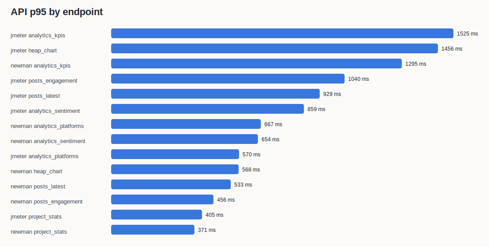
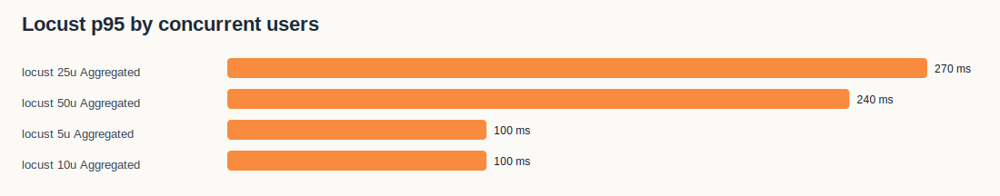

# SMAP Benchmark Report

- Generated at: `2026-05-20T13:52:54.179296+00:00`
- Base URL: `https://smap.tantai.dev`
- Campaign ID: `5cc6763f-3ec5-4481-9c7b-597bd5bb6126`
- Project ID: `d25fe723-a407-4a77-ac69-1556749f51ff`
- Environment: homelab Kubernetes namespace `smap`, live domain benchmark.

## Executive Summary

- Controlled load capacity under acceptance threshold: highest Locust level tested was **50 concurrent users**, with aggregate p95 **240 ms**, average **89 ms**, error rate **0.02%**, throughput **91.71 req/s**.
- Strict zero-error load level: highest tested level with **0 failed requests** was **25 concurrent users** (p95 **270 ms**, throughput **37.78 req/s**).
- k6 aggregate latency: 1800 requests, average **63 ms**, p95 **130 ms**, error rate **0.00%**.
- AI sentiment sample: n=45, accuracy **0.444**, macro F1 **0.440**, weighted F1 **0.449**.
- Raw evidence is stored in `raw/`; generated charts are stored in `charts/`.

## Tooling Evidence

```text
# Tool versions
2026-05-20T13:44:00Z

Docker version 29.4.0, build 9d7ad9f
v22.22.2
10.9.7
Python 3.9.6
openjdk version "17.0.11" 2024-04-16
OpenJDK Runtime Environment Temurin-17.0.11+9 (build 17.0.11+9)
OpenJDK 64-Bit Server VM Temurin-17.0.11+9 (build 17.0.11+9, mixed mode)
Client Version: v1.36.0
Kustomize Version: v5.8.1

k6 image: grafana/k6:latest
locust image: locustio/locust:latest
jmeter image: justb4/jmeter:latest
jmeter runtime: Apache JMeter 5.5 (see raw/jmeter.log)
```

## API Response Time

| Tool | Endpoint | Requests | Avg | P95 | Max | Error rate |
| --- | --- | --- | --- | --- | --- | --- |
| jmeter | analytics_keywords | 30 | 170 ms | 363 ms | 430 ms | 0.00% |
| jmeter | analytics_kpis | 30 | 287 ms | 1525 ms | 1644 ms | 0.00% |
| jmeter | analytics_platforms | 30 | 192 ms | 570 ms | 894 ms | 0.00% |
| jmeter | analytics_sentiment | 30 | 258 ms | 859 ms | 1042 ms | 0.00% |
| jmeter | health | 30 | 148 ms | 209 ms | 670 ms | 0.00% |
| jmeter | heap_chart | 30 | 456 ms | 1456 ms | 1563 ms | 0.00% |
| jmeter | posts_engagement | 30 | 333 ms | 1040 ms | 1157 ms | 0.00% |
| jmeter | posts_latest | 30 | 300 ms | 929 ms | 985 ms | 0.00% |
| jmeter | posts_page_2 | 30 | 169 ms | 337 ms | 392 ms | 0.00% |
| jmeter | project_stats | 30 | 195 ms | 405 ms | 600 ms | 0.00% |
| newman | analytics_keywords | 1 | 300 ms | 300 ms | 300 ms | 0.00% |
| newman | analytics_kpis | 1 | 1295 ms | 1295 ms | 1295 ms | 0.00% |
| newman | analytics_platforms | 1 | 667 ms | 667 ms | 667 ms | 0.00% |
| newman | analytics_sentiment | 1 | 654 ms | 654 ms | 654 ms | 0.00% |
| newman | health | 1 | 158 ms | 158 ms | 158 ms | 0.00% |
| newman | heap_chart | 1 | 568 ms | 568 ms | 568 ms | 0.00% |
| newman | posts_engagement | 1 | 456 ms | 456 ms | 456 ms | 0.00% |
| newman | posts_latest | 1 | 533 ms | 533 ms | 533 ms | 0.00% |
| newman | posts_page_2 | 1 | 32 ms | 32 ms | 32 ms | 0.00% |
| newman | project_stats | 1 | 371 ms | 371 ms | 371 ms | 0.00% |



## Load Test: Concurrent Users

| Concurrent users | Requests | RPS | Avg | P95 | Max | Error rate |
| --- | --- | --- | --- | --- | --- | --- |
| 5 | 484 | 10.97 | 30 ms | 100 ms | 197 ms | 0.00% |
| 10 | 1047 | 23.76 | 29 ms | 100 ms | 573 ms | 0.00% |
| 25 | 1668 | 37.78 | 241 ms | 270 ms | 7882 ms | 0.00% |
| 50 | 4048 | 91.71 | 89 ms | 240 ms | 2096 ms | 0.02% |

Acceptance rule for this live benchmark: `error_rate <= 0.1%` and aggregate `p95 <= 2500 ms`.

Measured accepted capacity in this run: **50 concurrent users**. This is the highest level tested, not a destructive upper bound.

Strict zero-error capacity in this run: **25 concurrent users**. The higher accepted level had non-zero but threshold-safe failures.

Observed load-test failures:
- 50 users: error rate 0.02%, p95 240 ms. See `raw/locust_50u.log`.




## AI/ML Quality: Sentiment

| Label | Precision | Recall | F1 | Support |
| --- | --- | --- | --- | --- |
| negative | 0.733 | 0.688 | 0.710 | 16 |
| neutral | 0.267 | 0.286 | 0.276 | 14 |
| positive | 0.333 | 0.333 | 0.333 | 15 |

Macro F1: **0.440**. Weighted F1: **0.449**. Accuracy: **0.444**.


Dataset: `ai-eval/labeled_sentiment_sample.jsonl`, manually labeled from real Ahamove campaign posts/comments. The sample intentionally includes both brand-relevant logistics comments and off-topic crawled content so the report reflects current data quality, not a clean demo set.

## Runtime Evidence

Key raw files:
- `raw/k8s_before.txt`: ok
- `raw/k8s_after.txt`: ok
- `raw/k8s_top_pods_before.txt`: ok
- `raw/k8s_top_pods_after.txt`: ok
- `raw/rabbitmq_queues_before.txt`: ok
- `raw/rabbitmq_queues_after.txt`: ok
- `raw/redpanda_groups_before.txt`: ok
- `raw/redpanda_groups_after.txt`: ok
- `raw/log_scan_after.txt`: ok
- `raw/newman.json`: ok
- `raw/k6_summary.json`: ok
- `raw/jmeter_results.jtl`: ok
- `raw/ai_eval/sentiment_metrics.json`: ok

## Interpretation

- API latency should be judged by p95, not average, because dashboard users experience the slow tail when filters/pagination fan out to analytics tables.
- The measured concurrent-user value is a controlled production-safe number. A real hard limit requires a maintenance-window stress test with larger user levels and DB/resource alarms.
- AI/ML F1 is computed on current stored predictions, not a synthetic model endpoint. This is appropriate for SMAP because users consume persisted analytics labels in Insights, MAP, Search, Chat and Report.
- Misclassified/off-topic rows should be read together with `raw/ai_eval/sentiment_misclassifications.md`; these rows reveal both sentiment calibration issues and crawl relevance leakage.
- The 50-user Locust run observed one `analytics_sentiment` 502 while app logs did not show matching application exceptions. Treat this as an edge proxy/gateway tail event to re-test under a maintenance-window stress profile.
