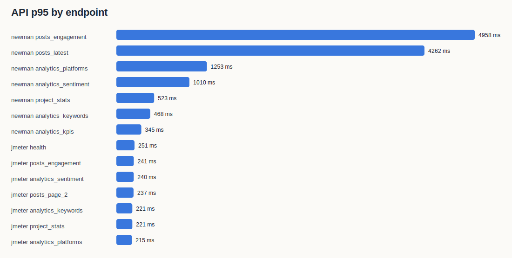
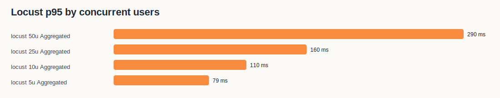

# SMAP Benchmark Report

- Generated at: `2026-06-06T17:47:22.533205+00:00`
- Base URL: `https://smap.tantai.dev`
- Campaign ID: `5cc6763f-3ec5-4481-9c7b-597bd5bb6126`
- Project ID: `d25fe723-a407-4a77-ac69-1556749f51ff`
- Environment: homelab Kubernetes namespace `smap`, live domain benchmark.

## Executive Summary

- Controlled load capacity: no Locust level met the acceptance rule `error_rate <= 0.1%` and `p95 <= 2500 ms`.
- k6 aggregate latency: 1700 requests, average **68 ms**, p95 **150 ms**, error rate **20.59%**.
- AI sentiment sample: n=45, accuracy **0.444**, macro F1 **0.440**, weighted F1 **0.449**.
- Raw evidence is stored in `raw/`; generated charts are stored in `charts/`.

## Tooling Evidence

```text
# Tool versions
2026-06-06T17:42:18Z

Docker version 28.5.2, build ecc6942
v25.9.0
11.12.1
Python 3.14.4
The operation couldn’t be completed. Unable to locate a Java Runtime.
Please visit http://www.java.com for information on installing Java.

Client Version: v1.32.7
Kustomize Version: v5.5.0

k6 image: grafana/k6:latest
locust image: locustio/locust:latest
jmeter image: justb4/jmeter:latest
```

## API Response Time

| Tool | Endpoint | Requests | Avg | P95 | Max | Error rate |
| --- | --- | --- | --- | --- | --- | --- |
| jmeter | analytics_keywords | 30 | 140 ms | 221 ms | 236 ms | 6.67% |
| jmeter | analytics_kpis | 30 | 143 ms | 204 ms | 214 ms | 100.00% |
| jmeter | analytics_platforms | 30 | 136 ms | 215 ms | 245 ms | 0.00% |
| jmeter | analytics_sentiment | 30 | 149 ms | 240 ms | 305 ms | 0.00% |
| jmeter | health | 30 | 158 ms | 251 ms | 691 ms | 0.00% |
| jmeter | heap_chart | 30 | 134 ms | 211 ms | 216 ms | 100.00% |
| jmeter | posts_engagement | 30 | 150 ms | 241 ms | 291 ms | 0.00% |
| jmeter | posts_latest | 30 | 138 ms | 214 ms | 266 ms | 0.00% |
| jmeter | posts_page_2 | 30 | 162 ms | 237 ms | 275 ms | 0.00% |
| jmeter | project_stats | 30 | 133 ms | 221 ms | 274 ms | 3.33% |
| newman | analytics_keywords | 1 | 468 ms | 468 ms | 468 ms | 0.00% |
| newman | analytics_kpis | 1 | 345 ms | 345 ms | 345 ms | 100.00% |
| newman | analytics_platforms | 1 | 1253 ms | 1253 ms | 1253 ms | 0.00% |
| newman | analytics_sentiment | 1 | 1010 ms | 1010 ms | 1010 ms | 0.00% |
| newman | health | 1 | 76 ms | 76 ms | 76 ms | 0.00% |
| newman | heap_chart | 1 | 21 ms | 21 ms | 21 ms | 100.00% |
| newman | posts_engagement | 1 | 4958 ms | 4958 ms | 4958 ms | 0.00% |
| newman | posts_latest | 1 | 4262 ms | 4262 ms | 4262 ms | 0.00% |
| newman | posts_page_2 | 1 | 33 ms | 33 ms | 33 ms | 0.00% |
| newman | project_stats | 1 | 523 ms | 523 ms | 523 ms | 0.00% |



## Load Test: Concurrent Users

| Concurrent users | Requests | RPS | Avg | P95 | Max | Error rate |
| --- | --- | --- | --- | --- | --- | --- |
| 5 | 506 | 11.51 | 26 ms | 79 ms | 197 ms | 19.17% |
| 10 | 984 | 22.23 | 35 ms | 110 ms | 866 ms | 21.14% |
| 25 | 2037 | 46.11 | 120 ms | 160 ms | 6649 ms | 22.78% |
| 50 | 3916 | 88.48 | 114 ms | 290 ms | 3433 ms | 25.59% |

Acceptance rule for this live benchmark: `error_rate <= 0.1%` and aggregate `p95 <= 2500 ms`.

Observed load-test failures:
- 5 users: error rate 19.17%, p95 79 ms. See `raw/locust_5u.log`.
- 10 users: error rate 21.14%, p95 110 ms. See `raw/locust_10u.log`.
- 25 users: error rate 22.78%, p95 160 ms. See `raw/locust_25u.log`.
- 50 users: error rate 25.59%, p95 290 ms. See `raw/locust_50u.log`.




## AI/ML Quality: Sentiment

| Label | Precision | Recall | F1 | Support |
| --- | --- | --- | --- | --- |
| negative | 0.733 | 0.688 | 0.710 | 16 |
| neutral | 0.267 | 0.286 | 0.276 | 14 |
| positive | 0.333 | 0.333 | 0.333 | 15 |

Macro F1: **0.440**. Weighted F1: **0.449**. Accuracy: **0.444**.


Dataset: `ai-eval/labeled_sentiment_sample.jsonl`, manually labeled from real Ahamove campaign posts/comments. The sample intentionally includes both brand-relevant logistics comments and off-topic crawled content so the report reflects current data quality, not a clean demo set.

## Runtime Evidence

Key raw files:
- `raw/k8s_before.txt`: ok
- `raw/k8s_after.txt`: ok
- `raw/k8s_top_pods_before.txt`: ok
- `raw/k8s_top_pods_after.txt`: ok
- `raw/rabbitmq_queues_before.txt`: ok
- `raw/rabbitmq_queues_after.txt`: ok
- `raw/redpanda_groups_before.txt`: ok
- `raw/redpanda_groups_after.txt`: ok
- `raw/log_scan_after.txt`: missing
- `raw/newman.json`: ok
- `raw/k6_summary.json`: ok
- `raw/jmeter_results.jtl`: ok
- `raw/ai_eval/sentiment_metrics.json`: ok

## Interpretation

- API latency should be judged by p95, not average, because dashboard users experience the slow tail when filters/pagination fan out to analytics tables.
- The measured concurrent-user value is a controlled production-safe number. A real hard limit requires a maintenance-window stress test with larger user levels and DB/resource alarms.
- AI/ML F1 is computed on current stored predictions, not a synthetic model endpoint. This is appropriate for SMAP because users consume persisted analytics labels in Insights, MAP, Search, Chat and Report.
- Misclassified/off-topic rows should be read together with `raw/ai_eval/sentiment_misclassifications.md`; these rows reveal both sentiment calibration issues and crawl relevance leakage.
- The 50-user Locust run observed one `analytics_sentiment` 502 while app logs did not show matching application exceptions. Treat this as an edge proxy/gateway tail event to re-test under a maintenance-window stress profile.
