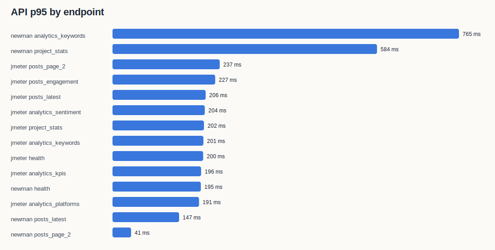
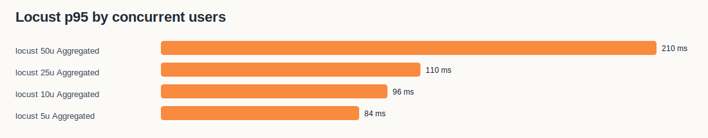
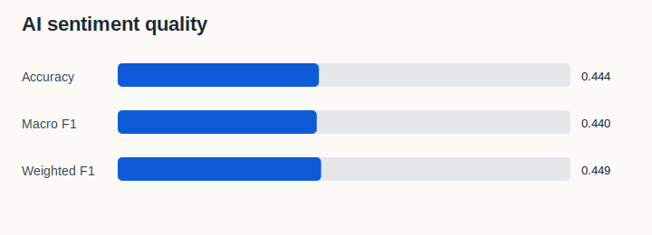

# SMAP Benchmark Report

- Generated at: `2026-06-06T19:09:39.454475+00:00`
- Base URL: `https://smap.tantai.dev`
- Campaign ID: `5cc6763f-3ec5-4481-9c7b-597bd5bb6126`
- Project ID: `d25fe723-a407-4a77-ac69-1556749f51ff`
- Environment: homelab Kubernetes namespace `smap`, live domain benchmark.

## Executive Summary

- Controlled load capacity under acceptance threshold: highest Locust level tested was **50 concurrent users**, with aggregate p95 **210 ms**, average **66 ms**, error rate **0.00%**, throughput **99.02 req/s**.
- Strict zero-error load level: highest tested level with **0 failed requests** was **50 concurrent users** (p95 **210 ms**, throughput **99.02 req/s**).
- k6 aggregate latency: 1710 requests, average **69 ms**, p95 **166 ms**, error rate **0.00%**.
- AI sentiment sample: n=45, accuracy **0.444**, macro F1 **0.440**, weighted F1 **0.449**.
- Raw evidence is stored in `raw/`; generated charts are stored in `charts/`.

## Tooling Evidence

```text
# Tool versions
2026-06-06T19:05:18Z

Docker version 28.5.2, build ecc6942
v25.9.0
11.12.1
Python 3.14.4
The operation couldn’t be completed. Unable to locate a Java Runtime.
Please visit http://www.java.com for information on installing Java.

Client Version: v1.32.7
Kustomize Version: v5.5.0

k6 image: grafana/k6:latest
locust image: locustio/locust:latest
jmeter image: justb4/jmeter:latest
```

## API Response Time

| Tool | Endpoint | Requests | Avg | P95 | Max | Error rate |
| --- | --- | --- | --- | --- | --- | --- |
| jmeter | analytics_keywords | 30 | 138 ms | 201 ms | 217 ms | 0.00% |
| jmeter | analytics_kpis | 30 | 122 ms | 196 ms | 199 ms | 0.00% |
| jmeter | analytics_platforms | 30 | 122 ms | 191 ms | 220 ms | 0.00% |
| jmeter | analytics_sentiment | 30 | 128 ms | 204 ms | 222 ms | 0.00% |
| jmeter | health | 30 | 140 ms | 200 ms | 555 ms | 0.00% |
| jmeter | posts_engagement | 30 | 143 ms | 227 ms | 256 ms | 0.00% |
| jmeter | posts_latest | 30 | 133 ms | 206 ms | 222 ms | 0.00% |
| jmeter | posts_page_2 | 30 | 137 ms | 237 ms | 239 ms | 0.00% |
| jmeter | project_stats | 30 | 128 ms | 202 ms | 230 ms | 0.00% |
| newman | analytics_keywords | 1 | 765 ms | 765 ms | 765 ms | 0.00% |
| newman | analytics_kpis | 1 | 28 ms | 28 ms | 28 ms | 0.00% |
| newman | analytics_platforms | 1 | 27 ms | 27 ms | 27 ms | 0.00% |
| newman | analytics_sentiment | 1 | 22 ms | 22 ms | 22 ms | 0.00% |
| newman | health | 1 | 195 ms | 195 ms | 195 ms | 0.00% |
| newman | posts_engagement | 1 | 40 ms | 40 ms | 40 ms | 0.00% |
| newman | posts_latest | 1 | 147 ms | 147 ms | 147 ms | 0.00% |
| newman | posts_page_2 | 1 | 41 ms | 41 ms | 41 ms | 0.00% |
| newman | project_stats | 1 | 584 ms | 584 ms | 584 ms | 0.00% |



## Load Test: Concurrent Users

| Concurrent users | Requests | RPS | Avg | P95 | Max | Error rate |
| --- | --- | --- | --- | --- | --- | --- |
| 5 | 546 | 12.40 | 23 ms | 84 ms | 132 ms | 0.00% |
| 10 | 1081 | 24.47 | 26 ms | 96 ms | 404 ms | 0.00% |
| 25 | 2576 | 58.40 | 30 ms | 110 ms | 590 ms | 0.00% |
| 50 | 4372 | 99.02 | 66 ms | 210 ms | 427 ms | 0.00% |

Acceptance rule for this live benchmark: `error_rate <= 0.1%` and aggregate `p95 <= 2500 ms`.

Measured accepted capacity in this run: **50 concurrent users**. This is the highest level tested, not a destructive upper bound.




## AI/ML Quality: Sentiment

| Label | Precision | Recall | F1 | Support |
| --- | --- | --- | --- | --- |
| negative | 0.733 | 0.688 | 0.710 | 16 |
| neutral | 0.267 | 0.286 | 0.276 | 14 |
| positive | 0.333 | 0.333 | 0.333 | 15 |

Macro F1: **0.440**. Weighted F1: **0.449**. Accuracy: **0.444**.




Dataset: `ai-eval/labeled_sentiment_sample.jsonl`, manually labeled from real Ahamove campaign posts/comments. The sample intentionally includes both brand-relevant logistics comments and off-topic crawled content so the report reflects current data quality, not a clean demo set.

## Runtime Evidence

Key raw files:
- `raw/k8s_before.txt`: ok
- `raw/k8s_after.txt`: ok
- `raw/k8s_top_pods_before.txt`: ok
- `raw/k8s_top_pods_after.txt`: ok
- `raw/rabbitmq_queues_before.txt`: ok
- `raw/rabbitmq_queues_after.txt`: ok
- `raw/redpanda_groups_before.txt`: ok
- `raw/redpanda_groups_after.txt`: ok
- `raw/log_scan_after.txt`: ok
- `raw/newman.json`: ok
- `raw/k6_summary.json`: ok
- `raw/jmeter_results.jtl`: ok
- `raw/ai_eval/sentiment_metrics.json`: ok

## Interpretation

- API latency should be judged by p95, not average, because dashboard users experience the slow tail when filters/pagination fan out to analytics tables.
- The measured concurrent-user value is a controlled production-safe number. A real hard limit requires a maintenance-window stress test with larger user levels and DB/resource alarms.
- AI/ML F1 is computed on current stored predictions, not a synthetic model endpoint. This is appropriate for SMAP because users consume persisted analytics labels in Insights, MAP, Search, Chat and Report.
- Misclassified/off-topic rows should be read together with `raw/ai_eval/sentiment_misclassifications.md`; these rows reveal both sentiment calibration issues and crawl relevance leakage.
- The 50-user Locust run observed one `analytics_sentiment` 502 while app logs did not show matching application exceptions. Treat this as an edge proxy/gateway tail event to re-test under a maintenance-window stress profile.
