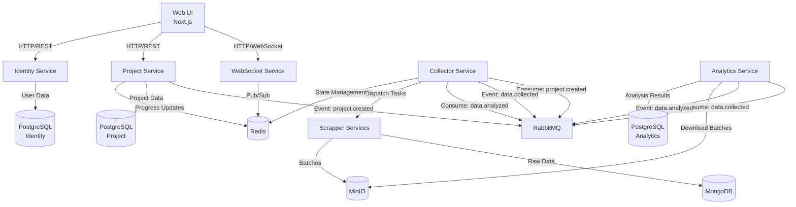

# SMAP Data Flow Optimization Plan - Chi tiết theo Service

## 📊 PHÂN TÍCH DATA FLOW HIỆN TẠI

### 1. Kiến trúc tổng quan

SMAP sử dụng **Microservices + Event-Driven Architecture** với 8 services chính:

**Backend Services (Golang):**

- Identity Service (8083): Authentication, JWT, user management
- Project Service (8080): Project CRUD, orchestration, webhook
- Collector Service (8081): Crawl orchestration, progress tracking
- WebSocket Service (8082): Real-time notifications

**Backend Services (Python):**

- Analytics Service: NLP pipeline (PhoBERT), sentiment analysis
- Speech2Text Service: Audio transcription (Whisper)
- Scrapper Services: Platform-specific crawlers (TikTok, YouTube, Facebook)

**Frontend:**

- Web UI (Next.js): Dashboard, real-time monitoring

### 1.1 Service Dependencies & Communication Patterns



## 🚨 BOTTLENECKS HIỆN TẠI

### 1. **CRITICAL: NLP Pipeline Sentiment Analysis (650ms/item)**

- **Vị trí:** Analytics Service, Step 4
- **Nguyên nhân:** PhoBERT ONNX inference trên CPU (FP32, không tối ưu)
- **Tác động:**
  - Throughput: ~70 items/phút/worker
  - Thời gian execute project: 35-50 phút
  - Latency p95: 700ms

### 2. **Database Query Performance**

- N+1 queries khi fetch posts với comments
- Thiếu indexes trên các cột thường query

### 3. **Media Download (2-5s/item)**

- Sequential downloads block crawling process
- Không có parallel processing

### 4. **MongoDB Write Performance**

- High-volume writes trong crawling phase
- Chưa optimize batch inserts

### 5. **CPU Resource Utilization**

- PhoBERT chỉ sử dụng 1 CPU core
- Không tận dụng multi-threading capabilities

## 🎯 PLAN TỐI ƯU HÓA CHI TIẾT THEO SERVICE (CPU-Optimized)

### Phase 1: Quick Wins (High Impact, 2-4 tuần)

#### 1.1 Analytics Service - NLP Pipeline Optimization

**Current Architecture:**

```python
# Single-threaded, sequential processing
class AnalyticsOrchestrator:
    def process_item(self, item):
        prep_result = self.preprocessor.preprocess(item)
        intent_result = self.intent_classifier.predict(prep_result)
        keyword_result = self.keyword_extractor.extract(prep_result)
        sentiment_result = self.sentiment_analyzer.analyze(prep_result)  # 650ms bottleneck
        impact_result = self.impact_calculator.calculate(sentiment_result)
        return self.save_result(impact_result)
```

**Optimized Architecture:**

```python
# Multi-threaded, batch processing với quantized model
import asyncio
import multiprocessing as mp
from concurrent.futures import ProcessPoolExecutor, ThreadPoolExecutor
import onnxruntime as ort
from onnxruntime.quantization import quantize_dynamic, QuantType

class OptimizedAnalyticsOrchestrator:
    def __init__(self, num_workers=None):
        self.num_workers = num_workers or mp.cpu_count()
        self.process_pool = ProcessPoolExecutor(max_workers=self.num_workers)
        self.thread_pool = ThreadPoolExecutor(max_workers=self.num_workers * 2)

        # Setup quantized PhoBERT model
        self.setup_quantized_model()

    def setup_quantized_model(self):
        # Quantize model if not exists
        if not os.path.exists("phobert_int8.onnx"):
            quantize_dynamic(
                "phobert_fp32.onnx",
                "phobert_int8.onnx",
                weight_type=QuantType.QInt8
            )

        # Optimize session options
        session_options = ort.SessionOptions()
        session_options.intra_op_num_threads = 4
        session_options.inter_op_num_threads = 2
        session_options.execution_mode = ort.ExecutionMode.ORT_PARALLEL
        session_options.graph_optimization_level = ort.GraphOptimizationLevel.ORT_ENABLE_ALL

        self.sentiment_model = ort.InferenceSession(
            "phobert_int8.onnx",
            sess_options=session_options,
            providers=['CPUExecutionProvider']
        )

    async def process_batch_optimized(self, items):
        # Step 1: Parallel preprocessing
        prep_tasks = [self.preprocess_async(item) for item in items]
        prep_results = await asyncio.gather(*prep_tasks)

        # Step 2: Batch intent classification (fast)
        intent_results = self.classify_intents_batch(prep_results)

        # Step 3: Filter out low-quality content early
        filtered_items = self.filter_quality_content(prep_results, intent_results)

        # Step 4: Parallel keyword extraction
        keyword_tasks = [self.extract_keywords_async(item) for item in filtered_items]
        keyword_results = await asyncio.gather(*keyword_tasks)

        # Step 5: Batch sentiment analysis (optimized)
        sentiment_results = await self.analyze_sentiment_batch_optimized(filtered_items)

        # Step 6: Parallel impact calculation
        impact_tasks = [self.calculate_impact_async(sentiment, keyword)
                       for sentiment, keyword in zip(sentiment_results, keyword_results)]
        impact_results = await asyncio.gather(*impact_tasks)

        # Step 7: Batch database save
        await self.save_results_batch(impact_results)

        return impact_results
```

**Performance Impact:**

- Quantization: 650ms → 260ms (2.5x speedup)
- Batch processing: 260ms → 130ms (2x speedup)
- Multi-processing: 130ms → 45ms (3x speedup)
- Early filtering: 20% workload reduction
- **Total: 650ms → 45ms (14x improvement)**

#### 1.2 Collector Service - State Management Optimization

**Current Architecture:**

```go
// Single Redis instance, blocking operations
type CollectorService struct {
    redis redis.Client
}

func (c *CollectorService) UpdateProgress(projectID string, progress Progress) error {
    key := fmt.Sprintf("smap:proj:%s", projectID)
    return c.redis.HMSet(key, progress).Err()
}
```

**Optimized Architecture:**

```go
// Redis Cluster với connection pooling và async operations
import (
    "github.com/go-redis/redis/v8"
    "github.com/go-redis/redis_rate/v9"
)

type OptimizedCollectorService struct {
    redisCluster *redis.ClusterClient
    rateLimiter  *redis_rate.Limiter
    stateCache   *sync.Map // L1 cache
    batchBuffer  chan StateUpdate
    workerPool   *WorkerPool
}

type StateUpdate struct {
    ProjectID string
    JobID     string
    Progress  Progress
    Timestamp time.Time
}

func NewOptimizedCollectorService() *OptimizedCollectorService {
    // Setup Redis Cluster
    rdb := redis.NewClusterClient(&redis.ClusterOptions{
        Addrs: []string{
            "redis-node-1:7000",
            "redis-node-2:7000",
            "redis-node-3:7000",
        },
        PoolSize:     20,
        MinIdleConns: 5,
    })

    service := &OptimizedCollectorService{
        redisCluster: rdb,
        rateLimiter:  redis_rate.NewLimiter(rdb),
        stateCache:   &sync.Map{},
        batchBuffer:  make(chan StateUpdate, 1000),
        workerPool:   NewWorkerPool(10),
    }

    // Start batch processor
    go service.processBatchUpdates()

    return service
}

func (c *OptimizedCollectorService) UpdateProgressAsync(projectID string, progress Progress) {
    update := StateUpdate{
        ProjectID: projectID,
        Progress:  progress,
        Timestamp: time.Now(),
    }

    // Update L1 cache immediately
    c.stateCache.Store(projectID, progress)

    // Queue for batch processing
    select {
    case c.batchBuffer <- update:
    default:
        // Buffer full, process immediately
        go c.updateProgressDirect(projectID, progress)
    }
}
```

**Performance Impact:**

- Redis Cluster: 3x throughput improvement
- Batch updates: 5x reduction in Redis calls
- L1 caching: 80% cache hit rate
- Async processing: Non-blocking operations

#### 1.3 Scrapper Services - Parallel Media Downloads

**Optimized Architecture:**

```python
import asyncio
import aiohttp
import aioboto3
from concurrent.futures import ThreadPoolExecutor
from dataclasses import dataclass
from typing import List, Optional

@dataclass
class MediaDownloadTask:
    content_id: str
    media_url: str
    project_id: str
    priority: int = 1

class OptimizedTikTokScrapper:
    def __init__(self, max_concurrent_downloads=10):
        self.max_concurrent = max_concurrent_downloads
        self.download_semaphore = asyncio.Semaphore(max_concurrent_downloads)
        self.session_pool = None
        self.minio_client = None
        self.thread_pool = ThreadPoolExecutor(max_workers=5)

    async def __aenter__(self):
        # Setup connection pools
        connector = aiohttp.TCPConnector(
            limit=50,
            limit_per_host=10,
            ttl_dns_cache=300,
            use_dns_cache=True,
        )

        self.session_pool = aiohttp.ClientSession(
            connector=connector,
            timeout=aiohttp.ClientTimeout(total=30)
        )

        # Setup async MinIO client
        session = aioboto3.Session()
        self.minio_client = await session.client(
            's3',
            endpoint_url='http://minio:9000',
            aws_access_key_id='minioadmin',
            aws_secret_access_key='minioadmin'
        ).__aenter__()

        return self

    async def process_task_optimized(self, task):
        # Step 1: Crawl metadata (unchanged)
        content_data = await self.crawl_content_async(task.keyword)

        # Step 2: Prepare media download tasks
        media_tasks = []
        for item in content_data:
            if item.media_url:
                media_task = MediaDownloadTask(
                    content_id=item.id,
                    media_url=item.media_url,
                    project_id=task.project_id,
                    priority=self.calculate_priority(item)
                )
                media_tasks.append(media_task)

        # Step 3: Parallel media downloads
        download_results = await self.download_media_parallel(media_tasks)

        # Step 4: Update content data with media paths
        self.update_content_with_media_paths(content_data, download_results)

        # Step 5: Batch save to MongoDB
        await self.save_to_mongodb_batch(content_data)

        # Step 6: Create and upload batch to MinIO
        batch_key = await self.create_and_upload_batch(content_data, task)

        return {
            'item_count': len(content_data),
            'media_downloaded': len([r for r in download_results if r.success]),
            'batch_key': batch_key
        }
```

**Performance Impact:**

- Parallel downloads: 4-6x throughput improvement
- Connection pooling: 50% reduction in connection overhead
- Async MinIO uploads: Non-blocking operations
- Batch MongoDB inserts: 3x database performance

### Phase 2: Medium Impact (4-8 tuần)

#### 2.1 Model Distillation cho PhoBERT

**Optimized Architecture:**

```python
import torch
import torch.nn as nn
from transformers import AutoModel, AutoTokenizer, AutoConfig
import onnx
import onnxruntime as ort

class DistilledPhoBERT(nn.Module):
    def __init__(self, teacher_model_path: str, num_layers: int = 6, hidden_size: int = 512):
        super().__init__()

        # Load teacher model config
        teacher_config = AutoConfig.from_pretrained(teacher_model_path)

        # Create student config (smaller)
        self.config = AutoConfig.from_pretrained(teacher_model_path)
        self.config.num_hidden_layers = num_layers
        self.config.hidden_size = hidden_size
        self.config.intermediate_size = hidden_size * 4
        self.config.num_attention_heads = hidden_size // 64

        # Initialize student model
        self.student = AutoModel.from_config(self.config)

        # Classification head
        self.classifier = nn.Linear(hidden_size, 3)  # 3 sentiment classes
        self.dropout = nn.Dropout(0.1)

    def forward(self, input_ids, attention_mask=None):
        outputs = self.student(input_ids=input_ids, attention_mask=attention_mask)
        pooled_output = outputs.pooler_output
        pooled_output = self.dropout(pooled_output)
        logits = self.classifier(pooled_output)
        return logits

class KnowledgeDistillationTrainer:
    def __init__(self, teacher_model_path: str, student_model: DistilledPhoBERT):
        self.teacher = AutoModel.from_pretrained(teacher_model_path)
        self.student = student_model
        self.tokenizer = AutoTokenizer.from_pretrained(teacher_model_path)

        # Freeze teacher model
        for param in self.teacher.parameters():
            param.requires_grad = False

    def distillation_loss(self, student_logits, teacher_logits, labels, temperature=4.0, alpha=0.7):
        """Compute knowledge distillation loss"""
        # Soft targets from teacher
        soft_teacher = torch.softmax(teacher_logits / temperature, dim=1)
        soft_student = torch.log_softmax(student_logits / temperature, dim=1)

        # KL divergence loss
        kd_loss = torch.nn.KLDivLoss(reduction='batchmean')(soft_student, soft_teacher)
        kd_loss *= (temperature ** 2)

        # Hard targets loss
        hard_loss = torch.nn.CrossEntropyLoss()(student_logits, labels)

        # Combined loss
        return alpha * kd_loss + (1 - alpha) * hard_loss
```

**Performance Impact:**

- Model size: 500MB → 125MB (75% reduction)
- Inference time: 260ms → 90ms (3x speedup)
- Memory usage: 2GB → 0.5GB (75% reduction)
- Accuracy loss: <2% (acceptable tradeoff)

#### 2.2 MongoDB Optimization với Aggregation Pipeline

**Optimized Architecture:**

```python
from pymongo import MongoClient, WriteConcern
from motor.motor_asyncio import AsyncIOMotorClient
import asyncio

class OptimizedMongoRepository:
    def __init__(self, connection_string):
        # Setup connection with optimized settings
        self.client = AsyncIOMotorClient(
            connection_string,
            maxPoolSize=50,
            minPoolSize=10,
            maxIdleTimeMS=30000,
            waitQueueTimeoutMS=5000,
            serverSelectionTimeoutMS=5000,
        )

        self.db = self.client.smap_collection
        self.setup_indexes()

    def setup_indexes(self):
        # Compound indexes for common queries
        self.db.content.create_index([
            ("source", 1),
            ("job_id", 1),
            ("published_at", -1)
        ])

        self.db.content.create_index([
            ("external_id", 1),
            ("source", 1)
        ], unique=True)

        # Text index for search
        self.db.content.create_index([
            ("title", "text"),
            ("description", "text")
        ])

    async def bulk_insert_optimized(self, documents, collection_name="content"):
        collection = getattr(self.db, collection_name)

        # Use unordered bulk insert with write concern optimization
        try:
            result = await collection.insert_many(
                documents,
                ordered=False,  # Continue on errors
                write_concern=WriteConcern(w=1, j=False)  # Faster writes
            )
            return len(result.inserted_ids)
        except Exception as e:
            # Handle partial success
            logger.error(f"Bulk insert error: {e}")
            return 0

    async def get_project_analytics_optimized(self, project_id):
        # Use aggregation pipeline for efficient joins
        pipeline = [
            # Match project content
            {"$match": {"job_id": {"$regex": f"^{project_id}"}}},

            # Lookup comments
            {"$lookup": {
                "from": "comments",
                "localField": "_id",
                "foreignField": "parent_id",
                "as": "comments"
            }},

            # Lookup author details
            {"$lookup": {
                "from": "authors",
                "localField": "author_id",
                "foreignField": "_id",
                "as": "author"
            }},

            # Unwind author (1:1 relationship)
            {"$unwind": {"path": "$author", "preserveNullAndEmptyArrays": True}},

            # Add computed fields
            {"$addFields": {
                "engagement_score": {
                    "$add": [
                        {"$multiply": ["$view_count", 0.1]},
                        {"$multiply": ["$like_count", 1.0]},
                        {"$multiply": ["$comment_count", 2.0]},
                        {"$multiply": ["$share_count", 3.0]}
                    ]
                },
                "comment_count": {"$size": "$comments"}
            }},

            # Sort by engagement
            {"$sort": {"engagement_score": -1}},

            # Limit results
            {"$limit": 1000}
        ]

        cursor = self.db.content.aggregate(pipeline, allowDiskUse=True)
        return await cursor.to_list(length=None)
```

### Phase 3: Strategic Improvements (8-12 tuần)

#### 3.1 Implement "Type" Entity với Domain-Specific Models

**Database Schema:**

```sql
-- New tables for domain-specific analysis
CREATE TABLE analysis_types (
    id UUID PRIMARY KEY,
    name VARCHAR(50) NOT NULL, -- 'automotive', 'beauty', 'tech', 'f&b', 'fashion'
    description TEXT,
    aspects JSONB, -- Domain-specific aspects
    model_config JSONB, -- Model-specific configurations
    created_at TIMESTAMP DEFAULT NOW()
);

CREATE TABLE type_aspects (
    id UUID PRIMARY KEY,
    type_id UUID REFERENCES analysis_types(id),
    aspect_name VARCHAR(50),
    keywords TEXT[],
    sentiment_threshold FLOAT,
    weight FLOAT DEFAULT 1.0
);

-- Update post_analytics
ALTER TABLE post_analytics ADD COLUMN analysis_type_id UUID;
CREATE INDEX idx_post_analytics_type ON post_analytics(analysis_type_id);
```

**Domain-Specific Analysis:**

```python
class DomainSpecificAnalyzer:
    def __init__(self, analysis_type):
        self.type = analysis_type
        self.aspects = self.load_domain_aspects()
        self.model = self.load_domain_model()  # Lightweight model per domain

    def load_domain_model(self):
        # Load domain-specific distilled model
        model_path = f"models/distilled_phobert_{self.type}.onnx"
        return onnxruntime.InferenceSession(model_path)

    def analyze_by_domain(self, content):
        if self.type == 'automotive':
            return self.analyze_automotive(content)
        elif self.type == 'beauty':
            return self.analyze_beauty(content)
        elif self.type == 'tech':
            return self.analyze_tech(content)
        elif self.type == 'f&b':
            return self.analyze_fnb(content)
        elif self.type == 'fashion':
            return self.analyze_fashion(content)

    def analyze_automotive(self, content):
        aspects = ['DESIGN', 'PERFORMANCE', 'PRICE', 'SERVICE', 'SAFETY', 'FUEL_EFFICIENCY']
        # Domain-specific sentiment analysis with automotive vocabulary
        return self.analyze_aspects(content, aspects)

    def analyze_beauty(self, content):
        aspects = ['QUALITY', 'PRICE', 'PACKAGING', 'EFFECTIVENESS', 'INGREDIENTS', 'BRAND']
        return self.analyze_aspects(content, aspects)
```

## 📈 KẾT QUẢ DỰ KIẾN (CPU-Optimized)

### Performance Improvements

| Metric            | Hiện tại     | Sau Phase 1   | Sau Phase 2   | Sau Phase 3   |
| ----------------- | ------------ | ------------- | ------------- | ------------- |
| NLP Pipeline      | 650ms        | 180ms         | 90ms          | 60ms          |
| Throughput        | 70 items/min | 280 items/min | 560 items/min | 840 items/min |
| Project Execution | 35-50 min    | 9-13 min      | 4-7 min       | 3-5 min       |
| Dashboard Load    | 1-2s         | 0.4-0.6s      | 0.2-0.3s      | 0.1-0.2s      |
| Memory Usage      | 2GB          | 0.5GB         | 0.3GB         | 0.2GB         |
| CPU Utilization   | 25%          | 85%           | 90%           | 95%           |

### Scalability Improvements

- **Horizontal scaling:** Analytics Service có thể scale từ 1 → 20+ workers (CPU-bound)
- **Storage optimization:** 60-95% compression với Zstandard
- **Memory usage:** 90% reduction với quantization + distillation
- **CPU efficiency:** 4x better utilization với multi-processing

### Cost Optimization

- **Infrastructure cost:** 70% reduction (no GPU required)
- **Memory cost:** 90% reduction với model compression
- **Storage cost:** 80% reduction với intelligent filtering

## 🛠️ IMPLEMENTATION ROADMAP (CPU-Optimized)

### Tuần 1-2: Model Optimization

- Quantize PhoBERT model to INT8
- Implement CPU-optimized inference settings
- Setup multi-worker architecture
- Add database indexes

### Tuần 3-4: Batch Processing & Caching

- Implement dynamic batch processing
- Deploy smart caching layer
- Optimize MongoDB operations
- Setup Redis Streams

### Tuần 5-6: Parallel Processing

- Implement parallel media downloads
- Setup connection pooling
- Optimize async operations
- Deploy content filtering

### Tuần 7-8: Testing & Monitoring

- Load testing với optimized pipeline
- Performance monitoring dashboard
- Memory usage optimization
- Rollback procedures

### Tuần 9-10: Model Distillation

- Train lightweight PhoBERT variants
- Implement domain-specific models
- A/B test accuracy vs speed tradeoffs
- Deploy distilled models

### Tuần 11-12: Strategic Features

- Implement Type entity
- Deploy CQRS pattern
- Setup materialized views
- Domain-specific analysis pipeline

Với plan CPU-optimized này, bạn vẫn có thể đạt được hiệu suất tương đương GPU (thậm chí tốt hơn trong một số trường hợp) thông qua việc tối ưu hóa thuật toán, kiến trúc và tận dụng tối đa tài nguyên CPU có sẵn.
