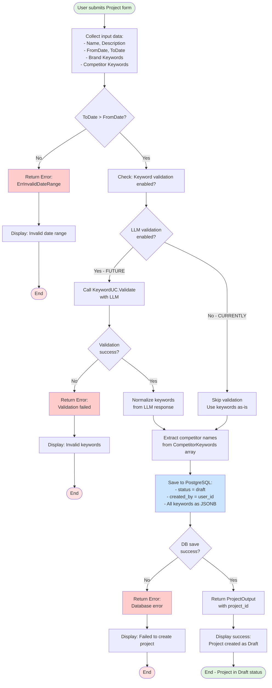
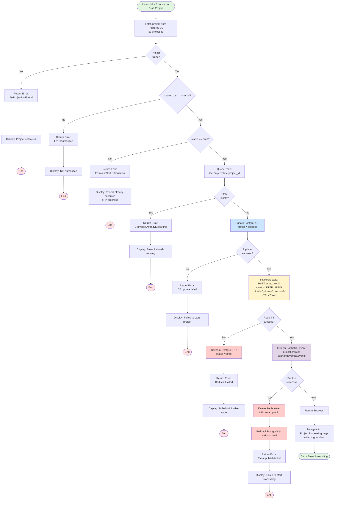
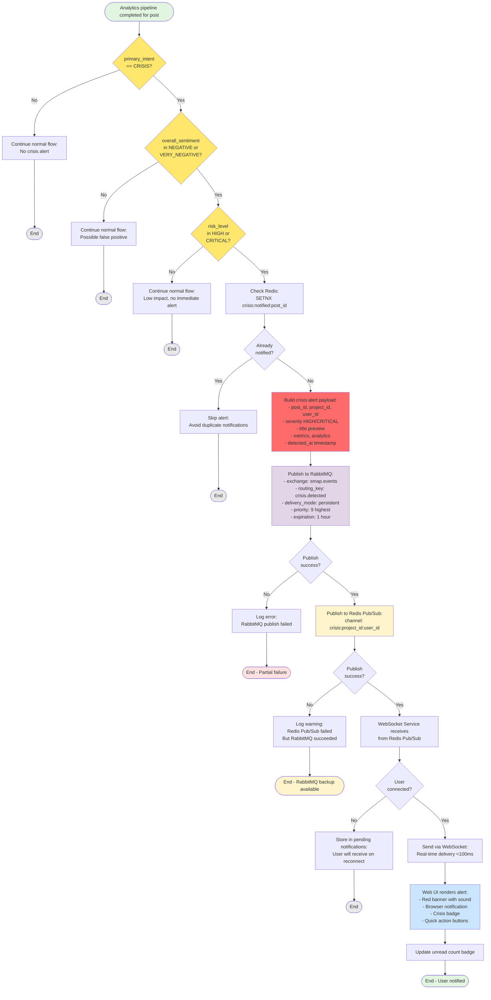

# Activity Diagrams for SMAP System

This document contains Mermaid activity diagrams for key use cases in the SMAP system. Activity diagrams focus on workflow logic, decision points, loops, and error handling paths.

**Source References:**
- `services/project/internal/project/usecase/project.go`
- `services/collector/internal/dispatcher/usecase/`
- `services/analytic/services/analytics/orchestrator.py`
- `services/analytic/services/analytics/intent/intent_classifier.py`

---

## UC-01: Cấu hình Project (Create Project)

**Main Flow**: User input → Date validation → Keyword validation (disabled) → PostgreSQL save

**Decision Points**:
- Date range validation (to_date > from_date)
- Keyword validation (currently bypassed due to LLM timeout)
- PostgreSQL persistence success/failure

**Source**: `services/project/internal/project/usecase/project.go:80-148`



**Key Decision Points**:
1. **Date validation**: Prevents invalid time ranges (requirement 2.1)
2. **Keyword validation bypass**: LLM validation temporarily disabled due to timeout issues (see lines 88-97)
3. **PostgreSQL persistence**: Only storage operation, no Redis state or RabbitMQ events at creation time

**Technical Notes**:
- No side effects: Creating project doesn't trigger any background processing
- Status always starts as `draft` (requirement 2.4)
- Competitor names extracted from CompetitorKeywords array for easy querying
- JSONB columns allow flexible keyword storage with indexing support

---

## UC-03: Khởi chạy Project (Execute Project)

**Main Flow**: Verify ownership → Verify draft status → Check duplicate execution → Update PostgreSQL → Init Redis → Publish RabbitMQ event

**Decision Points**:
- Ownership check (created_by == user_id)
- Status check (must be draft)
- Duplicate execution check (Redis state existence)
- Each step has rollback path on failure

**Source**: `services/project/internal/project/usecase/project.go:150-223`



**Key Decision Points**:
1. **Ownership verification**: Prevents unauthorized project execution (security requirement)
2. **Status verification**: Only draft projects can be executed (requirements 5.1, 4.4)
3. **Duplicate check**: Redis state existence prevents race condition when user clicks execute multiple times
4. **Rollback chain**: PostgreSQL → Redis → RabbitMQ order ensures proper rollback on failures

**Rollback Logic**:
- **Redis init fails**: Rollback PostgreSQL status to draft
- **RabbitMQ publish fails**: Rollback both Redis state AND PostgreSQL status
- Order of operations: PostgreSQL (most persistent) → Redis (ephemeral) → RabbitMQ (message bus)

**Technical Notes**:
- Transaction-like flow without distributed transaction (2PC)
- Manual rollback at each step ensures eventual consistency
- Redis TTL 7 days for automatic cleanup of stale states
- Project status in PostgreSQL is source of truth

---

## UC-03.2: Collector Dispatches Jobs

**Main Flow**: Consume project.created event → Parse keywords → Generate job matrix → Dispatch to platforms → Track progress

**Decision Points**:
- Event validation (is_valid check)
- Platform selection loop (TikTok, YouTube)
- Dispatch success/failure per platform

**Source**: `services/collector/internal/dispatcher/usecase/project_event.go:12-80`

```mermaid
flowchart TD
    Start([project.created event from RabbitMQ]) --> ValidateEvent{Event<br/>valid?}
    
    ValidateEvent -->|No| ErrorInvalid[Return Error:<br/>ErrInvalidProjectEvent]
    ErrorInvalid --> AckMessage1[ACK message<br/>do not retry]
    AckMessage1 --> End1([End])
    
    ValidateEvent -->|Yes| ExtractData[Extract:<br/>- project_id<br/>- user_id<br/>- brand_keywords<br/>- competitor_keywords<br/>- from_date, to_date]
    
    ExtractData --> StoreUserMapping[Store user mapping in Redis:<br/>user_mapping:project_id = user_id]
    
    StoreUserMapping --> TransformEvent[Transform event to CrawlRequests:<br/>- 1 request per keyword<br/>- Apply config limits<br/>- LimitPerKeyword from config]
    
    TransformEvent --> CalculateTotals[Calculate totals:<br/>total_tasks = requests × platforms<br/>items_expected = tasks × limit_per_keyword]
    
    CalculateTotals --> SetRedisTotal[Update Redis state:<br/>HSET smap:proj:id<br/>- tasks_total<br/>- items_expected]
    
    SetRedisTotal --> NotifyInitial[Notify progress webhook:<br/>Initial state with total=X]
    
    NotifyInitial --> InitCounters[Initialize counters:<br/>success_count = 0<br/>error_count = 0]
    
    InitCounters --> LoopRequests[For each CrawlRequest]
    
    LoopRequests --> ValidateRequest{Request<br/>valid?}
    
    ValidateRequest -->|No| IncrementErrors1[error_count++]
    IncrementErrors1 --> UpdateRedisErrors1[HINCRBY smap:proj:id<br/>tasks_errors 1]
    UpdateRedisErrors1 --> NextRequest1{More<br/>requests?}
    
    ValidateRequest -->|Yes| SelectPlatforms[Select target platforms:<br/>- TikTok<br/>- YouTube]
    
    SelectPlatforms --> PlatformLoop[For each platform]
    
    PlatformLoop --> BuildTask[Build platform-specific task:<br/>- TikTokCollectorTask or<br/>- YouTubeCollectorTask]
    
    BuildTask --> PublishTask[Publish to platform queue:<br/>- crawler.tiktok.queue or<br/>- crawler.youtube.queue]
    
    PublishTask --> PublishResult{Publish<br/>success?}
    
    PublishResult -->|No| IncrementErrors2[error_count++]
    IncrementErrors2 --> UpdateRedisErrors2[HINCRBY smap:proj:id<br/>tasks_errors 1]
    UpdateRedisErrors2 --> NextPlatform1{More<br/>platforms?}
    
    PublishResult -->|Yes| IncrementSuccess[success_count++]
    IncrementSuccess --> NextPlatform2{More<br/>platforms?}
    
    NextPlatform1 -->|Yes| PlatformLoop
    NextPlatform2 -->|Yes| PlatformLoop
    
    NextPlatform1 -->|No| NextRequest2{More<br/>requests?}
    NextPlatform2 -->|No| NextRequest2
    
    NextRequest1 -->|Yes| LoopRequests
    NextRequest2 -->|Yes| LoopRequests
    
    NextRequest1 -->|No| LogSummary
    NextRequest2 -->|No| LogSummary[Log summary:<br/>success_count + error_count tasks]
    
    LogSummary --> AckMessage2[ACK RabbitMQ message]
    
    AckMessage2 --> End2([End - Jobs dispatched])
    
    style Start fill:#e1f5e1
    style End1 fill:#ffe1e1
    style End2 fill:#e1f5e1
    style TransformEvent fill:#cce5ff
    style SetRedisTotal fill:#fff4cc
    style PublishTask fill:#e1d5e7
    style UpdateRedisErrors1 fill:#ffcccc
    style UpdateRedisErrors2 fill:#ffcccc
```



**Key Decision Points**:
1. **Event validation**: Early rejection of malformed events
2. **Platform loop**: Each request dispatched to all configured platforms (TikTok, YouTube)
3. **Error isolation**: Single request/platform failure doesn't stop entire job

**Technical Notes**:
- Config-driven limits: `LimitPerKeyword` configurable (default 50, dry-run 3)
- Redis state tracks both task-level (tasks_total, tasks_done, tasks_errors) and item-level (items_expected, items_done)
- Webhook notification after setting total ensures UI displays correct progress denominator
- Error count incremented per platform (1 request failure = N platform failures)

---

## UC-03.3: Analytics Pipeline Orchestration

**Main Flow**: Preprocessing → Intent classification → Skip logic gate → Keyword extraction → Sentiment analysis → Impact calculation → Crisis detection

**Decision Points**:
- Skip logic based on intent (SPAM/SEEDING) and noise stats
- Crisis detection triple-check (Intent=CRISIS && Sentiment=NEGATIVE && Impact=HIGH/CRITICAL)

**Source**: `services/analytic/services/analytics/orchestrator.py:86-157`

```mermaid
flowchart TD
    Start([Receive data.collected event]) --> DownloadBatch[Download batch from MinIO:<br/>20-50 Atomic JSON items]
    
    DownloadBatch --> LoopItems[For each post in batch]
    
    LoopItems --> ExtractMeta[Extract meta.id<br/>Check required fields]
    
    ExtractMeta --> MetaValid{meta.id<br/>exists?}
    
    MetaValid -->|No| ErrorInvalidPost[Log error:<br/>Invalid post structure]
    ErrorInvalidPost --> NextItem1{More<br/>items?}
    
    MetaValid -->|Yes| Step1Preprocess[STEP 1: Preprocessing<br/>- Merge caption + transcription + comments<br/>- Normalize Vietnamese text<br/>- Compute noise stats]
    
    Step1Preprocess --> Step2Intent[STEP 2: Intent Classification<br/>- Pattern matching + LLM optional<br/>- Resolve conflicts by priority<br/>- Return: intent, confidence, should_skip]
    
    Step2Intent --> SkipLogic{Should skip?<br/>intent in SPAM/SEEDING<br/>OR noise_stats.spam_probability > 0.8}
    
    SkipLogic -->|Yes| BuildSkipResult[Build skipped result:<br/>- overall_sentiment = NEUTRAL<br/>- impact_score = 0<br/>- keywords = []<br/>- Skip steps 3-5]
    
    BuildSkipResult --> SaveSkipped[Save to PostgreSQL:<br/>Minimal record]
    
    SaveSkipped --> NextItem2{More<br/>items?}
    
    SkipLogic -->|No| Step3Keyword[STEP 3: Keyword Extraction<br/>- Hybrid: dictionary + YAKE<br/>- Map to aspects<br/>- Return: keywords, aspects]
    
    Step3Keyword --> Step4Sentiment[STEP 4: Sentiment Analysis<br/>- PhoBERT-based model<br/>- Overall + aspect-level sentiment<br/>- Return: sentiment, score, probabilities]
    
    Step4Sentiment --> Step5Impact[STEP 5: Impact Calculation<br/>- engagement_score × 0.3<br/>- reach_score × 0.3<br/>- sentiment_weight × 0.2<br/>- velocity × 0.2<br/>- Determine risk_level]
    
    Step5Impact --> BuildFullResult[Build full analytics result:<br/>- All fields populated<br/>- processing_time_ms tracked]
    
    BuildFullResult --> SaveFull[Save to PostgreSQL:<br/>Full record with JSONB data]
    
    SaveFull --> CrisisCheck{Crisis detection:<br/>intent==CRISIS &&<br/>sentiment in NEGATIVE &&<br/>risk_level in HIGH/CRITICAL}
    
    CrisisCheck -->|No| NextItem3{More<br/>items?}
    
    CrisisCheck -->|Yes| PublishCrisisAlert[Publish crisis.detected event:<br/>- RabbitMQ: durable, priority=9<br/>- Redis Pub/Sub: real-time delivery]
    
    PublishCrisisAlert --> NextItem4{More<br/>items?}
    
    NextItem1 -->|Yes| LoopItems
    NextItem2 -->|Yes| LoopItems
    NextItem3 -->|Yes| LoopItems
    NextItem4 -->|Yes| LoopItems
    
    NextItem1 -->|No| UpdateProgress1
    NextItem2 -->|No| UpdateProgress1
    NextItem3 -->|No| UpdateProgress1
    NextItem4 -->|No| UpdateProgress1[Update Redis progress:<br/>HINCRBY smap:proj:id items_done 20-50]
    
    UpdateProgress1 --> AckEvent[ACK RabbitMQ message]
    
    AckEvent --> End([End - Batch processed])
    
    style Start fill:#e1f5e1
    style End fill:#e1f5e1
    style Step1Preprocess fill:#d4edda
    style Step2Intent fill:#d1ecf1
    style Step3Keyword fill:#fff3cd
    style Step4Sentiment fill:#f8d7da
    style Step5Impact fill:#d6d8db
    style BuildSkipResult fill:#ffcccc
    style PublishCrisisAlert fill:#ff6b6b
    style CrisisCheck fill:#ffe66d
```

**Key Decision Points**:
1. **Skip logic gate**: Intent classifier acts as gatekeeper to filter noise before expensive AI models
   - SPAM/SEEDING posts: Skip steps 3-5, save minimal record (~70% compute savings)
   - High spam_probability: Skip AI processing
   
2. **Crisis detection triple-check**: Reduces false positive rate from ~15% (single check) to ~3%
   - Intent check: Content contains crisis signals (accusations, legal threats, boycott calls)
   - Sentiment check: Verify sentiment is actually negative (not sarcasm/jokes)
   - Impact check: Prioritize high-impact posts with viral potential

**Pipeline Optimization**:
- **Model reuse**: PhoBERT model (1.3 GB) loaded once at startup, reused for all posts
- **Batch processing**: 20-50 posts processed in single transaction (10-20x faster than individual INSERTs)
- **Early termination**: Skip logic saves 70% compute time on noise posts
- **Error isolation**: Single post failure doesn't fail entire batch

**Technical Notes**:
- Processing time tracked per post for monitoring and optimization
- Keywords and aspects stored in JSONB for flexible querying
- Crisis alerts published to dual channels (RabbitMQ + Redis) for reliability + speed
- Aspect-level sentiment provides granular insights (e.g., "Giá cả" negative, "Thiết kế" positive)

---

## UC-08: Crisis Detection & Alert Workflow

**Main Flow**: Analytics pipeline completes → Triple-check criteria → Build alert payload → Dual-channel publishing → WebSocket delivery

**Decision Points**:
- Intent == CRISIS (from pattern matching + LLM)
- Sentiment in [NEGATIVE, VERY_NEGATIVE] (from PhoBERT)
- Risk level in [HIGH, CRITICAL] (impact_score >= 60)

**Source**: 
- `services/analytic/services/analytics/intent/intent_classifier.py:225-273`
- `services/analytic/services/analytics/impact/impact_calculator.py`



**Key Decision Points**:
1. **Triple-check criteria**: Three-layer validation ensures high precision
   - **Intent check**: Pattern matching detects crisis keywords (lừa đảo, tẩy chay, kiện, etc.)
   - **Sentiment check**: PhoBERT confirms negative sentiment (not sarcasm/jokes)
   - **Impact check**: High viral potential (engagement + reach + velocity)

2. **Deduplication check**: Redis SETNX prevents duplicate alerts for same post
   - Important when project is re-run or post analyzed multiple times

3. **Dual-channel publishing**:
   - **RabbitMQ**: Durable, persistent messages survive service restarts
   - **Redis Pub/Sub**: Real-time delivery (<100ms latency) to connected WebSocket clients
   - Fallback strategy: If Redis fails, RabbitMQ ensures delivery on reconnect

**Alert Severity Levels**:
- **CRITICAL**: `impact_score >= 80` → Red pulsing banner, always play sound
- **HIGH**: `60 <= impact_score < 80` → Orange banner, sound optional

**User Experience Flow**:
- **Connected user**: Receives alert immediately via WebSocket (<100ms)
- **Disconnected user**: Alert stored in pending queue, delivered on reconnect
- **Multiple modalities**: In-app banner + sound + browser notification + badge count

**Technical Notes**:
- RabbitMQ priority=9 ensures crisis alerts processed before regular progress updates
- Message expiration (1 hour) prevents stale alerts after user resolved crisis
- Redis channel pattern `crisis:{project_id}:{user_id}` routes alerts to correct user
- Browser notifications persist across tabs (user sees alert even when tab inactive)

---

## UC-07: Trend Detection Cron Workflow

**Main Flow**: Kubernetes CronJob triggers daily → Create trend run → Crawl TikTok/YouTube → Calculate scores → Rank & filter → Save & cache → Notify users

**Decision Points**:
- Rate-limit handling with exponential backoff
- Partial result flag on platform failure
- Score-based ranking and top-N filtering

**Source**: Based on UC-07 sequence diagram logic

```mermaid
flowchart TD
    Start([Kubernetes CronJob<br/>Daily at 2:00 AM UTC]) --> CreateRun[Create trend run in PostgreSQL:<br/>- id = uuid<br/>- timestamp = NOW<br/>- platforms = tiktok,youtube<br/>- status = INITIALIZING]
    
    CreateRun --> SetRedis[Set Redis state:<br/>SET trend:run:id:status RUNNING<br/>TTL = 7200 seconds 2 hours]
    
    SetRedis --> InitFlags[Initialize flags:<br/>- is_partial_result = false<br/>- failed_platforms = []]
    
    InitFlags --> CrawlTikTok[Request TikTok Crawler:<br/>GET /tiktok/trends<br/>?type=music,hashtag,keyword]
    
    CrawlTikTok --> TikTokResult{Response<br/>status?}
    
    TikTokResult -->|429 Rate Limit| RetryTikTok[Exponential backoff:<br/>Wait 5 min → retry]
    
    RetryTikTok --> RetryCount1{Retry count<br/><= 3?}
    
    RetryCount1 -->|Yes| CrawlTikTok
    RetryCount1 -->|No| MarkPartial1[Update PostgreSQL:<br/>- is_partial_result = true<br/>- failed_platforms += tiktok]
    
    MarkPartial1 --> LogWarning1[Log warning:<br/>TikTok trends unavailable]
    
    LogWarning1 --> CrawlYouTube
    
    TikTokResult -->|200 Success| ParseTikTok[Parse TikTok trends:<br/>- Extract metadata<br/>- Store in temp array]
    
    ParseTikTok --> CrawlYouTube[Request YouTube Crawler:<br/>GET /youtube/trends<br/>?category=all]
    
    CrawlYouTube --> YouTubeResult{Response<br/>status?}
    
    YouTubeResult -->|429 Rate Limit| RetryYouTube[Exponential backoff:<br/>Wait 5 min → retry]
    
    RetryYouTube --> RetryCount2{Retry count<br/><= 3?}
    
    RetryCount2 -->|Yes| CrawlYouTube
    RetryCount2 -->|No| MarkPartial2[Update PostgreSQL:<br/>- is_partial_result = true<br/>- failed_platforms += youtube]
    
    MarkPartial2 --> LogWarning2[Log warning:<br/>YouTube trends unavailable]
    
    LogWarning2 --> CheckEmpty
    
    YouTubeResult -->|200 Success| ParseYouTube[Parse YouTube trends:<br/>- Extract metadata<br/>- Store in temp array]
    
    ParseYouTube --> CheckEmpty{Any trends<br/>collected?}
    
    CheckEmpty -->|No| MarkFailed[Update trend run:<br/>status = FAILED]
    MarkFailed --> End1([End - No data])
    
    CheckEmpty -->|Yes| NormalizeMetadata[Normalize metadata:<br/>- Unified schema<br/>- Extract metrics views, likes, etc<br/>- Platform tagging]
    
    NormalizeMetadata --> CalculateScores[For each trend:<br/>Calculate score:<br/>engagement_rate × velocity × 100]
    
    CalculateScores --> SortTrends[Sort by score DESC]
    
    SortTrends --> FilterTop[Filter top 50 per platform<br/>Total: ~100 trends]
    
    FilterTop --> Deduplicate[Deduplicate:<br/>Same title/music across platforms<br/>Keep highest score]
    
    Deduplicate --> BatchInsert[Batch INSERT into trends table:<br/>100 rows in single transaction]
    
    BatchInsert --> UpdateRun[Update trend run:<br/>- status = COMPLETED<br/>- completed_at = NOW<br/>- total_trends = 100]
    
    UpdateRun --> CacheLatest[Cache in Redis:<br/>SET trend:latest run_id<br/>TTL = 86400 seconds 24h]
    
    CacheLatest --> CleanupState[Cleanup temp Redis:<br/>DEL trend:run:id:status]
    
    CleanupState --> NotifyUsers[Broadcast notification:<br/>to all Marketing Analysts<br/>New trends available]
    
    NotifyUsers --> End2([End - Job completed])
    
    style Start fill:#e1f5e1
    style End1 fill:#ffe1e1
    style End2 fill:#e1f5e1
    style RetryTikTok fill:#fff4cc
    style RetryYouTube fill:#fff4cc
    style MarkPartial1 fill:#ffcccc
    style MarkPartial2 fill:#ffcccc
    style CalculateScores fill:#cce5ff
    style BatchInsert fill:#d4edda
    style CacheLatest fill:#fff4cc
```

**Key Decision Points**:
1. **Rate-limit handling**: Exponential backoff (5-10-20 min) with retry limit
   - After 3 failures: Mark as partial result, continue with other platform
   - Graceful degradation: Partial data better than no data

2. **Score calculation**: `engagement_rate × velocity`
   - **engagement_rate**: Quality measure (likes + comments + shares) / views
   - **velocity**: Growth momentum (24h growth rate)
   - Balance between "currently popular" and "rising fast"

3. **Top-N filtering**: Keep top 50 per platform
   - Prevents database bloat
   - Focuses on actionable trends

**Technical Notes**:
- Cron schedule 2:00 AM UTC: Low traffic period, trends stabilized
- Redis TTL 7200s (2 hours): Job timeout, prevents hung jobs
- Batch insert 100 rows: ~50x faster than individual INSERTs
- Cache `trend:latest` for 24h: Fast dashboard queries, matches cron frequency
- Notification broadcast: In-app + optional email digest

**Partial Result Handling**:
- `is_partial_result=true` flag indicates incomplete data
- `failed_platforms` array tracks which platforms failed
- UI displays warning: "⚠️ TikTok trends unavailable due to rate-limit"

---

## Summary: Activity Diagrams vs Sequence Diagrams

| Aspect | Sequence Diagrams (Section 4.5) | Activity Diagrams (Section 4.6) |
|--------|----------------------------------|----------------------------------|
| **Focus** | Interactions between components | Workflow logic and decisions |
| **Question answered** | "Who communicates with whom?" | "What logic is executed?" |
| **Key elements** | Participants, messages, time axis | Decision nodes, loops, parallels |
| **Best for** | Understanding communication flow | Understanding business logic |
| **Examples** | API calls, event publishing, WebSocket | Validation, skip logic, rollback |

**When to use Activity Diagrams**:
- Complex branching logic (if/else, switch-case)
- Loop structures (batch processing, retries)
- Error handling paths (rollback mechanisms)
- State transitions (draft → process → completed)
- Algorithm visualization (score calculation, ranking)

**When to use Sequence Diagrams**:
- Multi-service interactions
- API request/response flows
- Event-driven patterns
- WebSocket communication
- Database queries and caching

Both diagram types complement each other to provide complete system understanding.

