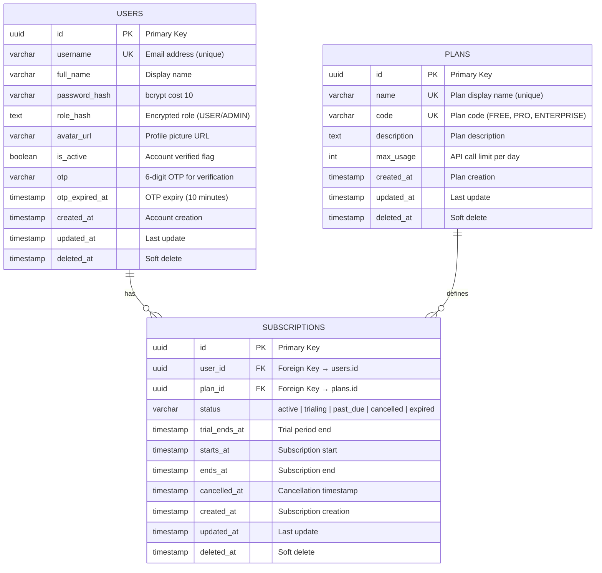
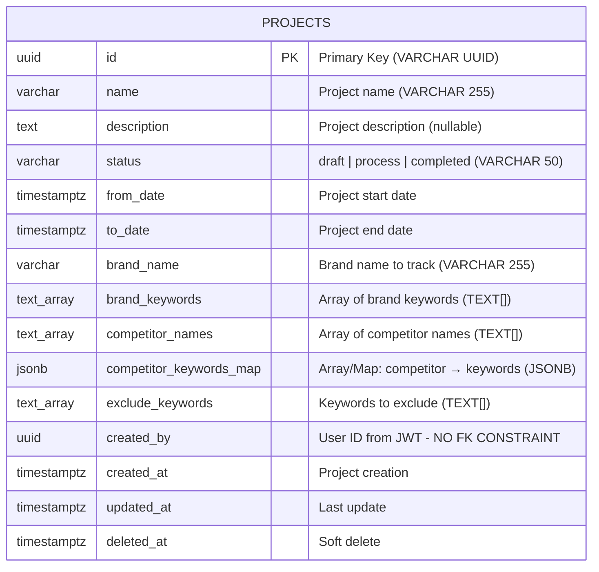
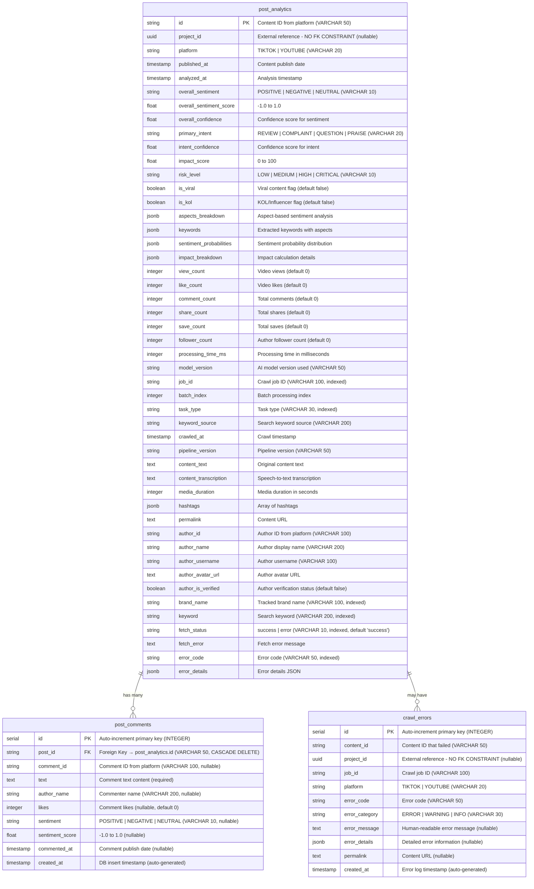
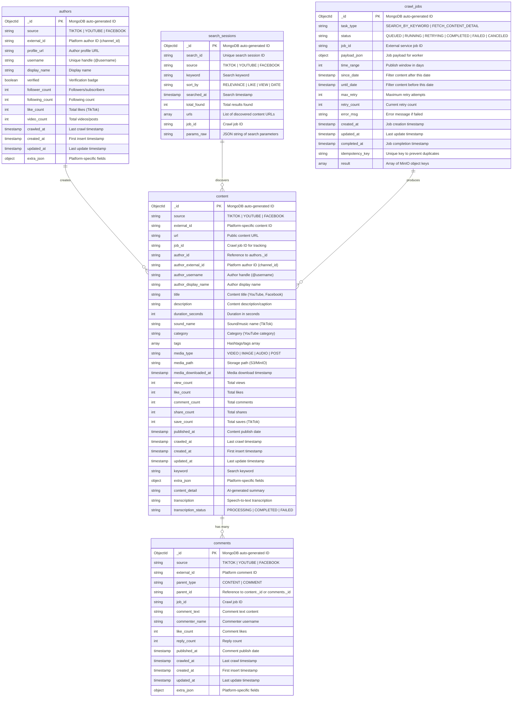
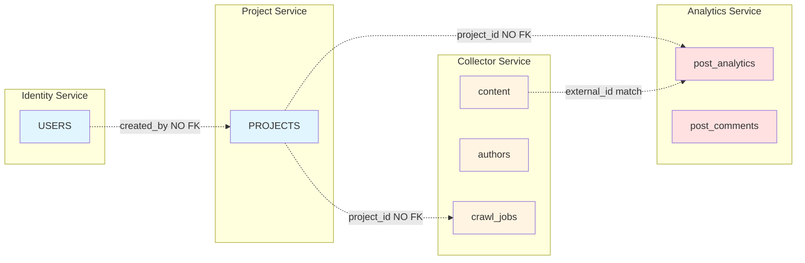

# Comprehensive Entity-Relationship Diagram (ERD) - SMAP System

**Mục đích:** ERD tổng thể cho toàn bộ hệ thống SMAP, bao gồm tất cả databases và services
**Ngày tạo:** 2025-12-29
**Phạm vi:** PostgreSQL (Identity, Project, Analytics) + MongoDB (Collector)

---

## Tổng quan hệ thống Database

SMAP sử dụng **Database per Service pattern** với 4 databases chính:

| Database          | Technology | Service           | Collections/Tables                                      |
| ----------------- | ---------- | ----------------- | ------------------------------------------------------- |
| **identity_db**   | PostgreSQL | Identity Service  | users, plans, subscriptions                             |
| **project_db**    | PostgreSQL | Project Service   | projects                                                |
| **analytics_db**  | PostgreSQL | Analytics Service | post_analytics, post_comments, crawl_errors             |
| **collection_db** | MongoDB    | Collector Service | content, authors, comments, search_sessions, crawl_jobs |

---

## 1. Identity Service Database (PostgreSQL)

### ERD Diagram



### Relationships

| Relationship          | Cardinality | Description                                           |
| --------------------- | ----------- | ----------------------------------------------------- |
| USERS → SUBSCRIPTIONS | 1:N         | One user can have multiple subscriptions (historical) |
| PLANS → SUBSCRIPTIONS | 1:N         | One plan can be subscribed by multiple users          |

### Indexes

- `users.username` - Unique index for login
- `subscriptions.user_id` - Query subscriptions by user
- `subscriptions.plan_id` - Query subscriptions by plan
- `subscriptions.status` - Filter active subscriptions

---

## 2. Project Service Database (PostgreSQL)

### ERD Diagram



### Cross-Database References

```
projects.created_by → users.id (Identity Service)
  - NO FK constraint (Database per Service pattern)
  - User ID extracted from JWT token
  - Validation via JWT, not database FK
```

### Indexes

- `projects.created_by` - Query projects by user
- `projects.status` - Filter by project status
- `projects.deleted_at` - Exclude deleted records

---

## 3. Analytics Service Database (PostgreSQL)

### ERD Diagram



### Relationships

| Relationship                   | Cardinality | Description                                      |
| ------------------------------ | ----------- | ------------------------------------------------ |
| post_analytics → post_comments | 1:N         | One post can have many comments (CASCADE DELETE) |
| post_analytics → crawl_errors  | 1:N         | One post may have multiple error logs            |

### Cross-Database References

```
post_analytics.project_id → projects.id (Project Service)
  - NO FK constraint (Database per Service pattern)
  - Nullable to support dry-run tasks

crawl_errors.project_id → projects.id (Project Service)
  - NO FK constraint
  - For error tracking per project
```

### JSONB Fields

- **aspects_breakdown**: Aspect-based sentiment

  ```json
  {
    "product_quality": { "sentiment": "POSITIVE", "score": 0.8, "count": 5 },
    "customer_service": { "sentiment": "NEUTRAL", "score": 0.1, "count": 2 },
    "price": { "sentiment": "NEGATIVE", "score": -0.6, "count": 3 }
  }
  ```

- **keywords**: Extracted keywords with aspects mapping

  ```json
  {
    "keywords": ["chất lượng tốt", "giá cao", "dịch vụ ổn"],
    "aspects": {
      "chất lượng tốt": "product_quality",
      "giá cao": "price",
      "dịch vụ ổn": "customer_service"
    }
  }
  ```

- **impact_breakdown**: Impact calculation details
  ```json
  {
    "engagement_score": 85,
    "reach_score": 92,
    "velocity_score": 78,
    "kol_multiplier": 1.5
  }
  ```

### Indexes

**post_analytics:**
- `idx_post_analytics_job_id` - Query by job_id
- `idx_post_analytics_fetch_status` - Filter by fetch status
- `idx_post_analytics_task_type` - Filter by task type
- `idx_post_analytics_error_code` - Query by error code
- `idx_post_analytics_brand_name` - Filter by brand name
- `idx_post_analytics_keyword` - Filter by keyword
- `idx_post_analytics_author_id` - Query by author

**post_comments:**
- `idx_post_comments_post_id` - Query comments by post (FK with CASCADE DELETE)
- `idx_post_comments_sentiment` - Filter comments by sentiment
- `idx_post_comments_commented_at` - Order comments by time

**crawl_errors:**
- `idx_crawl_errors_project_id` - Query errors by project
- `idx_crawl_errors_error_code` - Filter by error code
- `idx_crawl_errors_created_at` - Order errors by time
- `idx_crawl_errors_job_id` - Query errors by job

---

## 4. Collector Service Database (MongoDB)

### ERD Diagram



### Relationships

| Relationship              | Cardinality | Description                                             |
| ------------------------- | ----------- | ------------------------------------------------------- |
| authors → content         | 1:N         | One author creates many content items                   |
| content → comments        | 1:N         | One content has many comments (parent_type=CONTENT)     |
| comments → comments       | 1:N         | One comment can have many replies (parent_type=COMMENT) |
| search_sessions → content | 1:N         | One search discovers many content items                 |
| crawl_jobs → content      | 1:N         | One job produces many content items                     |

### MongoDB Indexes

**content collection:**

- `{ source: 1, external_id: 1 }` - Unique compound index
- `{ job_id: 1 }` - Query content by job
- `{ author_external_id: 1 }` - Query content by author
- `{ keyword: 1 }` - Query content by search keyword
- `{ published_at: -1 }` - Sort by publish date

**authors collection:**

- `{ source: 1, external_id: 1 }` - Unique compound index
- `{ username: 1 }` - Query by username

**comments collection:**

- `{ source: 1, external_id: 1 }` - Unique compound index
- `{ parent_id: 1, parent_type: 1 }` - Query comments by parent
- `{ job_id: 1 }` - Query comments by job

**search_sessions collection:**

- `{ search_id: 1 }` - Unique index
- `{ job_id: 1 }` - Query sessions by job

**crawl_jobs collection:**

- `{ job_id: 1 }` - Unique index
- `{ status: 1 }` - Filter jobs by status
- `{ idempotency_key: 1 }` - Prevent duplicate jobs

---

## 5. Cross-Database Relationships



### Cross-Database Reference Summary

| Source Entity     | Target Entity               | Reference Field   | FK Constraint | Validation Method          |
| ----------------- | --------------------------- | ----------------- | ------------- | -------------------------- |
| projects          | users                       | created_by        | ❌ NO         | JWT token validation       |
| post_analytics    | projects                    | project_id        | ❌ NO         | API validation             |
| crawl_errors      | projects                    | project_id        | ❌ NO         | API validation             |
| content (MongoDB) | post_analytics (PostgreSQL) | external_id match | ❌ NO         | Application-level matching |

**Rationale for NO FK Constraints:**

- **Database per Service pattern**: Each service owns its database
- **Service independence**: Services can be deployed, scaled, and maintained independently
- **Eventual consistency**: Cross-service references validated at application level
- **Resilience**: Service failures don't cascade via database FK constraints

---

## 6. Complete Entity Summary

### PostgreSQL Entities (3 databases, 7 tables)

| Service   | Table          | Fields | Rows (est) | Purpose                       |
| --------- | -------------- | ------ | ---------- | ----------------------------- |
| Identity  | users          | 12     | 10K-100K   | User authentication & profile |
| Identity  | plans          | 8      | 3-10       | Subscription plans            |
| Identity  | subscriptions  | 11     | 10K-100K   | User subscriptions            |
| Project   | projects       | 15     | 100K-1M    | Marketing projects            |
| Analytics | post_analytics | 45     | 10M-100M   | NLP analysis results          |
| Analytics | post_comments  | 10     | 50M-500M   | Comment-level sentiment       |
| Analytics | crawl_errors   | 11     | 1M-10M     | Error tracking                |

### MongoDB Collections (1 database, 5 collections)

| Collection      | Fields | Rows (est) | Purpose                   |
| --------------- | ------ | ---------- | ------------------------- |
| content         | 31     | 10M-100M   | Raw crawled videos/posts  |
| authors         | 14     | 1M-10M     | Content creators/channels |
| comments        | 14     | 50M-500M   | Raw comments              |
| search_sessions | 9      | 100K-1M    | Search metadata           |
| crawl_jobs      | 15     | 1M-10M     | Job orchestration         |

---

## 7. Key Design Patterns

### 1. Database per Service

- ✅ Each service owns its database
- ✅ No direct database access across services
- ✅ Cross-service communication via APIs

### 2. Soft Delete

- ✅ All PostgreSQL tables have `deleted_at` timestamp
- ✅ Enables data recovery and audit trails
- ✅ Queries filter `WHERE deleted_at IS NULL`

### 3. Immutable Identifiers

- ✅ UUIDs for PostgreSQL primary keys
- ✅ MongoDB ObjectIds for document IDs
- ✅ External platform IDs (external_id) for content deduplication

### 4. Timestamp Tracking

- ✅ `created_at`: First insert (immutable)
- ✅ `updated_at`: Last modification (auto-updated)
- ✅ `crawled_at`: Last crawl/refresh (for dynamic data)

### 5. JSONB for Flexibility

- ✅ `extra_json`: Platform-specific fields
- ✅ `aspects_breakdown`: Complex nested sentiment data
- ✅ `payload_json`: Dynamic job configurations

### 6. Polyglot Persistence

- ✅ PostgreSQL: Structured, relational data (Identity, Project, Analytics)
- ✅ MongoDB: Document-oriented, schema-flexible data (Collector)
- ✅ Redis: Caching, pub/sub, session storage
- ✅ MinIO: Object storage for media files

---

## 8. Data Flow Across Services

```
1. User creates Project (Project Service → project_db)
   ↓
2. Collector dispatches crawl job (Collector Service → collection_db.crawl_jobs)
   ↓
3. Scrapper crawls content (Scrapper Service → collection_db.content, authors, comments)
   ↓
4. Analytics analyzes content (Analytics Service → analytics_db.post_analytics, post_comments)
   ↓
5. User views results (Web UI queries Analytics Service)
```

**Data Consistency:**

- ✅ Eventual consistency across services
- ✅ Idempotency keys prevent duplicate processing
- ✅ Retry mechanisms handle transient failures
- ✅ Dead-letter queues for failed jobs

---

## 9. Scalability Considerations

### Horizontal Scaling

- ✅ PostgreSQL: Read replicas for Analytics Service (read-heavy)
- ✅ MongoDB: Sharding on `source` + `external_id` for content collection
- ✅ Redis: Redis Cluster for distributed caching

### Partitioning

- ✅ `post_analytics`: Partition by `analyzed_at` (time-series data)
- ✅ `content`: Shard by `source` (TIKTOK, YOUTUBE)

### Archival

- ✅ Old analytics results (>1 year) archived to S3
- ✅ Deleted projects soft-deleted for 90 days, then purged

---

**End of Comprehensive ERD**
