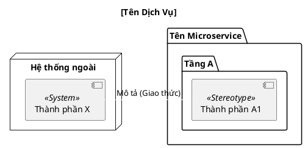

Chào bạn, đây là bản mẫu **Rule chi tiết (Markdown)** được thiết kế riêng để định hình cách tôi (AI) sẽ xử lý và chuyển đổi thông tin từ bạn thành code PlantUML.

Bạn có thể lưu file này làm "Technical Specification" cho các yêu cầu vẽ sơ đồ sau này của dự án SMAP.

---

# 📜 Quy tắc chuyển đổi Component Diagram (SMAP Project)

## 0. Tiêu chí đánh giá UML Component Diagram

Mọi sơ đồ được tạo ra phải tuân thủ các tiêu chí đánh giá sau (dựa trên UML 2.x và nguyên tắc kiến trúc phần mềm):

### A. Đúng chuẩn UML (UML Compliance) - Mục tiêu: 5/5

| Tiêu chí           | Mô tả                                  | Yêu cầu                                                   |
| ------------------ | -------------------------------------- | --------------------------------------------------------- |
| Component notation | Component được vẽ đúng ký hiệu UML     | Sử dụng `<<component>>`, `<<interface>>`, `<<subsystem>>` |
| Interface          | Có sử dụng provided/required interface | Dùng ký hiệu lollipop `()` và socket `(` khi cần          |
| Dependency         | Quan hệ phụ thuộc đúng chiều           | Mũi tên dependency `..>` hoặc `-->` rõ ràng               |
| System boundary    | Ranh giới hệ thống rõ ràng             | Dùng `package` hoặc `rectangle` phân tách                 |
| External systems   | Hệ thống bên ngoài được phân biệt      | Đặt ngoài boundary, dùng `<<System>>`                     |

### B. Rõ ràng về trách nhiệm (Separation of Concerns) - Mục tiêu: 5/5

| Tiêu chí              | Mô tả                                                    | Yêu cầu                                        |
| --------------------- | -------------------------------------------------------- | ---------------------------------------------- |
| Single Responsibility | Mỗi component có một vai trò chính                       | Tên component phản ánh đúng chức năng duy nhất |
| Không trộn layer      | Presentation/Application/Domain/Infrastructure tách biệt | Dùng `package` riêng cho mỗi layer             |
| Phụ thuộc đúng hướng  | Layer cao phụ thuộc layer thấp                           | Tuân thủ Clean Architecture                    |

### C. Mức độ trừu tượng phù hợp (Abstraction Level) - Mục tiêu: 5/5

| Tiêu chí           | Mô tả                                            | Yêu cầu                                            |
| ------------------ | ------------------------------------------------ | -------------------------------------------------- |
| Không quá chi tiết | Không biến component diagram thành class diagram | Không liệt kê methods, chỉ liệt kê component chính |
| Không quá thô      | Không chỉ vẽ một khối Service                    | Chia nhỏ thành các component có ý nghĩa            |
| Nhất quán          | Các component cùng mức abstraction               | Tất cả ở cấp độ architectural component            |

### D. Khả năng hiểu và giao tiếp (Readability & Communication) - Mục tiêu: 5/5

| Tiêu chí         | Mô tả                                 | Yêu cầu                                        |
| ---------------- | ------------------------------------- | ---------------------------------------------- |
| Tên rõ nghĩa     | Tên component phản ánh đúng chức năng | Dùng domain language, tránh viết tắt khó hiểu  |
| Luồng chính rõ   | Ai gọi ai, khi nào                    | Sắp xếp từ trái sang phải hoặc trên xuống dưới |
| Chú thích hợp lý | Event, message, protocol được ghi rõ  | Dùng `note` và label trên mũi tên              |

### E. Khả năng mở rộng và bảo trì (Evolvability) - Mục tiêu: 5/5

| Tiêu chí            | Mô tả                                | Yêu cầu                                      |
| ------------------- | ------------------------------------ | -------------------------------------------- |
| Dễ mở rộng          | Dễ thêm component mới                | Loose coupling giữa các component            |
| Loose coupling      | Giao tiếp qua interface hoặc message | Tránh dependency trực tiếp, dùng abstraction |
| Technology-agnostic | Không khóa chặt công nghệ ở mức cao  | Chỉ ghi công nghệ ở Infrastructure layer     |

### F. Phù hợp mục đích sơ đồ (Fitness for Purpose) - Mục tiêu: 5/5

Component Diagram phải đáp ứng các mục đích:

- Hiểu cấu trúc tổng thể của hệ thống
- Hiểu giao tiếp giữa các thành phần
- Phục vụ review kiến trúc và trao đổi thiết kế
- Onboarding developer mới
- Giải thích hệ thống event-driven/microservices

**Mục tiêu tổng thể: 5.0/5.0** (Excellent)

---

## 1. Nguyên tắc cấu trúc (Structural Rules)

Toàn bộ sơ đồ phải tuân thủ kiến trúc **Clean Architecture** và mô hình **C4 Component**:

- **Boundary (Ranh giới):** Sử dụng `package` hoặc `rectangle` để phân tách các tầng (Layer):
- `Presentation Layer (Delivery)`: Chứa Consumers, Producers, Controllers.
- `Application Layer (UseCase)`: Chứa Logic nghiệp vụ (Dispatcher, State, Results...).
- `Domain Layer (Models)`: Chứa Structs và Interfaces lõi.
- `Infrastructure Layer (Repository/Client)`: Chứa DB Driver, External Clients.

- **External Systems:** Các hệ thống bên ngoài (RabbitMQ, Redis, Microservices khác) phải được đặt bên ngoài `package` của dịch vụ chính.

## 2. Quy tắc định nghĩa Component

- **Khai báo:** Sử dụng cú pháp `[Tên thành phần] as Alias <<Stereotype>>`.
- **Stereotypes chuẩn UML:**

  - `<<component>>`: Cho các module/component chính (viết thường theo UML standard).
  - `<<interface>>`: Cho các interface/contract.
  - `<<subsystem>>`: Cho các hệ thống con lớn.
  - `<<System>>`: Cho các hệ thống bên ngoài (external systems).

- **Stereotypes mở rộng (cho Clean Architecture):**

  - `<<UseCase>>`: Cho Application Layer logic.
  - `<<Repository>>`: Cho Infrastructure Layer data access.
  - `<<Controller>>`: Cho Presentation Layer handlers.
  - `<<DomainModel>>`: Cho Domain Layer entities/value objects.

- **Alias (Bí danh):** Luôn dùng bí danh ngắn gọn (vd: `rmq_consumer`, `state_uc`) để viết code quan hệ dễ dàng hơn.

- **Interface notation (chuẩn UML):**
  - Provided interface (lollipop): `() "InterfaceName" as iface`
  - Required interface (socket): Component `-(` iface
  - Kết nối: `component1 -( iface` và `iface )- component2`

## 3. Quy tắc kết nối (Relationship Rules)

Màu sắc và kiểu mũi tên phải thể hiện được giao thức (Protocol) và loại quan hệ:

| Loại quan hệ       | Giao thức         | Ký hiệu PlantUML | Màu sắc      | Ví dụ                          |
| ------------------ | ----------------- | ---------------- | ------------ | ------------------------------ |
| **External Event** | AMQP (Events)     | `-[#blue]>`      | Xanh dương   | RabbitMQ -> Consumer           |
| **External API**   | HTTP/JSON         | `-[#green]>`     | Xanh lá      | Webhook Client -> Service      |
| **Data Access**    | TCP/DB            | `-[#red]>`       | Đỏ           | Repository -> Redis/PostgreSQL |
| **Internal Call**  | Function/Method   | `-->`            | Đen          | Delivery -> UseCase            |
| **Dependency**     | Uses/Depends      | `..>`            | Xám đứt đoạn | UseCase -> Models              |
| **Interface**      | Provided/Required | `-(` hoặc `-)`   | Đen          | Component -( Interface         |

**Lưu ý quan trọng:**

- Ưu tiên sử dụng interface notation (`-(`, `-)`) thay vì text "Gọi", "Sử dụng" để chuẩn UML hơn
- Giảm thiểu chú thích dài dòng trên mũi tên, chỉ ghi protocol/event name
- Với hệ thống phức tạp, nên tách riêng Sequence Diagram cho luồng xử lý chi tiết

## 4. Quy tắc thẩm mỹ (Visual Styling)

Luôn bao gồm khối `skinparam` để sơ đồ chuyên nghiệp:

```puml
skinparam componentStyle uml2
skinparam packageStyle rectangle
skinparam shadowing false
skinparam DefaultFontName "Arial"
skinparam NoteBackgroundColor #FEFECE
skinparam NoteBorderColor #A80036

```

## 5. Quy trình xử lý thông tin (Workflow)

Khi nhận được yêu cầu từ người dùng, AI phải thực hiện theo các bước sau:

1. **Phân tích Layer:** Xác định thành phần thuộc tầng nào trong Clean Architecture.
2. **Xác định Flow:** Luồng dữ liệu đi từ đâu đến đâu (Nhận event -> Xử lý logic -> Lưu DB -> Gọi Webhook).
3. **Đánh giá Abstraction:** Đảm bảo không quá chi tiết (class diagram) hoặc quá thô (chỉ 1 khối).
4. **Kiểm tra Interface:** Xem xét có cần dùng provided/required interface notation không.
5. **Gen Code:** Trả về code PlantUML hoàn chỉnh trong khối code.
6. **Self-review:** Đối chiếu với 6 tiêu chí đánh giá (A-F) ở phần 0.

**Checklist trước khi xuất sơ đồ:**

- [ ] Có phân tách rõ system boundary không?
- [ ] Các layer có tách biệt không?
- [ ] Dependency có đúng hướng không? (Clean Architecture)
- [ ] Tên component có rõ nghĩa không?
- [ ] Có dùng interface notation khi cần không?
- [ ] Màu sắc có phản ánh đúng protocol không?
- [ ] Sơ đồ có dễ hiểu cho người mới không?

---

## 6. Mẫu cấu trúc Code chuẩn



---

**Cách sử dụng:** Sau này, bạn chỉ cần gửi yêu cầu như: _"Vẽ sơ đồ cho Service Crawler, có các thành phần X, Y, Z, giao tiếp với Redis qua TCP và nhận nhiệm vụ từ RabbitMQ"_. Tôi sẽ tự động áp dụng bộ Rule trên để xuất ra kết quả chuẩn nhất cho bạn.

---

## 7. Gợi ý cải thiện sơ đồ hiện có

Nếu sơ đồ đã tồn tại và cần cải thiện để đạt 5.0/5.0, xem xét các điểm sau:

### Từ Architecture Diagram sang UML Component Diagram thuần

1. **Thay text bằng interface notation:**

   - Thay vì: `A --> B : "Gọi"`
   - Dùng: `() "IService" as isvc` và `A -( isvc` và `isvc )- B`

2. **Giảm chú thích dài:**

   - Thay vì: `rmq_consumer --> dispatcher_uc : "Gọi"`
   - Dùng: `rmq_consumer --> dispatcher_uc`
   - Chỉ ghi protocol/event name khi cần: `rabbitmq -[#blue]> rmq_consumer : project.created`

3. **Tách Sequence Diagram:**

   - Component Diagram: Chỉ thể hiện cấu trúc tĩnh (components và relationships)
   - Sequence Diagram: Thể hiện luồng xử lý động (flow 1, flow 2, flow 3...)

4. **Giảm chi tiết Domain Models:**
   - Thay vì liệt kê: `ProjectCreatedEvent, CrawlRequest, CollectorTask`
   - Chỉ ghi: `[Domain Models] as models <<DomainModel>>`

### So sánh với C4 Model

- **C4 Level 3 (Component):** Tương đương với sơ đồ hiện tại
- **C4 Level 4 (Code):** Mới cần chi tiết class/struct
- Nếu muốn theo C4, có thể bỏ stereotype UML và dùng C4-PlantUML library

---

## 8. Tham khảo thêm

- **UML 2.5 Specification:** [https://www.omg.org/spec/UML/](https://www.omg.org/spec/UML/)
- **C4 Model:** [https://c4model.com/](https://c4model.com/)
- **PlantUML Component Diagram:** [https://plantuml.com/component-diagram](https://plantuml.com/component-diagram)
- **Clean Architecture:** Robert C. Martin (Uncle Bob)
