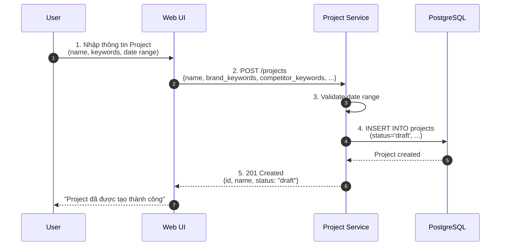
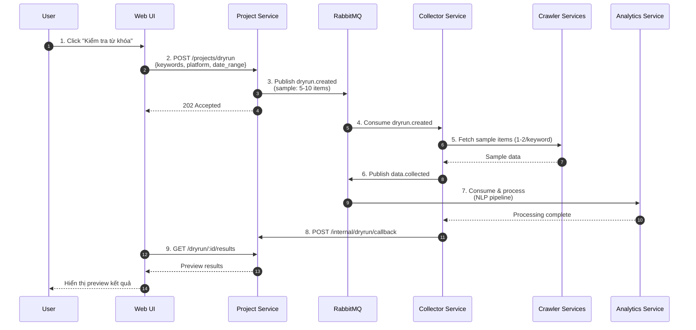
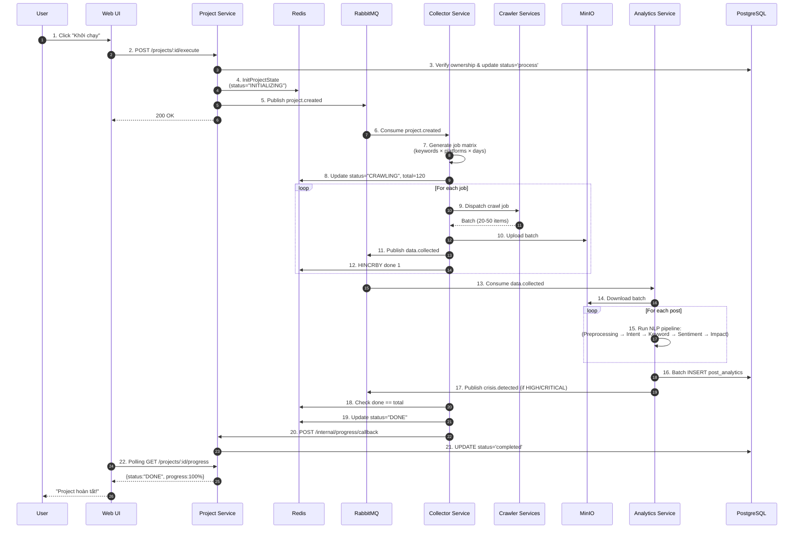
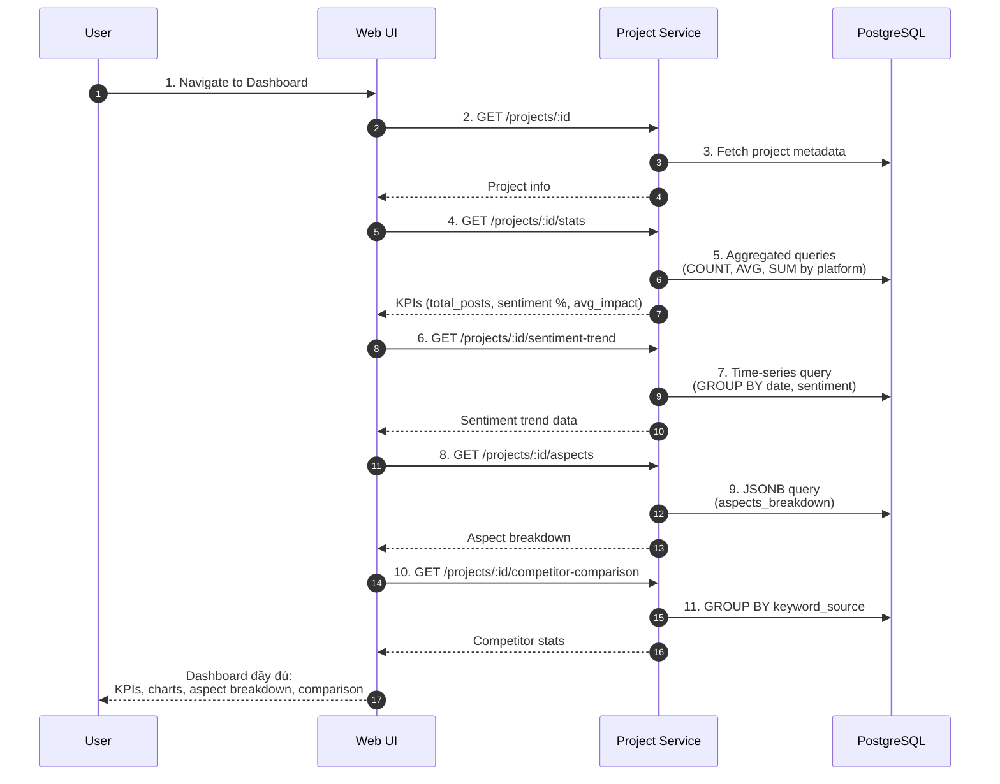
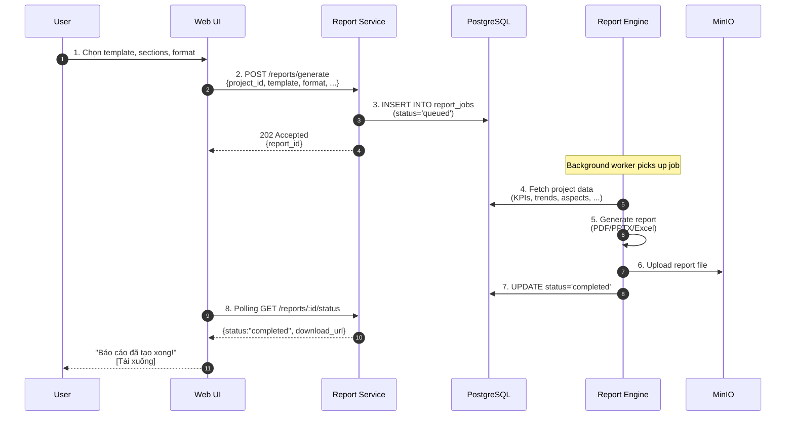
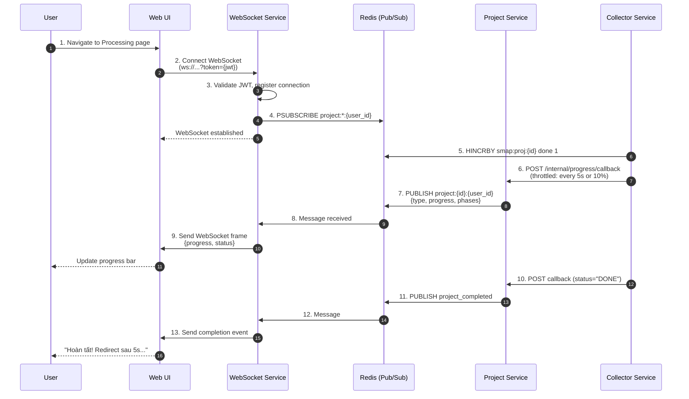
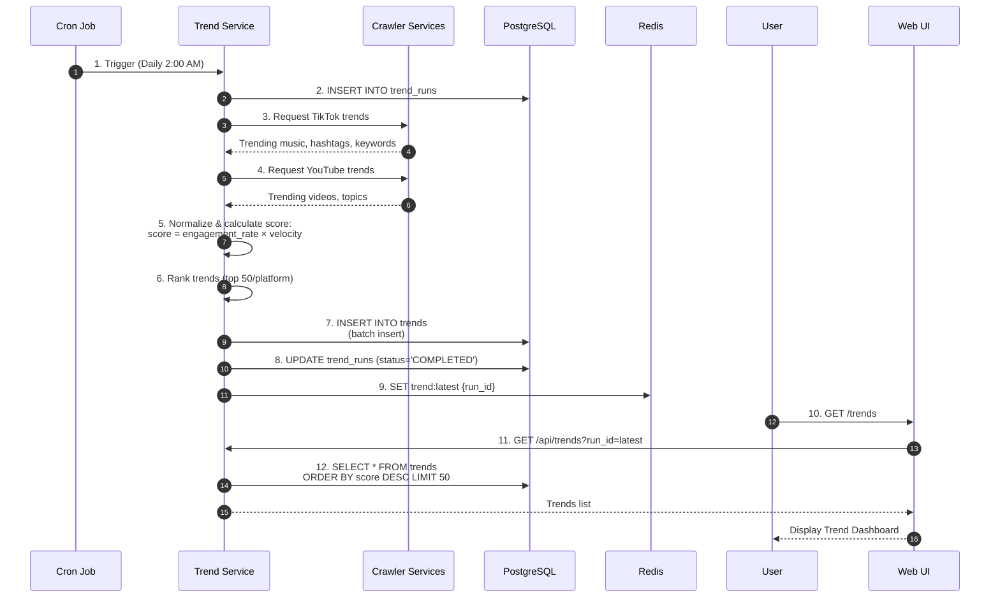
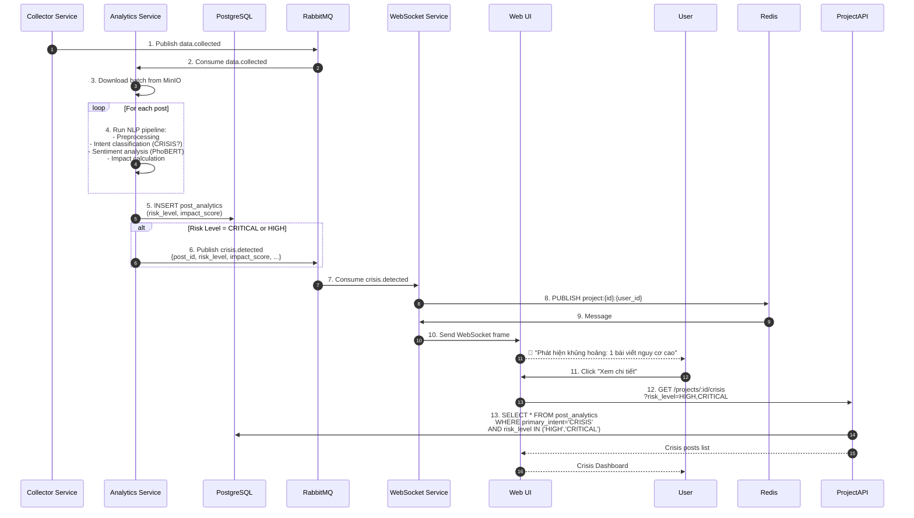

# SMAP System - Sequence Diagrams

> **Note**: Các sequence diagrams này được xây dựng dựa trên source code thực tế trong folder `services/`.

---

## Table of Contents

1. [UC-01: Cấu hình Project](#uc-01-cấu-hình-project)
2. [UC-02: Dry-run (Kiểm tra keywords)](#uc-02-dry-run-kiểm-tra-keywords)
3. [UC-03: Khởi chạy & Giám sát Project](#uc-03-khởi-chạy--giám-sát-project)
4. [UC-04: Xem kết quả & So sánh](#uc-04-xem-kết-quả--so-sánh)
5. [UC-05: Xuất báo cáo](#uc-05-xuất-báo-cáo)
6. [UC-06: Theo dõi tiến độ real-time (WebSocket)](#uc-06-theo-dõi-tiến-độ-real-time-websocket)
7. [UC-07: Phát hiện trend tự động](#uc-07-phát-hiện-trend-tự-động)
8. [UC-08: Phát hiện khủng hoảng](#uc-08-phát-hiện-khủng-hoảng)

---

## UC-01: Cấu hình Project

**Main Flow**: User tạo Project mới với brand và competitor keywords.

**Source**: `services/project/internal/project/usecase/project.go::Create()`

**Key Points**:

- Project status = `draft` sau khi tạo
- **NO Redis state**, **NO RabbitMQ event** được publish
- PostgreSQL lưu: project metadata, brand_keywords (JSONB), competitor_keywords (JSONB array)

---

## UC-02: Dry-run (Kiểm tra keywords)

**Main Flow**: User kiểm tra keywords trước khi chạy Project thật.

**Source**: `services/project/internal/project/usecase/project.go::DryRun()`

**Key Points**:

- **Sampling strategy**: 1-2 items/keyword (total 5-10 items)
- **No project_id**: Dry-run tasks không gắn project_id
- **Callback mechanism**: Collector gọi webhook khi xong

---

## UC-03: Khởi chạy & Giám sát Project

**Main Flow**: User khởi chạy Project đã cấu hình và theo dõi tiến độ.

**Source**: `services/project/internal/project/usecase/project.go::Execute()`

**Key Points**:

- **Transaction-like flow**: PostgreSQL → Redis → RabbitMQ (with rollback)
- **4 giai đoạn**: INITIALIZING → CRAWLING → PROCESSING → DONE
- **Redis state** (`smap:proj:{id}`) làm single source of truth cho progress
- **Batching**: Crawler upload 20-50 items/batch vào MinIO
- **Crisis detection**: Tự động trigger nếu CRISIS intent + high impact

---

## UC-04: Xem kết quả & So sánh

**Main Flow**: User xem dashboard với KPIs, sentiment trends, và so sánh đối thủ.

**Source**: `services/web-ui/pages/dashboard/project/[id].tsx`

**Key Points**:

- **Aggregated queries**: GROUP BY, AVG(), COUNT() để tính KPIs
- **JSONB queries**: PostgreSQL JSONB operators để query aspect breakdown
- **Drilldown**: Click aspect → filter posts → view details

---

## UC-05: Xuất báo cáo

**Main Flow**: User xuất báo cáo dưới format PDF/PPTX/Excel.

**Source**: `services/web-ui/components/reports/ReportWizard.tsx`

**Key Points**:

- **Async processing**: Report generation chạy background
- **Polling**: WebUI polls status mỗi 3s
- **Size limit**: File > 100MB → fail
- **MinIO pre-signed URL**: Download link có expiry 7 ngày

---

## UC-06: Theo dõi tiến độ real-time (WebSocket)

**Main Flow**: User kết nối WebSocket để nhận progress updates real-time.

**Source**: `services/websocket/internal/hub/hub.go`

**Key Points**:

- **Pattern subscription**: `project:*:{user_id}` để nhận tất cả projects
- **Throttling**: Collector chỉ gọi webhook mỗi 5s hoặc khi progress tăng 10%
- **Multi-connection**: 1 user có thể mở nhiều tabs

---

## UC-07: Phát hiện trend tự động

**Main Flow**: Cron job tự động thu thập và xếp hạng trends từ các platforms.

**Source**: `services/project/document/api.md` (Future feature)

**Key Points**:

- **Cron schedule**: Kubernetes CronJob chạy hàng ngày lúc 2:00 AM UTC
- **Score formula**: `engagement_rate × velocity`
- **Error handling**: Rate-limit → retry → skip platform → partial result
- **Cache**: Latest run_id được cache trong Redis (24h)

---

## UC-08: Phát hiện khủng hoảng

**Main Flow**: Hệ thống tự động phát hiện bài viết có nguy cơ khủng hoảng và cảnh báo user.

**Source**: `services/analytic/services/analytics/intent/intent_classifier.py`

**Key Points**:

- **Triple check**: Intent=CRISIS + Sentiment=VERY_NEGATIVE + Impact=HIGH/CRITICAL
- **Impact formula**: engagement × 0.3 + reach × 0.3 + sentiment × 0.2 + velocity × 0.2
- **Risk levels**: CRITICAL (>80), HIGH (60-80), MEDIUM (40-60), LOW (<40)
- **Real-time alert**: Qua WebSocket, user nhận ngay khi phát hiện

---

## Summary

Tổng cộng **8 sequence diagrams** đã được tạo, bao phủ toàn bộ 8 Use Cases:

| Use Case                     | Độ phức tạp | Số participants | Highlights                                           |
| ---------------------------- | ----------- | --------------- | ---------------------------------------------------- |
| UC-01: Cấu hình Project      | Medium      | 4               | PostgreSQL only, no events                           |
| UC-02: Dry-run               | Medium      | 7               | Sampling strategy, async callback                    |
| UC-03: Khởi chạy & Giám sát  | **High**    | 9               | 4 phases, Redis state, event-driven, rollback        |
| UC-04: Xem kết quả           | Medium      | 3               | Aggregation queries, JSONB, drilldown                |
| UC-05: Xuất báo cáo          | Medium      | 6               | Async processing, multi-format, MinIO pre-signed URL |
| UC-06: WebSocket Progress    | High        | 6               | Pub/Sub, throttling, multi-connection                |
| UC-07: Phát hiện trend       | Medium      | 7               | Cron job, score formula, partial results             |
| UC-08: Phát hiện khủng hoảng | **High**    | 7               | NLP pipeline, crisis detection logic                 |

**Những diagrams này được xây dựng dựa trên:**

- Source code thực tế trong folder `services/`
- API contracts (REST, RabbitMQ events, Redis Pub/Sub)
- Database schemas (PostgreSQL, Redis)
- Documentation files (architecture.md, event-drivent.md, api.md)

**Lưu ý khi chuyển sang Typst:**

- Mermaid không được hỗ trợ trực tiếp trong Typst
- Cần export các diagrams sang PNG/SVG bằng Mermaid CLI hoặc online tools
- Hoặc sử dụng PlantUML nếu Typst có plugin hỗ trợ
