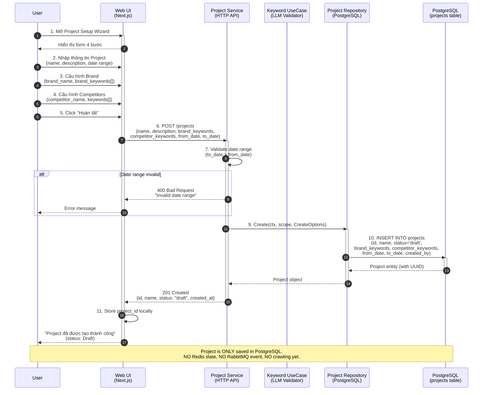
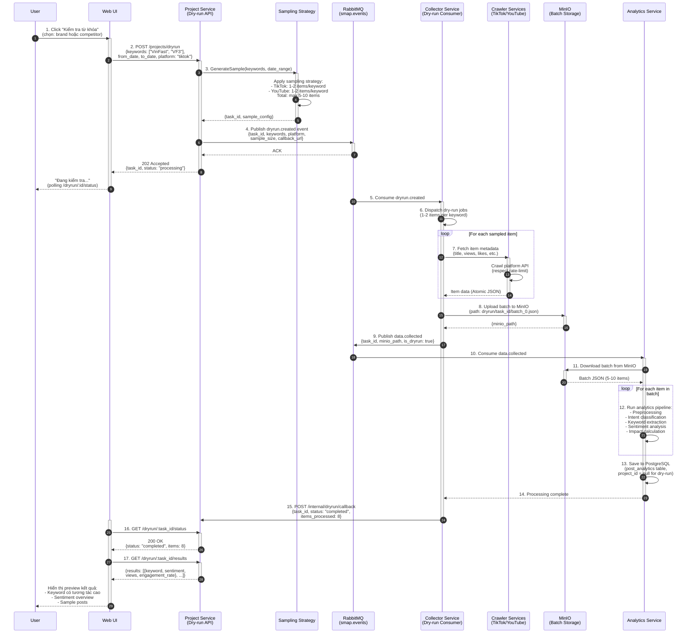
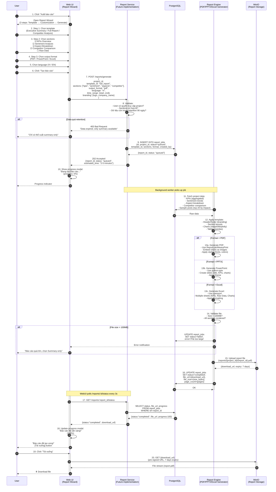
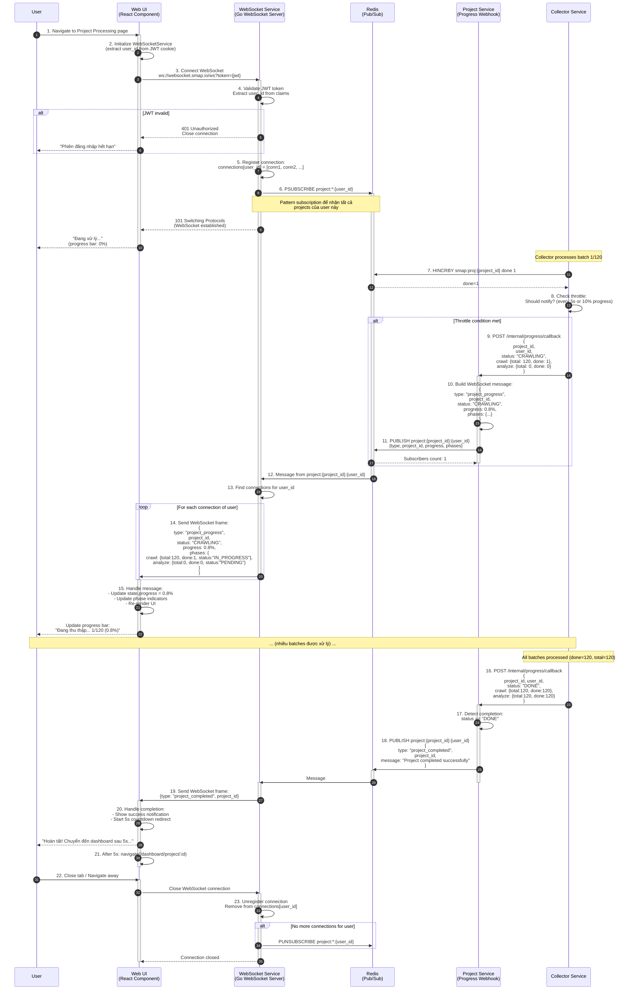

# SMAP System - Sequence Diagrams

> **Note**: Các sequence diagrams này được xây dựng dựa trên source code thực tế trong folder `services/`.

---

## Table of Contents

1. [UC-01: Cấu hình Project](#uc-01-cấu-hình-project)
2. [UC-02: Dry-run (Kiểm tra keywords)](#uc-02-dry-run-kiểm-tra-keywords)
3. [UC-03: Khởi chạy & Giám sát Project](#uc-03-khởi-chạy--giám-sát-project)
4. [UC-04: Xem kết quả & So sánh](#uc-04-xem-kết-quả--so-sánh)
5. [UC-05: Xuất báo cáo](#uc-05-xuất-báo-cáo)
6. [UC-06: Theo dõi tiến độ real-time (WebSocket)](#uc-06-theo-dõi-tiến-độ-real-time-websocket)
7. [UC-07: Phát hiện trend tự động](#uc-07-phát-hiện-trend-tự-động)
8. [UC-08: Phát hiện khủng hoảng](#uc-08-phát-hiện-khủng-hoảng)

---

## UC-01: Cấu hình Project

**Main Flow**: User tạo Project mới với brand và competitor keywords.

**Source**: `services/project/internal/project/usecase/project.go::Create()`, `services/web-ui/components/dashboard/ProjectSetupWizard.tsx`

**Key Points**:

- Project status = `draft` sau khi tạo
- **NO Redis state**, **NO RabbitMQ event** được publish
- Keyword validation qua LLM hiện đang **disabled** trong production (dòng 104-117 trong source)
- PostgreSQL lưu: project metadata, brand_keywords (JSONB), competitor_keywords (JSONB array)

---

## UC-02: Dry-run (Kiểm tra keywords)

**Main Flow**: User kiểm tra keywords trước khi chạy Project thật.

**Source**: `services/project/internal/project/usecase/project.go::DryRun()`, `services/collector/internal/dryrun/usecase/dryrun.go`

**Key Points**:

- **Sampling strategy**: 1-2 items/keyword (total 5-10 items) để tiết kiệm cost
- **No project_id**: Dry-run tasks không gắn project_id
- **Callback mechanism**: Collector gọi webhook `/internal/dryrun/callback` khi xong
- **Result storage**: Lưu trong PostgreSQL với flag `is_dryrun=true`

---

## UC-03: Khởi chạy & Giám sát Project

**Main Flow**: User khởi chạy Project đã cấu hình và theo dõi tiến độ.

**Source**: `services/project/internal/project/usecase/project.go::Execute()`, `services/collector/internal/dispatcher/usecase/project_event.go`

```mermaid
sequenceDiagram
    autonumber
    participant User
    participant WebUI as Web UI
    participant ProjectAPI as Project Service
    participant StateUC as State UseCase<br/>(Redis Ops)
    participant Redis as Redis<br/>(State DB)
    participant RabbitMQ as RabbitMQ<br/>(smap.events)
    participant Collector as Collector Service
    participant Crawler as Crawler Services<br/>(YouTube/TikTok)
    participant MinIO as MinIO
    participant Analytics as Analytics Service
    participant PostgreSQL as PostgreSQL

    %% ===== STEP 1: EXECUTE PROJECT =====
    User->>WebUI: 1. Click "Khởi chạy" trên Draft Project
    activate WebUI

    WebUI->>ProjectAPI: 2. POST /projects/:id/execute<br/>(với cookie smap_auth_token)
    activate ProjectAPI

    %% Verify ownership
    ProjectAPI->>PostgreSQL: 3. SELECT * FROM projects<br/>WHERE id=:id
    activate PostgreSQL
    PostgreSQL-->>ProjectAPI: Project {id, created_by, status}
    deactivate PostgreSQL

    alt User không phải owner
        ProjectAPI-->>WebUI: 403 Forbidden<br/>"Unauthorized"
        WebUI-->>User: "Bạn không có quyền"
    end

    %% Check duplicate execution
    ProjectAPI->>StateUC: 4. GetProjectState(project_id)
    activate StateUC
    StateUC->>Redis: HGETALL smap:proj:{id}
    activate Redis
    Redis-->>StateUC: {status, total, done, errors} or nil
    deactivate Redis
    StateUC-->>ProjectAPI: State result (nil if not exists)
    deactivate StateUC

    alt State đã tồn tại
        ProjectAPI-->>WebUI: 409 Conflict<br/>{code: 30008, message: "Already executing"}
        WebUI-->>User: "Project đang chạy"
    end
    
    %% ===== STEP 2: UPDATE POSTGRESQL STATUS =====
    ProjectAPI->>PostgreSQL: 5. UPDATE projects<br/>SET status='process'<br/>WHERE id={project_id}
    activate PostgreSQL
    PostgreSQL-->>ProjectAPI: OK
    deactivate PostgreSQL
    
    alt PostgreSQL update fails
        ProjectAPI-->>WebUI: 500 Internal Server Error
        WebUI-->>User: "Lỗi hệ thống"
    end
    
    %% ===== STEP 3: INITIALIZE REDIS STATE =====
    ProjectAPI->>StateUC: 7. InitProjectState(project_id, user_id)
    activate StateUC
    StateUC->>Redis: 8. HSET smap:proj:{id}<br/>status="INITIALIZING"<br/>total=0, done=0, errors=0<br/>user_id={user_id}
    activate Redis
    Redis-->>StateUC: OK
    StateUC->>Redis: 9. EXPIRE smap:proj:{id} 604800<br/>(7 days TTL)
    Redis-->>StateUC: OK
    deactivate Redis
    StateUC-->>ProjectAPI: State initialized
    deactivate StateUC
    
    alt Redis init fails
        ProjectAPI->>PostgreSQL: ROLLBACK: UPDATE status='draft'<br/>WHERE id={project_id}
        activate PostgreSQL
        PostgreSQL-->>ProjectAPI: OK
        deactivate PostgreSQL
        ProjectAPI-->>WebUI: 500 Internal Server Error
        WebUI-->>User: "Lỗi hệ thống"
    end
    
    %% ===== STEP 4: PUBLISH EVENT TO RABBITMQ =====
    ProjectAPI->>RabbitMQ: 10. Publish project.created<br/>{project_id, user_id, brand_keywords,<br/>competitor_keywords, from_date, to_date}
    activate RabbitMQ
    
    alt RabbitMQ publish fails
        RabbitMQ-->>ProjectAPI: Error
        ProjectAPI->>StateUC: ROLLBACK: Delete Redis state
        StateUC->>Redis: DEL smap:proj:{id}
        ProjectAPI->>PostgreSQL: ROLLBACK: UPDATE status='draft'
        activate PostgreSQL
        PostgreSQL-->>ProjectAPI: OK
        deactivate PostgreSQL
        ProjectAPI-->>WebUI: 500 Internal Server Error
        WebUI-->>User: "Lỗi hệ thống"
    end

    RabbitMQ-->>ProjectAPI: ACK
    deactivate RabbitMQ
    
    ProjectAPI-->>WebUI: 200 OK<br/>{project_id, status: "executing"}
    deactivate ProjectAPI
    
    WebUI->>WebUI: 11. Navigate to Project Processing Page<br/>(polling /progress + WebSocket)
    WebUI-->>User: Hiển thị progress bar
    deactivate WebUI
    
    %% ===== STEP 5: COLLECTOR DISPATCHES JOBS =====
    RabbitMQ->>Collector: 12. Consume project.created event
    activate Collector
    
    Collector->>Collector: 13. Parse keywords:<br/>- brand_keywords: ["VinFast", "VF3"]<br/>- competitor_keywords: [<br/>  {name:"Toyota", kw:["Vios"]}<br/>]
    
    Collector->>Collector: 14. Generate job matrix:<br/>- 2 keywords × 2 platforms × 30 days<br/>= 120 jobs
    
    Collector->>Redis: 15. HSET smap:proj:{id}<br/>status="CRAWLING", total=120
    activate Redis
    Redis-->>Collector: OK
    deactivate Redis

    loop For each (keyword, platform, date)
        Collector->>Crawler: 16. Dispatch crawl job<br/>{keyword, platform, date, project_id}
        activate Crawler
        Crawler->>Crawler: Crawl posts từ platform API<br/>(respect rate-limit)
        Crawler-->>Collector: Batch of 20-50 items<br/>(Atomic JSON format)
        deactivate Crawler
        
        Collector->>MinIO: 17. Upload batch<br/>(crawl/{project_id}/batch_X.json)
        activate MinIO
        MinIO-->>Collector: {minio_path}
        deactivate MinIO
        
        Collector->>RabbitMQ: 18. Publish data.collected<br/>{project_id, minio_path, batch_index}
        
        Collector->>Redis: 19. HINCRBY smap:proj:{id} done 1
        activate Redis
        Redis-->>Collector: New done count
        deactivate Redis
    end
    
    Collector->>Redis: 20. HSET smap:proj:{id}<br/>status="PROCESSING"
    deactivate Collector
    
    %% ===== STEP 6: ANALYTICS PROCESSES BATCHES =====
    RabbitMQ->>Analytics: 21. Consume data.collected events
    activate Analytics
    
    loop For each batch
        Analytics->>MinIO: 22. Download batch from MinIO
        activate MinIO
        MinIO-->>Analytics: Batch JSON (20-50 items)
        deactivate MinIO

        loop For each post in batch
            Analytics->>Analytics: 23. Run analytics pipeline:<br/>1. Preprocessing<br/>2. Intent classification<br/>3. Keyword extraction<br/>4. Sentiment analysis<br/>5. Impact calculation
        end
        
        Analytics->>PostgreSQL: 24. Batch INSERT post_analytics<br/>(20-50 rows)
        activate PostgreSQL
        PostgreSQL-->>Analytics: OK
        deactivate PostgreSQL
        
        Analytics->>Analytics: 25. Check for CRISIS intent<br/>+ High impact + Negative sentiment
        
        alt Crisis detected
            Analytics->>RabbitMQ: Publish crisis.detected<br/>{project_id, post_id, risk_level}
        end
        
        Analytics-->>Collector: 26. ACK message
    end
    deactivate Analytics
    
    %% ===== STEP 7: COMPLETION =====
    Collector->>Redis: 27. Check: done == total?
    activate Redis
    Redis-->>Collector: {done: 120, total: 120}
    deactivate Redis
    
    Collector->>Redis: 28. HSET smap:proj:{id}<br/>status="DONE"
    
    Collector->>ProjectAPI: 29. POST /internal/progress/callback<br/>{project_id, user_id,<br/>status: "DONE", total: 120, done: 120}
    activate ProjectAPI
    ProjectAPI->>PostgreSQL: 30. UPDATE projects<br/>SET status='completed'<br/>WHERE id={project_id}
    activate PostgreSQL
    PostgreSQL-->>ProjectAPI: OK
    deactivate PostgreSQL
    
    ProjectAPI->>Redis: 31. PUBLISH user_noti:{user_id}<br/>{type: "project_completed",<br/>project_id, message}
    ProjectAPI-->>Collector: 200 OK
    deactivate ProjectAPI
    
    %% ===== USER SEES COMPLETION =====
    activate WebUI
    WebUI->>ProjectAPI: 32. Polling GET /projects/:id/progress
    activate ProjectAPI
    ProjectAPI->>Redis: HGETALL smap:proj:{id}
    activate Redis
    Redis-->>ProjectAPI: {status:"DONE", progress:100%}
    deactivate Redis
    ProjectAPI-->>WebUI: {status:"DONE", progress:100%}
    deactivate ProjectAPI

    WebUI-->>User: "Project hoàn tất!"<br/>(redirect to Dashboard sau 5s)
    deactivate WebUI
```

**Key Points**:

- **Transaction-like flow**: PostgreSQL update → Redis init → RabbitMQ publish (with rollback at each step)
- **4 giai đoạn**: INITIALIZING → CRAWLING → PROCESSING → DONE
- **Redis state** (`smap:proj:{id}`) làm single source of truth cho progress
- **Rollback mechanism**: 
  - Nếu Redis init fail → rollback PostgreSQL to "draft"
  - Nếu RabbitMQ publish fail → rollback cả Redis và PostgreSQL
- **Batching**: Crawler upload 20-50 items/batch vào MinIO, analytics consume theo batch
- **Crisis detection**: Tự động trigger nếu phát hiện post có CRISIS intent + high impact

---

## UC-04: Xem kết quả & So sánh

**Main Flow**: User xem dashboard với KPIs, sentiment trends, và so sánh đối thủ.

**Source**: `services/web-ui/pages/dashboard/project/[id].tsx`, `services/analytic/repository/analytics_repository.py`

```mermaid
sequenceDiagram
    autonumber
    participant User
    participant WebUI as Web UI<br/>(Dashboard)
    participant ProjectAPI as Project Service
    participant PostgreSQL as PostgreSQL<br/>(post_analytics)

    User->>WebUI: 1. Navigate to Project Dashboard<br/>(/dashboard/project/:id)
    activate WebUI

    %% ===== FETCH PROJECT METADATA =====
    WebUI->>ProjectAPI: 2. GET /projects/:id
    activate ProjectAPI
    ProjectAPI->>PostgreSQL: SELECT * FROM projects WHERE id=:id
    activate PostgreSQL
    PostgreSQL-->>ProjectAPI: {id, name, status,<br/>brand_keywords, competitor_keywords,<br/>from_date, to_date}
    deactivate PostgreSQL
    ProjectAPI-->>WebUI: Project metadata
    deactivate ProjectAPI

    %% ===== FETCH AGGREGATED STATS =====
    WebUI->>ProjectAPI: 3. GET /projects/:id/stats<br/>?platform=all&date_range=all
    activate ProjectAPI

    ProjectAPI->>PostgreSQL: 4. Query aggregated stats:<br/>SELECT<br/>  COUNT(*) as total_posts,<br/>  AVG(impact_score) as avg_impact,<br/>  COUNT(CASE overall_sentiment='POSITIVE') as positive_count,<br/>  COUNT(CASE overall_sentiment='NEGATIVE') as negative_count,<br/>  SUM(view_count) as total_views,<br/>  SUM(like_count + comment_count + share_count) as total_engagement<br/>FROM post_analytics<br/>WHERE project_id=:id<br/>GROUP BY platform
    activate PostgreSQL
    PostgreSQL-->>ProjectAPI: Aggregated stats
    deactivate PostgreSQL

    ProjectAPI-->>WebUI: 5. KPIs:<br/>{total_posts: 1250,<br/>positive: 45%, negative: 15%,<br/>neutral: 40%, avg_impact: 42.5}
    deactivate ProjectAPI

    %% ===== RENDER DASHBOARD =====
    WebUI->>WebUI: 6. Render overview cards:<br/>- Total Posts: 1,250<br/>- Sentiment: 45% Positive<br/>- Avg Impact: 42.5/100<br/>- Total Engagement: 125K

    %% ===== FETCH SENTIMENT TREND =====
    WebUI->>ProjectAPI: 7. GET /projects/:id/sentiment-trend<br/>?granularity=daily
    activate ProjectAPI

    ProjectAPI->>PostgreSQL: 8. SELECT<br/>  DATE(published_at) as date,<br/>  overall_sentiment,<br/>  COUNT(*) as count<br/>FROM post_analytics<br/>WHERE project_id=:id<br/>GROUP BY date, overall_sentiment<br/>ORDER BY date
    activate PostgreSQL
    PostgreSQL-->>ProjectAPI: Time-series data
    deactivate PostgreSQL

    ProjectAPI-->>WebUI: Sentiment trend<br/>[{date, positive_count, negative_count}, ...]
    deactivate ProjectAPI

    WebUI->>WebUI: 9. Render line chart:<br/>"Sentiment Trend (30 ngày)"

    %% ===== FETCH ASPECT BREAKDOWN =====
    WebUI->>ProjectAPI: 10. GET /projects/:id/aspects
    activate ProjectAPI

    ProjectAPI->>PostgreSQL: 11. SELECT<br/>  jsonb_array_elements(aspects_breakdown) as aspect,<br/>  aspect->>'name' as aspect_name,<br/>  aspect->>'sentiment' as sentiment,<br/>  COUNT(*) as count<br/>FROM post_analytics<br/>WHERE project_id=:id<br/>  AND aspects_breakdown IS NOT NULL<br/>GROUP BY aspect_name, sentiment
    activate PostgreSQL
    PostgreSQL-->>ProjectAPI: Aspect breakdown
    deactivate PostgreSQL

    ProjectAPI-->>WebUI: Aspects:<br/>[{name:"Giá cả", positive:120, negative:45},<br/> {name:"Chất lượng", positive:200, negative:30}]
    deactivate ProjectAPI

    WebUI->>WebUI: 12. Render stacked bar chart:<br/>"Phân tích theo khía cạnh"

    %% ===== COMPETITOR COMPARISON =====
    WebUI->>ProjectAPI: 13. GET /projects/:id/competitor-comparison
    activate ProjectAPI

    ProjectAPI->>PostgreSQL: 14. SELECT<br/>  keyword_source,<br/>  AVG(impact_score) as avg_impact,<br/>  COUNT(CASE overall_sentiment='POSITIVE') as positive_pct,<br/>  SUM(view_count + like_count) as total_engagement<br/>FROM post_analytics<br/>WHERE project_id=:id<br/>GROUP BY keyword_source
    activate PostgreSQL
    PostgreSQL-->>ProjectAPI: Competitor stats
    deactivate PostgreSQL

    ProjectAPI-->>WebUI: Comparison:<br/>{brand: {impact:45, positive:50%, engagement:80K},<br/> competitor_Toyota: {impact:40, positive:45%, engagement:65K}}
    deactivate ProjectAPI

    WebUI->>WebUI: 15. Render comparison table + radar chart:<br/>"So sánh với đối thủ"

    WebUI-->>User: Hiển thị dashboard đầy đủ:<br/>- KPIs tổng quan<br/>- Sentiment trend chart<br/>- Aspect breakdown<br/>- Competitor comparison
    deactivate WebUI

    %% ===== DRILLDOWN =====
    User->>WebUI: 16. Click vào khía cạnh "Giá cả"
    activate WebUI

    WebUI->>ProjectAPI: 17. GET /projects/:id/posts<br/>?aspect=Giá+cả&sentiment=negative&limit=20
    activate ProjectAPI

    ProjectAPI->>PostgreSQL: 18. SELECT id, platform, content, author,<br/>  published_at, overall_sentiment, impact_score<br/>FROM post_analytics<br/>WHERE project_id=:id<br/>  AND aspects_breakdown @> '[{"name":"Giá cả","sentiment":"NEGATIVE"}]'<br/>ORDER BY impact_score DESC<br/>LIMIT 20
    activate PostgreSQL
    PostgreSQL-->>ProjectAPI: List of posts
    deactivate PostgreSQL

    ProjectAPI-->>WebUI: Posts filtered by aspect
    deactivate ProjectAPI

    WebUI-->>User: Hiển thị danh sách bài viết liên quan<br/>(title, sentiment, impact, link)
    deactivate WebUI

    User->>WebUI: 19. Click vào 1 bài viết
    activate WebUI

    WebUI->>ProjectAPI: 20. GET /posts/:post_id/details
    activate ProjectAPI

    ProjectAPI->>PostgreSQL: SELECT * FROM post_analytics WHERE id=:post_id
    activate PostgreSQL
    PostgreSQL-->>ProjectAPI: Full post analytics
    deactivate PostgreSQL

    ProjectAPI->>PostgreSQL: SELECT * FROM post_comments WHERE post_id=:post_id
    activate PostgreSQL
    PostgreSQL-->>ProjectAPI: Comments với sentiment
    deactivate PostgreSQL

    ProjectAPI-->>WebUI: Post details + Comments
    deactivate ProjectAPI

    WebUI-->>User: Modal hiển thị:<br/>- Nội dung đầy đủ<br/>- Aspect breakdown<br/>- Comments (với sentiment)<br/>- Impact breakdown
    deactivate WebUI
```

**Key Points**:

- **Aggregated queries**: Sử dụng GROUP BY, AVG(), COUNT() để tính KPIs
- **JSONB queries**: PostgreSQL JSONB operators (`@>`, `jsonb_array_elements`) để query aspect breakdown
- **Drilldown**: Click aspect → filter posts → click post → view details
- **Competitor comparison**: So sánh brand vs competitors dựa trên `keyword_source` field

---

## UC-05: Xuất báo cáo

**Main Flow**: User xuất báo cáo dưới format PDF/PPTX/Excel.

**Source**: `services/web-ui/contexts/ReportContext.tsx`, `services/web-ui/components/reports/ReportWizard.tsx`

**Key Points**:

- **Async processing**: Report generation chạy background, không block UI
- **Polling**: WebUI polls `/reports/:id/status` mỗi 3s để update progress
- **Size limit**: File > 100MB → fail, suggest "Summary-only" mode
- **Retention check**: Chỉ export được data còn trong 90 ngày retention
- **MinIO pre-signed URL**: Download link có expiry 7 ngày

---

## UC-06: Theo dõi tiến độ real-time (WebSocket)

**Main Flow**: User kết nối WebSocket để nhận progress updates real-time.

**Source**: `services/websocket/internal/hub/hub.go`, `services/project/internal/webhook/usecase/webhook.go`, `services/web-ui/services/websocketService.ts`

**Key Points**:

- **Pattern subscription**: WebSocket service subscribes `project:*:{user_id}` để nhận tất cả projects của user
- **Throttling**: Collector chỉ gọi webhook mỗi 5s hoặc khi progress tăng 10% (giảm load)
- **Multi-connection support**: 1 user có thể mở nhiều tabs, tất cả tabs đều nhận updates
- **Graceful cleanup**: Khi user disconnect → unregister connection, unsubscribe nếu không còn connection nào

---

## UC-07: Phát hiện trend tự động

**Main Flow**: Cron job tự động thu thập và xếp hạng trends từ các platforms.

**Source**: `services/project/document/api.md` (Trend Detection - future feature), dựa trên kiến trúc hiện tại

```mermaid
sequenceDiagram
    autonumber
    participant Cron as Cron Job<br/>(Kubernetes CronJob)
    participant TrendService as Trend Service<br/>(Future implementation)
    participant Redis as Redis<br/>(Trend Cache)
    participant Crawler as Crawler Services<br/>(TikTok/YouTube)
    participant PostgreSQL as PostgreSQL<br/>(trend_runs table)
    participant NotificationService as Notification Service
    participant User
    participant WebUI as Web UI

    %% ===== CRON TRIGGER =====
    Note over Cron: Daily at 2:00 AM UTC

    Cron->>TrendService: 1. Trigger trend detection job
    activate TrendService

    %% ===== CREATE TREND RUN =====
    TrendService->>PostgreSQL: 2. INSERT INTO trend_runs<br/>(id, timestamp, platforms=['tiktok','youtube'],<br/>status='INITIALIZING', is_partial_result=false)
    activate PostgreSQL
    PostgreSQL-->>TrendService: {run_id}
    deactivate PostgreSQL

    TrendService->>Redis: 3. SET trend:run:{run_id}:status "RUNNING"<br/>EX 7200 (2 hours TTL)
    activate Redis
    Redis-->>TrendService: OK
    deactivate Redis

    %% ===== COLLECT TRENDS FROM TIKTOK =====
    TrendService->>Crawler: 4. Request TikTok trending:<br/>GET /tiktok/trends?type=music,hashtag,keyword
    activate Crawler

    Crawler->>Crawler: 5. Call TikTok Discover API:<br/>- Trending music<br/>- Trending hashtags<br/>- Trending keywords

    alt Rate-limit or CAPTCHA
        Crawler-->>TrendService: 429 Too Many Requests<br/>{retry_after: 300}
        TrendService->>TrendService: Exponential backoff:<br/>Wait 5 min, retry

        alt Still fails after 3 retries
            TrendService->>PostgreSQL: UPDATE trend_runs<br/>SET is_partial_result=true,<br/>failed_platforms=['tiktok']<br/>WHERE id={run_id}
            Note over TrendService: Skip TikTok, continue với YouTube
        end
    end

    Crawler-->>TrendService: 6. TikTok trends:<br/>[<br/>  {type:"music", title:"Song X",<br/>   views:15M, likes:2M, shares:500K,<br/>   velocity:+120% (24h growth)},<br/>  {type:"hashtag", title:"#ChallengeName",<br/>   views:8M, posts:50K, ...},<br/>  ...<br/>]
    deactivate Crawler

    %% ===== COLLECT TRENDS FROM YOUTUBE =====
    TrendService->>Crawler: 7. Request YouTube trending:<br/>GET /youtube/trends?category=all
    activate Crawler

    Crawler->>Crawler: 8. Call YouTube Trending API:<br/>- Trending videos<br/>- Trending topics

    Crawler-->>TrendService: 9. YouTube trends:<br/>[<br/>  {type:"video", title:"Video Y",<br/>   views:5M, likes:300K, comments:50K,<br/>   velocity:+80%},<br/>  ...<br/>]
    deactivate Crawler

    %% ===== NORMALIZE & SCORE =====
    TrendService->>TrendService: 10. Normalize metadata:<br/>- Unified schema (title, platform, type, timestamp)<br/>- Extract metrics (views, likes, comments, shares, saves)

    TrendService->>TrendService: 11. Calculate score for each trend:<br/>score = engagement_rate × velocity<br/><br/>engagement_rate = (likes + comments + shares) / views<br/>velocity = (current_views - 24h_ago_views) / 24h_ago_views

    TrendService->>TrendService: 12. Rank trends:<br/>- Sort by score DESC<br/>- Filter: top 50 per platform<br/>- Deduplicate: same title/music<br/>- Classify by type (music/keyword/hashtag)

    %% ===== SAVE TRENDS =====
    TrendService->>PostgreSQL: 13. INSERT INTO trends<br/>(run_id, platform, type, title, score,<br/>views, likes, shares, velocity, metadata)<br/>VALUES (...) (batch insert, 100 rows)
    activate PostgreSQL
    PostgreSQL-->>TrendService: OK
    deactivate PostgreSQL

    TrendService->>PostgreSQL: 14. UPDATE trend_runs<br/>SET status='COMPLETED',<br/>completed_at=NOW(),<br/>total_trends=100<br/>WHERE id={run_id}
    activate PostgreSQL
    PostgreSQL-->>TrendService: OK
    deactivate PostgreSQL

    TrendService->>Redis: 15. SET trend:latest {run_id}<br/>EX 86400 (24h cache)
    activate Redis
    Redis-->>TrendService: OK
    deactivate Redis

    TrendService->>Redis: 16. DEL trend:run:{run_id}:status
    activate Redis
    Redis-->>TrendService: OK
    deactivate Redis

    %% ===== NOTIFY USERS =====
    TrendService->>NotificationService: 17. Broadcast notification:<br/>{<br/>  type: "trend_update",<br/>  message: "Trends mới đã được cập nhật",<br/>  run_id, total_trends: 100<br/>}
    activate NotificationService

    NotificationService->>NotificationService: 18. Send to all Marketing Analysts:<br/>- In-app notification<br/>- (Optional) Email digest

    NotificationService-->>TrendService: Sent to 25 users
    deactivate NotificationService

    TrendService-->>Cron: Job completed successfully
    deactivate TrendService

    %% ===== USER VIEWS TRENDS =====
    Note over User: User opens Trend Dashboard

    activate User
    User->>WebUI: 19. GET /trends?platform=all&date=latest
    activate WebUI

    WebUI->>TrendService: 20. GET /api/trends?run_id=latest
    activate TrendService

    TrendService->>Redis: 21. GET trend:latest
    activate Redis
    Redis-->>TrendService: {run_id}
    deactivate Redis

    TrendService->>PostgreSQL: 22. SELECT * FROM trends<br/>WHERE run_id={run_id}<br/>ORDER BY score DESC<br/>LIMIT 50
    activate PostgreSQL
    PostgreSQL-->>TrendService: Trends list
    deactivate PostgreSQL

    TrendService-->>WebUI: Trends with filters
    deactivate TrendService

    WebUI-->>User: Display Trend Dashboard:<br/>- Top 50 trends/platform<br/>- Filters: platform, type, date, min_score<br/>- Sort by score DESC
    deactivate WebUI

    User->>WebUI: 23. Click on trend "Song X"
    activate WebUI

    WebUI->>TrendService: 24. GET /api/trends/{trend_id}/details
    activate TrendService

    TrendService->>PostgreSQL: SELECT * FROM trends WHERE id={trend_id}
    activate PostgreSQL
    PostgreSQL-->>TrendService: Trend details + metadata
    deactivate PostgreSQL

    TrendService->>PostgreSQL: SELECT * FROM post_analytics<br/>WHERE keywords @> '["Song X"]'<br/>ORDER BY published_at DESC LIMIT 10
    activate PostgreSQL
    PostgreSQL-->>TrendService: Related posts
    deactivate PostgreSQL

    TrendService-->>WebUI: Trend details + related posts
    deactivate TrendService

    WebUI-->>User: Modal hiển thị:<br/>- Trend metadata (views, score, velocity)<br/>- Related posts (top 10)
    deactivate WebUI
    deactivate User
```

**Key Points**:

- **Cron schedule**: Kubernetes CronJob chạy hàng ngày lúc 2:00 AM UTC
- **Score formula**: `engagement_rate × velocity` (balance giữa popularity và growth)
- **Error handling**: Rate-limit → retry với backoff → skip platform nếu vẫn fail → lưu partial result
- **Timeout**: Nếu job chạy quá 2 giờ → dừng, status=Failed, lưu is_partial_result=true
- **Cache**: Latest run_id được cache trong Redis (24h) để tăng tốc queries

---

## UC-08: Phát hiện khủng hoảng

**Main Flow**: Hệ thống tự động phát hiện bài viết có nguy cơ khủng hoảng và cảnh báo user.

**Source**: `services/analytic/services/analytics/intent/intent_classifier.py`, `services/analytic/services/analytics/impact/impact_calculator.py`

```mermaid
sequenceDiagram
    autonumber
    participant Collector as Collector Service
    participant Analytics as Analytics Service<br/>(Consumer)
    participant IntentClassifier as Intent Classifier<br/>(NLP Model)
    participant SentimentAnalyzer as Sentiment Analyzer<br/>(PhoBERT)
    participant ImpactCalculator as Impact Calculator
    participant PostgreSQL as PostgreSQL<br/>(post_analytics)
    participant RabbitMQ as RabbitMQ<br/>(crisis.detected event)
    participant WebSocket as WebSocket Service
    participant WebUI as Web UI<br/>(Crisis Dashboard)
    participant User as Marketing Analyst

    %% ===== COLLECTOR SENDS DATA =====
    Collector->>RabbitMQ: 1. Publish data.collected<br/>{project_id, minio_path, batch_index}

    RabbitMQ->>Analytics: 2. Consume data.collected
    activate Analytics

    Analytics->>Analytics: 3. Download batch from MinIO<br/>(20-50 posts)

    loop For each post in batch
        Analytics->>Analytics: 4. Run preprocessing:<br/>- Merge caption + transcription + comments<br/>- Normalize Vietnamese text

        %% ===== INTENT CLASSIFICATION =====
        Analytics->>IntentClassifier: 5. Classify intent:<br/>classify(text, platform_meta)
        activate IntentClassifier

        IntentClassifier->>IntentClassifier: 6. Pattern matching + LLM:<br/>- Check keywords: "tẩy chay", "lừa đảo", "scam"<br/>- Check context: negative + call-to-action<br/>- Classify: CRISIS / COMPLAINT / REVIEW / SEEDING

        IntentClassifier-->>Analytics: {<br/>  primary_intent: "CRISIS",<br/>  confidence: 0.87,<br/>  matched_patterns: ["boycott", "scam"]<br/>}
        deactivate IntentClassifier

        alt Intent != CRISIS
            Note over Analytics: Tiếp tục xử lý bình thường,<br/>không trigger crisis alert
        end

        %% ===== SENTIMENT ANALYSIS (for CRISIS posts) =====
        Analytics->>SentimentAnalyzer: 7. Analyze sentiment:<br/>analyze(text, aspects)
        activate SentimentAnalyzer

        SentimentAnalyzer->>SentimentAnalyzer: 8. PhoBERT inference:<br/>- Overall sentiment<br/>- Aspect-based sentiment<br/>- Confidence scores

        SentimentAnalyzer-->>Analytics: {<br/>  overall_sentiment: "VERY_NEGATIVE",<br/>  overall_score: -0.85,<br/>  confidence: 0.92,<br/>  aspects: [<br/>    {name:"Chất lượng", sentiment:"NEGATIVE", score:-0.9}<br/>  ]<br/>}
        deactivate SentimentAnalyzer

        alt Sentiment không đủ negative
            Note over Analytics: Not a crisis:<br/>Intent=CRISIS but sentiment not negative enough
        end

        %% ===== IMPACT CALCULATION =====
        Analytics->>ImpactCalculator: 9. Calculate impact:<br/>calculate(post_metrics, author_profile, sentiment)
        activate ImpactCalculator

        ImpactCalculator->>ImpactCalculator: 10. Calculate components:<br/><br/>engagement_score = (likes + comments + shares) / views<br/>reach_score = follower_count × (is_verified ? 1.5 : 1.0)<br/>sentiment_weight = |sentiment_score| (0.85)<br/>velocity = growth_rate_24h<br/><br/>impact_score = (engagement × 0.3 +<br/>                reach × 0.3 +<br/>                sentiment_weight × 0.2 +<br/>                velocity × 0.2) × 100

        ImpactCalculator->>ImpactCalculator: 11. Determine risk level:<br/>if impact >= 80: CRITICAL<br/>elif impact >= 60: HIGH<br/>elif impact >= 40: MEDIUM<br/>else: LOW

        ImpactCalculator-->>Analytics: {<br/>  impact_score: 78.5,<br/>  risk_level: "HIGH",<br/>  is_viral: true,<br/>  is_kol: true (follower_count > 100K)<br/>}
        deactivate ImpactCalculator

        %% ===== SAVE TO DATABASE =====
        Analytics->>PostgreSQL: 12. INSERT INTO post_analytics<br/>(id, project_id, platform,<br/> overall_sentiment="VERY_NEGATIVE",<br/> primary_intent="CRISIS",<br/> impact_score=78.5,<br/> risk_level="HIGH",<br/> is_viral=true, is_kol=true,<br/> aspects_breakdown=[...],<br/> ...)
        activate PostgreSQL
        PostgreSQL-->>Analytics: OK
        deactivate PostgreSQL

        %% ===== TRIGGER CRISIS ALERT =====
        alt Risk Level = CRITICAL or HIGH
            Analytics->>RabbitMQ: 13. Publish crisis.detected<br/>{<br/>  project_id,<br/>  post_id,<br/>  platform,<br/>  risk_level: "HIGH",<br/>  impact_score: 78.5,<br/>  intent: "CRISIS",<br/>  sentiment: "VERY_NEGATIVE",<br/>  author: {name, follower_count, is_verified},<br/>  engagement: {views, likes, comments, shares},<br/>  timestamp,<br/>  user_id (from project metadata)<br/>}
            activate RabbitMQ
            RabbitMQ-->>Analytics: ACK
            deactivate RabbitMQ
        end
    end

    Analytics-->>Collector: Batch processing complete
    deactivate Analytics

    %% ===== WEBSOCKET DELIVERS ALERT =====
    RabbitMQ->>WebSocket: 14. Consume crisis.detected
    activate WebSocket

    WebSocket->>WebSocket: 15. Build alert message:<br/>{<br/>  type: "crisis_alert",<br/>  project_id,<br/>  post_id,<br/>  risk_level: "HIGH",<br/>  message: "Phát hiện bài viết nguy cơ cao"<br/>}

    WebSocket->>Redis: 16. PUBLISH project:{project_id}:{user_id}<br/>{type, post_id, risk_level, ...}
    activate Redis
    Redis-->>WebSocket: OK
    deactivate Redis

    WebSocket->>WebUI: 17. Send WebSocket frame to user's connections
    deactivate WebSocket

    %% ===== USER RECEIVES ALERT =====
    activate WebUI
    WebUI->>WebUI: 18. Handle crisis_alert:<br/>- Show red notification banner<br/>- Play alert sound (optional)<br/>- Add to Crisis Dashboard

    WebUI-->>User: 🚨 Notification:<br/>"Phát hiện khủng hoảng: 1 bài viết nguy cơ cao"<br/>[Xem chi tiết]
    deactivate WebUI

    %% ===== USER VIEWS CRISIS DASHBOARD =====
    User->>WebUI: 19. Click "Xem chi tiết" / Open Crisis Dashboard
    activate WebUI

    WebUI->>ProjectAPI: 20. GET /projects/:id/crisis<br/>?risk_level=HIGH,CRITICAL&sort=impact_desc
    activate ProjectAPI

    ProjectAPI->>PostgreSQL: 21. SELECT * FROM post_analytics<br/>WHERE project_id={id}<br/>  AND primary_intent='CRISIS'<br/>  AND risk_level IN ('HIGH', 'CRITICAL')<br/>ORDER BY impact_score DESC, published_at DESC<br/>LIMIT 50
    activate PostgreSQL
    PostgreSQL-->>ProjectAPI: Crisis posts
    deactivate PostgreSQL

    ProjectAPI-->>WebUI: Crisis posts list
    deactivate ProjectAPI

    WebUI-->>User: Crisis Dashboard hiển thị:<br/>- List posts với risk_level badge<br/>- Sort by impact_score DESC<br/>- Filters: risk_level, platform, date<br/>- Quick actions: "Đánh dấu đã xử lý", "Chia sẻ team"
    deactivate WebUI

    User->>WebUI: 22. Click vào bài viết crisis
    activate WebUI

    WebUI->>ProjectAPI: 23. GET /posts/:post_id/crisis-details
    activate ProjectAPI

    ProjectAPI->>PostgreSQL: SELECT * FROM post_analytics WHERE id={post_id}
    activate PostgreSQL
    PostgreSQL-->>ProjectAPI: Post details
    deactivate PostgreSQL

    ProjectAPI->>PostgreSQL: SELECT * FROM post_comments WHERE post_id={post_id}
    activate PostgreSQL
    PostgreSQL-->>ProjectAPI: Comments
    deactivate PostgreSQL

    ProjectAPI-->>WebUI: Crisis post details:<br/>- Full content<br/>- Author profile (follower_count, is_verified)<br/>- Engagement metrics<br/>- Sentiment breakdown (aspects)<br/>- Comments (with sentiment)<br/>- Impact breakdown<br/>- Timeline (24h trend)
    deactivate ProjectAPI

    WebUI-->>User: Modal hiển thị đầy đủ thông tin<br/>+ Action buttons:<br/>[Đánh dấu đã xử lý] [Gửi báo cáo] [Chia sẻ]
    deactivate WebUI

    %% ===== SPIKE DETECTION (Optional Extension) =====
    Note over Analytics,User: Extension: Spike Detection

    activate Analytics
    Analytics->>PostgreSQL: 24. Query spike:<br/>SELECT COUNT(*) as negative_count<br/>FROM post_analytics<br/>WHERE project_id={id}<br/>  AND overall_sentiment IN ('NEGATIVE', 'VERY_NEGATIVE')<br/>  AND published_at > NOW() - INTERVAL '1 hour'<br/>GROUP BY DATE_TRUNC('hour', published_at)
    activate PostgreSQL
    PostgreSQL-->>Analytics: Hourly negative counts
    deactivate PostgreSQL

    Analytics->>Analytics: 25. Detect spike:<br/>if current_hour_count > avg_24h * 2.5:<br/>  → Spike detected

    alt Spike detected
        Analytics->>RabbitMQ: Publish crisis.spike_detected<br/>{project_id, spike_factor: 3.2,<br/> current_count: 45, avg_count: 14}
        RabbitMQ->>WebSocket: Consume spike event
        WebSocket->>WebUI: Send alert
        WebUI-->>User: 🚨 "Phát hiện tăng đột biến<br/>bài viết tiêu cực (3.2x bình thường)"
    end
    deactivate Analytics
```

**Key Points**:

- **Triple check**: Intent=CRISIS + Sentiment=VERY_NEGATIVE + Impact=HIGH/CRITICAL → trigger alert
- **Impact formula**: Combines engagement, reach (KOL có weight cao hơn), sentiment intensity, và velocity
- **Risk levels**: CRITICAL (>80), HIGH (60-80), MEDIUM (40-60), LOW (<40)
- **Real-time alert**: Qua WebSocket, user nhận ngay khi phát hiện crisis
- **Spike detection**: Extension để phát hiện tăng đột biến bài viết tiêu cực (optional, tính toán mỗi giờ)
- **False positive handling**: User có thể "Đánh dấu đã xử lý" hoặc "Report false positive" để cải thiện model

---

## Summary

Tổng cộng **8 sequence diagrams** đã được tạo, bao phủ toàn bộ 8 Use Cases trong section 4.4:

| Use Case                     | Độ phức tạp | Số participants | Highlights                                            |
| ---------------------------- | ----------- | --------------- | ----------------------------------------------------- |
| UC-01: Cấu hình Project      | Medium      | 6               | Keyword validation (disabled), PostgreSQL only        |
| UC-02: Dry-run               | Medium      | 9               | Sampling strategy, async callback                     |
| UC-03: Khởi chạy & Giám sát  | **High**    | 10              | 4 phases, Redis state, event-driven, rollback         |
| UC-04: Xem kết quả           | Medium      | 4               | Aggregation queries, JSONB, drilldown                 |
| UC-05: Xuất báo cáo          | Medium      | 6               | Async processing, multi-format, MinIO pre-signed URL  |
| UC-06: WebSocket Progress    | High        | 7               | Pub/Sub, throttling, multi-connection                 |
| UC-07: Phát hiện trend       | Medium      | 7               | Cron job, score formula, partial results              |
| UC-08: Phát hiện khủng hoảng | **High**    | 11              | NLP pipeline, crisis detection logic, spike detection |

**Những diagrams này được xây dựng dựa trên:**

- Source code thực tế trong folder `services/`
- API contracts (REST, RabbitMQ events, Redis Pub/Sub)
- Database schemas (PostgreSQL, Redis)
- Documentation files (architecture.md, event-drivent.md, api.md)

**Lưu ý khi chuyển sang Typst:**

- Mermaid không được hỗ trợ trực tiếp trong Typst
- Cần export các diagrams sang PNG/SVG bằng Mermaid CLI hoặc online tools
- Hoặc sử dụng PlantUML nếu Typst có plugin hỗ trợ
