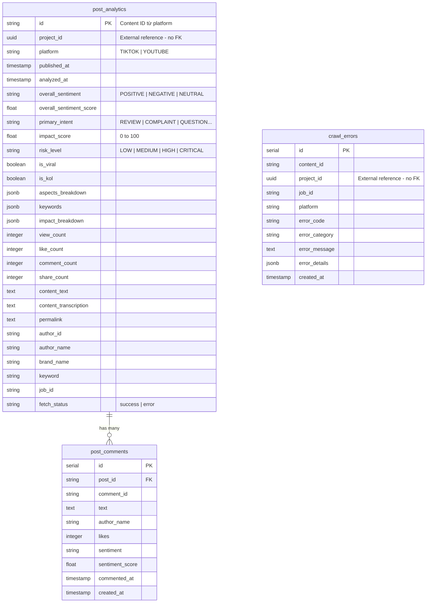

# ERD - Analytics Service

**Mục đích:** Mermaid ERD diagram cho Analytics Service database schema  
**File output:** `report/images/schema/analytics-schema.png`

---

## Mermaid ERD Diagram

---

## Tables Overview

### post_analytics

**Mục đích:** Lưu kết quả phân tích NLP cho từng post/content.

| Category     | Key Attributes                                                      |
| ------------ | ------------------------------------------------------------------- |
| Identifiers  | `id` (PK), `project_id`, `platform`                                 |
| Analysis     | `overall_sentiment`, `primary_intent`, `impact_score`, `risk_level` |
| JSONB Fields | `aspects_breakdown`, `keywords`, `impact_breakdown`                 |
| Metrics      | `view_count`, `like_count`, `comment_count`, `share_count`          |
| Content      | `content_text`, `content_transcription`, `permalink`                |
| Author       | `author_id`, `author_name`                                          |
| Context      | `brand_name`, `keyword`, `job_id`                                   |

### post_comments

**Mục đích:** Lưu comments với sentiment analysis riêng.

| Attribute         | Type        | Notes                                   |
| ----------------- | ----------- | --------------------------------------- |
| `id`              | SERIAL      | PK, auto increment                      |
| `post_id`         | VARCHAR(50) | FK → post_analytics.id (CASCADE delete) |
| `sentiment`       | VARCHAR(10) | POSITIVE, NEGATIVE, NEUTRAL             |
| `sentiment_score` | FLOAT       | -1.0 to 1.0                             |

### crawl_errors

**Mục đích:** Lưu errors từ crawling process để analyze và debug.

| Attribute       | Type        | Notes                     |
| --------------- | ----------- | ------------------------- |
| `id`            | SERIAL      | PK, auto increment        |
| `content_id`    | VARCHAR(50) | Content ID from platform  |
| `project_id`    | UUID        | External reference, no FK |
| `error_code`    | VARCHAR(50) | Error code                |
| `error_details` | JSONB       | Error details             |

---

## Relationships

- **post_analytics → post_comments:** One-to-Many với CASCADE delete.
- **post_analytics → project:** Many-to-One, external reference (no FK constraint).

---

## JSONB Fields

- **aspects_breakdown:** Aspect-based sentiment (product_quality, customer_service, price...)
- **keywords:** Extracted keywords với aspects mapping
- **impact_breakdown:** Impact calculation details (engagement, reach, velocity...)

---

## Design Decisions

- **Nullable project_id:** Support dry-run tasks (không thuộc project nào).
- **Separate Comments Table:** Enable comment-level sentiment analysis và querying.
- **Error Tracking:** Separate table cho error analytics và monitoring.
- **JSONB for Flexibility:** Schema flexibility cho aspects, keywords, impact breakdown.

---

## Cross-Database Reference

`post_analytics.project_id` → `projects.id` (Project Service)

- Không có FK constraint (Database per Service pattern)
- Nullable để support dry-run tasks

---

**End of ERD - Analytics Service**
