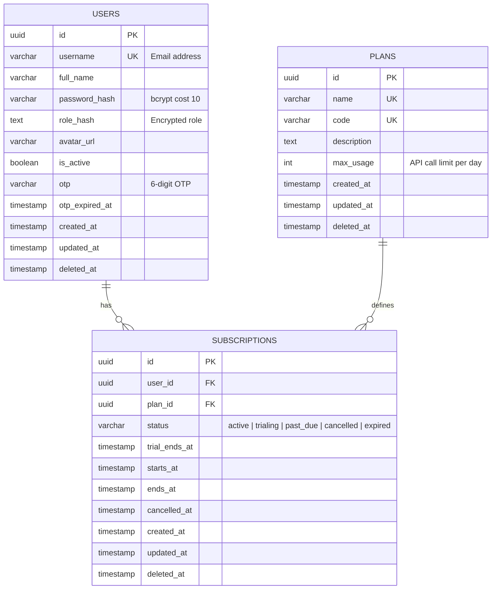

# ERD - Identity Service

**Mục đích:** Mermaid ERD diagram cho Identity Service database schema  
**File output:** `report/images/schema/identity-schema.png`

---

## Mermaid ERD Diagram

---

## Tables Overview

### USERS

**Mục đích:** Lưu trữ thông tin người dùng và authentication data.

| Attribute       | Type         | Notes                              |
| --------------- | ------------ | ---------------------------------- |
| `id`            | UUID         | PK, auto-generated                 |
| `username`      | VARCHAR(255) | UK, email address                  |
| `password_hash` | VARCHAR(255) | bcrypt với cost 10                 |
| `role_hash`     | TEXT         | Encrypted role (USER/ADMIN)        |
| `is_active`     | BOOLEAN      | Account verified flag              |
| `otp`           | VARCHAR(6)   | 6-digit OTP cho email verification |

### PLANS

**Mục đích:** Định nghĩa subscription plans.

| Attribute   | Type        | Notes                  |
| ----------- | ----------- | ---------------------- |
| `id`        | UUID        | PK, auto-generated     |
| `name`      | VARCHAR(50) | UK, plan display name  |
| `code`      | VARCHAR(50) | UK, unique identifier  |
| `max_usage` | INT         | API call limit per day |

### SUBSCRIPTIONS

**Mục đích:** Liên kết users với plans, track subscription lifecycle.

| Attribute | Type    | Notes                                          |
| --------- | ------- | ---------------------------------------------- |
| `id`      | UUID    | PK, auto-generated                             |
| `user_id` | UUID    | FK → users.id                                  |
| `plan_id` | UUID    | FK → plans.id                                  |
| `status`  | VARCHAR | active, trialing, past_due, cancelled, expired |

---

## Relationships

- **USERS → SUBSCRIPTIONS:** One-to-Many. Một user có nhiều subscriptions (historical).
- **PLANS → SUBSCRIPTIONS:** One-to-Many. Một plan được subscribe bởi nhiều users.

---

## Design Decisions

- **Soft Delete:** Tất cả tables có `deleted_at` timestamp.
- **Password Hashing:** bcrypt với cost 10 (DefaultCost).
- **Role Encryption:** Role được hash (SHA256) để enhance security.
- **OTP Storage:** OTP và expiry time lưu trong `users` table, expire sau 10 phút.
- **FK Constraints:** Có FK constraints trong cùng database (SUBSCRIPTIONS → USERS, PLANS).

---

**End of ERD - Identity Service**
