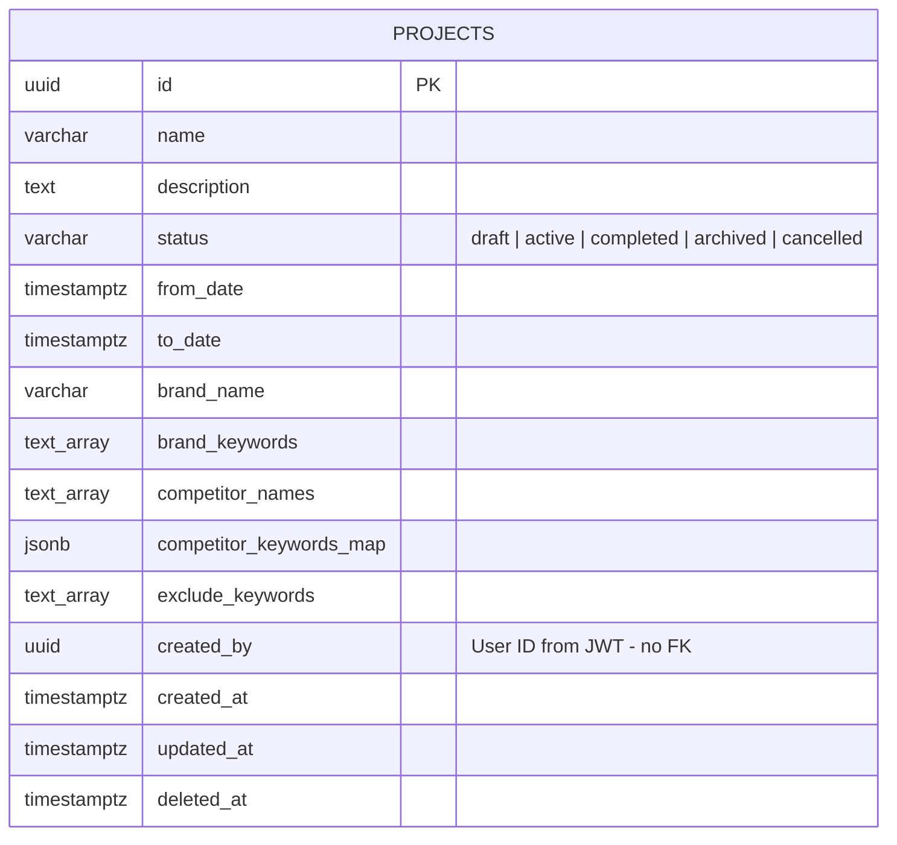

# ERD - Project Service

**Mục đích:** Mermaid ERD diagram cho Project Service database schema  
**File output:** `report/images/schema/project-schema.png`

---

## Mermaid ERD Diagram

---

## Table: PROJECTS

**Mục đích:** Lưu trữ thông tin project phân tích thương hiệu và đối thủ cạnh tranh.

### Key Attributes

| Attribute                 | Type         | Notes                                         |
| ------------------------- | ------------ | --------------------------------------------- |
| `id`                      | UUID         | PK, auto-generated                            |
| `name`                    | VARCHAR(255) | Project name                                  |
| `status`                  | VARCHAR      | draft, active, completed, archived, cancelled |
| `brand_name`              | VARCHAR(255) | Brand name to track                           |
| `brand_keywords`          | TEXT[]       | Array of brand keywords                       |
| `competitor_names`        | TEXT[]       | Array of competitor names                     |
| `competitor_keywords_map` | JSONB        | Map: competitor → keywords                    |
| `created_by`              | UUID         | User ID from JWT, no FK constraint            |

### Indexes

- `idx_projects_created_by` - Query by user
- `idx_projects_status` - Filter by status
- `idx_projects_deleted_at` - Exclude deleted records

---

## Design Decisions

- **Single Table:** Project Service chỉ quản lý project metadata, không có relationships phức tạp.
- **Array Types (TEXT[]):** PostgreSQL array cho multiple values (keywords, competitors).
- **JSONB:** Flexible structure cho `competitor_keywords_map`.
- **No FK Constraint:** `created_by` reference đến Identity Service database, validation qua JWT token.
- **Soft Delete:** `deleted_at` timestamp để retain data cho audit.

---

## Cross-Database Reference

`projects.created_by` → `users.id` (Identity Service)

- Không có FK constraint (Database per Service pattern)
- User ID được extract từ JWT token
- Queries filter theo `created_by` để đảm bảo user isolation

---

**End of ERD - Project Service**
