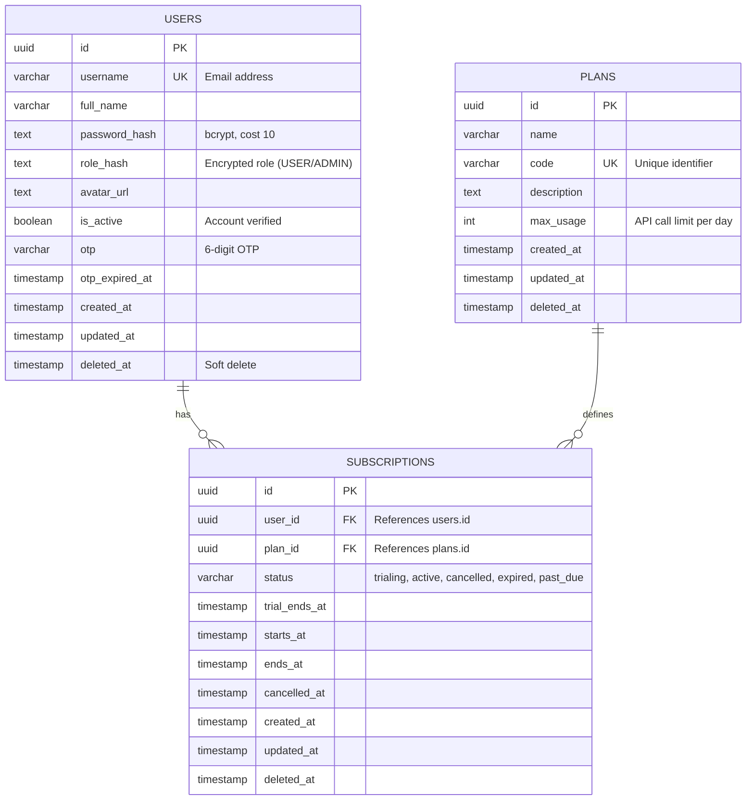
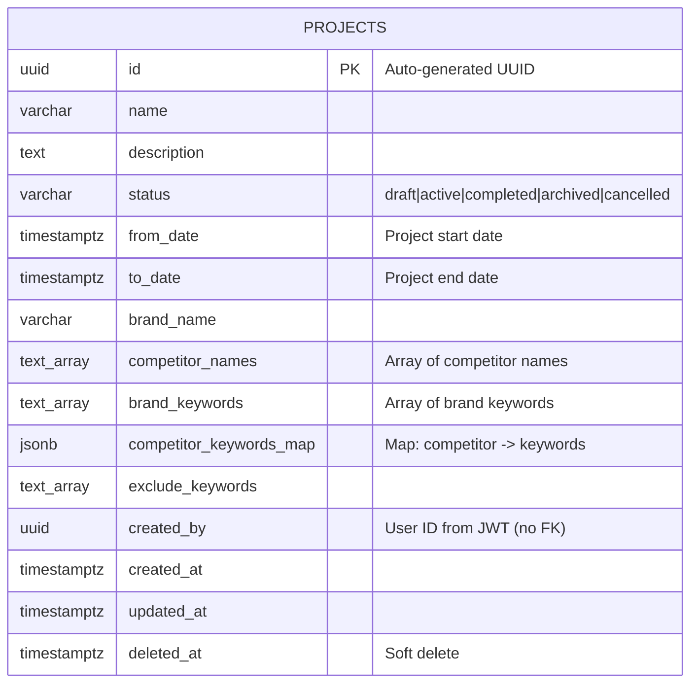
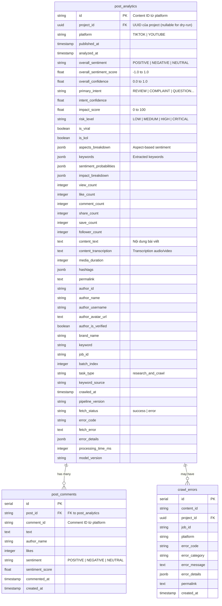

# 📋 SƯỜN VÀ KẾ HOẠCH CHI TIẾT: SECTION 5.4 - THIẾT KẾ CƠ SỞ DỮ LIỆU

**Ngày tạo:** 2025-12-20  
**Mục đích:** Cung cấp sườn và kế hoạch chi tiết để viết Section 5.4 - Thiết kế cơ sở dữ liệu  
**File target:** `report/chapter_5/section_5_4.typ`  
**Thời gian ước tính:** 20-24 giờ

---

## 📊 TỔNG QUAN SECTION 5.4

### Mục đích

Section 5.4 mô tả chi tiết thiết kế cơ sở dữ liệu của hệ thống SMAP, bao gồm:
- Chiến lược lựa chọn database (PostgreSQL, MongoDB, Redis, MinIO)
- ERD cho từng service (Identity, Project, Analytics)
- Các patterns quản lý dữ liệu phân tán (Database per Service, Distributed State Management, Claim Check Pattern)

### Mối liên hệ với các sections khác

- **Section 5.1:** Design Principles (Database per Service, Distributed State Management)
- **Section 5.2:** System Architecture (Container Diagram - Data Stores)
- **Section 5.3:** Component Diagrams (Repository layers trong từng service)
- **Chapter 4:** NFRs về Data Governance, Compliance (Right to Access, Right to Delete)

---

## 📐 CẤU TRÚC CHI TIẾT

### 5.4.1 Chiến lược lựa chọn Database (Database Strategy)

**Mục đích:** Giải thích tại sao hệ thống sử dụng nhiều loại database khác nhau và cách chúng phục vụ các use cases cụ thể.

**Nội dung:**

#### 5.4.1.1 Tổng quan kiến trúc Database

- **Microservices Database Pattern:** Mỗi service có database riêng (Database per Service)
- **Polyglot Persistence:** Sử dụng nhiều loại database phù hợp với từng use case
- **Tổng quan 4 loại database:**
  - PostgreSQL: Relational data (Identity, Project, Analytics)
  - MongoDB: Document store cho raw crawled data
  - Redis: Distributed state management + Pub/Sub
  - MinIO: Object storage cho batch files

#### 5.4.1.2 Ma trận lựa chọn Database

**Bảng:** Database Strategy Matrix

| Service | Database | Type | Lý do chọn | Đặc điểm dữ liệu | Read/Write Pattern | Consistency |
|---------|----------|------|------------|------------------|---------------------|------------|
| Identity | PostgreSQL | Relational | ACID cho auth, relational users-roles | Structured, normalized | Read-heavy (login), Write-light (registration) | Strong consistency |
| Project | PostgreSQL | Relational | Relational projects-keywords, JSONB cho flexible data | Structured + JSONB | Read-heavy (list projects), Write-medium (CRUD) | Strong consistency |
| Analytics | PostgreSQL | Relational | Structured analysis results, complex queries | Structured + JSONB (aspects, keywords) | Write-heavy (batch inserts), Read-heavy (aggregations) | Eventual consistency (batch) |
| Collection | MongoDB | Document | Schema-less cho raw social data | Unstructured, variable schema | Write-heavy (crawled data), Read-light (debugging) | Eventual consistency |
| State Management | Redis | In-memory | Fast access, atomic operations, TTL | Key-value, Hash | Read/Write-heavy (real-time updates) | Strong consistency (single Redis instance) |
| Object Storage | MinIO | Object | Large files, batch data | Binary (Protobuf + Zstd) | Write-once, Read-many | Eventual consistency |

#### 5.4.1.3 Lý do lựa chọn từng Database

**a. PostgreSQL cho Identity, Project, Analytics:**

- **ACID Compliance:** Cần thiết cho authentication, authorization, và financial transactions
- **Relational Integrity:** Foreign keys, constraints đảm bảo data consistency
- **JSONB Support:** Lưu trữ flexible data (competitor_keywords_map, aspects_breakdown) trong structured schema
- **Complex Queries:** SQL queries với JOINs, aggregations cho analytics
- **Mature Ecosystem:** ORMs (SQLBoiler, SQLAlchemy), migration tools (Alembic)

**b. MongoDB cho Collection Service:**

- **Schema-less:** Raw crawled data có structure thay đổi theo platform (TikTok vs YouTube)
- **Horizontal Scaling:** Sharding cho large datasets
- **Document Model:** Phù hợp với nested data (posts với comments, metadata)
- **Write Performance:** High write throughput cho batch inserts

**c. Redis cho State Management:**

- **In-Memory Speed:** Sub-millisecond latency cho real-time progress tracking
- **Atomic Operations:** HINCRBY, HSET cho distributed state updates
- **TTL Support:** Auto-expire state sau khi project hoàn thành
- **Pub/Sub:** Real-time event broadcasting cho WebSocket

**d. MinIO cho Object Storage:**

- **Large File Handling:** Batch files (50-500KB) không phù hợp cho message queue
- **Cost Efficiency:** Cheaper than database storage cho binary data
- **Lifecycle Management:** Auto-delete sau 7 ngày
- **S3-Compatible:** Dễ migrate sang AWS S3 nếu cần

#### 5.4.1.4 Database per Service Pattern

**Nguyên tắc:** Mỗi service sở hữu và quản lý database riêng, không chia sẻ database giữa các services.

**Lợi ích:**
- **Independent Scaling:** Scale database theo workload của từng service
- **Technology Freedom:** Mỗi service chọn database phù hợp nhất
- **Fault Isolation:** Database crash của một service không ảnh hưởng service khác
- **Team Autonomy:** Mỗi team quản lý database của service mình

**Trade-offs:**
- **No Cross-Service Queries:** Không thể JOIN giữa Identity.users và Project.projects
- **Data Consistency:** Phải đảm bảo consistency ở application layer (JWT validation)
- **Operational Complexity:** Quản lý nhiều databases

**Implementation trong SMAP:**
- Identity Service: `identity_db` (PostgreSQL)
- Project Service: `project_db` (PostgreSQL)
- Analytics Service: `analytics_db` (PostgreSQL)
- Collection Service: `collection_db` (MongoDB)
- State Management: Redis DB 1 (separate from cache DB 0)

---

### 5.4.2 ERD Identity Service

**Mục đích:** Mô tả cấu trúc database của Identity Service với 3 tables: users, plans, subscriptions.

**Nội dung:**

#### 5.4.2.1 Tổng quan

Identity Service quản lý authentication, authorization, và subscription management. Database sử dụng PostgreSQL với 3 tables chính.

#### 5.4.2.2 ERD Diagram

**Image:** `report/images/schema/identity-schema.png` (Mermaid ER diagram)

**Mermaid ER Diagram:**


#### 5.4.2.3 Table Catalog

**Bảng:** Identity Service Tables

| Table | Mục đích | Key Columns | Indexes | Constraints |
|-------|----------|-------------|---------|-------------|
| `users` | Lưu thông tin người dùng, authentication | `id` (PK), `username` (UK) | `idx_users_username`, `idx_users_deleted_at` | `username` unique, `password_hash` NOT NULL |
| `plans` | Định nghĩa subscription plans | `id` (PK), `code` (UK) | `idx_plans_code`, `idx_plans_deleted_at` | `code` unique, `max_usage` > 0 |
| `subscriptions` | Quản lý subscription của users | `id` (PK), `user_id` (FK), `plan_id` (FK) | `idx_subscriptions_user_id`, `idx_subscriptions_status` | Foreign keys to users, plans |

#### 5.4.2.4 Relationships

- **USERS → SUBSCRIPTIONS:** One-to-Many (một user có thể có nhiều subscriptions, nhưng chỉ 1 active)
- **PLANS → SUBSCRIPTIONS:** One-to-Many (một plan có thể được subscribe bởi nhiều users)
- **Cascade Behavior:** Khi user bị soft delete, subscriptions không bị xóa (để giữ lịch sử)

#### 5.4.2.5 Design Decisions

- **Soft Delete:** Tất cả tables có `deleted_at` để hỗ trợ audit trail và recovery
- **Password Hashing:** bcrypt với cost 10 (DefaultCost), minimum 8 characters
- **Role Encryption:** Role được hash (SHA256) để tránh plaintext trong database
- **OTP Storage:** OTP và expiry time lưu trong users table, tự động expire sau 10 phút

---

### 5.4.3 ERD Project Service

**Mục đích:** Mô tả cấu trúc database của Project Service với table `projects`.

**Nội dung:**

#### 5.4.3.1 Tổng quan

Project Service quản lý project lifecycle (CRUD, execution, status tracking). Database sử dụng PostgreSQL với 1 table chính: `projects`.

#### 5.4.3.2 ERD Diagram

**Image:** `report/images/schema/SMAP-collector.png` (Mermaid ER diagram)

**Mermaid ER Diagram:**


#### 5.4.3.3 Table Catalog

**Bảng:** Project Service Tables

| Table | Mục đích | Key Columns | Indexes | Constraints |
|-------|----------|-------------|---------|-------------|
| `projects` | Lưu thông tin project theo dõi thương hiệu | `id` (PK) | `idx_projects_created_by`, `idx_projects_status`, `idx_projects_deleted_at` | `status` enum, `to_date` > `from_date` |

#### 5.4.3.4 Data Types và Constraints

- **UUID:** Sử dụng `gen_random_uuid()` cho primary key
- **TEXT[]:** PostgreSQL array type cho `competitor_names`, `brand_keywords`, `exclude_keywords`
- **JSONB:** `competitor_keywords_map` lưu map từ competitor name → keywords array
  - Example: `{"Competitor A": ["kw1", "kw2"], "Competitor B": ["kw3"]}`
- **ENUM:** `status` phải là một trong: `draft`, `active`, `completed`, `archived`, `cancelled`
- **TIMESTAMPTZ:** Tất cả time fields sử dụng timezone-aware timestamps

#### 5.4.3.5 Cross-Database Relationship

**Logical Relationship (No Foreign Key):**

- `projects.created_by` tham chiếu đến `users.id` nhưng không có FK constraint (khác database)
- Validation được thực hiện ở application layer thông qua JWT token
- Lợi ích:
  - Independent scaling giữa Identity và Project services
  - Deploy và maintain riêng biệt
  - Tránh distributed transaction complexity

---

### 5.4.4 ERD Analytics Service

**Mục đích:** Mô tả cấu trúc database của Analytics Service với 3 tables: `post_analytics`, `post_comments`, `crawl_errors`.

**Nội dung:**

#### 5.4.4.1 Tổng quan

Analytics Service lưu trữ kết quả phân tích NLP (sentiment, intent, impact) và metadata từ crawled posts. Database sử dụng PostgreSQL với 3 tables chính.

#### 5.4.4.2 ERD Diagram

**Image:** `report/images/schema/analytics-schema.png` (Mermaid ER diagram)

**Mermaid ER Diagram:**


#### 5.4.4.3 Table Catalog

**Bảng:** Analytics Service Tables

| Table | Mục đích | Key Columns | Indexes | Constraints |
|-------|----------|-------------|---------|-------------|
| `post_analytics` | Lưu kết quả phân tích NLP cho mỗi post | `id` (PK) | `idx_post_analytics_job_id`, `idx_post_analytics_project_id`, `idx_post_analytics_platform`, `idx_post_analytics_brand_name`, `idx_post_analytics_keyword`, `idx_post_analytics_author_id`, `idx_post_analytics_published_at`, `idx_post_analytics_fetch_status` | `platform` enum, `overall_sentiment` enum, `risk_level` enum |
| `post_comments` | Lưu comments và sentiment analysis | `id` (PK), `post_id` (FK) | `idx_post_comments_post_id`, `idx_post_comments_sentiment`, `idx_post_comments_commented_at` | Foreign key to post_analytics (CASCADE delete) |
| `crawl_errors` | Lưu errors từ crawling process | `id` (PK) | `idx_crawl_errors_project_id`, `idx_crawl_errors_error_code`, `idx_crawl_errors_job_id` | - |

#### 5.4.4.4 Relationships

- **post_analytics → post_comments:** One-to-Many (một post có nhiều comments)
- **post_analytics → crawl_errors:** Zero-to-Many (một post có thể có error record nếu fail)
- **post_analytics → project:** Many-to-One (nhiều posts thuộc một project, external reference)

#### 5.4.4.5 JSONB Fields

**`aspects_breakdown` (JSONB):**
```json
{
  "product_quality": {"sentiment": "NEGATIVE", "score": -0.8},
  "customer_service": {"sentiment": "POSITIVE", "score": 0.6},
  "price": {"sentiment": "NEUTRAL", "score": 0.1}
}
```

**`keywords` (JSONB):**
```json
{
  "extracted": ["VinFast", "VF8", "xe điện"],
  "aspects": ["product", "price"],
  "confidence": 0.95
}
```

**`impact_breakdown` (JSONB):**
```json
{
  "engagement_score": 85.5,
  "reach_score": 72.3,
  "sentiment_weight": -0.6,
  "velocity": 1.2,
  "final_score": 78.4
}
```

#### 5.4.4.6 Design Decisions

- **Nullable project_id:** Cho phép `project_id = NULL` để support dry-run tasks (không thuộc project nào)
- **Separate Comments Table:** Tách comments ra table riêng để enable comment-level sentiment analysis và querying
- **Error Tracking:** `crawl_errors` table lưu errors riêng để dễ analyze và debug
- **JSONB for Flexible Data:** Sử dụng JSONB cho aspects, keywords, impact_breakdown để linh hoạt với schema changes

---

### 5.4.5 Data Management Patterns

**Mục đích:** Mô tả các patterns quản lý dữ liệu phân tán trong hệ thống SMAP.

**Nội dung:**

#### 5.4.5.1 Database per Service Pattern

**Đã mô tả ở 5.4.1.4**

#### 5.4.5.2 Distributed State Management (Redis)

**Problem:** Cần track project progress real-time across multiple services (Project, Collector, Analytics) mà không tạo tight coupling.

**Solution:** Redis Hash với key pattern `smap:proj:{project_id}` làm Single Source of Truth (SSOT) cho project state.

**Data Structure:**
```
Key: smap:proj:{project_id}
Hash Fields:
  - status: "INITIALIZING" | "CRAWLING" | "PROCESSING" | "DONE" | "FAILED"
  - total: Integer (tổng số items cần xử lý)
  - processed: Integer (số items đã xử lý)
  - percentage: Float (processed / total * 100)
  - errors: Integer (số items bị lỗi)
TTL: 24 hours (tự động expire sau khi project hoàn thành)
```

**Implementation:**
- **Redis DB 1:** Dedicated database cho state management (separate from cache DB 0)
- **Atomic Operations:** `HINCRBY` cho increment counters, `HSET` cho multi-field updates
- **TTL Management:** Auto-expire sau 24h, refresh TTL khi có updates

**Evidence:**
- `services/project/internal/project/usecase/project.go`: Lines 150-223 (Execute function)
- `services/project/internal/state/repository/redis/state_repo.go`: Redis Hash operations

**Benefits:**
- Real-time progress tracking (< 100ms latency)
- Atomic updates (no race conditions)
- Auto-cleanup (TTL)
- Decoupled services (no direct service-to-service calls)

#### 5.4.5.3 Claim Check Pattern

**Problem:** Khi gửi batch data (50 posts × ~10KB = ~500KB) qua RabbitMQ, message queue bị overload và latency tăng cao.

**Solution:** Lưu payload lớn vào MinIO, chỉ gửi reference (object key) qua RabbitMQ.

**Flow:**

1. **Producer (Collector Service):**
   - Upload batch file (Protobuf + Zstd compressed) lên MinIO
   - Path: `collection-data/2024/12/20/{job_id}/batch_{index}.bin`
   - Publish RabbitMQ event với metadata:
     ```json
     {
       "job_id": "uuid-123",
       "bucket": "collection-data",
       "object_key": "2024/12/20/uuid-123/batch_1.bin",
       "size": 10485760,
       "item_count": 50,
       "timestamp": 1733299200
     }
     ```

2. **Consumer (Analytics Service):**
   - Receive event từ RabbitMQ
   - Download batch file từ MinIO bằng `object_key`
   - Decompress (Zstd) và parse (Protobuf)
   - Process items và ACK message

**Benefits:**
- Message size reduction: 500KB → ~200 bytes (99.96% reduction)
- Queue throughput improvement: 50x faster (smaller messages)
- Network bandwidth savings: Data transfer only once (Producer → MinIO), not multiple times (Producer → Queue → Consumer)

**Lifecycle Management:**
- MinIO lifecycle policy: Auto-delete files sau 7 ngày
- Bucket partitioning: `year/month/day/{job_id}/` để optimize IOPS

**Evidence:**
- `documents/chapter5/4.5.1.md`: Lines 432-581 (Claim Check Pattern details)
- `services/scrapper/tiktok/docs/rabbitmq-api.md`: Message format với `object_key`

#### 5.4.5.4 Event Sourcing (Light Version)

**Pattern:** RabbitMQ events (`project.created`, `data.collected`, `analysis.finished`) serve as lightweight event log.

**Not Full Event Sourcing:**
- Events không được lưu vĩnh viễn (chỉ trong queue)
- Không có event replay mechanism
- Không có event store

**Use Cases:**
- Service coordination (choreography)
- Async processing triggers
- Event-driven state updates

#### 5.4.5.5 CQRS (Light Version)

**Pattern:** PostgreSQL write, Redis read cho project state.

**Write Side (PostgreSQL):**
- Project metadata: `projects` table
- Analytics results: `post_analytics` table

**Read Side (Redis):**
- Real-time progress: `smap:proj:{id}` Hash
- Fast queries (< 100ms) cho WebSocket updates

**Not Full CQRS:**
- Không có separate read/write models
- Không có eventual consistency guarantees
- Chỉ áp dụng cho real-time progress tracking

---

### 5.4.6 Tổng kết và Kết luận

**Tóm tắt:**
- Hệ thống sử dụng 4 loại database (PostgreSQL, MongoDB, Redis, MinIO) phù hợp với từng use case
- Database per Service pattern đảm bảo independent scaling và fault isolation
- Distributed State Management với Redis Hash cho real-time progress tracking
- Claim Check Pattern tối ưu message queue throughput

**Forward References:**
- Section 5.5: Communication Patterns (RabbitMQ topology, event schemas)
- Chapter 6: Implementation details (migration scripts, connection pooling)

---

## 📝 CHECKLIST CHO MỖI SUBSECTION

### 5.4.1 Database Strategy
- [ ] Tổng quan kiến trúc Database
- [ ] Ma trận lựa chọn Database (table với 7 services)
- [ ] Lý do lựa chọn từng Database (4 loại: PostgreSQL, MongoDB, Redis, MinIO)
- [ ] Database per Service Pattern (nguyên tắc, lợi ích, trade-offs, implementation)

### 5.4.2 ERD Identity Service
- [ ] Tổng quan
- [ ] ERD Diagram (Mermaid + image)
- [ ] Table Catalog (bảng mô tả 3 tables)
- [ ] Relationships (One-to-Many, Cascade behavior)
- [ ] Design Decisions (soft delete, password hashing, role encryption, OTP)

### 5.4.3 ERD Project Service
- [ ] Tổng quan
- [ ] ERD Diagram (Mermaid + image)
- [ ] Table Catalog (bảng mô tả projects table)
- [ ] Data Types và Constraints (UUID, TEXT[], JSONB, ENUM, TIMESTAMPTZ)
- [ ] Cross-Database Relationship (logical relationship, no FK)

### 5.4.4 ERD Analytics Service
- [ ] Tổng quan
- [ ] ERD Diagram (Mermaid + image)
- [ ] Table Catalog (bảng mô tả 3 tables)
- [ ] Relationships (One-to-Many, Zero-to-Many)
- [ ] JSONB Fields (examples cho aspects_breakdown, keywords, impact_breakdown)
- [ ] Design Decisions (nullable project_id, separate comments table, error tracking)

### 5.4.5 Data Management Patterns
- [ ] Database per Service Pattern (reference to 5.4.1.4)
- [ ] Distributed State Management (Redis Hash, SSOT, atomic operations, TTL)
- [ ] Claim Check Pattern (Producer flow, Consumer flow, lifecycle management)
- [ ] Event Sourcing (Light Version) - RabbitMQ events
- [ ] CQRS (Light Version) - PostgreSQL write, Redis read

### 5.4.6 Tổng kết
- [ ] Tóm tắt 4 loại database
- [ ] Tóm tắt patterns
- [ ] Forward references

---

## 🎨 FORMATTING GUIDELINES

### Tables

Sử dụng format giống `section_5_1.typ` (lines 205-272):
```typst
#table(
  columns: (0.1fr, 0.25fr, 0.35fr, 0.3fr),
  stroke: 0.5pt,
  align: (center, left, left, left),
  
  table.cell(align: center + horizon, inset: (y: 0.8em))[*Header 1*],
  table.cell(align: center + horizon, inset: (y: 0.8em))[*Header 2*],
  // ... rows
)
```

### Images

```typst
#figure(
  image("../images/schema/identity-schema.png", width: 100%),
  caption: [
    ERD - Identity Service.
    Mô tả cấu trúc database với 3 tables: users, plans, subscriptions.
  ]
) <fig:identity_erd>

#context (align(center)[_Hình #image_counter.display(): ERD - Identity Service_])
#image_counter.step()
```

### Code Blocks

```typst
```mermaid
erDiagram
  // ... diagram
```
```

### Sub-levels

Sau `x.x.x.x` sử dụng `a, b, c` (không phải `1, 2, 3`):
- `5.4.1.1` → `5.4.1.1a`, `5.4.1.1b`
- `5.4.2.1` → `5.4.2.1a`, `5.4.2.1b`

---

## 📚 SOURCES CẦN THAM KHẢO

### Code Sources

1. **Identity Service:**
   - `services/identity/migration/01_add_user_indexes.sql.sql`: Schema definition
   - `services/identity/document/overview.md`: ERD và relationships

2. **Project Service:**
   - `services/project/migration/01_add_project.sql`: Schema definition
   - `services/project/document/overview.md`: ERD và data types

3. **Analytics Service:**
   - `services/analytic/models/database.py`: SQLAlchemy models
   - `services/analytic/document/analytics-erd.md`: ERD chi tiết

4. **Redis State Management:**
   - `services/project/internal/state/repository/redis/state_repo.go`: Redis Hash operations
   - `services/project/openspec/specs/redis-state-management/spec.md`: Specification

5. **Claim Check Pattern:**
   - `documents/chapter5/4.5.1.md`: Lines 432-581
   - `services/scrapper/tiktok/docs/rabbitmq-api.md`: Message format

### Existing Content

- `report/chapter_5/section_textra-2.typ`: Nội dung cũ (cần refactor và expand)

---

## ⏱️ TIME ESTIMATE

| Subsection | Time Estimate | Priority |
|------------|---------------|----------|
| 5.4.1 Database Strategy | 4 hours | 🔴 CRITICAL |
| 5.4.2 ERD Identity Service | 3 hours | 🟠 HIGH |
| 5.4.3 ERD Project Service | 3 hours | 🟠 HIGH |
| 5.4.4 ERD Analytics Service | 4 hours | 🔴 CRITICAL |
| 5.4.5 Data Management Patterns | 4 hours | 🔴 CRITICAL |
| 5.4.6 Tổng kết | 1 hour | 🟡 MEDIUM |
| **TOTAL** | **19 hours** | |

---

## ✅ NEXT STEPS

1. **Review và approve sườn này**
2. **Bắt đầu viết từ 5.4.1 Database Strategy**
3. **Tạo ERD diagrams (Mermaid) cho 3 services**
4. **Export diagrams thành images (PNG)**
5. **Viết chi tiết từng subsection theo checklist**

---

**End of Plan**  
**Generated by: AI Assistant**  
**Date: December 20, 2025**

