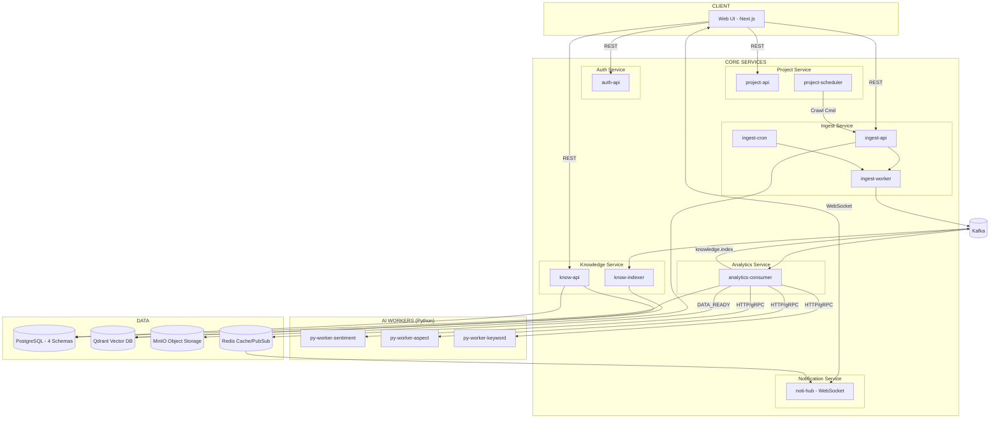
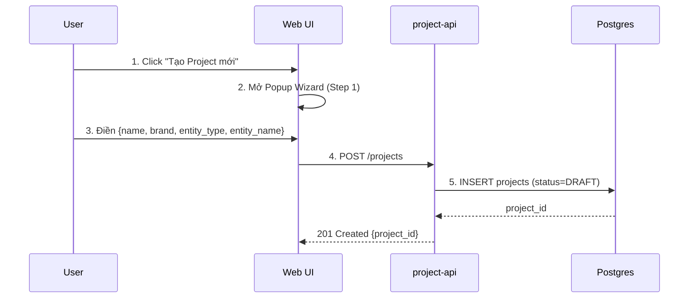
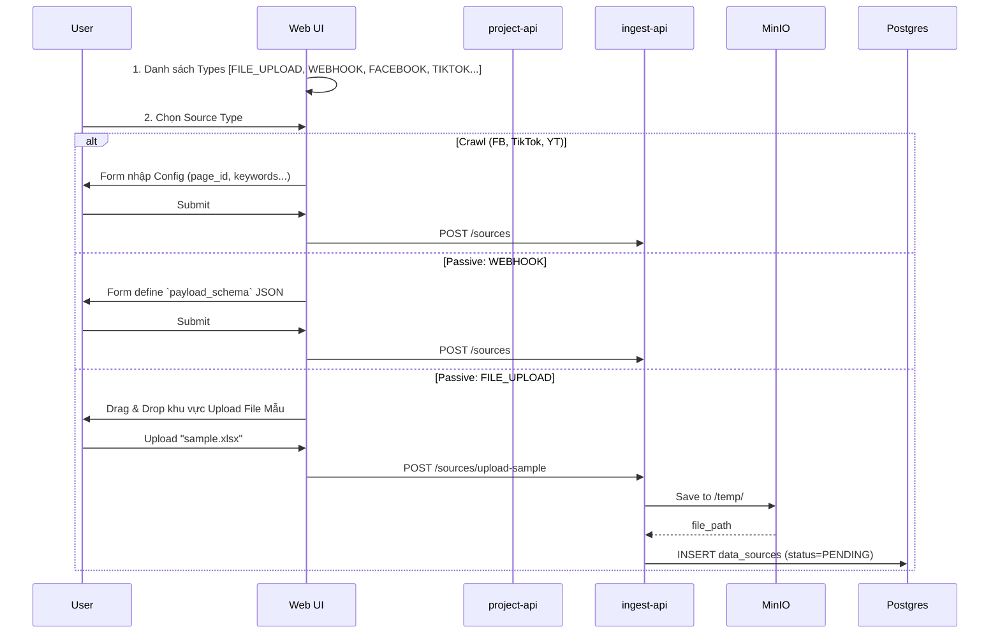
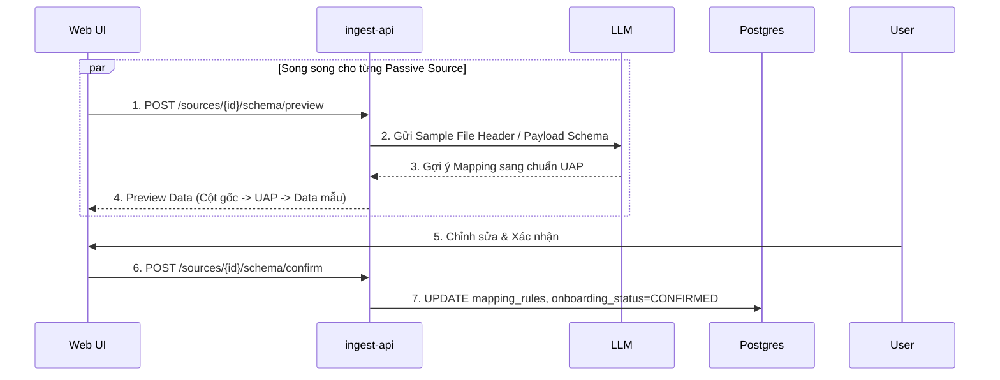
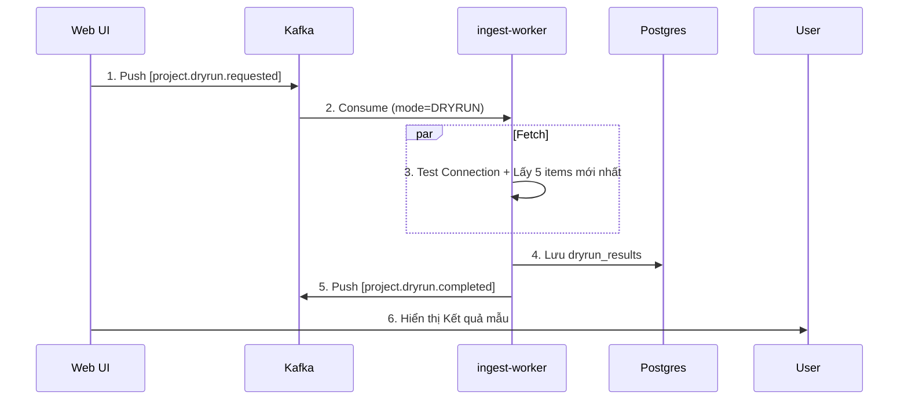
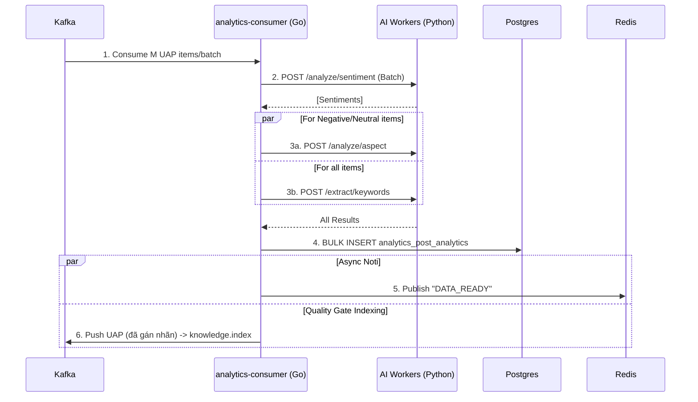
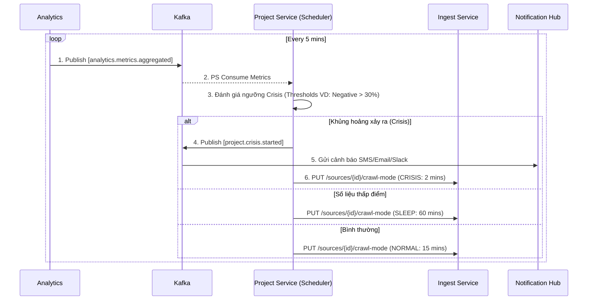
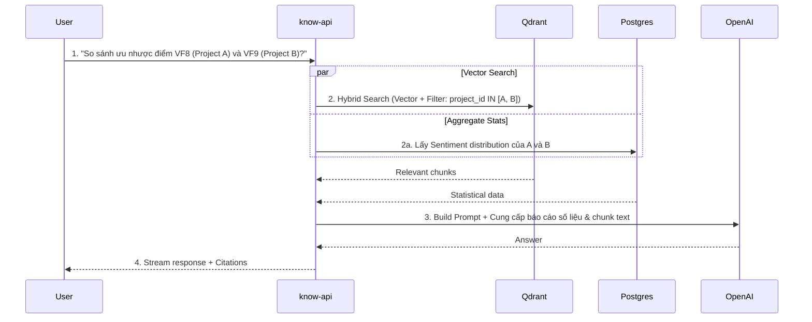

# SMAP Data Flow Specification v3.0 (Component-Level)

**Ngày cập nhật:** 20/02/2026  
**Trọng tâm:** Chi tiết hóa luồng dữ liệu qua từng **Process/Unit** cụ thể, dựa trên Kiến trúc Đồng nhất UAP và Entity Hierarchy mới.

---

## 1. TỔNG QUAN KIẾN TRÚC



---

## 2. ĐỊNH NGHĨA CÁC ĐƠN VỊ XỬ LÝ (CORE UNITS)

| Service | Unit | Loại | Nhiệm vụ |
| --- | --- | --- | --- |
| **Auth** | `auth-api` | HTTP Server | Xử lý SSO, quản lý User, roles, JWT |
| **Project** | `project-api` | HTTP Server | Quản lý Campaign/Project, Dashboard, Crisis Config |
| | `project-scheduler` | Cron/Worker | Đánh giá Khủng hoảng, quyết định Adaptive Crawl |
| **Ingest** | `ingest-api` | HTTP Server | Nhận file upload, webhook, config data source, trigger AI Schema Mapping |
| | `ingest-worker` | Consumer | Parse file, gọi External API, transform sang UAP |
| | `ingest-cron` | Scheduler | Trigger crawl định kỳ dựa theo Crawl Mode |
| **Analytics** | `analytics-consumer`| Go Orchestrator | Điều phối luồng xử lý AI, phân luồng ghi DB |
| | `py-worker-sentiment`| Micro-service | Chạy Model Sentiment |
| | `py-worker-aspect` | Micro-service | Chạy Model Aspect Extraction |
| | `py-worker-keyword` | Micro-service | Chạy Model Keyword Extraction |
| **Knowledge** | `know-api` | HTTP Server | Phục vụ Chat RAG, báo cáo tự động |
| | `know-indexer` | Consumer | Nhúng (Embed) văn bản → Upsert vào Qdrant |
| **Notification**| `noti-hub` | WebSocket | Đẩy events Realtime (Alerts, Metrics update) |

---

## 3. FLOW 0: TẠO CAMPAIGN & PROJECT (ENTITY HIERARCHY)

> **Thiết kế mới:** Dữ liệu được tổ chức theo cấu trúc `Campaign` (Tầng 3) → `Project` (Tầng 2) → `Data Source` (Tầng 1).
> **UI Pattern:** Wizard tạo Project (Tầng 2 & 1) sử dụng **Popup/Modal Window**. Nếu user đóng giữa chừng, Project lưu ở trạng thái `DRAFT`.

### 3.1 Khởi tạo Project (Bước 1)



### 3.2 Thêm & Cấu hình Data Source (Bước 2)

> **Phân loại Source:**
>
> - **Crawl Sources** (FB, TikTok, YT): Hệ thống đi lấy → Cần **Dry Run**.
> - **Passive Sources** (Webhook, File): Dữ liệu đẩy vào → Cần **AI Schema Mapping** (Onboarding).



### 3.3 DATA ONBOARDING - AI Schema Mapping (Bước 3)

> Chỉ áp dụng cho Passive Sources. API gọi LLM đồng bộ (synchronous) để gợi ý mapping.



### 3.4 DRY RUN - Chạy thử (Bước 4)

> Chỉ áp dụng cho Crawl Sources. Thực hiện Bất đồng bộ qua Kafka để không treo UI.



### 3.5 ACTIVATE (Bước 5)

Điều kiện: Onboarding `CONFIRMED` và Dry Run `SUCCESS/WARNING`. Chuyển Project sang `ACTIVE`.

---

## 4. FLOW 1: XỬ LÝ DỮ LIỆU ĐẦU VÀO (INGESTION)

Dữ liệu đầu vào đều quy về một cấu trúc vật lý chung: **Unified Analytics Payload (UAP)**. Tất cả nguồn (File, Webhook, Crawl) đều kết thúc bằng việc đẩy UAP vào `Kafka`.

### 4.1 File Upload (Batch Processing)

1. Tầng `ingest-api` nhận file, ném lên MinIO, tạo Job rỗng vào DB. Đẩy sự kiện Kafka.
2. Tầng `ingest-worker` tiêu thụ Kafka, kéo file dạng stream từ MinIO.
3. `ingest-worker` áp dụng `mapping_rules` (đã duyệt ở bước 3.3).
4. `ingest-worker` gửi từng Batch UAP vào topic `analytics.uap.received`.

### 4.2 Webhook (Push)

1. External Service gọi POST vào Endpoint webhook sinh bởi API hệ thống.
2. `ingest-api` Verify Signature (SYNC), Validate Schema.
3. Nếu hợp lệ, push Event vào Kafka `ingest.external.received`.
4. `ingest-worker` lấy lô dữ liệu, Dedup, Transform theo quy tắc Mapping. Đẩy sang `analytics.uap.received`.

### 4.3 Scheduled Crawl (Pull)

1. `ingest-cron` chạy, kiểm tra các Crawl Source tới lịch hẹn `next_crawl_at`.
2. Gửi job vào `ingest.crawl.scheduled`.
3. `ingest-worker` consume, gọi qua các MMO API lấy data.
4. Xử lý Time Check (Bỏ qua bài cũ), Dedup. Transform sang chuẩn UAP và bắn sang topic.

---

## 5. FLOW 2: ORCHESTRATION PHÂN TÍCH (ANALYTICS PIPELINE)

> **Thay đổi Lõi:** Bỏ hoàn toàn `n8n` để giảm Overhead. Thay bằng `analytics-consumer` viết bằng **Go** để tối ưu hóa Multi-threading, Batching và quản lý kết nối CSDL (Postgres).



---

## 6. FLOW 3: TRIFATE CRAWL & CRISIS KHỦNG HOẢNG (ADAPTIVE CRAWL)

Sự phân tách trách nhiệm rõ ràng ở hệ thống mới: **Project Service** (đóng vai **Bộ Não** Orchestrator cấp Domain) đưa ra quyết định dựa trên số liệu từ **Analytics**, sau đó truyền mệnh lệnh cho **Ingest Service** (đóng vai **Tay Chân** Executor).



---

## 7. FLOW 4: KNOWLEDGE (RAG VÀ VECTORD DB)

### 7.1 Indexing (Chỉ đẩy data "có giá trị")

`know-indexer` tiêu thụ Topic `knowledge.index` (Topic này chỉ được ghi vào bởi Analytics Pipeline sau quá trình Quality Filter). `know-indexer` bắn HTTP tới OpenAI Embeddings lấy Vector và Upsert cùng MetaData (để filter) vào Qdrant.

### 7.2 The Campaign War Room - Chat Query (Cross-Project Comparison)

Giao diện Chat ở quy mô **Campaign (Tầng 3)**. User có thể gộp nhiều `Project (Tầng 2)` vào 1 chiến dịch. Từ đó, Chat truy vấn chéo.



### 7.3 Generative Báo Cáo

LLM tạo Dashboard báo cáo tự động (Campaign Artifacts). Báo cáo sinh ra được lưu tĩnh trên `MinIO` dưới dạng Markdown/PDF. Các Báo cáo này có the Inline-edited trực tiếp bởi Analyst trên Web UI.

---

## 8. DANH SÁCH KAFKA TOPIC TOÀN CỤC

| Topic | Producer | Consumer | Nhiệm vụ |
| --- | --- | --- | --- |
| `audit.events` | Mọi Service | auth-service | Nhật ký hệ thống |
| `project.created` <br> `project.updated` <br> `project.deleted` | project-api | Các Service (tùy vào luồng) | Đồng bộ trạng thái Project |
| `campaign.*` | project-api | know-api | Quản lý Campaign |
| `ingest.file.uploaded` | ingest-api | ingest-worker | Xử lý File |
| `ingest.schema.*` | ingest-api | Frontend | Schema Suggestion |
| `ingest.external.received` | ingest-api (webhook) | ingest-worker | Xử lý Webhook Payload |
| `ingest.crawl.scheduled` | ingest-cron | ingest-worker | Kích hoạt Tool Crawl |
| `analytics.uap.received` | ingest-worker | analytics-consumer | Truyền UAP cần phân tích |
| `analytics.metrics.aggregated` <br> `analytics.insights.aggregated`| analytics | project-scheduler | Tổng hợp số liệu định kỳ |
| `knowledge.index` | analytics-consumer | know-indexer | Data sạch đi Indexing |
| `project.crisis.*` | project-scheduler | noti-hub | Loa báo động Khủng hoảng |
| `notification.*.sent` | Các Core Service | noti-hub | Lệnh Push Notification |

---

## 9. CẤU TRÚC UNIFIED ANALYTICS PAYLOAD (UAP)

Bộ khung dữ liệu đi khắp hệ thống:

```json
{
  "id": "uuid-v4",
  "project_id": "proj_vf8",
  "source_id": "src_tiktok_1",
  "content": "Xe đi êm nhưng pin sụt nhanh",
  "content_created_at": "2026-02-06T01:00:00Z",
  "ingested_at": "2026-02-07T10:00:00Z",
  "platform": "tiktok",
  "metadata": { 
      "author": "Nguyễn A", 
      "time_type": "absolute" 
  }
}
```

**Nguyên tắc Thời gian:** Hệ thống ưu tiên truy vấn trên Dashboard bằng trường `content_created_at` (Lúc sự kiện diễn ra). Hệ thống tracking độ trễ bằng `ingested_at` (Lúc SMAP thu thập được). Cả 2 đều dùng định dạng chuẩn quốc tế UTC.

---

**[End of Data Flow Specification]**
