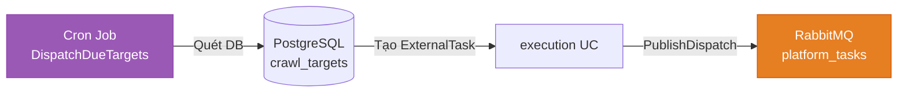
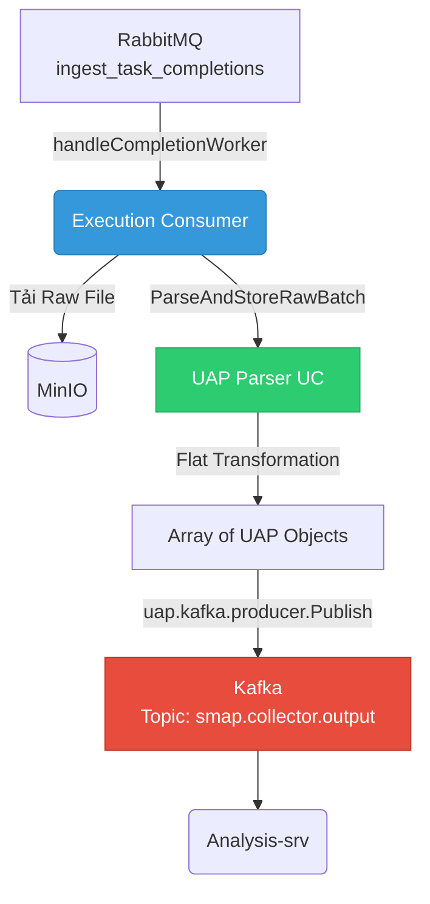
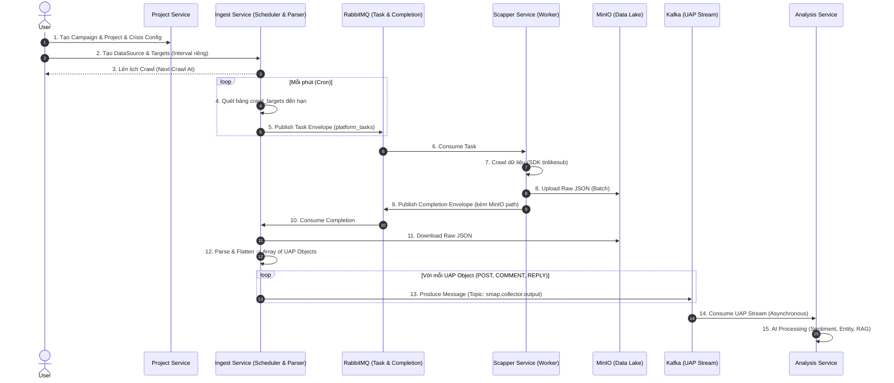

# Báo cáo Business Logic, Dataflow và Contract của Ingest Service

**Dự án:** SMAP v2
**Service:** `ingest-srv`

---

## 1. Tổng quan Business Logic (Vai trò của Ingest Service)

`ingest-srv` đóng vai trò là **"Cửa ngõ thu thập dữ liệu"** (Data Ingestion Gateway) của toàn bộ hệ thống SMAP v2. Trách nhiệm cốt lõi của service này bao gồm:

1. **Quản lý Onboarding Nguồn Dữ Liệu**: Nhận các yêu cầu thu thập dữ liệu từ người dùng thông qua các chiến dịch (Campaign) và dự án (Project).
2. **Lập lịch và Điều phối (Scheduling & Dispatching)**: Lên lịch định kỳ để ra lệnh cho các Crawler (như `scapper-srv`) đi thu thập dữ liệu trên các nền tảng (TikTok, Facebook, YouTube) dựa trên các mục tiêu (Targets) đã được cấu hình.
3. **Phẳng hóa & Chuẩn hóa dữ liệu (Flattening & Normalization)**: Nhận dữ liệu thô cào về từ MinIO, tách bóc (parse), và chuyển đổi các file JSON khổng lồ/lồng nhau thành luồng dữ liệu sự kiện phẳng (Flat Event Stream) theo chuẩn **UAP (Universal Analytics Profile)**.
4. **Phân phối cho Phân tích**: Đẩy các UAP đã chuẩn hóa sang cho `analysis-srv` (thông qua Kafka/RabbitMQ) để tiến hành phân loại cảm xúc, đánh giá ý định và nhận diện thực thể bằng AI.

---

## 2. Mô hình Thực thể và API Flow (Entity Relationships)

Mô hình dữ liệu đi từ tính chiến lược (Marketing) xuống đến tính kỹ thuật (Crawling) theo mô hình hình cây chặt chẽ:

### A. Chuỗi phụ thuộc (Dependency Chain)
1. **Campaign (Chiến dịch)**: Do `project-srv` quản lý. Xác định thời gian (Start/End) và mục tiêu tổng quát (VD: "Theo dõi phản ứng ra mắt VF8"). Sinh ra `campaign_id`.
2. **Project (Dự án)**: Thuộc 1 Campaign. Khai báo thương hiệu, sản phẩm (VD: "VinFast", "VF8"). Đi kèm với cấu hình **Crisis Config** (Các ngưỡng báo động về Volume/Sentiment). Sinh ra `project_id`.
3. **DataSource (Nguồn dữ liệu)**: Quản lý bởi `ingest-srv`. Là cầu nối giữa một Project và một Nền tảng cụ thể (TikTok, Facebook). Chứa các mode hoạt động (`NORMAL`, `CRISIS`, `SLEEP`). Sinh ra `datasource_id`.
4. **Target (Mục tiêu cào)**: Nằm trong DataSource. Đại diện cho các đối tượng kỹ thuật thực sự cần cào. Chia làm 3 loại:
   - `Keywords`: Từ khóa tìm kiếm (VD: "vinfast vf8 review").
   - `Profiles`: URL của các kênh đối thủ hoặc kênh sở hữu (VD: "@vinfastauto.official").
   - `Posts`: Các URL bài viết cụ thể đang viral cần theo dõi bình luận liên tục.
   - *Đặc điểm kỹ thuật*: Mỗi Target có một tần suất cào riêng biệt (`crawl_interval_minutes`), cho phép hệ thống tối ưu hóa tài nguyên (VD: bài viral cào 5p/lần, profile cào 60p/lần).

### B. Lifecycle của Data Source
- `PENDING` -> User đang cấu hình Target.
- `READY` -> Đã cấu hình xong, Dry Run thành công (hoặc bỏ qua).
- `ACTIVE` -> Project kích hoạt, Scheduler bắt đầu tạo job đi cào thực sự.

---

## 3. Dataflow & Technical Implementation (Luồng xử lý dữ liệu chi tiết)

Luồng dữ liệu của SMAP v2 được thiết kế theo mô hình **Asynchronous Event-Driven** với sự phân tách rõ ràng giữa các module bên trong `ingest-srv`: `scheduler`, `execution`, và `uap`.

### Bước 1: Cron Job & Kích hoạt Task (Dispatching)
**Module phụ trách:** `internal/execution/delivery/job` (Cron) & `internal/execution/delivery/rabbitmq/producer`

1. **Cron Job (`DispatchDueTargets`)**: Hàm này chạy định kỳ (theo `HeartbeatCron`) để quét bảng `crawl_targets` tìm các mục tiêu đã đến hạn cào (`next_crawl_at <= now()`).
2. **Dispatching**: Với mỗi target hợp lệ, Usecase sẽ tạo một bản ghi `ExternalTask` lưu vào Database với trạng thái `PENDING`.
3. **Publish to RMQ**: `producer.PublishDispatch` sẽ tạo một Request Envelope và đẩy vào RabbitMQ queue tương ứng với platform (VD: `tiktok_tasks`, `facebook_tasks`).

### Bước 2: Thu thập Dữ liệu (Crawling tại Scapper-srv)
**Module phụ trách:** `scapper-srv` (Python Worker)

1. Worker lắng nghe trên `platform_tasks` queue.
2. Khi nhận được Request Envelope, gọi `tinlikesub` SDK để lấy dữ liệu (Post, Comments).
3. Gom dữ liệu vào một file JSON khổng lồ (Batch).

### Bước 3: Data Handoff (Chuyển giao qua MinIO & RabbitMQ)
1. `scapper-srv` upload file JSON Raw lên **MinIO** (Data Lake) theo cấu trúc: `crawl-raw/{platform}/{action}/{yyyy}/{mm}/{dd}/{task_id}.json`.
2. `scapper-srv` tạo Completion Envelope (chứa path, bucket, checksum, task_id) và publish vào queue `ingest_task_completions`.

### Bước 4: Consume, Parser & Phân phối (Ingestion & Normalization)
**Module phụ trách:** `internal/execution/delivery/rabbitmq/consumer` & `internal/uap`

1. **Consume Completion**: `handleCompletionWorker` lắng nghe queue `ingest_task_completions`. Khi nhận message, nó gọi Usecase để cập nhật trạng thái `ExternalTask` thành `COMPLETED` và lưu thông tin về Raw Batch vào DB.
2. **Download Raw Data**: Gọi module MinIO để tải file JSON từ Data Lake xuống.
3. **Parser (Flat Stream Transformation)**: Module `internal/uap/usecase` (`ParseAndStoreRawBatchInput`) tiến hành parse file JSON khổng lồ. Sử dụng Strategy Pattern, nó duyệt qua từng `Post`, `Comment`, `Reply` và phẳng hóa chúng thành các object `UAP` độc lập. Nó cũng tính toán các trường Derived (như `reply_count`, `external_links`) theo chuẩn đã định nghĩa ở v12.0.
4. **Publish to Kafka**: `uap.delivery.kafka.producer.Publish` nhận stream các đối tượng UAP và đẩy vào topic `smap.collector.output`.

---

## 4. Contracts (Giao thức và Định dạng dữ liệu)

`ingest-srv` tuân thủ 2 loại Contract chính:

### A. Runtime Contract (RabbitMQ)
Định nghĩa giao tiếp giữa `ingest-srv` và `scapper-srv`:
- **Request Envelope**: Gửi từ Ingest. Chứa `task_id`, `action` (vd: `full_flow`, `post_detail`), và `params` (chứa array keywords hoặc URL).
- **Completion Envelope**: Gửi từ Scapper. Xác nhận trạng thái thành công/thất bại, số lượng item cào được, và quan trọng nhất là tọa độ file lưu trên Data Lake: `storage_bucket`, `storage_path`, `checksum`.

### B. Data Payload Contract (UAP - Universal Analytics Profile)
Đây là "Ngôn ngữ chung" của hệ thống SMAP v2, chuẩn hóa mọi loại dữ liệu hỗn tạp từ mạng xã hội thành định dạng mà AI và RAG có thể hiểu được.

**Nguyên tắc cốt lõi của UAP:**
1. **Phẳng hóa (Flattening)**: Thay vì lưu 1 Bài viết kèm 10.000 Bình luận lồng nhau, UAP tách chúng thành 10.001 bản ghi độc lập.
2. **Hierarchy Tracking**: Mỗi UAP có `parent_id` (trực tiếp) và `root_id` (bài viết gốc) để có thể xây dựng lại cây hội thoại bất cứ lúc nào.
3. **AI-Enriched**: Kế thừa các nhãn AI có sẵn từ nền tảng (như `tiktok_keywords`, `sort_score` của TikTok).
4. **Media Ready**: Lưu trữ đầy đủ `download_url` (Video No-Logo), `music_url`, `subtitle_url` phục vụ cho Marketer tải về tái sử dụng hoặc chạy NLP Transcript.
5. **Context Injection**: Mỗi UAP đi kèm các dữ liệu đã được gán nhãn cứng (`matched_entities`) từ cấu hình Project để Database có thể Query siêu tốc mà không cần đợi AI chạy xong.

*Chi tiết về UAP JSON Schema được định nghĩa tại `UAP_SPECIFICATION.md`.*

---

## 5. Sequence Diagram: Toàn bộ luồng dữ liệu (Dataflow)

Dưới đây là sơ đồ luồng dữ liệu tổng thể từ lúc khởi tạo đến khi phân phối qua Kafka:

---

## 6. Tích hợp Kafka Producer (Handoff to Analysis)

Để giải quyết bài toán Data Pipeline ổn định khi volume dữ liệu khổng lồ đổ về cùng một lúc, hệ thống sử dụng **Kafka** làm Message Broker trung gian thay vì gọi REST API trực tiếp hay dùng chung RabbitMQ.

### Kiến trúc Kafka tại Ingest-srv:
- **Topic**: `smap.collector.output` (Topic duy nhất dùng chung cho mọi UAP Event).
- **Partition Key**: Sử dụng `root_id` (ID của bài viết gốc). Việc này đảm bảo toàn bộ Post, Comment, và Reply thuộc cùng một bài viết sẽ luôn rơi vào cùng một Partition. Nhờ vậy, `analysis-srv` sẽ xử lý các chuỗi hội thoại (Conversation Threads) một cách có thứ tự (Order Guarantee).
- **Message Value**: Chuỗi JSON tuân chuẩn cấu trúc UAP (đã được định nghĩa ở mục 4B).

### Lợi ích của việc dùng Kafka ở chốt chặn này:
1. **Decoupling (Tách rời hoàn toàn)**: `ingest-srv` chỉ việc bắn dữ liệu UAP vào Kafka se-ri. Nó không cần quan tâm `analysis-srv` có đang sống hay chết, có đang quá tải hay không.
2. **Backpressure Handling (Giảm xóc)**: Nếu crawler lấy về 100.000 comments trong vài phút, Kafka sẽ giữ chúng lại. `analysis-srv` có thể từ từ lấy ra 1.000 comments/phút để chạy qua GPU model mà không làm sập hệ thống.
3. **Replayability (Phát lại dữ liệu)**: Nếu model AI của `analysis-srv` được nâng cấp (ví dụ v2.0 nhận diện cảm xúc tốt hơn), chúng ta chỉ cần reset offset Kafka để cho `analysis-srv` đọc lại toàn bộ stream UAP từ đầu để tính toán lại kết quả.

---

**Tổng kết:** 
`ingest-srv` không chỉ là một công cụ cào dữ liệu đơn thuần. Nó được thiết kế như một **Orchestrator** quản lý lịch trình theo từng Target vi mô, và là một **Data Transformer** biến rác mạng xã hội thành dữ liệu dạng luồng (Event Stream) tinh khiết và đồng nhất, sẵn sàng cho hạ tầng AI phân tích thời gian thực qua Kafka.
