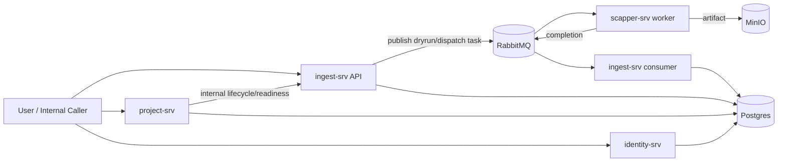

# 01. Overview

## Business Context

Hệ thống hiện tại chia thành 3 lớp domain chính:
- `project-srv`: quản lý campaign/project và project lifecycle là nguồn sự thật của trạng thái project.
- `ingest-srv`: quản lý datasource/target, dry-run, execution, scheduler, runtime timestamps, MinIO artifact.
- `identity-srv`: cung cấp auth boundary cho JWT và internal key; không giữ business state của lifecycle/runtime.

Các bounded context quan trọng:
- `Campaign / Project`
- `Datasource / Target`
- `Dry-run validation`
- `Execution / Scheduler`
- `Auth boundary`

## Core Terminology

| Term | Ý nghĩa code-derived |
| --- | --- |
| Project | Đơn vị giám sát nghiệp vụ, thuộc một campaign, có lifecycle `DRAFT/ACTIVE/PAUSED/ARCHIVED`. |
| Datasource | Nguồn ingest gắn với một project, có `SourceCategory` là `CRAWL` hoặc `PASSIVE`. |
| Target | Đơn vị crawl con trong một datasource. Runtime hiện đang hoạt động theo từng target. |
| Dry-run | Bước validate trước khi cho target/source chạy thật. |
| Execution | Lần runtime crawl thật do manual dispatch hoặc scheduler tạo ra. |
| Scheduler | Thành phần quét target đến hạn, claim rồi dispatch task. |
| Passive source | `FILE_UPLOAD/WEBHOOK`; hiện mới có skeleton và placeholder readiness gate. |

## State Catalog

### Project Status

| Status | Ý nghĩa |
| --- | --- |
| `DRAFT` | Chưa đi vào runtime thật |
| `ACTIVE` | Đang vận hành |
| `PAUSED` | Tạm dừng nhưng có thể resume |
| `ARCHIVED` | Ngừng vận hành, giữ lịch sử |

### Datasource Status

| Status | Ý nghĩa |
| --- | --- |
| `PENDING` | Mới tạo hoặc vừa thay đổi config material |
| `READY` | Đã đủ điều kiện để active |
| `ACTIVE` | Runtime đang bật |
| `PAUSED` | Runtime tạm dừng |
| `FAILED` | Có lỗi cần xử lý |
| `COMPLETED` | Chủ yếu cho passive one-shot |
| `ARCHIVED` | Dừng vận hành và chỉ giữ lịch sử |

### Dryrun Status

| Status | Ý nghĩa |
| --- | --- |
| `NOT_REQUIRED` | Chưa yêu cầu dry-run |
| `PENDING` | Đã tạo request |
| `RUNNING` | Đang thực thi |
| `SUCCESS` | Pass hoàn toàn |
| `WARNING` | Usable nhưng có cảnh báo |
| `FAILED` | Không usable |

### Job Status

| Status | Ý nghĩa |
| --- | --- |
| `PENDING` | Đã tạo job/task |
| `RUNNING` | Đang chạy |
| `SUCCESS` | Thành công |
| `PARTIAL` | Thành công một phần |
| `FAILED` | Thất bại |
| `CANCELLED` | Bị hủy do lifecycle/runtime control |

## System Dataflow Overview

## Source of Truth

| Concern | Source of truth |
| --- | --- |
| Campaign/project status | `project-srv` |
| Datasource/target status | `ingest-srv` |
| Dry-run lineage/result | `ingest-srv` |
| Execution lineage/runtime timestamps | `ingest-srv` |
| Auth acceptance | `identity-srv` + shared middleware |
| Artifact payload | `MinIO` object được `scapper-srv` publish và `ingest-srv` verify |

## Runtime Flow Families

1. `Project lifecycle`
   - create project
   - readiness
   - activate / pause / resume / archive / unarchive / delete
2. `Datasource + target management`
   - datasource CRUD
   - target CRUD
   - crawl mode change
3. `Dry-run pipeline`
   - trigger
   - worker completion
   - finalize result
   - auto-activate target
   - readiness impact
4. `Execution pipeline`
   - manual internal dispatch
   - scheduler due-target dispatch
   - completion
   - update runtime timestamps and health
5. `Auth boundary`
   - JWT auth for public APIs
   - internal key for internal APIs

## Coverage Summary

Hiện runtime core đã có black-box E2E khá sâu cho:
- CRUD và edge cases
- lifecycle
- dry-run completion
- execution/manual dispatch
- scheduler e2e/guard/stress/soak
- runtime consistency
- idempotency
- MinIO artifact
- internal/error/trace/zero-500 contracts

Coverage còn yếu hoặc chưa có route runtime đầy đủ:
- single datasource lifecycle qua HTTP
- passive source onboarding thật
- profile target runtime
- full identity OAuth product flow
- infra outage lâu dài
