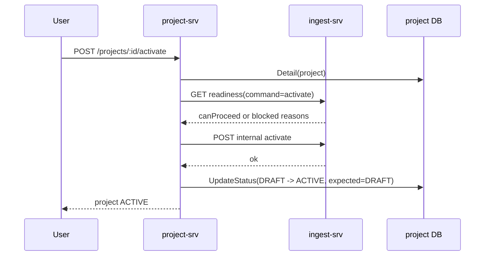
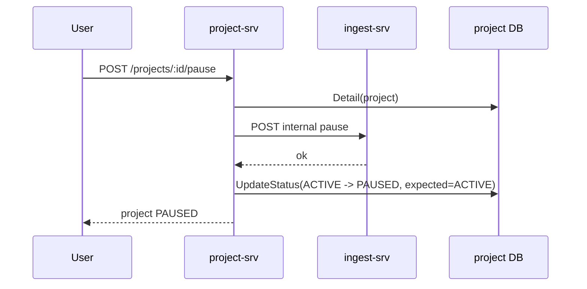
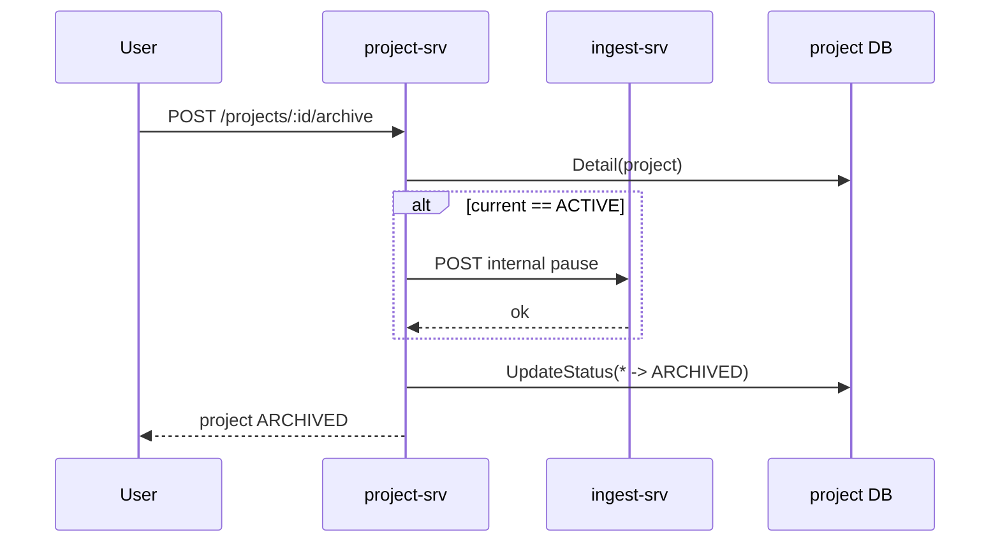

# 02. Project Domain

## Business Context

Project là aggregate điều phối ở mức nghiệp vụ. `project-srv` là source of truth cho `project.status`, còn `ingest-srv` giữ runtime state của datasource/target. Mọi project lifecycle command đều phải đồng bộ với ingest trước hoặc trong transition.

Actor chính:
- user qua public API
- internal service gọi internal detail/readiness

Entity chính:
- `Campaign`
- `Project`

## BRD

### Capability

Project domain cung cấp:
- tạo project dưới campaign
- xem/sửa project
- readiness check cho `activate` và `resume`
- lifecycle `activate/pause/resume/archive/unarchive/delete`
- publish lifecycle event sau transition local

### Rule Inventory

1. Project chỉ được tạo dưới campaign hợp lệ.
2. `Activate` chỉ hợp lệ khi project đang `DRAFT`.
3. `Pause` chỉ hợp lệ khi project đang `ACTIVE`.
4. `Resume` chỉ hợp lệ khi project đang `PAUSED`.
5. `Archive` chỉ hợp lệ khi project đang `DRAFT/ACTIVE/PAUSED`.
6. `Unarchive` chỉ hợp lệ khi project đang `ARCHIVED` và đưa project về `PAUSED`.
7. `Delete` chỉ cho sau archived.
8. `Activate` và `Resume` đều phải qua readiness check của ingest nhưng dùng command khác nhau.
9. Nếu `Archive` từ trạng thái `ACTIVE`, project phải pause ingest trước rồi mới đổi local status.
10. Update local status có optimistic guard bằng `ExpectedStatuses` để giảm race local.
11. Readiness fail nếu datasource/target bên ingest chưa đủ điều kiện.
12. Internal project detail là contract cho service khác tra cứu trạng thái project.

### Failure Rules

| Command | Failure business chính |
| --- | --- |
| Activate | status không phải `DRAFT`, ingest readiness block, ingest activate fail |
| Pause | status không phải `ACTIVE`, ingest pause fail |
| Resume | status không phải `PAUSED`, readiness block, ingest resume fail |
| Archive | status không hợp lệ, ingest pause fail khi current là `ACTIVE` |
| Unarchive | status không phải `ARCHIVED` |
| Delete | chưa archived |

## SRS

### Public Interfaces

| API | Purpose |
| --- | --- |
| `POST /campaigns/:id/projects` | create project |
| `GET /projects/:project_id` | detail |
| `PUT /projects/:project_id` | update metadata |
| `GET /projects/:project_id/activation-readiness` | readiness view |
| `POST /projects/:project_id/activate` | activate |
| `POST /projects/:project_id/pause` | pause |
| `POST /projects/:project_id/resume` | resume |
| `POST /projects/:project_id/archive` | archive |
| `POST /projects/:project_id/unarchive` | unarchive |
| `DELETE /projects/:project_id` | delete |

### Internal Interface

| API | Purpose |
| --- | --- |
| `GET /projects/:project_id` | internal detail for other services |

### Persistence/Side Effects

- project status update qua repository `UpdateStatus(...)`
- lifecycle event publish sau transition local
- ingest client được gọi ở `Activate`, `Pause`, `Resume`, và `Archive` khi project đang `ACTIVE`

### Detailed Dataflow

#### Activate

#### Pause

#### Archive

## Decision Tables

### Project Status x Command

| Current Status | Activate | Pause | Resume | Archive | Unarchive |
| --- | --- | --- | --- | --- | --- |
| `DRAFT` | Allow if readiness activate pass | Block | Block | Allow | Block |
| `ACTIVE` | Block | Allow | Block | Allow after ingest pause | Block |
| `PAUSED` | Block | Block | Allow if readiness resume pass | Allow | Block |
| `ARCHIVED` | Block | Block | Block | Block | Allow -> `PAUSED` |

### Readiness Command

| Command | Allowed project status locally | Ingest expectation |
| --- | --- | --- |
| `activate` | `DRAFT` | datasource status phải phù hợp cho activate |
| `resume` | `PAUSED` | datasource status phải phù hợp cho resume |

## Evidence

Code paths chính:
- `project-srv/internal/model/project.go`
- `project-srv/internal/project/usecase/lifecycle.go`
- `project-srv/internal/project/delivery/http/routes.go`

Test evidence:
- `test_lifecycle.py`
- `test_lifecycle_edge_cases.py`
- `test_project_decision_table.py`
- `test_project_lifecycle_concurrency.py`
- `test_internal_api_contract.py`

## Coverage / Gap

Đã cover tốt:
- state transition
- readiness command split
- concurrency local
- archive-from-active behavior

Còn hạn chế:
- docs này không mô tả full campaign business ngoài phần liên quan project
- partial success giữa project local state và ingest remote side effect vẫn cần theo dõi runtime dài hạn
