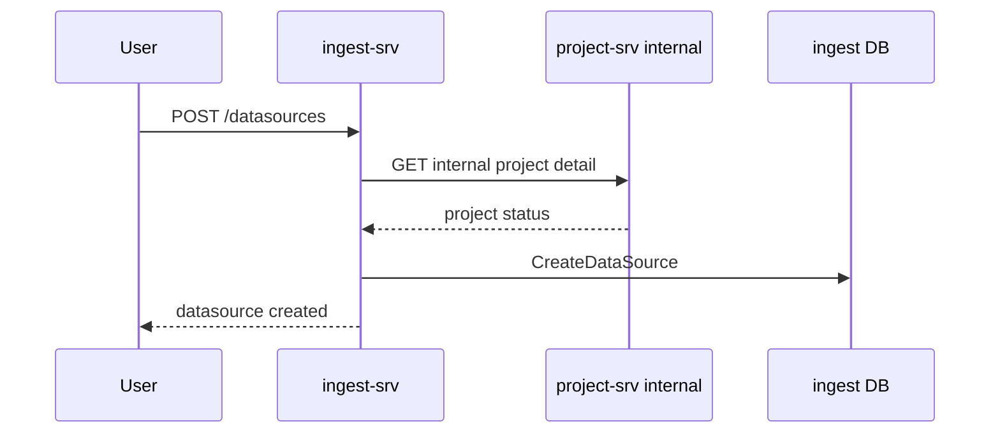
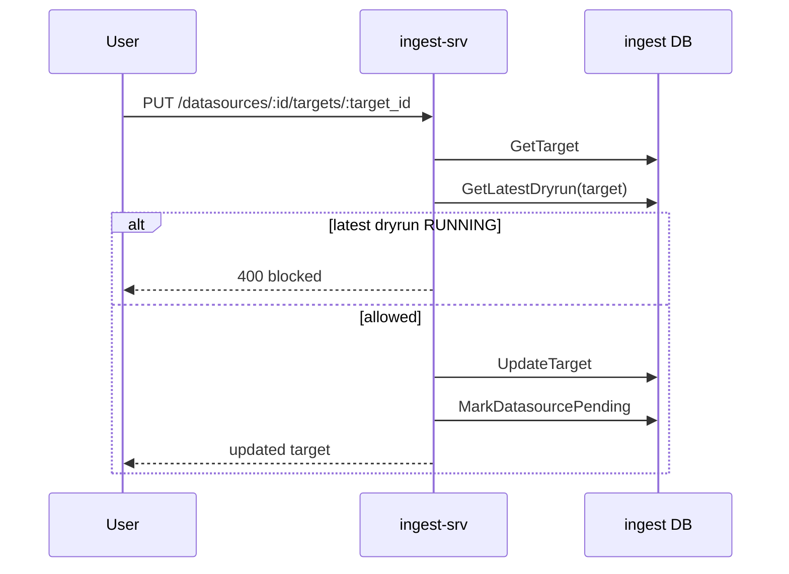

# 03. Ingest Datasource + Target Domain

## Business Context

Datasource và target là lõi nghiệp vụ của ingest. Datasource đại diện nguồn dữ liệu gắn với project; target là execution unit thực tế cho crawl/dry-run.

Quan hệ:
- `Project 1 - N DataSource`
- `DataSource 1 - N CrawlTarget`

Runtime hiện tại vận hành theo nguyên tắc:
- readiness ở mức project được tính từ datasource + target
- dry-run và execution chạy theo từng target
- target mới tạo luôn inactive

## BRD

### Datasource Capability

- create/detail/list/update/archive/delete datasource
- update crawl mode qua internal route
- code-level datasource lifecycle `activate/pause/resume`

### Datasource Rules

1. Datasource create yêu cầu `project_id`, `name`, `source_type`.
2. Nếu `source_category` rỗng thì hệ thống suy luận từ `source_type`.
3. Crawl datasource phải có `crawl_mode` và `crawl_interval_minutes > 0`.
4. Datasource không được tạo dưới project archived.
5. Detail/List không lộ datasource đã soft-delete.
6. Update datasource bị chặn nếu có target trong datasource đang dry-run `RUNNING`.
7. Update material fields (`config`, `mapping_rules`) bị chặn khi datasource đang `ACTIVE`.
8. Update material fields sẽ reset snapshot dry-run của datasource.
9. Archive datasource không phải delete; archived record vẫn query được.
10. Delete datasource chỉ cho sau archived và là soft delete.
11. Crawl mode chỉ đổi được cho crawl datasource ở `READY/ACTIVE/PAUSED`.
12. Code-level datasource lifecycle tồn tại nhưng chưa expose public/internal route trực tiếp.

### Target Capability

- create/list/detail/update/activate/deactivate/delete target
- target typed by `KEYWORD`, `PROFILE`, `POST_URL`

### Target Rules

1. Chỉ datasource crawl mới tạo target.
2. Datasource archived không tạo target mới.
3. Target mới tạo mặc định inactive.
4. `PROFILE` target hiện có CRUD nhưng runtime mapping chưa hoàn chỉnh.
5. Update target bị chặn khi target đó đang dry-run `RUNNING`.
6. Material target change có thể deactivate target nếu đang active.
7. Material target change sẽ mark datasource pending để ép validate lại.
8. Activate target chỉ được nếu latest dry-run là usable (`SUCCESS/WARNING`).
9. Deactivate/delete target đang active phải giữ invariant active target count của crawl datasource.
10. Delete target là hard delete.

## SRS

### Public Interfaces

| API | Purpose |
| --- | --- |
| `POST /datasources` | create datasource |
| `GET /datasources` | list datasource |
| `GET /datasources/:id` | detail datasource |
| `PUT /datasources/:id` | update datasource |
| `POST /datasources/:id/archive` | archive datasource |
| `DELETE /datasources/:id` | soft delete datasource |
| `POST /datasources/:id/targets/keywords` | create keyword target |
| `POST /datasources/:id/targets/profiles` | create profile target |
| `POST /datasources/:id/targets/posts` | create post target |
| `GET /datasources/:id/targets` | list targets |
| `GET /datasources/:id/targets/:target_id` | detail target |
| `PUT /datasources/:id/targets/:target_id` | update target |
| `POST /datasources/:id/targets/:target_id/activate` | activate target |
| `POST /datasources/:id/targets/:target_id/deactivate` | deactivate target |
| `DELETE /datasources/:id/targets/:target_id` | delete target |

### Internal Interfaces

| API | Purpose |
| --- | --- |
| `PUT /internal/datasources/:id/crawl-mode` | update crawl mode |
| `GET /internal/projects/:project_id/activation-readiness` | project readiness from ingest |
| `POST /internal/projects/:project_id/activate` | activate project datasources |
| `POST /internal/projects/:project_id/pause` | pause project datasources |
| `POST /internal/projects/:project_id/resume` | resume project datasources |

### Dataflow

#### Datasource Create

#### Target Update with Material Change

## Decision Tables

### Datasource Status x Command

| Datasource Status | Update | Archive | Delete | Update Crawl Mode |
| --- | --- | --- | --- | --- |
| `PENDING` | Allow with runtime guards | Allow if no target dryrun running | Block unless archived | Block |
| `READY` | Allow | Allow if no target dryrun running | Block unless archived | Allow |
| `ACTIVE` | Block for material config/mapping change | Allow if no target dryrun running | Block unless archived | Allow |
| `PAUSED` | Allow | Allow if no target dryrun running | Block unless archived | Allow |
| `ARCHIVED` | Generally no operational update | Idempotent no-op | Allow soft delete | Block |

### Target State x Command

| Target State | Update | Activate | Deactivate | Delete |
| --- | --- | --- | --- | --- |
| `inactive` + no usable dryrun | Allow | Block | Idempotent no-op | Allow if invariant pass |
| `inactive` + usable dryrun | Allow | Allow | Idempotent no-op | Allow if invariant pass |
| `active` + no running dryrun | Allow, material change may deactivate | Idempotent no-op | Allow if invariant pass | Allow if invariant pass |
| any + latest dryrun `RUNNING` | Block | Block | Block | Block |

## Evidence

Code paths chính:
- `ingest-srv/internal/datasource/usecase/datasource.go`
- `ingest-srv/internal/datasource/usecase/datasource_lifecycle.go`
- `ingest-srv/internal/datasource/usecase/target.go`
- `ingest-srv/internal/model/data_source.go`
- `ingest-srv/internal/model/crawl_target.go`
- `ingest-srv/internal/datasource/delivery/http/routes.go`

Test evidence:
- `test_crud.py`
- `test_crud_edge_cases.py`
- `test_datasource_runtime_guard_matrix.py`
- `test_target_runtime_guard_matrix.py`
- `test_datasource_target_decision_table.py`
- `test_archive_delete_update_concurrent_stress.py`
- `test_no_side_effect_contracts.py`

## Gap

- `ActivateDataSource / PauseDataSource / ResumeDataSource` có code-level usecase nhưng chưa có HTTP/internal route riêng để black-box E2E.
- Passive source create chỉ dừng ở base persistence, chưa có onboarding runtime đầy đủ.
- `PROFILE` target mới có CRUD; runtime dispatch/dry-run mapping chưa hoàn chỉnh.
