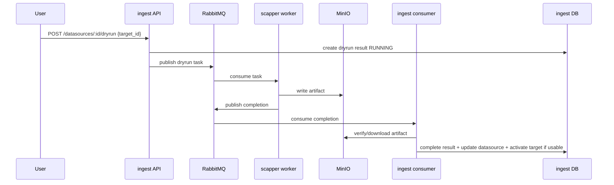
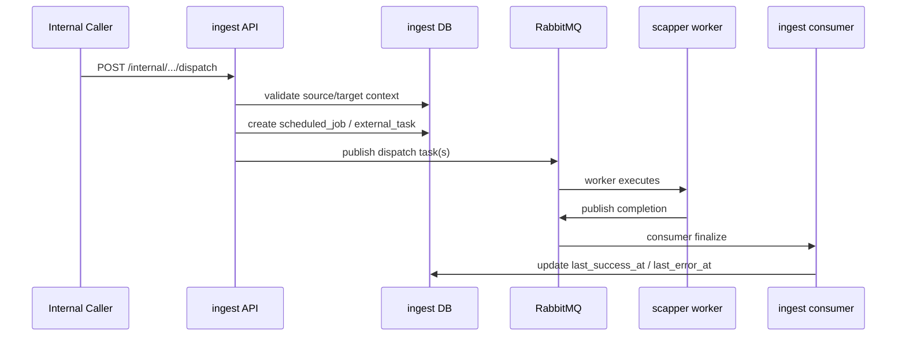
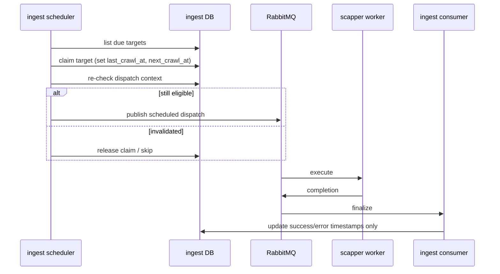

# 04. Dryrun + Execution + Scheduler Domain

## Business Context

Đây là runtime plane của ingest:
- `dry-run` validate target trước khi cho chạy thật
- `execution` xử lý manual dispatch và scheduled dispatch
- `scheduler` quét due targets để claim và dispatch
- `scapper-srv` worker chạy task thật, ghi artifact lên MinIO, rồi publish completion
- `ingest-srv consumer` finalize state từ completion

## BRD

### Dry-run Rules

1. Dry-run trigger là **per-target**, không phải per-datasource.
2. Retrigger cùng target khi latest `RUNNING` bị chặn.
3. Latest/history là lineage theo datasource + target.
4. Completion `error` finalize result thành `FAILED`.
5. Completion success tải artifact từ storage và quyết định `SUCCESS/WARNING/FAILED`.
6. `SUCCESS/WARNING` là usable, có thể auto-activate target.
7. Duplicate completion phải idempotent.
8. Late completion không được resurrect state đã archive/delete/cancel.
9. MinIO artifact phải tồn tại, tải được, parse được trong nhánh success.
10. Readiness của project bị ảnh hưởng trực tiếp bởi latest dry-run của từng target.

### Execution Rules

1. Manual dispatch chỉ hợp lệ khi source là crawl, không archived, target active, source có crawl mode.
2. Scheduled dispatch còn yêu cầu source status là `ACTIVE`.
3. Runtime mapping hiện chỉ rõ ràng cho:
   - `TIKTOK + KEYWORD -> full_flow`
   - `FACEBOOK + POST_URL -> post_detail`
4. Unsupported source_type x target_type mapping bị chặn.
5. Scheduler claim set `last_crawl_at` tại thời điểm dispatch.
6. Completion chỉ update `last_success_at` hoặc `last_error_at`, không overwrite `last_crawl_at`.
7. Pause/archive project phải cancel runtime in-flight liên quan.
8. Scheduler phải re-check context sau claim để tránh dispatch nhầm sau state change.

## SRS

### Interfaces

| API / Channel | Purpose |
| --- | --- |
| `POST /datasources/:id/dryrun` | trigger dry-run |
| `GET /datasources/:id/dryrun/latest` | latest dry-run result |
| `GET /datasources/:id/dryrun/history` | dry-run history |
| `POST /internal/datasources/:id/targets/:target_id/dispatch` | manual dispatch |
| Rabbit queue | task publish + completion |
| MinIO object | artifact source of truth cho dry-run/runtime payload |

### Dry-run Dataflow

### Execution Manual Dispatch Dataflow

### Scheduler Dataflow

## Decision Tables

### Dry-run Result x Runtime Meaning

| Dry-run Status | Terminal | Usable | Readiness effect | Auto-activate target |
| --- | --- | --- | --- | --- |
| `RUNNING` | No | No | Block mutate/activate where applicable | No |
| `SUCCESS` | Yes | Yes | Can unblock | Yes |
| `WARNING` | Yes | Yes | Can unblock with warnings | Yes |
| `FAILED` | Yes | No | Block readiness | No |

### Scheduler Eligibility x Outcome

| Condition | Outcome |
| --- | --- |
| source archived | do not dispatch |
| source not active in scheduled path | do not dispatch |
| target inactive | do not dispatch |
| crawl mode missing | do not dispatch |
| unsupported mapping | do not dispatch |
| claimed then project pauses/archive | cancel/release before publish or ignore late completion |

## Artifact Contract

Runtime hiện yêu cầu:
- worker phải publish completion kèm `storage_bucket` và `storage_path` cho nhánh success
- `ingest-srv` verify object trên MinIO bằng `HEAD/GET`
- artifact phải parse được thành JSON usable
- lineage `task_id / bucket / path` phải khớp với result/job đang finalize

## Evidence

Code paths chính:
- `ingest-srv/internal/dryrun/usecase/consumer.go`
- `ingest-srv/internal/execution/usecase/helpers.go`
- `ingest-srv/internal/execution/usecase/cron.go`
- `ingest-srv/internal/execution/usecase/consumer.go`
- `ingest-srv/internal/execution/repository/postgre/*`
- `scapper-srv/app/worker.py`
- `scapper-srv/app/publisher.py`

Test evidence:
- `test_runtime_completion_e2e.py`
- `test_dryrun_completion_faults.py`
- `test_dryrun_completion_duplicate_burst.py`
- `test_runtime_minio_contract.py`
- `test_runtime_consistency_matrix.py`
- `test_execution_dispatch_faults.py`
- `test_facebook_post_url_execution_e2e.py`
- `test_manual_dispatch_stress.py`
- `test_scheduler_e2e.py`
- `test_scheduler_guard_matrix.py`
- `test_scheduler_stress_matrix.py`
- `test_scheduler_concurrent_projects.py`
- `test_scheduler_runtime_soak.py`

## Coverage / Gap

Đã cover tốt:
- dry-run completion fault/duplicate/late completion
- MinIO verification
- scheduler guard/stress/soak
- manual dispatch faults
- timestamp consistency

Gap còn lại:
- `PROFILE` runtime mapping chưa có
- full downstream semantic assert cho UAP/Kafka chưa sâu
- infra outage thật của Rabbit/MinIO/DB chưa được mô phỏng đầy đủ
