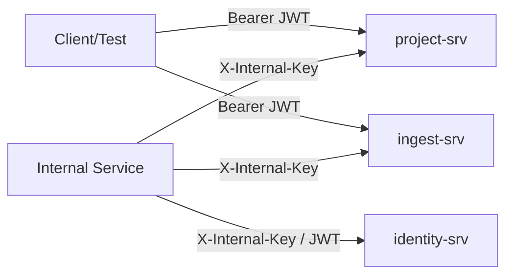

# 05. Identity Boundary Domain

## Business Context

`identity-srv` hiện được dùng trong runtime chain chủ yếu như **auth boundary**, không phải source of truth cho lifecycle hay ingest state. Trong E2E hiện tại, phần được dùng thật là:
- JWT auth cho public APIs
- internal key auth cho internal APIs
- một số internal validate/revoke/user lookup routes

## BRD

### Capability

- public auth routes: login, callback
- protected routes: logout, me
- internal routes:
  - validate token
  - revoke token
  - get user by id

### Rules

1. Public API của `project-srv` và `ingest-srv` dùng JWT auth.
2. Internal API dùng `X-Internal-Key`.
3. Internal route phải bị chặn nếu thiếu hoặc sai internal key.
4. Protected user route phải bị chặn nếu thiếu hoặc sai JWT.
5. Runtime E2E hiện đang dùng local JWT generation để mô phỏng auth hợp lệ; identity product flow full OAuth chưa phải luồng runtime đang được test sâu.

## SRS

### Interfaces

| API | Purpose |
| --- | --- |
| `GET /api/v1/authentication/login` | bắt đầu OAuth login |
| `GET /api/v1/authentication/callback` | OAuth callback |
| `POST /api/v1/authentication/logout` | logout |
| `GET /api/v1/authentication/me` | user profile hiện tại |
| `POST /api/v1/authentication/internal/validate` | validate token internal |
| `POST /api/v1/authentication/internal/revoke-token` | revoke token |
| `GET /api/v1/authentication/internal/users/:id` | internal user lookup |

### Runtime Boundary Flow

### Observed Runtime Contract

- Public runtime chain chấp nhận JWT hợp lệ và reject JWT sai bằng `401`.
- Internal runtime chain chấp nhận internal key hợp lệ và reject key sai bằng `401/403`.
- `identity-srv` không quyết định project/datasource lifecycle; nó chỉ cho phép hay chặn caller.

## Evidence

Code paths chính:
- `identity-srv/internal/httpserver/handler.go`
- `identity-srv/internal/authentication/delivery/http/routes.go`
- shared middleware auth/internal auth
- `test/full_check/common.py`

Test evidence:
- `test_internal_api_contract.py`
- `test_error_contract.py`
- `test_zero_500_matrix.py`
- `test_trace_contract.py`

## Gap

- Full OAuth login/callback/session/revoke product flow chưa được E2E sâu trong runtime pack này.
- Role/permission semantics chi tiết ngoài `Auth`, `InternalAuth`, `AdminOnly` chưa được tổng hợp sâu ở đây vì không phải core runtime behavior của ingest/project.
