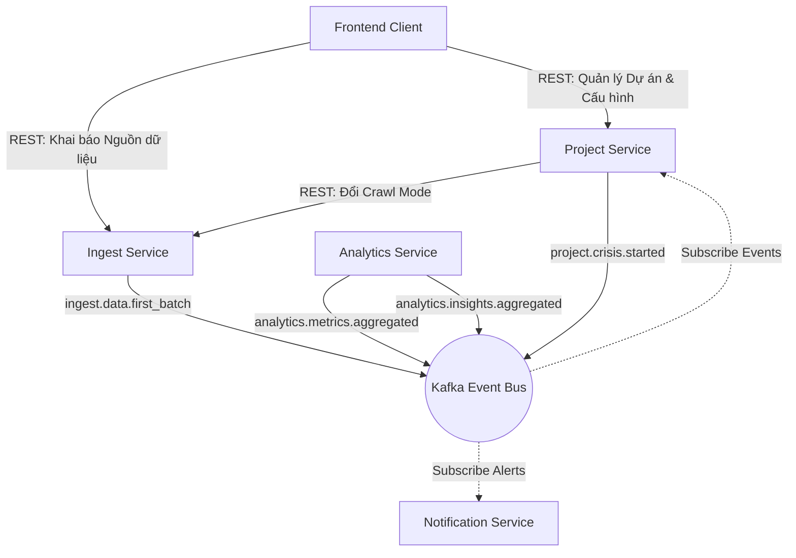
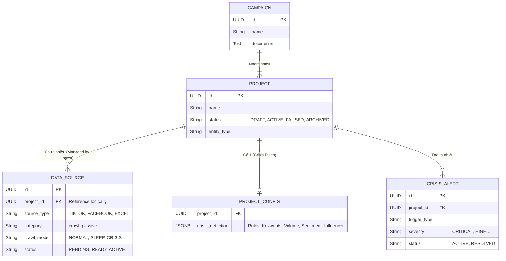
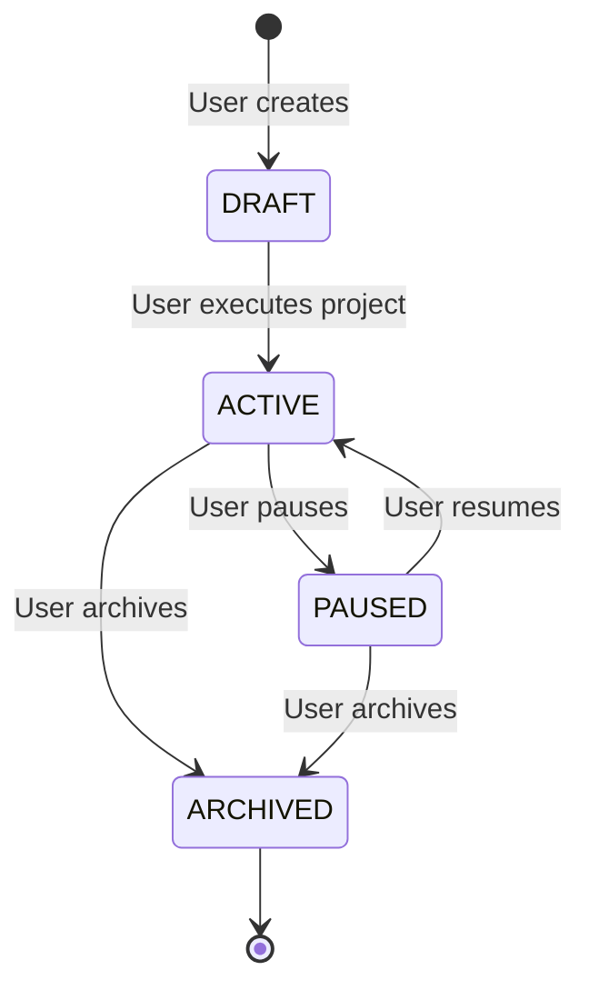
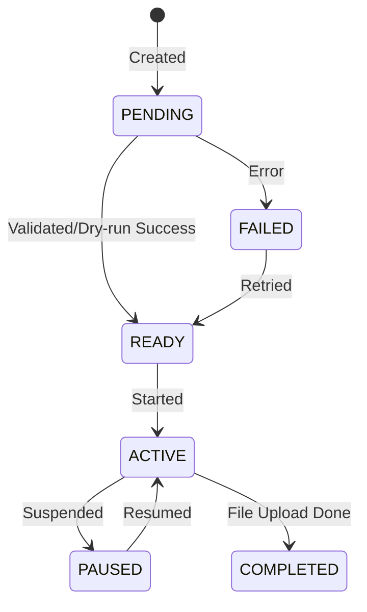
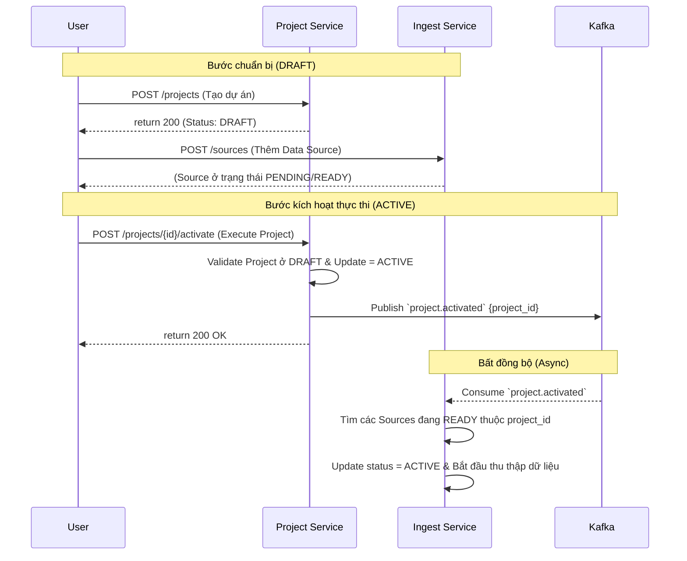
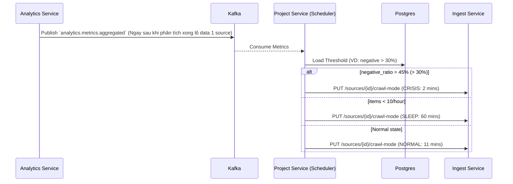
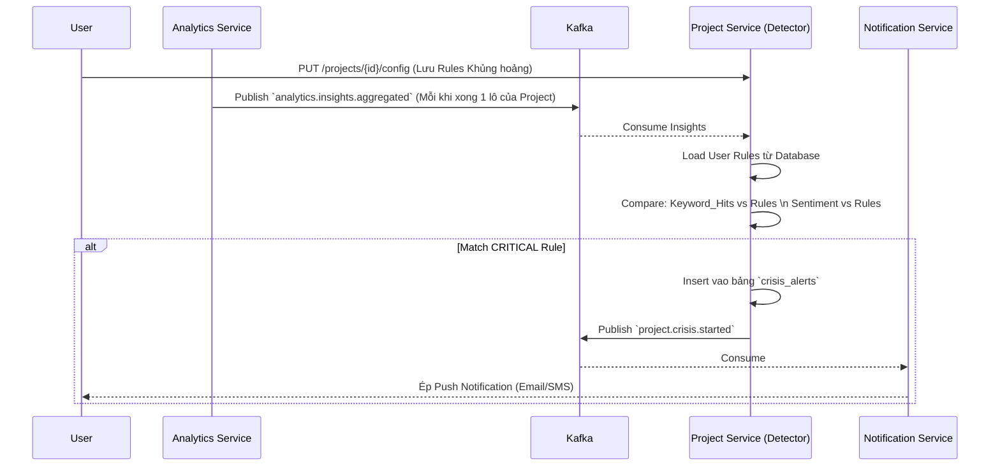
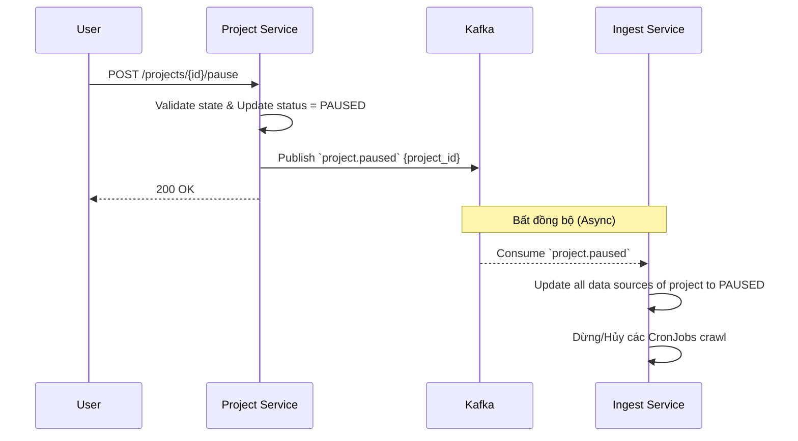

# Project Service - Complete Specification

**Phiên bản:** 3.0 (Refactored - Clean Architecture & Integration Contracts)
**Ngày cập nhật:** 20/02/2026
**Repo:** project-srv (Go)
**Tác giả:** System Architect

---

## 1. TỔNG QUAN VÀ VAI TRÒ CỐT LÕI (OVERVIEW)

Project Service là một **Domain Service** (không phải API Gateway hay Orchestrator) chịu trách nhiệm chính về nghiệp vụ cấu hình Dự án và Cảnh báo Khủng hoảng trong hệ thống SMAP.

**Core Responsibilities (4 Trụ cột chính):**

1. **Lưu trữ Cấu hình Projects & Campaigns**: Quản lý vòng đời (DRAFT, ACTIVE, PAUSED, ARCHIVED).
2. **Quản lý Cấu hình Khủng hoảng (Crisis Config)**: Nơi người dùng định nghĩa các ngưỡng cảnh báo (Từ khóa, Lượng bài, Cảm xúc, Influencer).
3. **Adaptive Crawl Controller (Điều phối tần suất cào)**: Phân tích Metrics từ Analytics để ra lệnh cho Ingest Service tăng/giảm tần suất lấy dữ liệu (Normal, Sleep, Crisis).
4. **Crisis Detector (Phát hiện Khủng hoảng)**: Kết hợp Insights từ Analytics và Crisis Config để cảnh báo người dùng.

**Nguyên tắc "Không làm" (Anti-patterns):**

- ❌ KHÔNG chứa logic cào mạng xã hội, upload file (Đó là việc của **Ingest Service**).
- ❌ KHÔNG chứa model ML/AI để phân tích cảm xúc (Đó là việc của **Analytics Service**).
- ❌ KHÔNG định tuyến request từ ngoài vào như một Gateway. Client gọi thẳng các service cần thiết.

### 1.1 Vị trí trong Hệ thống (Context Diagram)



---

## 2. MÔ HÌNH DỮ LIỆU (DOMAIN MODEL)

Hệ thống được thiết kế theo phân cấp 3 tầng rõ rệt: Tầng Logic (Campaigns), Tầng Thực thể Giám sát (Projects), Tầng Dữ liệu Vật lý (Data Sources).



_Lưu ý: Bảng `DATA_SOURCE` nằm vật lý bên Ingest Service, Project Service chỉ lưu Logical Reference (UUID)._

---

## 3. VÒNG ĐỜI TRẠNG THÁI (STATE MACHINES)

### 3.1 Vòng đời Project (Nằm tại Project Service)



### 3.2 Vòng đời Data Source (Nằm tại Ingest Service)

Dù nằm bên Ingest, Project Service vẫn sử dụng các trạng thái này để hiển thị trên Dashboard.



---

## 4. LUỒNG XỬ LÝ CỐT LÕI (CORE WORKFLOWS)

Project Service chỉ phản ứng dựa trên Events (Event-Driven) từ Kafka, hạn chế gọi HTTP đồng bộ để tránh bottle-necks.

### 4.1 Luồng 1: Kích hoạt Dự án (Execute Project)

Dự án được khởi tạo ở mode `DRAFT`. Việc thêm Data Source không tự động kích hoạt dự án vì người dùng cần một bước đệm để Ingest Service kiểm tra (Validate/Dry Run). Thay vào đó, để Project bắt đầu chạy, **Người dùng (User) phải ra lệnh kích hoạt (Execute)**.



**Các bước thực thi (Execution Flow):**

1. **Khởi tạo & Chuẩn bị:** User gọi REST API `POST /projects` tạo project. Trạng thái mặc định là `DRAFT`.
2. **Setup Fetch:** User cấu hình liên tiếp nhiều data sources bên Ingest Service (Target Facebook, TikTok...). Các sources này được Ingest Service validate và đưa vào trạng thái chờ (Ví dụ: `READY`), chúng CHƯA thu thập dữ liệu ngay lập tức.
3. **Trigger Event (Execute):** Khi đã sẵn sàng, User bấm nút Execute trên UI, gọi API `POST /projects/{id}/activate` tới Project Service.
4. **Validation & Activate:** `Project Service` kiểm tra csdl, nếu project hợp lệ (đang `DRAFT`), nó đổi thành `ACTIVE`, ghi nhận `activated_at = NOW()`.
5. **Đồng bộ lệnh:** `Project Service` gửi một event `project.activated` qua Kafka chứa `project_id`.
6. **Ingest Execution:** `Ingest Service` nhận event, quét toàn bảng `data_sources` với `project_id` tương ứng, đổi các source hợp lệ (`READY`) sang `ACTIVE` và thực sự nhét công việc vào bộ lập lịch để thu thập dữ liệu.

### 4.2 Luồng 2: Adaptive Crawl (Điều chỉnh tần suất tự động)

Hệ thống tự động ép Ingest Service cào nhanh hơn (CRISIS mode) khi Cảm xúc tiêu cực tăng cao, và cào chậm lại (SLEEP mode) khi không có ai thảo luận. Việc này diễn ra **ngay lập tức** mỗi khi Analytics phân tích xong một lô dữ liệu (Event-driven).



**Các bước thực thi (Execution Flow):**

1. **Consume Event:** `Project Service` nhận event `analytics.metrics.aggregated` trên từng Data Source.
2. **Load Threshold:** Đọc cấu hình `crisis_detection.sentiment_trigger.threshold_percent` của Project chứa Data Source đó từ Database.
3. **Đánh giá logic (Evaluate):**
   - Nếu tỷ lệ tiêu cực (`negative_ratio`) vượt ngưỡng `threshold_percent` -> Trạng thái **nguy hiểm**.
   - Nếu số lượng bài viết (`new_items_count`) cực thấp (ví dụ < 10 bài/giờ) -> Trạng thái **đóng băng (Sleep)**.
   - Các trường hợp còn lại -> Trạng thái **bình thường**.
4. **Trigger Ingest Service:** Tùy theo kết quả đánh giá, gọi HTTP REST API đồng bộ sang Ingest Service `PUT /ingest/sources/{source_id}/crawl-mode` kèm enum `{NORMAL, SLEEP, CRISIS}`. Mọi lỗi gọi network sẽ được retry với Exponential Backoff.

### 4.3 Luồng 3: Áp dụng Cấu hình Cảnh báo Khủng hoảng (Crisis Detection)

Người dùng định nghĩa Rule tĩnh (Ví dụ: Chứa chữ "lừa đảo" hoặc Lượng bài tiêu cực tăng 200%). Analytic phân tích văn bản thành Insights. Project Service so sánh Insights với Rules để bóp cò báo động **ngay khi nhận được dữ liệu tổng hợp** (Event-driven).



**Các bước thực thi (Execution Flow):**

1. **Consume Event:** Nhận `analytics.insights.aggregated` qua Kafka. Mất dữ liệu ở bước này không sao vì Insights sẽ được cộng dồn ở các lô sau nếu khủng hoảng vẫn kéo dài.
2. **Filter & Evaluate Local Config:**
   - Lấy `crisis_detection` chứa 4 lớp Rules (Keywords, Volume, Sentiment, Influencer) từ Database.
   - Lấy từng rule đánh giá logic. Ví dụ: Nếu mảng `keyword_hits` của event có chứa từ khóa thuộc rules `Nghiêm trọng`.
3. **Lưu vết Khủng hoảng (Store Alert):**
   - Lưu vào table `schema_project.crisis_alerts` với các params: `project_id`, `trigger_type`, `severity`, trường `metrics` lưu tỷ lệ hoặc từ khóa bắt được. Status=`ACTIVE`.
4. **Kích hoạt Báo động (Trigger notification):**
   - Gửi payload qua Kafka vào Topic `project.crisis.started`. Payload mang thông điệp đầy đủ và context khủng hoảng (id, severity, metrics, message).
5. **Đồng bộ Adaptive Crawl (Chéo):** Nếu Severity nằm ở mức CRITICAL, Project Service lập tức trigger lấy toàn bộ Data Source của Project gọi REST API tới Ingest Service (giống 4.2) để ép toàn thể nền tảng tập trung cào Project này bằng `CRISIS` mode.

### 4.4 Luồng 4: Thay đổi Trạng thái Dự án (Pause / Resume / Archive)

Khi người dùng thao tác dừng hoặc xóa một dự án, Project Service (Với vai trò Domain Owner của entity Project) sẽ tiếp nhận HTTP Request, chuyển trạng thái trong DB, và dùng Kafka để đồng bộ lệnh "Dừng thu thập/Khởi động lại" xuống Ingest Service. Sự kiện này là một chiều (One-way Sync).



**Các bước thực thi (Execution Flow):**

1. **User Action:** User gọi REST API `POST /projects/{id}/pause` (hoặc `/resume`, `/archive`).
2. **Validation & Update:**
   - `Project Service` kiểm tra logic hợp lệ: Ví dụ `DRAFT` không thể `PAUSE`.
   - Update `schema_project.projects` set `status=PAUSED` (hoặc Soft Delete nếu là `ARCHIVED`).
   - Ghi log audit trail (USER trigger).
3. **Publish Sync Event:**
   - `Project Service` publish event vào Kafka: `project.paused` (hoặc `project.resumed`, `project.archived`). Payload chứa `project_id` bị ảnh hưởng.
4. **Ingest Execution (Nơi làm việc vất vả):**
   - `Ingest Service` consume event này.
   - Tìm tất cả Data Source thuộc về `project_id` đó.
   - Cập nhật state nội bộ của Data Source (`status=PAUSED`).
   - Loại bỏ các target ra khỏi bộ lập lịch (Cron Scheduler) để tiến trình crawl dừng ngay lập tức. Cắt các kết nối Webhook.
   - Ngược lại nếu là `project.resumed`, nhét lại target vào bộ lập lịch.

---

## 5. HỢP ĐỒNG GIAO TIẾP VÀ PAYLOADS (INTEGRATION CONTRACTS)

Phần này đặc tả những `payloads` cốt lõi được dùng làm Contract giao tiếp giữa Project Service với API Gateway (Frontend) và Kafka (Các Microservice khác). Đây là quy chuẩn bắt buộc để đảm bảo tính nhất quán (Consistency).

### 5.1 Project Configuration Payload (REST API)

Cấu hình Rules của người dùng dùng cho Phát hiện khủng hoảng (Crisis Detection). Project Service quản lý CRUD và lưu vào `schema_project.project_configs`.

**Method:** `PUT /projects/{project_id}/config`

```json
{
  "crisis_detection": {
    "keywords_trigger": {
      "enabled": true,
      "logic": "OR",
      "groups": [
        {
          "name": "Nghiêm trọng",
          "keywords": ["lừa đảo", "cháy", "đâm xe"],
          "weight": 100
        }
      ]
    },
    "volume_trigger": {
      "enabled": true,
      "metric": "MENTIONS",
      "rules": [
        {
          "level": "CRITICAL",
          "threshold_percent_growth": 200,
          "comparison_window_hours": 1,
          "baseline": "PREVIOUS_PERIOD"
        }
      ]
    },
    "sentiment_trigger": {
      "enabled": true,
      "min_sample_size": 50,
      "rules": [
        {
          "type": "NEGATIVE_SPIKE",
          "threshold_percent": 30
        }
      ]
    },
    "influencer_trigger": {
      "enabled": false,
      "logic": "OR",
      "rules": []
    }
  }
}
```

### 5.2 Analytics Metrics Contract (Kafka Consumer)

**Topic:** `analytics.metrics.aggregated`
**Nhà sản xuất (Producer):** Analytics Service (Phát tín hiệu Real-time mỗi khi phân tích xong một lô (Batch) dữ liệu UAP của 1 Source). Thay vì poll mỗi 5 phút, đây là cơ chế Event-driven sát thời gian thực.
**Ý nghĩa:** Data dùng để Project Service chạy **Luồng 4.2 (Adaptive Crawl)**.

```json
{
  "source_id": "src_tiktok_01",
  "project_id": "proj_vf8",
  "new_items_count": 50,
  "negative_ratio": 0.45,
  "positive_ratio": 0.25,
  "neutral_ratio": 0.3,
  "velocity": 50.0,
  "time_window": "last_5min",
  "timestamp": "2026-02-19T10:30:00Z"
}
```

### 5.3 Analytics Insights Contract (Kafka Consumer)

**Topic:** `analytics.insights.aggregated`
**Nhà sản xuất (Producer):** Analytics Service (Phát tín hiệu Real-time mỗi khi phân tích xong số liệu của 1 Project - có bộ đệm trễ vài chục giây để cộng dồn nếu throughput quá cao)
**Ý nghĩa:** Data dùng để Project Service chạy **Luồng 4.3 (Crisis Detection)**. Đóng vai trò Input để Project Service đối chiếu với Rules.

```json
{
  "project_id": "proj_vf8",
  "aggregated_at": "2026-02-19T10:30:00Z",
  "time_window": "last_5min",
  "metrics": {
    "new_items_count": 50,
    "negative_ratio": 0.45,
    "sample_size": 110
  },
  "keyword_hits": [
    { "keyword": "lừa đảo", "count": 12 },
    { "keyword": "đứt phanh", "count": 8 }
  ],
  "volume_growth": {
    "metric": "MENTIONS",
    "current_value": 150,
    "baseline_value": 50,
    "growth_percent": 200,
    "baseline_period": "PREVIOUS_PERIOD"
  },
  "influencer_mentions": [
    {
      "post_id": "post_103",
      "author": "KOL_NguyenVanA",
      "reach": 150000,
      "sentiment": "NEGATIVE"
    }
  ]
}
```

### 5.4 Crisis Notification Contract (Kafka Producer)

**Topic:** `project.crisis.started`
**Nhà sản xuất (Producer):** Project Service
**Kẻ tiêu thụ (Consumer):** Notification Service
**Ý nghĩa:** Khi Project Service đối chiếu khớp Rule trong Config, nó sẽ bắn lệnh sang Notification Service để push cho người dùng.

```json
{
  "alert_id": "alert_f90s_d83n1",
  "project_id": "proj_vf8",
  "trigger_type": "keywords_trigger",
  "severity": "CRITICAL",
  "detected_at": "2026-02-19T10:30:01Z",
  "metrics": {
    "keyword_hit": "lừa đảo",
    "count": 12
  },
  "message": "[BÁO ĐỘNG] Dự án 'VF8' đang bị nhắc đến nhiều với cụm từ 'lừa đảo'."
}
```

### 5.5 State Transfer Contracts (Kafka Producer)

Khi Project thay đổi trạng thái, Ingest Service cần tạm dừng / chạy lại tất cả crawlers tương ứng thuộc dự án đó.

**Topics:** `project.paused` / `project.resumed` / `project.archived`
**Nhà sản xuất (Producer):** Project Service

```json
{
  "project_id": "proj_vf8",
  "triggered_by": "user_id_01",
  "action": "PAUSE",
  "timestamp": "2026-02-19T10:45:00Z"
}
```

---

## 6. KẾT LUẬN VÀ TRẠNG THÁI HIỆN THỰC

- File Proposal này (v3.0) bám sát các luồng Integration để làm kim chỉ nam phát triển Code cho Backend.
- Trình tự khuyên dùng khi Code:
  1. Dựng 3 bảng Entities: `campaigns`, `projects`, `project_configs`.
  2. Mở Endpoint Cấu hình `PUT /projects/{id}/config`.
  3. Xây KafKa Consumer nhận Metrics & xử lý Logic `Adaptive Crawl`.
  4. Xây KafKa Consumer nhận Insights & xử lý Logic `Crisis Detector`.
