# SMAP State Machine and Event Flow

**Ngày cập nhật:** 2026-04-13  
**Mục tiêu:** chốt state machine và event flow chuẩn cho `campaign`, `project`, `datasource`, `crisis`, đồng thời so sánh 3 phương án ownership của `crisis` để dùng làm reference cho design review.

## 1. Mục tiêu và nguyên tắc kiến trúc

SMAP phục vụ agency hoặc doanh nghiệp cần:

- theo dõi mạng xã hội theo `campaign -> project -> keyword/profile target`
- phân tích thị trường, cảm xúc, chủ đề, đối thủ, dấu hiệu khủng hoảng
- lưu dữ liệu enriched/gold theo time-series để làm dashboard và report
- cung cấp RAG/reporting qua `knowledge-srv`
- cảnh báo khi phát hiện tín hiệu tiêu cực hoặc crisis

### 1.1 Bounded contexts

- `project-srv`
  - sở hữu `campaign`, `project`, `domain_type_code`, crisis policy/config
  - là business/control plane
- `ingest-srv`
  - sở hữu `datasource`, `target`, dry-run, scheduling, crawl mode, raw batch, UAP generation
  - là execution plane
- `analysis-srv`
  - sở hữu normalization, dedup, enrichment, signal, insight, crisis candidate detection
  - là intelligence plane
- `knowledge-srv`
  - sở hữu report materialization, vector indexing, RAG retrieval
  - là reporting/RAG plane

Các service hỗ trợ trong bức tranh đầy đủ:

- `identity-srv`: authentication/RBAC/audit boundary cho user và service access
- `scapper-srv`: crawler worker/API thực thi task crawl và trả completion/raw artifact về ingest
- `notification-srv`: realtime/WebSocket/Discord notification layer cho alert user-facing

### 1.2 Nguyên tắc thiết kế

- `business state` và `runtime state` là hai lớp khác nhau, không trộn vào một enum duy nhất.
- `domain_type_code` là business context bắt buộc để analysis chọn ontology/prompt/rule đúng.
- `crisis` là closed-loop control có kiểm soát, không phải callback ad-hoc.
- `project-srv` nên là nguồn sự thật cho project context; `ingest-srv` chỉ snapshot và propagate.
- Hệ thống chấp nhận eventual consistency giữa services, nhưng từng service phải giữ ownership rất rõ.

## 2. Current Source vs Target Architecture

### 2.1 Khớp với source hiện tại

- `campaign/project`: `PENDING | ACTIVE | PAUSED | ARCHIVED`
- `datasource`: `PENDING | READY | ACTIVE | PAUSED | FAILED | COMPLETED | ARCHIVED`
- `domain_type_code` đã được đưa vào `project`, snapshot sang `ingest`, và vào UAP contract
- `ingest-srv` đã có lifecycle runtime cho datasource và crawl mode

### 2.2 Target architecture chưa hoàn tất trong source

- `analysis-srv` đã có source path parse flat ingest UAP và route theo `domain_type_code`; phần còn lại là hardening/test/parity với analytics core
- `analysis-srv` phải phát signal/crisis event thống nhất cho `project-srv`
- `project-srv` phải chốt crisis state và điều khiển `ingest-srv` đổi crawl mode
- `knowledge-srv` cần consume insight/report topics chuẩn hóa từ analysis
- domain registry current source đang là `analysis-srv` load YAML/domain config rồi publish Redis key `smap:domains` cho `project-srv`; DB-managed ontology registry là target future, chưa phải current source

Tài liệu này dùng source hiện tại làm nền, nhưng ở các phần crisis loop và analysis outbound sẽ ghi rõ đó là **target architecture**.

## 3. Canonical State Machines

## 3.1 Campaign State Machine

`Campaign` là business grouping layer, không giữ runtime detail.

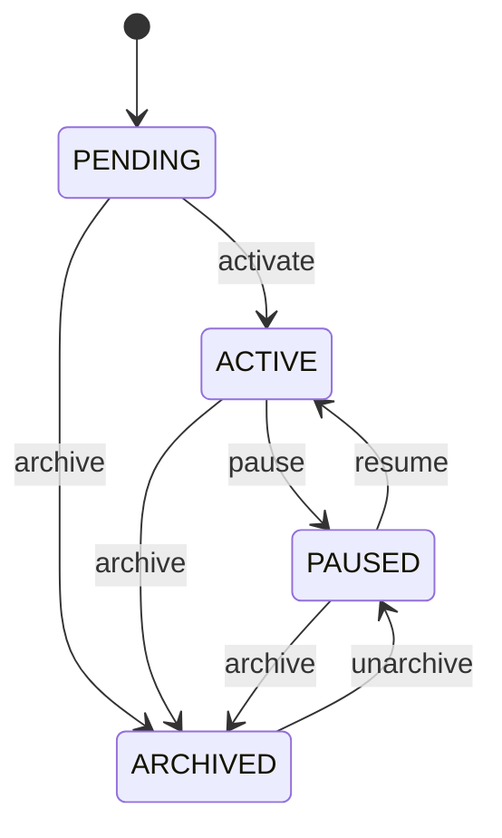

### Ý nghĩa

- `PENDING`: campaign vừa tạo, chưa vận hành chính thức
- `ACTIVE`: campaign đang hoạt động
- `PAUSED`: campaign tạm dừng nhưng còn khả năng tiếp tục
- `ARCHIVED`: campaign đóng lại, chỉ còn ý nghĩa lịch sử

### Actor và guard

- actor chính: user/operator qua `project-srv`
- `activate`: chỉ cần campaign hợp lệ ở mức business, không cần check ingest runtime
- `unarchive`: quay về `PAUSED`, không auto `ACTIVE`

### Event gợi ý

- `campaign.activated`
- `campaign.paused`
- `campaign.archived`
- `campaign.unarchived`

## 3.2 Project State Machine

`Project` là đơn vị business chính để theo dõi một thực thể/chủ đề trong một domain.

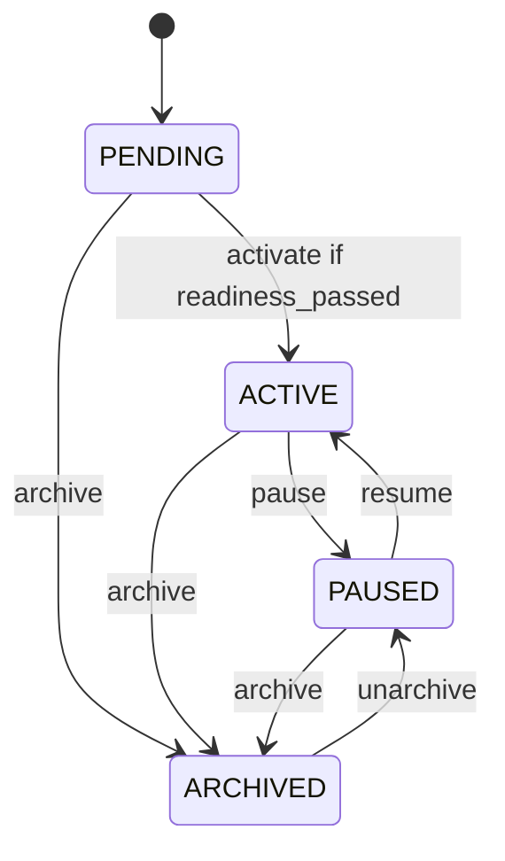

### Ý nghĩa

- `PENDING`: project đã tồn tại nhưng chưa đủ điều kiện hoặc chưa được kích hoạt
- `ACTIVE`: project đang chạy thực tế và có cron/runtime active
- `PAUSED`: project đang tạm dừng ở mức business
- `ARCHIVED`: project đóng lại, không còn active execution

### Guard `activate`

Project chỉ được `ACTIVE` khi readiness đạt. Readiness tối thiểu nên gồm:

- có ít nhất 1 datasource
- datasource passive đã onboarding/confirm xong nếu có
- crawl targets đã dry-run ít nhất một lần
- không có target nào có latest dry-run `FAILED`
- `domain_type_code` hợp lệ

### Event gợi ý

- `project.activated`
- `project.paused`
- `project.resumed`
- `project.archived`
- `project.unarchived`

## 3.3 Datasource State Machine

`Datasource` là runtime aggregate bên `ingest-srv`, không nên map 1-1 với project status.

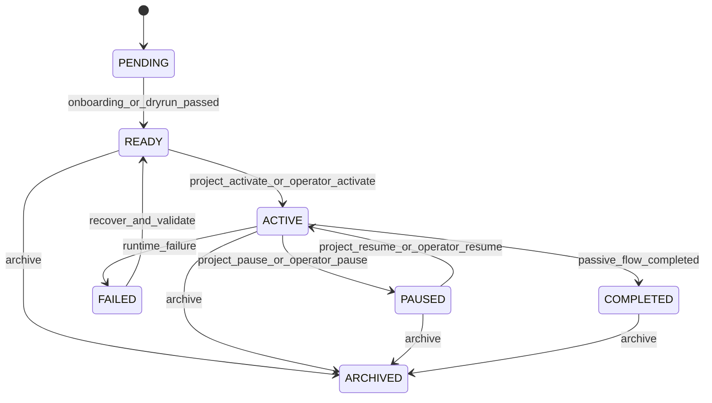

### Ý nghĩa

- `PENDING`: chưa sẵn sàng chạy
- `READY`: đã qua onboarding/dry-run, chờ activate
- `ACTIVE`: đang tham gia dispatch/schedule
- `PAUSED`: đã tạm ngừng runtime
- `FAILED`: runtime có lỗi cần can thiệp hoặc re-validate
- `COMPLETED`: dùng cho một số passive/completion flow, không phải trạng thái chính cho crawl liên tục
- `ARCHIVED`: không còn được sử dụng

### Actor và guard

- actor chính: `ingest-srv`, có thể do command từ `project-srv` hoặc operator
- `READY -> ACTIVE`: chỉ khi project được activate hoặc runtime command hợp lệ
- `FAILED -> READY`: phải qua bước recover/revalidate

### Runtime policy tách riêng

Trạng thái datasource không đồng nghĩa với tốc độ crawl. Crawl speed/policy nên nằm ở `crawl_mode`, ví dụ:

- `NORMAL`
- `CRISIS`

Điều này giúp giữ state machine ổn định và tránh lạm dụng status để biểu diễn policy.

## 3.4 Crisis State Machine

Đây là state machine mức business/risk, không phải datasource runtime.

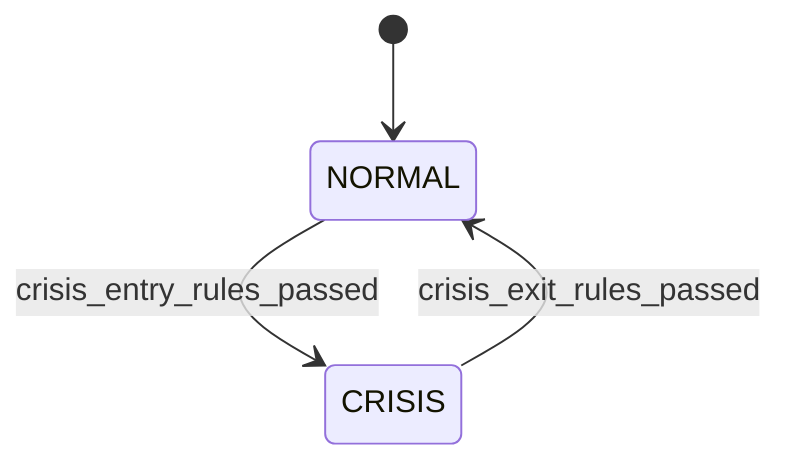

### Ý nghĩa

- `NORMAL`: hoạt động bình thường
- `CRISIS`: đã xác nhận khủng hoảng

### Guard quan trọng

- dùng windowed signal thay vì single-event spike
- cần cơ chế nghiệp vụ để tránh bật/tắt crisis liên tục
- các điều kiện vào/thoát crisis là business rules của usecase, không cần thêm state trung gian nếu business chưa yêu cầu

## 4. Event Flow End-to-End

## 4.1 Setup Flow

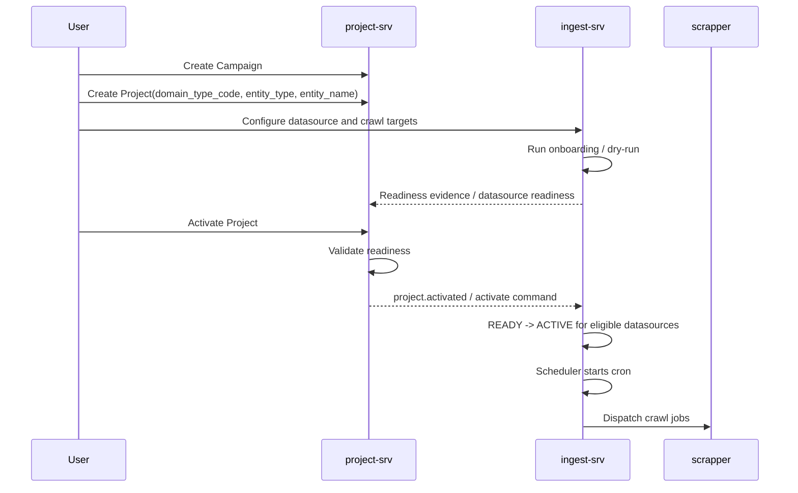

### Setup notes

- `domain_type_code` phải được chọn ngay lúc tạo project
- `project` không nên tự activate ngay khi create
- ingest readiness là bằng chứng runtime, project chỉ dùng để ra quyết định business

## 4.2 Normal Running Flow

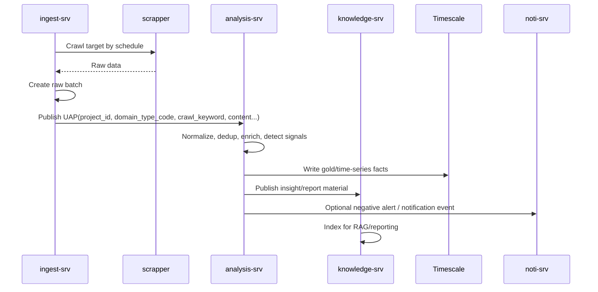

### Normal flow notes

- `domain_type_code` phải đi xuyên suốt từ project đến UAP
- `analysis-srv` phải chọn ontology/rule pack theo `domain_type_code`
- Timescale là lớp lưu trữ phù hợp cho dashboard và trend analytics
- `knowledge-srv` tận dụng insight/report để trả lời RAG và tổng hợp report

## 4.3 Crisis Feedback Loop

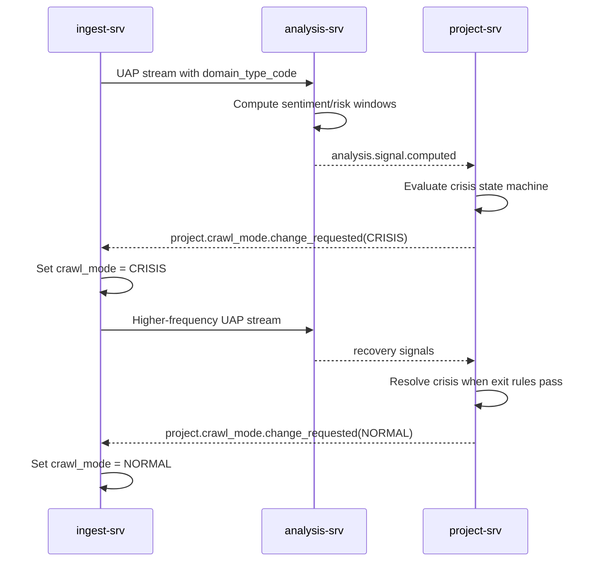

### Crisis flow notes

- path vào crisis và path thoát crisis đều phải tồn tại
- không dùng silence làm tín hiệu resolve chính
- `analysis` nên gửi periodic signal hoặc recovery signal khi project đang ở crisis

## 5. Crisis Ownership Options

## 5.1 Option A: `project-srv` owns final crisis state

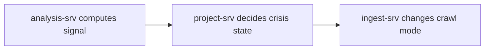

### Mô tả

- `analysis` chỉ phát signal: risk score, negative ratio, issue spike
- `project` quyết định `NORMAL/CRISIS`
- `project` ra event hoặc command cho `ingest`

### Khi nào phù hợp

- cần ownership business rõ
- mỗi project/domain có threshold khác nhau
- cần auditability, explainability, dashboard bám đúng business state

## 5.2 Option B: `analysis-srv` owns final crisis state

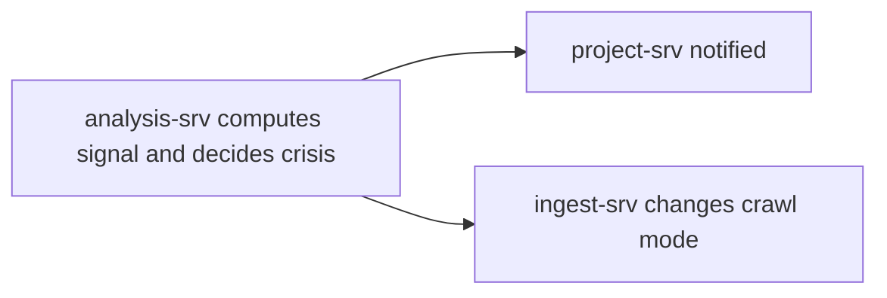

### Mô tả

- `analysis` vừa tính signal vừa tự kết luận crisis
- `project` chủ yếu nhận trạng thái đã chốt
- `ingest` có thể nhận lệnh trực tiếp từ analysis

### Khi nào phù hợp

- ưu tiên latency
- logic risk và decision gần như trùng nhau
- chấp nhận business policy sống ở analysis

## 5.3 Option C: `crisis-engine` riêng

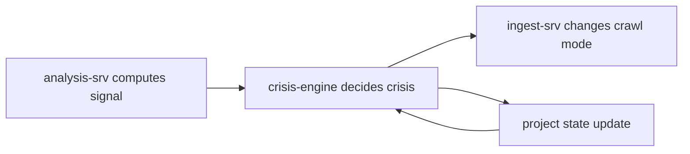

### Mô tả

- tách controller riêng cho loop khủng hoảng
- analysis phát signal
- project cung cấp policy/config
- crisis-engine chốt state và điều khiển ingest

### Khi nào phù hợp

- crisis là bài toán rất quan trọng
- muốn mở rộng nhiều loại signal và policy phức tạp
- team chấp nhận thêm một bounded context mới

## 5.4 Bảng trade-off

| Tiêu chí | Option A: Project owns state | Option B: Analysis owns state | Option C: Crisis engine riêng |
| --- | --- | --- | --- |
| Ownership clarity | Cao | Trung bình | Cao |
| Readability tổng thể | Cao | Trung bình | Thấp đến Trung bình |
| Latency phản ứng | Trung bình | Cao | Trung bình |
| Reliability / blast radius | Cao | Trung bình | Cao |
| Scalability | Cao | Trung bình | Cao |
| Explainability / auditability | Cao | Thấp đến Trung bình | Cao |
| Implementation complexity | Trung bình | Thấp | Cao |
| Team cognitive load | Trung bình | Thấp | Cao |

### Khuyến nghị

Khuyến nghị chọn **Option A: `project-srv` owns final crisis state**.

Lý do:

- sạch về ownership business
- phù hợp với `project` đang là aggregate chính
- dễ gắn với crisis config, notification policy, dashboard, approval logic
- không biến `analysis-srv` thành nơi ôm cả detection lẫn business decision

## 6. Domain và Ontology Governance

## 6.1 Domain flow canonical

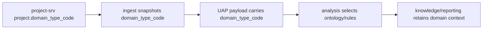

### Quy tắc

- project bắt buộc có `domain_type_code`
- ingest phải denormalize `domain_type_code` vào task/raw/UAP
- analysis phải dùng `domain_type_code` để chọn ontology/rule pack

## 6.2 DB-managed ontology với governance chặt

Phần này là **target architecture**. Current source hiện không dùng DB registry cho ontology/domain governance đầy đủ; source hiện là `analysis-srv` quản domain config bằng YAML, publish danh sách domain active qua Redis để `project-srv` validate/list domain.

Nếu sau này chuyển sang `DB-only editable`, cách an toàn là dùng mô hình quản trị artifact trong DB, không phải editable trực tiếp kiểu tự do.

### Đề xuất logical model

- `domain_types`
  - metadata domain
- `ontology_packs`
  - version, checksum, schema version, author, notes
- `ontology_pack_revisions`
  - payload source, diff, validation result
- `domain_active_pack`
  - con trỏ version đang active cho từng domain

### Lifecycle ontology pack

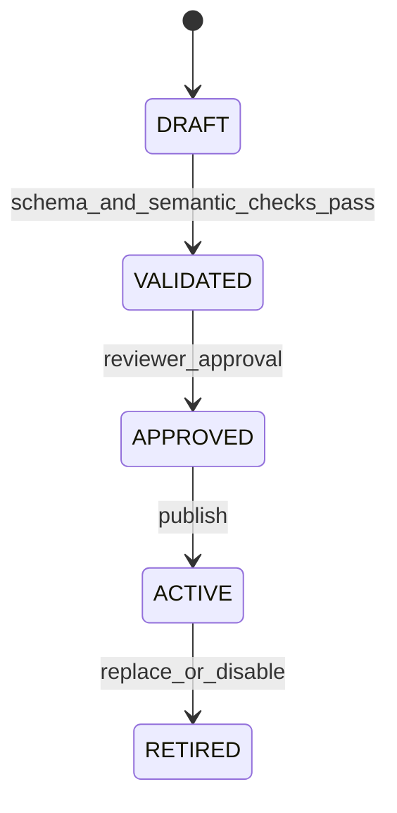

### Cơ chế bắt buộc để tránh ontology bị rác

- schema validation
- semantic validation
- uniqueness/overlap checks cho entity/taxonomy
- review/approval workflow
- versioning và rollback
- provenance/audit trail
- active version pointer

### Pattern áp dụng

- registry pattern
- versioned configuration artifact
- draft/approved/active publishing
- immutable revision + mutable active pointer

## 7. Contract Logic Cần Thống Nhất

## 7.1 Lifecycle events

- `project.activated`
- `project.paused`
- `project.resumed`
- `project.archived`

## 7.2 Analysis outbound

- `analysis.signal.computed`
- `analysis.crisis.candidate_detected` hoặc periodic signal-window event
- `analytics.insights.published`
- `analytics.report.digest`

## 7.3 Project outbound sang ingest

- `project.crawl_mode.change_requested`
- hoặc business events:
  - `project.crisis.started`
  - `project.crisis.resolved`

## 7.4 UAP minimum context

UAP tối thiểu phải có:

- `project_id`
- `domain_type_code`
- `crawl_keyword`

Phần này là bắt buộc nếu muốn analysis hoạt động đúng ngữ cảnh mà không phải gọi ngược `project-srv`.

## 8. Use Cases Ngoài Crisis

Ngoài crisis detection, cùng nền tảng dữ liệu này còn hỗ trợ tốt:

- market landscape / share of voice
- campaign effectiveness
- competitor watch
- consumer insight / pain points
- issue early warning
- source / influencer intelligence
- realtime executive dashboard
- RAG-based report explanation và hỏi đáp theo intent

## 9. Kết luận

State machine hợp lý nhất cho SMAP là:

- `campaign/project` giữ business lifecycle đơn giản
- `datasource` giữ runtime lifecycle riêng
- `crawl_mode` giữ policy điều tốc riêng
- `crisis` giữ risk/business state machine riêng

Kiến trúc được khuyến nghị:

- `project-srv` owns `project context + domain_type_code + crisis final state`
- `ingest-srv` owns execution/runtime state
- `analysis-srv` owns signal/enrichment
- `knowledge-srv` owns reporting/RAG materialization

Nếu chỉ chọn một quyết định kiến trúc quan trọng nhất để tránh hệ thống rối về sau, thì đó là:

**`project-srv` nên là owner của crisis state cuối cùng, còn `analysis-srv` chỉ nên phát signal có ngữ cảnh domain rõ ràng.**
