# SMAP Data Flow Specification v2.1 (Component-Level)

**Ngày cập nhật:** 07/02/2026  
**Trọng tâm:** Chi tiết hóa luồng dữ liệu qua từng **Process/Unit** cụ thể

---

## 1. TỔNG QUAN KIẾN TRÚC

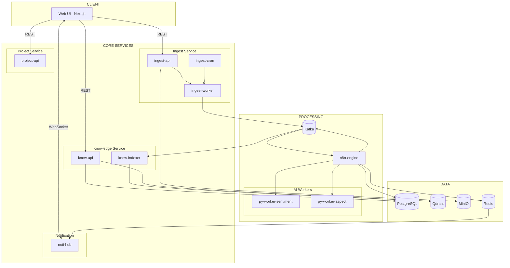
```mermaid
flowchart TD
    subgraph Client["CLIENT"]
        UI[Web UI - Next.js]
    end

    subgraph Core["CORE SERVICES"]
        subgraph Ingest["Ingest Service"]
            IA[ingest-api]
            IW[ingest-worker]
            IC[ingest-cron]
        end
        subgraph Project["Project Service"]
            PA[project-api]
        end
        subgraph Knowledge["Knowledge Service"]
            KA[know-api]
            KI[know-indexer]
        end
        subgraph Notification["Notification"]
            NH[noti-hub]
        end
    end

    subgraph Processing["PROCESSING"]
        Kafka[(Kafka)]
        n8n[n8n-engine]
        subgraph Workers["AI Workers"]
            WS[py-worker-sentiment]
            WA[py-worker-aspect]
        end
    end

    subgraph Data["DATA"]
        PG[(PostgreSQL)]
        Qdrant[(Qdrant)]
        MinIO[(MinIO)]
        Redis[(Redis)]
    end

    UI -->|REST| IA & PA & KA
    UI <-->|WebSocket| NH

    IA --> MinIO
    IA --> IW
    IC --> IW
    IW --> Kafka

    Kafka --> n8n
    n8n --> WS & WA
    n8n --> PG
    n8n --> Kafka

    Kafka --> KI
    KI --> Qdrant
    KA --> Qdrant & PG

    n8n --> Redis
    Redis --> NH
```

---

## 2. ĐỊNH NGHĨA CÁC ĐƠN VỊ XỬ LÝ

| Service          | Unit                  | Loại          | Nhiệm vụ                                    |
| ---------------- | --------------------- | ------------- | ------------------------------------------- |
| **Ingest**       | `ingest-api`          | HTTP Server   | Nhận file upload, config từ UI              |
|                  | `ingest-worker`       | Consumer      | Parse file, gọi External API, transform UAP |
|                  | `ingest-cron`         | Scheduler     | Trigger crawl định kỳ                       |
| **Analytics**    | `n8n-engine`          | Orchestrator  | Điều phối luồng, logic rẽ nhánh             |
|                  | `py-worker-sentiment` | Micro-service | Chạy PhoBERT Sentiment                      |
|                  | `py-worker-aspect`    | Micro-service | Chạy PhoBERT Aspect                         |
| **Knowledge**    | `know-api`            | HTTP Server   | Phục vụ Chat RAG                            |
|                  | `know-indexer`        | Consumer      | Embed → Upsert Qdrant                       |
| **Project**      | `project-api`         | HTTP Server   | Dashboard aggregation                       |
| **Notification** | `noti-hub`            | WebSocket     | Push realtime events                        |

---

## 3. FLOW 0: TẠO VÀ CẤU HÌNH PROJECT

> **UI Pattern:** Toàn bộ flow tạo project sử dụng **Popup/Modal Window** (Multi-step Wizard) thay vì redirect page. User có thể đóng popup bất kỳ lúc nào, project sẽ được lưu ở trạng thái DRAFT.
>
> **Wizard gồm tối đa 6 bước:** Tạo Project → Chọn Source → Analytics Config → Data Onboarding (nếu có Passive source) → Dry Run (nếu có Crawl source) → Activate. Các bước không liên quan sẽ được tự động skip.

> Demo UI: https://v0.app/chat/create-project-ui-g7gVReP0PoZ?ref=591ZDQ

### 3.1 Tạo Project (Bước 1)

> **Project = 1 thực thể cụ thể cần monitor** (sản phẩm, chiến dịch, dịch vụ...), không phải toàn bộ brand. Brand chỉ là metadata (text field) để nhóm các project liên quan khi hiển thị.

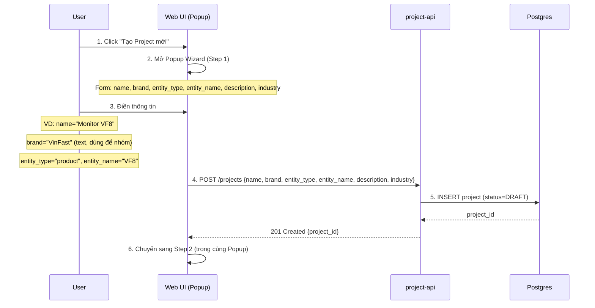
```mermaid
sequenceDiagram
    participant User as User
    participant UI as Web UI (Popup)
    participant API as project-api
    participant DB as Postgres

    User->>UI: 1. Click "Tạo Project mới"
    UI->>UI: 2. Mở Popup Wizard (Step 1)
    Note over UI: Form: name, brand, entity_type, entity_name, description, industry
    User->>UI: 3. Điền thông tin
    Note over User: VD: name="Monitor VF8"
    Note over User: brand="VinFast" (text, dùng để nhóm)
    Note over User: entity_type="product", entity_name="VF8"
    UI->>API: 4. POST /projects {name, brand, entity_type, entity_name, description, industry}
    API->>DB: 5. INSERT project (status=DRAFT)
    DB-->>API: project_id
    API-->>UI: 201 Created {project_id}
    UI->>UI: 6. Chuyển sang Step 2 (trong cùng Popup)
```

**Entity Type (gợi ý, không giới hạn):**

| entity_type  | Ví dụ                   | Mô tả                          |
| ------------ | ----------------------- | ------------------------------ |
| `product`    | VF8, iPhone 16          | Monitor 1 sản phẩm cụ thể      |
| `campaign`   | "VinFast Global Launch" | Monitor 1 chiến dịch marketing |
| `service`    | Hậu mãi, Bảo hành       | Monitor 1 dịch vụ              |
| `competitor` | Hyundai Ioniq 5         | Monitor đối thủ                |
| `topic`      | "EV Market Vietnam"     | Monitor 1 chủ đề chung         |

### 3.2 Chọn & Cấu hình Data Source (Bước 2)

> **Phân loại Source theo cơ chế xử lý:**
>
> - **Crawl Sources** (FB, TikTok, YouTube): Hệ thống chủ động crawl → cần **Dry Run** để test connection
> - **Passive Sources** (Webhook, File Upload): Data được push/upload vào → cần **Data Onboarding** (AI Schema Mapping) thay vì Dry Run

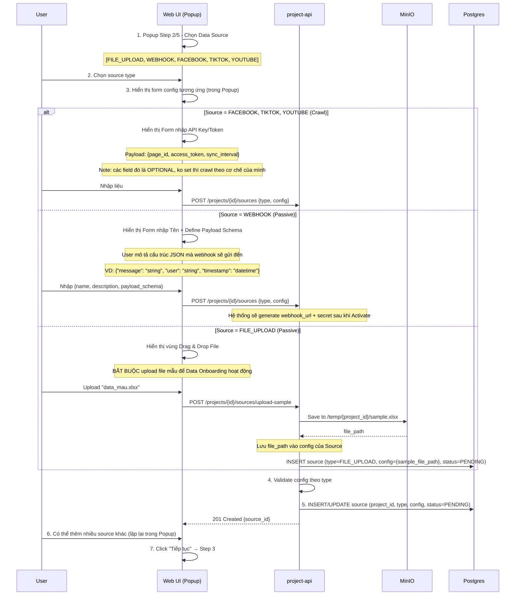
```mermaid
sequenceDiagram
    participant User as User
    participant UI as Web UI (Popup)
    participant API as project-api
    participant MinIO as MinIO
    participant DB as Postgres

    UI->>UI: 1. Popup Step 2/5 - Chọn Data Source
    Note over UI: [FILE_UPLOAD, WEBHOOK, FACEBOOK, TIKTOK, YOUTUBE]

    User->>UI: 2. Chọn source type
    UI->>UI: 3. Hiển thị form config tương ứng (trong Popup)

    alt Source = FACEBOOK, TIKTOK, YOUTUBE (Crawl)
        UI->>UI: Hiển thị Form nhập API Key/Token
        Note over UI: Payload: {page_id, access_token, sync_interval}
        Note over UI: Note: các field đó là OPTIONAL, ko set thì crawl theo cơ chế của mình
        User->>UI: Nhập liệu
        UI->>API: POST /projects/{id}/sources {type, config}
    else Source = WEBHOOK (Passive)
        UI->>UI: Hiển thị Form nhập Tên + Define Payload Schema
        Note over UI: User mô tả cấu trúc JSON mà webhook sẽ gửi đến
        Note over UI: VD: {"message": "string", "user": "string", "timestamp": "datetime"}
        User->>UI: Nhập {name, description, payload_schema}
        UI->>API: POST /projects/{id}/sources {type, config}
        Note over API: Hệ thống sẽ generate webhook_url + secret sau khi Activate
    else Source = FILE_UPLOAD (Passive)
        UI->>UI: Hiển thị vùng Drag & Drop File
        Note over UI: BẮT BUỘC upload file mẫu để Data Onboarding hoạt động
        User->>UI: Upload "data_mau.xlsx"
        UI->>API: POST /projects/{id}/sources/upload-sample
        API->>MinIO: Save to /temp/{project_id}/sample.xlsx
        MinIO-->>API: file_path
        Note over API: Lưu file_path vào config của Source
        API->>DB: INSERT source (type=FILE_UPLOAD, config={sample_file_path}, status=PENDING)
    end

    API->>API: 4. Validate config theo type
    API->>DB: 5. INSERT/UPDATE source (project_id, type, config, status=PENDING)
    API-->>UI: 201 Created {source_id}

    User->>UI: 6. Có thể thêm nhiều source khác (lặp lại trong Popup)
    UI->>UI: 7. Click "Tiếp tục" → Step 3
```

> **Lưu ý:**
>
> - **FILE_UPLOAD**: User BẮT BUỘC upload file mẫu ngay tại bước này để Data Onboarding (AI Schema Mapping) ở Bước 3.4 có dữ liệu xử lý. File lưu tạm vào MinIO `/temp/{project_id}/`.
> - **WEBHOOK**: User BẮT BUỘC define payload schema để AI có thể suggest mapping sang UAP.

### 3.3 Cấu hình Analytics (Bước 3 - Optional)

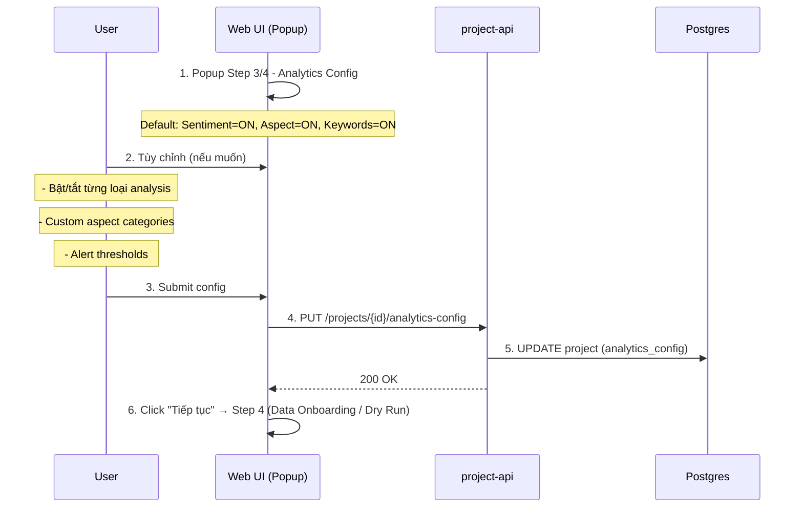
```mermaid
sequenceDiagram
    participant User as User
    participant UI as Web UI (Popup)
    participant API as project-api
    participant DB as Postgres

    UI->>UI: 1. Popup Step 3/4 - Analytics Config
    Note over UI: Default: Sentiment=ON, Aspect=ON, Keywords=ON

    User->>UI: 2. Tùy chỉnh (nếu muốn)
    Note over User: - Bật/tắt từng loại analysis
    Note over User: - Custom aspect categories
    Note over User: - Alert thresholds

    User->>UI: 3. Submit config
    UI->>API: 4. PUT /projects/{id}/analytics-config
    API->>DB: 5. UPDATE project (analytics_config)
    API-->>UI: 200 OK
    UI->>UI: 6. Click "Tiếp tục" → Step 4 (Data Onboarding / Dry Run)
```

### 3.4 DATA ONBOARDING - AI Schema Mapping (Bước 4)

> **Áp dụng cho:** FILE_UPLOAD và WEBHOOK. Mục đích: AI gợi ý cách map dữ liệu đầu vào sang định dạng UAP chuẩn, User review và confirm.
>
> **Bước này chỉ hiển thị khi project có ít nhất 1 source loại FILE_UPLOAD hoặc WEBHOOK.** Nếu project chỉ có Crawl sources (FB, TikTok, YouTube), wizard sẽ skip thẳng sang Bước 3.5 (Dry Run).

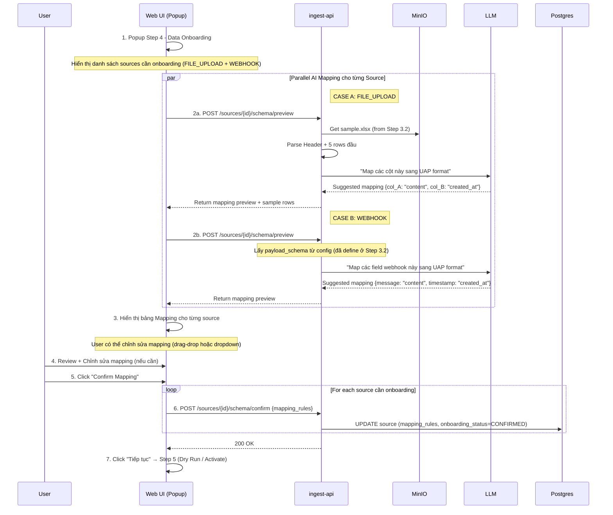
```mermaid
sequenceDiagram
    participant User as User
    participant UI as Web UI (Popup)
    participant API as ingest-api
    participant MinIO as MinIO
    participant LLM as LLM
    participant DB as Postgres

    UI->>UI: 1. Popup Step 4 - Data Onboarding
    Note over UI: Hiển thị danh sách sources cần onboarding (FILE_UPLOAD + WEBHOOK)

    par Parallel AI Mapping cho từng Source
        Note right of API: CASE A: FILE_UPLOAD
        UI->>API: 2a. POST /sources/{id}/schema/preview
        API->>MinIO: Get sample.xlsx (from Step 3.2)
        API->>API: Parse Header + 5 rows đầu
        API->>LLM: "Map các cột này sang UAP format"
        LLM-->>API: Suggested mapping {col_A: "content", col_B: "created_at"}
        API-->>UI: Return mapping preview + sample rows

        Note right of API: CASE B: WEBHOOK
        UI->>API: 2b. POST /sources/{id}/schema/preview
        Note over API: Lấy payload_schema từ config (đã define ở Step 3.2)
        API->>LLM: "Map các field webhook này sang UAP format"
        LLM-->>API: Suggested mapping {message: "content", timestamp: "created_at"}
        API-->>UI: Return mapping preview
    end

    UI->>UI: 3. Hiển thị bảng Mapping cho từng source
    Note over UI: User có thể chỉnh sửa mapping (drag-drop hoặc dropdown)

    User->>UI: 4. Review + Chỉnh sửa mapping (nếu cần)
    User->>UI: 5. Click "Confirm Mapping"

    loop For each source cần onboarding
        UI->>API: 6. POST /sources/{id}/schema/confirm {mapping_rules}
        API->>DB: UPDATE source (mapping_rules, onboarding_status=CONFIRMED)
    end

    API-->>UI: 200 OK
    UI->>UI: 7. Click "Tiếp tục" → Step 5 (Dry Run / Activate)
```

**Data Onboarding UX theo Source Type:**

| Source Type     | Input cho AI                  | AI Output                  | UI Display                                                                             |
| --------------- | ----------------------------- | -------------------------- | -------------------------------------------------------------------------------------- |
| **FILE_UPLOAD** | Header + 5 rows từ file mẫu   | Mapping cột → UAP fields   | Bảng mapping: Cột A → `content`, Cột B → `created_at`. Kèm preview 5 rows đã transform |
| **WEBHOOK**     | Payload schema do User define | Mapping field → UAP fields | Bảng mapping: `message` → `content`, `timestamp` → `created_at`. Kèm ví dụ transform   |

**Data Onboarding Output:**

```json
{
  "source_id": "src_file_01",
  "type": "FILE_UPLOAD",
  "status": "MAPPING_READY",
  "suggested_mapping": {
    "column_A": "content",
    "column_B": "created_at",
    "column_C": "author"
  },
  "sample_rows": [
    { "content": "Sản phẩm ok", "created_at": "2026-02-01", "author": "User A" }
  ]
}
```

```json
{
  "source_id": "src_webhook_01",
  "type": "WEBHOOK",
  "status": "MAPPING_READY",
  "input_schema": {
    "message": "string",
    "user": "string",
    "timestamp": "datetime"
  },
  "suggested_mapping": {
    "message": "content",
    "user": "metadata.author",
    "timestamp": "content_created_at"
  },
  "sample_transform": {
    "input": {
      "message": "Sản phẩm tốt",
      "user": "Nguyễn A",
      "timestamp": "2026-02-07T10:00:00Z"
    },
    "output": {
      "content": "Sản phẩm tốt",
      "content_created_at": "2026-02-07T10:00:00Z",
      "metadata": { "author": "Nguyễn A" }
    }
  }
}
```

> **Lưu ý:** Bước này là **SYNCHRONOUS** (API gọi LLM trực tiếp, trả kết quả ngay). Khác với Dry Run (async qua Kafka). Lý do: mapping cần user interaction ngay lập tức, không phù hợp với async processing.

### 3.5 DRY RUN - Chạy thử Crawl Sources (Bước 5)

> **Chỉ áp dụng cho Crawl Sources:** FACEBOOK, TIKTOK, YOUTUBE. Mục đích: Test connection + fetch sample data để User verify trước khi Activate.
>
> **Bước này chỉ hiển thị khi project có ít nhất 1 Crawl source.** Nếu project chỉ có FILE_UPLOAD/WEBHOOK, wizard sẽ skip thẳng sang Activate.

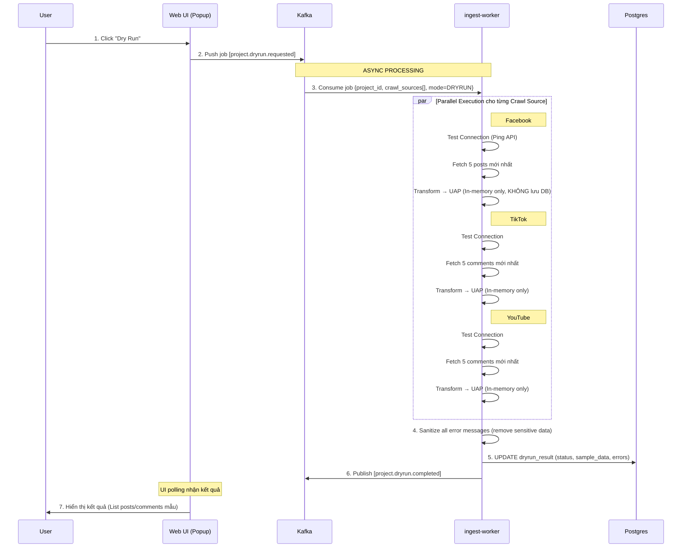
```mermaid
sequenceDiagram
    participant User as User
    participant UI as Web UI (Popup)
    participant Kafka as Kafka
    participant Worker as ingest-worker
    participant DB as Postgres

    User->>UI: 1. Click "Dry Run"
    UI->>Kafka: 2. Push job [project.dryrun.requested]

    Note over Kafka, Worker: ASYNC PROCESSING
    Kafka->>Worker: 3. Consume job {project_id, crawl_sources[], mode=DRYRUN}

    par Parallel Execution cho từng Crawl Source
        Note right of Worker: Facebook
        Worker->>Worker: Test Connection (Ping API)
        Worker->>Worker: Fetch 5 posts mới nhất
        Worker->>Worker: Transform → UAP (In-memory only, KHÔNG lưu DB)

        Note right of Worker: TikTok
        Worker->>Worker: Test Connection
        Worker->>Worker: Fetch 5 comments mới nhất
        Worker->>Worker: Transform → UAP (In-memory only)

        Note right of Worker: YouTube
        Worker->>Worker: Test Connection
        Worker->>Worker: Fetch 5 comments mới nhất
        Worker->>Worker: Transform → UAP (In-memory only)
    end

    Worker->>Worker: 4. Sanitize all error messages (remove sensitive data)
    Worker->>DB: 5. UPDATE dryrun_result (status, sample_data, errors)
    Worker->>Kafka: 6. Publish [project.dryrun.completed]

    Note over UI: UI polling nhận kết quả
    UI->>User: 7. Hiển thị kết quả (List posts/comments mẫu)
```

**Dry Run Output:**

```json
{
  "status": "SUCCESS | PARTIAL | FAILED",
  "sources": [
    {
      "source_id": "src_facebook_01",
      "type": "FACEBOOK",
      "status": "OK",
      "sample_count": 5,
      "sample_data": [
        { "content": "Sản phẩm tốt...", "created_at": "2026-02-06T10:00:00Z" }
      ]
    },
    {
      "source_id": "src_tiktok_01",
      "type": "TIKTOK",
      "status": "OK",
      "sample_count": 5,
      "sample_data": [
        { "content": "Video hay quá...", "created_at": "2026-02-05T15:00:00Z" }
      ]
    },
    {
      "source_id": "src_youtube_01",
      "type": "YOUTUBE",
      "status": "ERROR",
      "error": "Invalid API key"
    }
  ],
  "warnings": ["Facebook token sẽ hết hạn trong 7 ngày"]
}
```

> **⚠️ Security Note:** Tất cả error messages phải được sanitize trước khi trả về UI. Worker cần filter các thông tin nhạy cảm như token, API key từ raw error của third-party APIs.

### 3.6 ACTIVATE PROJECT (Bước 6 - Final)

> **Điều kiện Activate:**
>
> - Nếu có Crawl sources → Dry Run phải `SUCCESS` hoặc `WARNING`
> - Nếu có Passive sources (FILE_UPLOAD/WEBHOOK) → Data Onboarding phải `CONFIRMED`
> - Nếu project chỉ có Passive sources (không có Crawl) → Chỉ cần Onboarding CONFIRMED là đủ

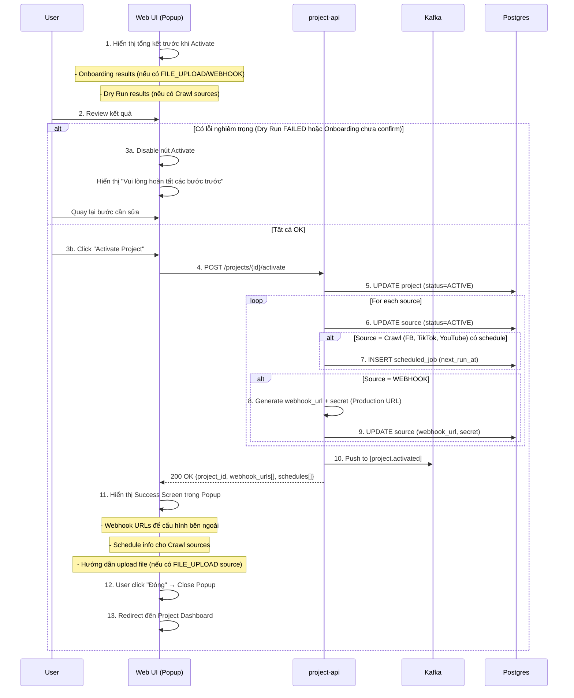
```mermaid
sequenceDiagram
    participant User as User
    participant UI as Web UI (Popup)
    participant API as project-api
    participant Kafka as Kafka
    participant DB as Postgres

    UI->>UI: 1. Hiển thị tổng kết trước khi Activate
    Note over UI: - Onboarding results (nếu có FILE_UPLOAD/WEBHOOK)
    Note over UI: - Dry Run results (nếu có Crawl sources)
    User->>UI: 2. Review kết quả

    alt Có lỗi nghiêm trọng (Dry Run FAILED hoặc Onboarding chưa confirm)
        UI->>UI: 3a. Disable nút Activate
        UI->>UI: Hiển thị "Vui lòng hoàn tất các bước trước"
        User->>UI: Quay lại bước cần sửa
    else Tất cả OK
        User->>UI: 3b. Click "Activate Project"
        UI->>API: 4. POST /projects/{id}/activate
        API->>DB: 5. UPDATE project (status=ACTIVE)

        loop For each source
            API->>DB: 6. UPDATE source (status=ACTIVE)

            alt Source = Crawl (FB, TikTok, YouTube) có schedule
                API->>DB: 7. INSERT scheduled_job (next_run_at)
            end

            alt Source = WEBHOOK
                API->>API: 8. Generate webhook_url + secret (Production URL)
                API->>DB: 9. UPDATE source (webhook_url, secret)
            end
        end

        API->>Kafka: 10. Push to [project.activated]
        API-->>UI: 200 OK {project_id, webhook_urls[], schedules[]}
        UI->>UI: 11. Hiển thị Success Screen trong Popup
        Note over UI: - Webhook URLs để cấu hình bên ngoài
        Note over UI: - Schedule info cho Crawl sources
        Note over UI: - Hướng dẫn upload file (nếu có FILE_UPLOAD source)
        UI->>UI: 12. User click "Đóng" → Close Popup
        UI->>UI: 13. Redirect đến Project Dashboard
    end
```

### 3.7 Tổng quan State Machine của Project

> **Rule quan trọng:** Nút "Activate Project" ở Frontend sẽ bị **Disabled** cho đến khi:
>
> - Crawl sources: `dryrun_results.status == 'SUCCESS'` hoặc `WARNING`
> - Passive sources: `onboarding_status == 'CONFIRMED'`

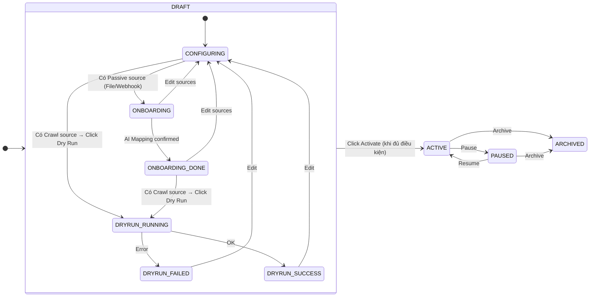
```mermaid
stateDiagram-v2
    direction LR
    [*] --> DRAFT

    state DRAFT {
        [*] --> CONFIGURING
        CONFIGURING --> ONBOARDING: Có Passive source (File/Webhook)
        ONBOARDING --> ONBOARDING_DONE: AI Mapping confirmed
        ONBOARDING --> CONFIGURING: Edit sources
        ONBOARDING_DONE --> CONFIGURING: Edit sources
        CONFIGURING --> DRYRUN_RUNNING: Có Crawl source → Click Dry Run
        ONBOARDING_DONE --> DRYRUN_RUNNING: Có Crawl source → Click Dry Run
        DRYRUN_RUNNING --> DRYRUN_FAILED: Error
        DRYRUN_RUNNING --> DRYRUN_SUCCESS: OK
        DRYRUN_FAILED --> CONFIGURING: Edit
        DRYRUN_SUCCESS --> CONFIGURING: Edit
    }

    DRAFT --> ACTIVE: Click Activate (khi đủ điều kiện)
    ACTIVE --> PAUSED: Pause
    PAUSED --> ACTIVE: Resume
    ACTIVE --> ARCHIVED: Archive
    PAUSED --> ARCHIVED: Archive
```

**Điều kiện Activate theo tổ hợp Source:**

| Tổ hợp Sources                     | Điều kiện Activate                                      |
| ---------------------------------- | ------------------------------------------------------- |
| Chỉ có Crawl (FB, TikTok, YouTube) | Dry Run = SUCCESS/WARNING                               |
| Chỉ có Passive (File, Webhook)     | Onboarding = CONFIRMED                                  |
| Cả Crawl + Passive                 | Onboarding = CONFIRMED **VÀ** Dry Run = SUCCESS/WARNING |

**Chi tiết config_status (cho Backend):**

| Status            | Mô tả                       | UI Action                                          |
| ----------------- | --------------------------- | -------------------------------------------------- |
| `CONFIGURING`     | Đang cấu hình source        | Cho phép Edit                                      |
| `ONBOARDING`      | Đang chờ AI Mapping confirm | Hiển thị bảng mapping                              |
| `ONBOARDING_DONE` | Mapping đã confirmed        | Enable Dry Run (nếu có Crawl) hoặc Enable Activate |
| `DRYRUN_RUNNING`  | Đang chạy Dry Run           | Disable tất cả nút                                 |
| `DRYRUN_SUCCESS`  | Dry Run thành công          | Enable nút Activate                                |
| `DRYRUN_FAILED`   | Dry Run thất bại            | Disable Activate, Enable Edit                      |

### 3.8 Database Schema bổ sung cho Flow 0

```sql
-- Thêm vào bảng business.projects
ALTER TABLE business.projects
ADD COLUMN brand VARCHAR(100),                 -- Tên brand (text, dùng để nhóm hiển thị)
ADD COLUMN entity_type VARCHAR(50),            -- product, campaign, service, competitor, topic
ADD COLUMN entity_name VARCHAR(200),           -- Tên thực thể cụ thể (VD: "VF8")
ADD COLUMN config_status VARCHAR(20) DEFAULT 'DRAFT';
-- Values: DRAFT, CONFIGURING, ONBOARDING, ONBOARDING_DONE,
--         DRYRUN_RUNNING, DRYRUN_SUCCESS, DRYRUN_FAILED, ACTIVE, ERROR

-- Thêm vào bảng ingest.data_sources
ALTER TABLE ingest.data_sources
ADD COLUMN last_check_at TIMESTAMPTZ,          -- Thời điểm check kết nối cuối
ADD COLUMN last_error_msg TEXT,                -- Lỗi check cuối cùng (đã sanitize)
ADD COLUMN credential_hash VARCHAR(255),       -- Hash để detect thay đổi config
ADD COLUMN mapping_rules JSONB,                -- Schema mapping rules (cho FILE_UPLOAD + WEBHOOK)
ADD COLUMN onboarding_status VARCHAR(20);      -- PENDING, MAPPING_READY, CONFIRMED
-- onboarding_status chỉ dùng cho FILE_UPLOAD và WEBHOOK

-- Bảng lưu kết quả Dry Run (chỉ cho Crawl sources)
CREATE TABLE ingest.dryrun_results (
    id UUID PRIMARY KEY DEFAULT gen_random_uuid(),
    project_id UUID NOT NULL REFERENCES business.projects(id),
    status VARCHAR(20) NOT NULL,           -- SUCCESS, PARTIAL, FAILED
    result_data JSONB NOT NULL,            -- Sample data + errors per source
    created_at TIMESTAMPTZ DEFAULT NOW(),
    expires_at TIMESTAMPTZ                 -- Auto cleanup sau 24h
);
```

### 3.9 Source Type & Config Schema

| Source Type   | Loại    | Required Config                        | Optional Config                      | Onboarding        | Trigger        |
| ------------- | ------- | -------------------------------------- | ------------------------------------ | ----------------- | -------------- |
| `FILE_UPLOAD` | Passive | sample_file_path (upload tại Step 3.2) | -                                    | AI Schema Mapping | Manual upload  |
| `WEBHOOK`     | Passive | name, payload_schema                   | description                          | AI Schema Mapping | External push  |
| `FACEBOOK`    | Crawl   | -                                      | page_id, access_token, sync_interval | Dry Run           | Scheduled poll |
| `TIKTOK`      | Crawl   | -                                      | video_url[]                          | Dry Run           | One-time crawl |
| `YOUTUBE`     | Crawl   | -                                      | channel_id, api_key                  | Dry Run           | Scheduled poll |

**Giải thích:**

- **Crawl Sources** (FB, TikTok, YouTube): Hệ thống chủ động crawl data → cần Dry Run để test connection + fetch sample
- **Passive Sources** (File Upload, Webhook): Data được push/upload vào → cần Data Onboarding (AI Schema Mapping) để map sang UAP
- **DRAFT**: Project đang được cấu hình, chưa hoạt động
- **ACTIVE**: Project đang chạy, các scheduled job được kích hoạt

### 3.10 Tổng quan Wizard Steps theo tổ hợp Source

| Tổ hợp Sources  | Step 1      | Step 2      | Step 3    | Step 4     | Step 5   | Step 6   |
| --------------- | ----------- | ----------- | --------- | ---------- | -------- | -------- |
| Chỉ Crawl       | Tạo Project | Chọn Source | Analytics | _(skip)_   | Dry Run  | Activate |
| Chỉ Passive     | Tạo Project | Chọn Source | Analytics | Onboarding | _(skip)_ | Activate |
| Crawl + Passive | Tạo Project | Chọn Source | Analytics | Onboarding | Dry Run  | Activate |

---

## 4. FLOW 1: FILE UPLOAD

**User → API → Storage → Queue → Worker → Queue**

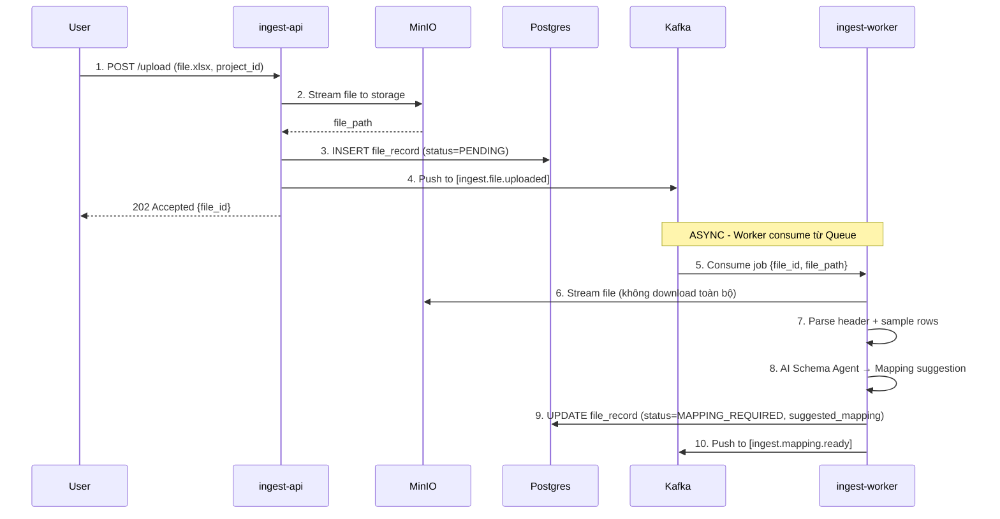
```mermaid
sequenceDiagram
    participant User as User
    participant API as ingest-api
    participant MinIO as MinIO
    participant DB as Postgres
    participant Kafka as Kafka
    participant Worker as ingest-worker

    User->>API: 1. POST /upload (file.xlsx, project_id)
    API->>MinIO: 2. Stream file to storage
    MinIO-->>API: file_path
    API->>DB: 3. INSERT file_record (status=PENDING)
    API->>Kafka: 4. Push to [ingest.file.uploaded]
    API-->>User: 202 Accepted {file_id}

    Note over Kafka, Worker: ASYNC - Worker consume từ Queue
    Kafka->>Worker: 5. Consume job {file_id, file_path}
    Worker->>MinIO: 6. Stream file (không download toàn bộ)
    Worker->>Worker: 7. Parse header + sample rows
    Worker->>Worker: 8. AI Schema Agent → Mapping suggestion
    Worker->>DB: 9. UPDATE file_record (status=MAPPING_REQUIRED, suggested_mapping)
    Worker->>Kafka: 10. Push to [ingest.mapping.ready]
```

**Lưu ý quan trọng:**

- Bước 4: API đẩy job vào Kafka, KHÔNG gọi trực tiếp Worker
- Bước 6: Worker STREAM file từ MinIO, không download toàn bộ vào memory
- Flow này dừng ở đây, chờ User confirm mapping (xem Flow 1b)

---

## 5. FLOW 1b: CONFIRM MAPPING & PROCESS

**User confirm → Queue → Worker → UAP**

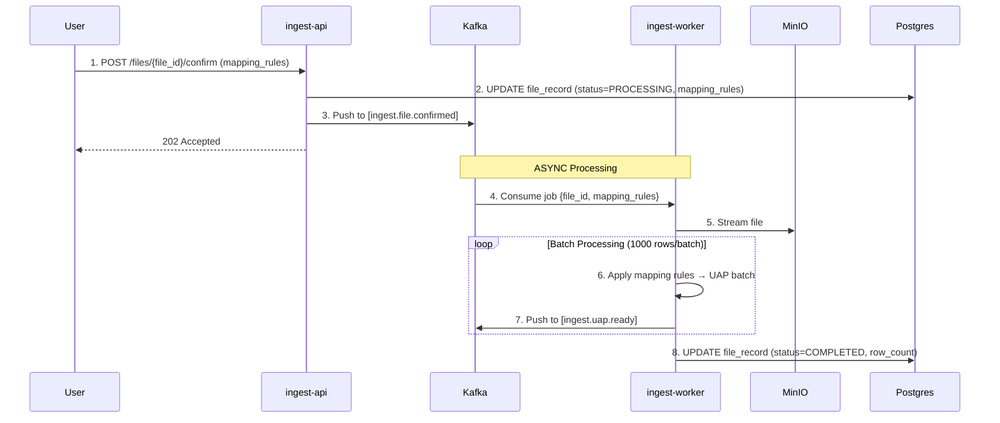
```mermaid
sequenceDiagram
    participant User as User
    participant API as ingest-api
    participant Kafka as Kafka
    participant Worker as ingest-worker
    participant MinIO as MinIO
    participant DB as Postgres

    User->>API: 1. POST /files/{file_id}/confirm (mapping_rules)
    API->>DB: 2. UPDATE file_record (status=PROCESSING, mapping_rules)
    API->>Kafka: 3. Push to [ingest.file.confirmed]
    API-->>User: 202 Accepted

    Note over Kafka, Worker: ASYNC Processing
    Kafka->>Worker: 4. Consume job {file_id, mapping_rules}
    Worker->>MinIO: 5. Stream file

    loop Batch Processing (1000 rows/batch)
        Worker->>Worker: 6. Apply mapping rules → UAP batch
        Worker->>Kafka: 7. Push to [ingest.uap.ready]
    end

    Worker->>DB: 8. UPDATE file_record (status=COMPLETED, row_count)
```

**Phân công:**

- `ingest-api`: Gác cổng, validate, đẩy queue (nhanh)
- `ingest-worker`: Cửu vạn, xử lý nặng, LUÔN nhận việc từ Queue

---

## 6. FLOW 2: EXTERNAL DATA INGESTION (Pub/Sub Pattern)

> **Thiết kế mới:** External Service push data vào hệ thống qua Webhook, không phải hệ thống đi pull.

### 6.1 Đăng ký Webhook Endpoint

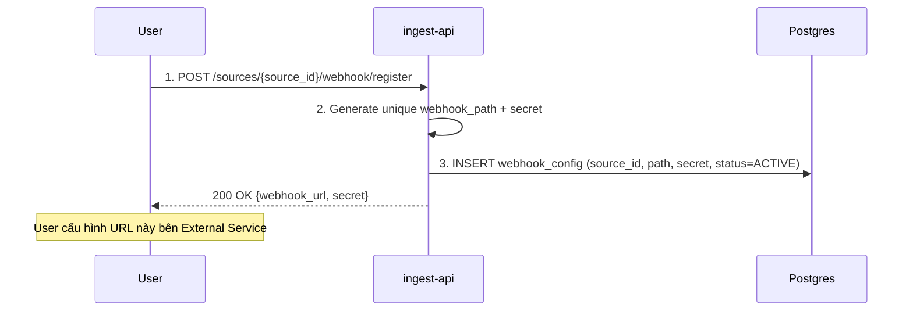
```mermaid
sequenceDiagram
    participant User as User
    participant API as ingest-api
    participant DB as Postgres

    User->>API: 1. POST /sources/{source_id}/webhook/register
    API->>API: 2. Generate unique webhook_path + secret
    API->>DB: 3. INSERT webhook_config (source_id, path, secret, status=ACTIVE)
    API-->>User: 200 OK {webhook_url, secret}

    Note over User: User cấu hình URL này bên External Service
```

### 6.2 External Service Push Data (Pub)

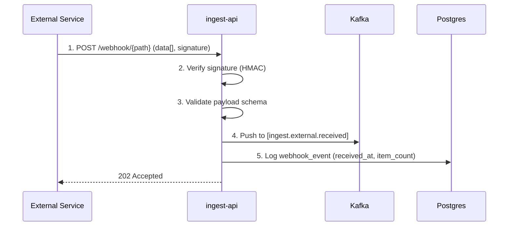
```mermaid
sequenceDiagram
    participant Ext as External Service
    participant API as ingest-api
    participant Kafka as Kafka
    participant DB as Postgres

    Ext->>API: 1. POST /webhook/{path} (data[], signature)
    API->>API: 2. Verify signature (HMAC)
    API->>API: 3. Validate payload schema
    API->>Kafka: 4. Push to [ingest.external.received]
    API->>DB: 5. Log webhook_event (received_at, item_count)
    API-->>Ext: 202 Accepted
```

### 6.3 Worker Subscribe & Process

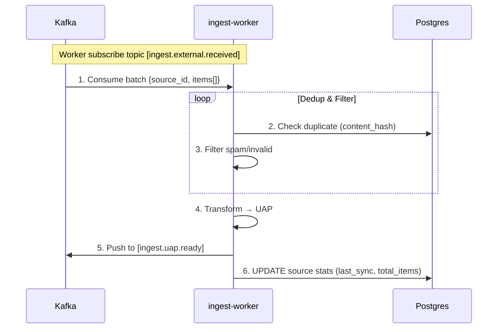
```mermaid
sequenceDiagram
    participant Kafka as Kafka
    participant Worker as ingest-worker
    participant DB as Postgres

    Note over Kafka, Worker: Worker subscribe topic [ingest.external.received]
    Kafka->>Worker: 1. Consume batch {source_id, items[]}

    loop Dedup & Filter
        Worker->>DB: 2. Check duplicate (content_hash)
        Worker->>Worker: 3. Filter spam/invalid
    end

    Worker->>Worker: 4. Transform → UAP
    Worker->>Kafka: 5. Push to [ingest.uap.ready]
    Worker->>DB: 6. UPDATE source stats (last_sync, total_items)
```

### 6.4 Unsubscribe (Khi Project kết thúc)

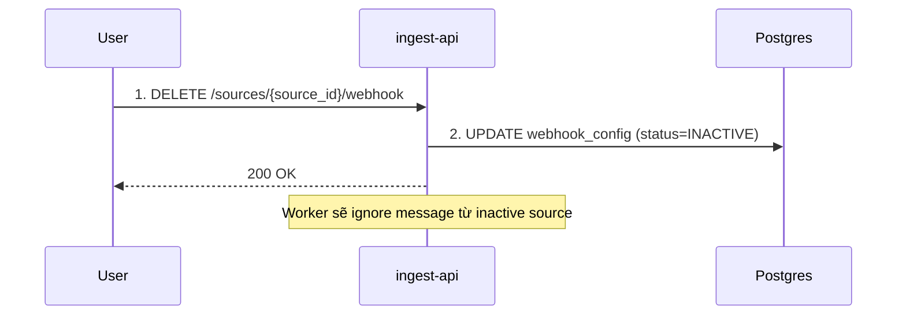
```mermaid
sequenceDiagram
    participant User as User
    participant API as ingest-api
    participant DB as Postgres

    User->>API: 1. DELETE /sources/{source_id}/webhook
    API->>DB: 2. UPDATE webhook_config (status=INACTIVE)
    API-->>User: 200 OK

    Note over API: Worker sẽ ignore message từ inactive source
```

**Phân công:**

- `ingest-api`: Nhận webhook, verify, đẩy queue
- `ingest-worker`: Subscribe queue, dedup, transform
- **External Service**: Chủ động push khi có data mới

---

## 7. FLOW 2b: SCHEDULED CRAWL (Fallback cho API không hỗ trợ Webhook)

> **Chỉ dùng khi:** External API không hỗ trợ webhook, buộc phải poll.

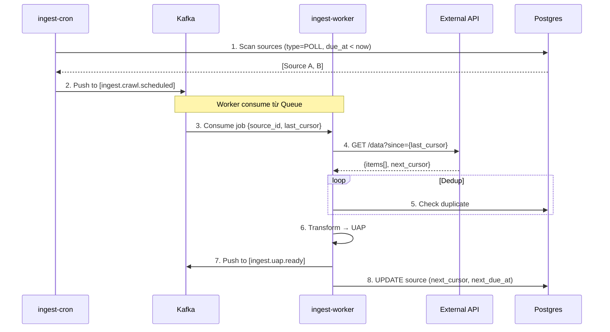
```mermaid
sequenceDiagram
    participant Cron as ingest-cron
    participant Kafka as Kafka
    participant Worker as ingest-worker
    participant ExtAPI as External API
    participant DB as Postgres

    Cron->>DB: 1. Scan sources (type=POLL, due_at < now)
    DB-->>Cron: [Source A, B]
    Cron->>Kafka: 2. Push to [ingest.crawl.scheduled]

    Note over Kafka, Worker: Worker consume từ Queue
    Kafka->>Worker: 3. Consume job {source_id, last_cursor}
    Worker->>ExtAPI: 4. GET /data?since={last_cursor}
    ExtAPI-->>Worker: {items[], next_cursor}

    loop Dedup
        Worker->>DB: 5. Check duplicate
    end

    Worker->>Worker: 6. Transform → UAP
    Worker->>Kafka: 7. Push to [ingest.uap.ready]
    Worker->>DB: 8. UPDATE source (next_cursor, next_due_at)
```

**Phân công:**

- `ingest-cron`: Đồng hồ báo thức, đẩy job vào queue (KHÔNG gọi trực tiếp worker)
- `ingest-worker`: Consume queue, gọi external API, transform

---

## 8. FLOW 3: ANALYTICS PIPELINE

**n8n điều phối → Python Workers xử lý**

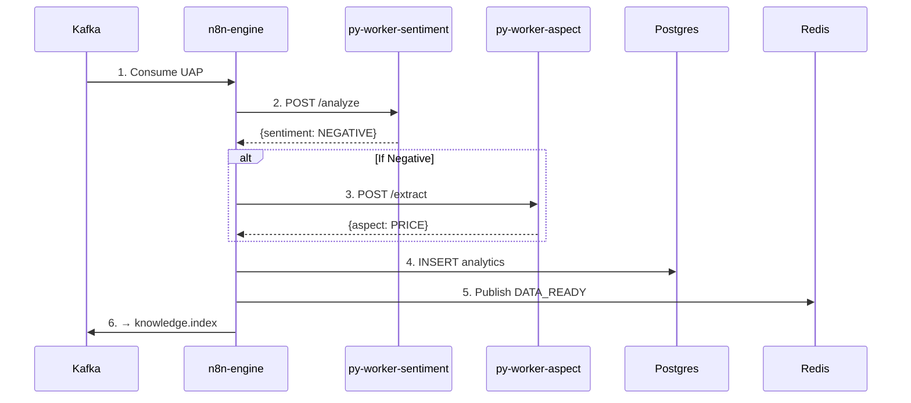
```mermaid
sequenceDiagram
    participant Kafka as Kafka
    participant n8n as n8n-engine
    participant Sent as py-worker-sentiment
    participant Asp as py-worker-aspect
    participant DB as Postgres
    participant Redis as Redis

    Kafka->>n8n: 1. Consume UAP

    n8n->>Sent: 2. POST /analyze
    Sent-->>n8n: {sentiment: NEGATIVE}

    alt If Negative
        n8n->>Asp: 3. POST /extract
        Asp-->>n8n: {aspect: PRICE}
    end

    n8n->>DB: 4. INSERT analytics
    n8n->>Redis: 5. Publish DATA_READY
    n8n->>Kafka: 6. → knowledge.index
```

**Phân công:**

- `n8n`: Nhạc trưởng (không chạy AI)
- `py-worker-*`: Thợ chuyên môn (scale độc lập)

---

## 9. FLOW 4: KNOWLEDGE (RAG)

### 6.1 Indexing (Async)

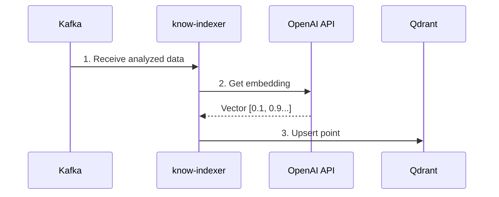
```mermaid
sequenceDiagram
    participant Kafka as Kafka
    participant Indexer as know-indexer
    participant OpenAI as OpenAI API
    participant Qdrant as Qdrant

    Kafka->>Indexer: 1. Receive analyzed data
    Indexer->>OpenAI: 2. Get embedding
    OpenAI-->>Indexer: Vector [0.1, 0.9...]
    Indexer->>Qdrant: 3. Upsert point
```

### 6.2 Chat Query (Sync)

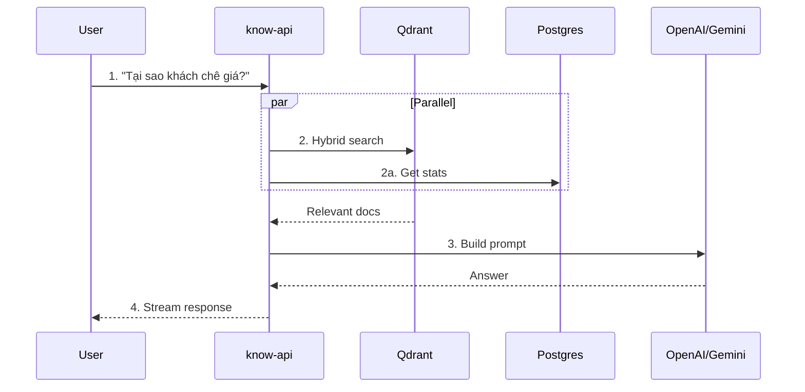
```mermaid
sequenceDiagram
    participant User as User
    participant API as know-api
    participant Qdrant as Qdrant
    participant DB as Postgres
    participant LLM as OpenAI/Gemini

    User->>API: 1. "Tại sao khách chê giá?"

    par Parallel
        API->>Qdrant: 2. Hybrid search
        API->>DB: 2a. Get stats
    end

    Qdrant-->>API: Relevant docs
    API->>LLM: 3. Build prompt
    LLM-->>API: Answer
    API-->>User: 4. Stream response
```

---

## 10. FLOW 5: REAL-TIME UPDATE

**Redis Pub/Sub → WebSocket → Browser**

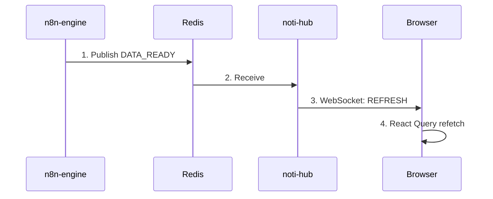
```mermaid
sequenceDiagram
    participant n8n as n8n-engine
    participant Redis as Redis
    participant Hub as noti-hub
    participant Browser as Browser

    n8n->>Redis: 1. Publish DATA_READY
    Redis->>Hub: 2. Receive
    Hub->>Browser: 3. WebSocket: REFRESH
    Browser->>Browser: 4. React Query refetch
```

---

## 11. KAFKA TOPICS

| Topic                      | Producer             | Consumer      |
| -------------------------- | -------------------- | ------------- |
| `ingest.file.uploaded`     | ingest-api           | ingest-worker |
| `ingest.file.confirmed`    | ingest-api           | ingest-worker |
| `ingest.external.received` | ingest-api (webhook) | ingest-worker |
| `ingest.crawl.scheduled`   | ingest-cron          | ingest-worker |
| `ingest.uap.ready`         | ingest-worker        | n8n           |
| `analytics.completed`      | n8n                  | noti-hub      |
| `knowledge.index`          | n8n                  | know-indexer  |
| `notification.alert`       | Any                  | noti-hub      |

---

## 12. UAP FORMAT

```json
{
  "id": "uuid-v4",
  "project_id": "proj_xxx",
  "source_id": "src_xxx",
  "content": "Xe đi êm nhưng pin sụt nhanh",
  "content_created_at": "2026-02-06T01:00:00Z",
  "ingested_at": "2026-02-07T10:00:00Z",
  "platform": "internal_excel",
  "metadata": { "author": "Nguyễn A", "rating": 4 }
}
```

---

## 13. TÓM TẮT PHÂN CÔNG

| Loại Unit        | Vai trò                          | Scale Strategy        |
| ---------------- | -------------------------------- | --------------------- |
| **API**          | Nhận request, trả response nhanh | Horizontal (replicas) |
| **Worker**       | Xử lý nặng (parse, crawl, embed) | KEDA (auto-scale)     |
| **Scheduler**    | Trigger định kỳ                  | Single instance       |
| **Orchestrator** | Điều phối luồng                  | n8n cluster           |

---

## 14. ĐÁNH GIÁ VÀ TỐI ƯU HÓA (AUDIT & OPTIMIZATION)

> **Ghi chú:** Phần này đánh giá các lỗ hổng trong thiết kế và đề xuất giải pháp tối ưu.

### 🔴 VẤN ĐỀ 1: LỖI LOGIC TRONG FLOW "FILE UPLOAD" (NGHIÊM TRỌNG NHẤT)

**Hiện trạng:**
Worker thực hiện "AI Schema Agent" → "User Confirm".

**Tại sao sai?**

- Worker là tiến trình chạy ngầm (Background Job). Nó không có giao diện (UI).
- Nó không thể "dừng lại" để chờ User bấm nút "Confirm" trên trình duyệt được.
- Nếu đẩy việc "Map cột Excel" xuống Worker, thì khi Worker chạy đến đó, nó sẽ tắc tịt vì không ai trả lời nó cả.

**✅ Giải pháp Tối ưu: Tách tầng (Split Layer)**

Đưa việc "Map Schema" lên tầng API (Synchronous), chỉ đẩy việc "Transform & Save" xuống Worker (Asynchronous).

**Luồng mới:**

1. **API:** Nhận file → Đọc Header + 5 dòng đầu → Gọi LLM đoán cột → Trả về JSON Mapping cho Frontend.
2. **Frontend:** User sửa/chốt Mapping → Gửi `confirm_signal` (kèm `file_id` + `mapping_rule`) về API.
3. **API:** Lúc này mới đẩy Job (kèm Mapping Rule) vào Kafka/Queue cho Worker.
4. **Worker:** Nhận Job từ Queue → Áp dụng Rule để convert 1 triệu dòng còn lại → UAP.

---

### 🔴 VẤN ĐỀ 2: "CÁI BẪY" TRUNG GIAN CỦA n8n (HIỆU NĂNG)

**Hiện trạng:**

```
Kafka → n8n → Python Worker → n8n → Postgres
```

**Tại sao chưa tối ưu?**

1. **Network Ping-pong:** Dữ liệu chạy vòng vèo quá nhiều.
   - Kafka gửi data cho n8n (Node.js).
   - n8n lại đóng gói gửi HTTP sang Python.
   - Python trả kết quả về n8n.
   - n8n lại mở kết nối ghi xuống DB.

2. **Serialization Overhead:** Mỗi lần chuyển qua lại là một lần JSON Serialize/Deserialize. Với hàng triệu record, đây là sự lãng phí CPU khổng lồ.

3. **n8n là nút thắt cổ chai:** n8n xử lý luồng rất hay, nhưng xử lý Stream dữ liệu lớn (High Throughput) không phải thế mạnh của nó so với Native Code.

**✅ Giải pháp Tối ưu: Batch Processing & Direct Write**

Vẫn giữ n8n để điều phối (vì cần tính linh hoạt), nhưng thay đổi cách giao tiếp:

1. **Batching:** n8n không xử lý từng dòng. n8n đọc 1 cục 50-100 records từ Kafka.
2. **Worker thông minh hơn:** Python Worker nhận cả lô 100 records → Xử lý song song → Trả về cả lô.
3. **Tùy chọn nâng cao (Advance):** Để Python Worker ghi thẳng xuống DB (Bỏ qua n8n bước Save), n8n chỉ nhận tín hiệu "Done" để trigger bước sau. Tuy nhiên, để giữ n8n làm trung tâm kiểm soát, ta tạm chấp nhận việc n8n ghi DB, nhưng **BẮT BUỘC PHẢI DÙNG BATCH INSERT**.

---

### 🔴 VẤN ĐỀ 3: VECTOR INDEXING BỊ "SPAM"

**Hiện trạng:**
Cứ có data phân tích xong là đẩy vào Qdrant.

**Tại sao chưa tối ưu?**

- **Rác:** Những câu comment vô nghĩa ("Ok", "Hihi", "Spam bán sim") sau khi phân tích ra Sentiment = Neutral hoặc không có Aspect gì cả.
- Nếu Index cả những câu này vào Vector DB → Tốn RAM (Vector DB ăn RAM rất khiếp) và làm loãng kết quả tìm kiếm RAG.

**✅ Giải pháp Tối ưu: Quality Gate (Cổng Chất lượng)**

Thêm logic lọc tại n8n trước khi bắn sang luồng Knowledge:

```
IF (Len(content) > 10) AND (Has_Aspect OR Sentiment != Neutral) THEN Index
```

---

## 15. SƠ ĐỒ LUỒNG DỮ LIỆU ĐÃ TỐI ƯU (REVISED DATA FLOW v2.2)

> **Nguyên tắc quan trọng:** Tất cả các Worker đều PHẢI nhận message từ Queue (Kafka), không nhận trực tiếp từ nguồn nào khác.

### 12.1 REVISED FLOW 1: IMPORT & MAPPING (Synchronous First)

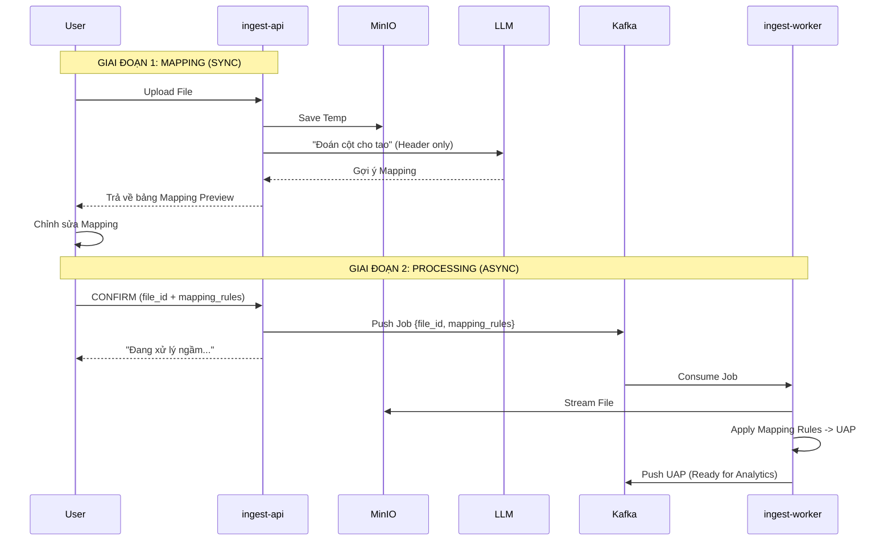
```mermaid
sequenceDiagram
    participant User as User
    participant API as ingest-api
    participant MinIO as MinIO
    participant LLM as LLM
    participant Kafka as Kafka
    participant Worker as ingest-worker

    Note over User, API: GIAI ĐOẠN 1: MAPPING (SYNC)
    User->>API: Upload File
    API->>MinIO: Save Temp
    API->>LLM: "Đoán cột cho tao" (Header only)
    LLM-->>API: Gợi ý Mapping
    API-->>User: Trả về bảng Mapping Preview

    User->>User: Chỉnh sửa Mapping

    Note over User, Worker: GIAI ĐOẠN 2: PROCESSING (ASYNC)
    User->>API: CONFIRM (file_id + mapping_rules)
    API->>Kafka: Push Job {file_id, mapping_rules}
    API-->>User: "Đang xử lý ngầm..."

    Kafka->>Worker: Consume Job
    Worker->>MinIO: Stream File
    Worker->>Worker: Apply Mapping Rules -> UAP
    Worker->>Kafka: Push UAP (Ready for Analytics)
```

### 12.2 REVISED FLOW 3: BATCH ANALYTICS (High Performance)

```mermaid
sequenceDiagram
    participant Kafka as Kafka
    participant n8n as n8n-engine
    participant PyWorker as py-worker
    participant Postgres as Postgres
    participant Redis as Redis

    Note right of Kafka: Batch Size: 50 records
    Kafka->>n8n: Consume Batch (50 items)
    n8n->>PyWorker: HTTP POST /analyze_batch (50 items)

    Note right of PyWorker: Xử lý song song (Vectorization)
    PyWorker-->>n8n: Return Results [50 items]

    Note over n8n: Logic Filter Rác
    n8n->>Postgres: BULK INSERT (1 transaction)

    par Async Notification
        n8n->>Redis: Pub "BATCH_DONE"
    and Conditional Vector Index
        n8n->>Kafka: Push Valid Items -> knowledge.index
    end
```

---

## 16. TÓM TẮT CÁC ĐIỂM CẦN SỬA TRONG CODE/CONFIG

| Component         | Thay đổi cần thiết                                                                                                                                                                                  |
| ----------------- | --------------------------------------------------------------------------------------------------------------------------------------------------------------------------------------------------- |
| **Ingest API**    | Thêm endpoint `POST /schema/preview` (gọi LLM) và `POST /schema/confirm` (đẩy Kafka). Đừng để Worker làm việc này.                                                                                  |
| **Python Worker** | Viết endpoint nhận `List[String]` thay vì `String`. Code xử lý phải dùng vòng lặp hoặc `batch_encode` của thư viện Transformers.                                                                    |
| **n8n**           | Cấu hình node Kafka Trigger với `Batch Size > 1`. Dùng node Postgres với chế độ Execute Query (viết câu lệnh `INSERT INTO ... VALUES (...), (...), (...)`) thay vì node Insert thông thường (chậm). |
| **All Workers**   | **QUAN TRỌNG:** Tất cả Worker phải nhận message từ Queue (Kafka), không nhận trực tiếp từ nguồn nào khác.                                                                                           |

---

## 17. KẾT LUẬN

Phương án tối ưu "Tách tầng Mapping" và "Xử lý Batch" sẽ giúp hệ thống:

- Tránh deadlock khi cần user interaction
- Giảm network overhead đáng kể
- Tăng throughput xử lý lên nhiều lần
- Tiết kiệm tài nguyên Vector DB bằng Quality Gate
