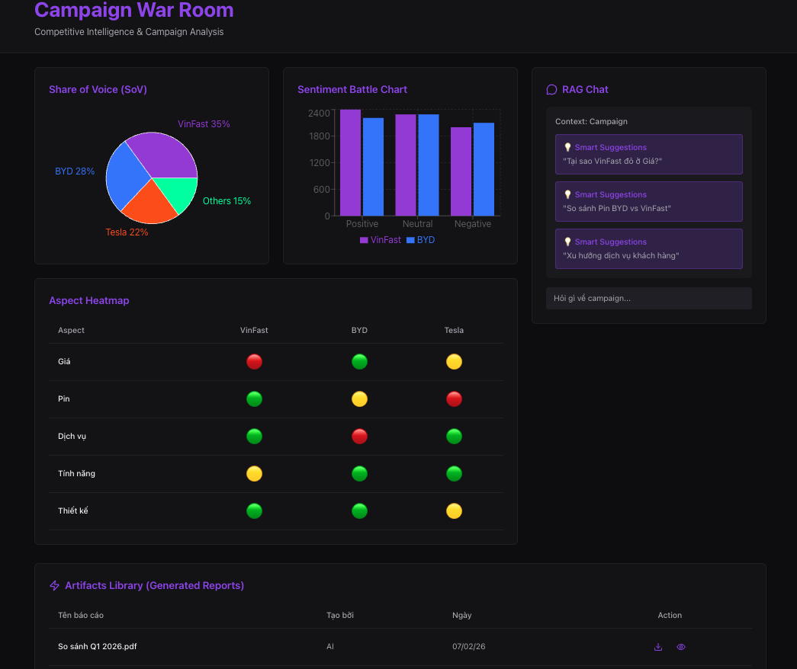

# SMAP Migration Plan v2.0

## Từ Public SaaS → On-Premise Enterprise Solution

**Ngày tạo:** 06/02/2026  
**Cập nhật:** 09/02/2026 (v2.10 - Analytics Service Architecture Revision)  
**Thời gian thực hiện:** 3 tháng (12 tuần)  
**Người thực hiện:** Nguyễn Tấn Tài

---

**Changelog:**
| Version | Ngày | Nội dung |
|---------|------|----------|
| v2.0 | 06/02/2026 | Initial migration plan |
| v2.1 | 06/02/2026 | Tích hợp UAP, Entity Hierarchy, AI Schema Agent |
| v2.2 | 06/02/2026 | Tích hợp Time Handling Strategy |
| v2.3 | 07/02/2026 | Chốt Hybrid Architecture & Multi-Schema Database |
| v2.4 | 07/02/2026 | Enhanced UX: Dry-Run, Vector Trigger, Campaign War Room |
| v2.5 | 07/02/2026 | Real-time Engine & Intelligent Crawling |
| v2.6 | 07/02/2026 | Artifact Editing: Inline Editor + Google Docs Integration |
| v2.7 | 07/02/2026 | Turnkey Deployment Strategy (IaC): Ansible + K3s + Helm |
| v2.8 | 09/02/2026 | Auth Service Deep Dive: JWT Middleware, Audit Log Strategy, Business Context |
| v2.9 | 09/02/2026 | Enterprise Security: Token Blacklist, Multi-Provider, Key Rotation |
| v2.10 | 09/02/2026 | **REVISION:** Analytics Service - Revert n8n, Keep Traditional Go Service |

---

## 0. TECHNICAL FOUNDATION

### 0.1 Unified Analytics Payload (UAP) - Canonical Data Model

Mọi dữ liệu đầu vào (Excel, CSV, JSON, Social Crawl) **BẮT BUỘC** phải được chuẩn hóa về định dạng UAP trước khi vào Analytics Service.

```json
{
  "id": "uuid-v4", // Định danh duy nhất
  "project_id": "proj_vinfast_qv", // Thuộc Project nào
  "source_id": "src_excel_feedback_t1", // Truy vết nguồn gốc

  "content": "Xe đi êm nhưng pin sụt nhanh quá", // [CORE] Văn bản để AI phân tích

  // TIME SEMANTICS (2 trường thời gian riêng biệt - BẮT BUỘC)
  "content_created_at": "2026-02-06T01:00:00Z", // [CORE] Thời điểm sự kiện xảy ra (UTC)
  "ingested_at": "2026-02-06T10:00:00Z", // [SYSTEM] Thời điểm SMAP thu thập (UTC)

  "platform": "internal_excel", // Nguồn gốc (tiktok, youtube, excel, crm)
  "metadata": {
    // Dữ liệu phụ (Schema-less) cho RAG
    "author": "Nguyễn Văn A",
    "rating": 4,
    "branch": "Chi nhánh HCM",
    "original_time_value": "06/02/2026 08:00", // Giá trị thời gian gốc (trước normalize)
    "time_type": "absolute" // absolute | relative | fallback
  }
}
```

**Time Fields Explanation:**

| Field                | Mục đích                                                   | Ví dụ                                                                |
| -------------------- | ---------------------------------------------------------- | -------------------------------------------------------------------- |
| `content_created_at` | **Business:** Trend charts, RAG context, behavior analysis | User đăng comment lúc 01:00 AM VN → stored as 18:00 UTC (ngày trước) |
| `ingested_at`        | **Ops:** Latency measurement, debug, filter recent records | SMAP crawl lúc 10:00 AM VN → stored as 03:00 UTC                     |

**Lợi ích:**

- Analytics Service **không phụ thuộc** vào nguồn dữ liệu gốc
- Dễ dàng thêm nguồn dữ liệu mới mà không sửa core logic
- Metadata schema-less cho phép RAG trích xuất linh hoạt
- **Time semantics rõ ràng** - không nhầm lẫn giữa thời gian thực và thời gian thu thập

### 0.2 Entity Hierarchy - Mô hình 3 tầng

```
┌─────────────────────────────────────────────────────────────────┐
│                    ENTITY HIERARCHY                             │
├─────────────────────────────────────────────────────────────────┤
│                                                                 │
│  Tầng 3: CAMPAIGN (Logical Analysis Unit)                       │
│  ┌─────────────────────────────────────────────────────────┐    │
│  │  Campaign "So sánh Xe điện"                             │    │
│  │  ├── Project "Monitor VF8"  (brand=VinFast)             │    │
│  │  └── Project "Monitor BYD Seal" (brand=BYD)             │    │
│  │  → RAG scope: WHERE project_id IN ('VF8', 'BYD Seal')   │    │
│  └─────────────────────────────────────────────────────────┘    │
│                           ↑                                     │
│  Tầng 2: PROJECT (Entity Monitoring Unit)                       │
│  ┌─────────────────────────────────────────────────────────┐    │
│  │  Project "Monitor VF8"                                  │    │
│  │  ├── brand: "VinFast" (text, dùng để nhóm hiển thị)    │    │
│  │  ├── entity_type: "product"                             │    │
│  │  ├── entity_name: "VF8"                                 │    │
│  │  ├── Data Source: Excel Feedback T1                     │    │
│  │  ├── Data Source: TikTok Crawl "vinfast vf8"            │    │
│  │  └── Data Source: Webhook từ CRM                        │    │
│  │  → Health Check: Dashboard riêng cho entity VF8         │    │
│  └─────────────────────────────────────────────────────────┘    │
│                           ↑                                     │
│  Tầng 1: DATA SOURCE (Physical Data Unit)                       │
│  ┌─────────────────────────────────────────────────────────┐    │
│  │  Data Source "Excel Feedback T1"                        │    │
│  │  ├── Raw File: feedback_t1.xlsx                         │    │
│  │  ├── Schema Mapping: AI Agent suggested                 │    │
│  │  └── Output: 500 UAP records                            │    │
│  │  → Normalization: Biến raw data thành UAP               │    │
│  └─────────────────────────────────────────────────────────┘    │
│                                                                 │
└─────────────────────────────────────────────────────────────────┘
```

**Vai trò từng tầng:**

| Tầng | Entity      | Vai trò                | Chức năng chính                                       |
| ---- | ----------- | ---------------------- | ----------------------------------------------------- |
| 1    | Data Source | Physical Data Unit     | Chuẩn hóa raw → UAP                                   |
| 2    | Project     | Entity Monitoring Unit | Dashboard, Health Check, Alerts cho 1 thực thể cụ thể |
| 3    | Campaign    | Logical Analysis Unit  | RAG scope, So sánh cross-project                      |

> **Lưu ý:** Project = 1 thực thể cụ thể cần monitor (sản phẩm, chiến dịch, dịch vụ...), KHÔNG phải toàn bộ brand. Brand chỉ là text field metadata để nhóm hiển thị.

### 0.3 AI Schema Agent - Universal Adapter

**Workflow chuẩn hóa dữ liệu:**

```
┌──────────────────────────────────────────────────────────────────┐
│                    AI SCHEMA AGENT WORKFLOW                      │
├──────────────────────────────────────────────────────────────────┤
│                                                                  │
│  1. INGESTION                                                    │
│     User upload file (Excel/CSV/JSON)                            │
│                    ↓                                             │
│  2. INSPECTION (LLM)                                             │
│     AI đọc Header + 5 dòng đầu                                   │
│     Prompt: "Tìm cột 'Nội dung phản hồi' → map sang content"     │
│                    ↓                                             │
│  3. SUGGESTION                                                   │
│     Hiển thị bảng mapping gợi ý:                                 │
│     ┌────────────────────┬─────────────┬────────────┐            │
│     │ Cột gốc            │ UAP Field   │ Confidence │            │
│     ├────────────────────┼─────────────┼────────────┤            │
│     │ Ý kiến khách hàng  │ content     │ 95%        │            │
│     │ Ngày gửi           │ created_at  │ 90%        │            │
│     │ Tên KH             │ metadata.   │ 85%        │            │
│     │                    │ author      │            │            │
│     └────────────────────┴─────────────┴────────────┘            │
│                    ↓                                             │
│  4. CONFIRMATION                                                 │
│     User xác nhận hoặc chỉnh sửa mapping                         │
│                    ↓                                             │
│  5. TRANSFORMATION (ETL)                                         │
│     Convert toàn bộ file → UAP records                           │
│     Push vào Message Queue → Analytics Service                   │
│                                                                  │
└──────────────────────────────────────────────────────────────────┘
```

### 0.4 Time Handling Strategy - Chiến lược Xử lý Thời gian

**Vấn đề:** Sai lệch timezone, định dạng ngày tháng không đồng nhất, và nhầm lẫn giữa "thời gian thực" vs "thời gian thu thập" có thể gây sai lệch nghiêm trọng trong Trend charts và Alert system.

#### 0.4.1 Time Semantics - 2 Trường Thời gian Bắt buộc

| Trường                   | Định nghĩa                                    | Mục đích                               |
| ------------------------ | --------------------------------------------- | -------------------------------------- |
| **`content_created_at`** | Thời điểm sự kiện xảy ra (user đăng, ghi log) | **Business:** Trend, RAG, behavior     |
| **`ingested_at`**        | Thời điểm SMAP thu thập                       | **Ops:** Latency, debug, filter recent |

#### 0.4.2 Storage & Normalization Rules

| Aspect            | Rule                                           |
| ----------------- | ---------------------------------------------- |
| **Format**        | ISO 8601 UTC (`YYYY-MM-DDThh:mm:ssZ`)          |
| **Database**      | PostgreSQL: `TIMESTAMPTZ`, MongoDB: `ISODate`  |
| **Qdrant**        | Unix Timestamp (Integer) cho range filtering   |
| **Relative time** | "2 giờ trước" → Tính từ `ingested_at`          |
| **Fallback**      | Không parse được → Dùng `ingested_at` cho cả 2 |

#### 0.4.3 Key Implementation Points

**Dashboard Visualization:**

- Client gửi timezone: `?tz=Asia/Ho_Chi_Minh`
- Server aggregate: `GROUP BY date_trunc('day', content_created_at AT TIME ZONE $tz)`

**Alert Logic:**

- Chỉ alert nếu `content_created_at` trong 24h gần nhất
- Historical import KHÔNG trigger crisis alert

**RAG Temporal Queries:**

- "tuần này" → Pre-filter `content_created_at` TRƯỚC vector search
- Tránh "ảo giác" lấy data cũ trả lời câu hỏi về hiện tại

### 0.5 Multi-Schema Database Strategy

**Vấn đề:** Microservices thuần túy yêu cầu Database-per-Service, nhưng với On-Premise B2B Solution, việc vận hành 5-6 DB instances gây lãng phí tài nguyên và phức tạp hóa Backup/Restore.

**Quyết định:** **Logical Separation on Single Physical Instance** - 1 PostgreSQL Cluster, phân chia bằng Schemas.

```
┌─────────────────────────────────────────────────────────────────┐
│              MULTI-SCHEMA DATABASE ARCHITECTURE                 │
├─────────────────────────────────────────────────────────────────┤
│                                                                 │
│  PostgreSQL Physical Instance (Single)                          │
│  ┌─────────────────────────────────────────────────────────┐    │
│  │                                                         │    │
│  │  ┌─────────────┐  ┌─────────────┐  ┌─────────────┐      │    │
│  │  │ auth.*      │  │ business.*  │  │ ingest.*    │      │    │
│  │  │ - users     │  │ - projects  │  │ - sources   │      │    │
│  │  │ - audit_logs│  │ - campaigns │  │ - jobs      │      │    │
│  │  └─────────────┘  └─────────────┘  └─────────────┘      │    │
│  │                                                         │    │
│  │  ┌─────────────┐                                        │    │
│  │  │ analytics.* │     ┌─────────────────────────────┐    │    │
│  │  │ - post_     │     │  Qdrant (Separate Instance) │    │    │
│  │  │   analytics │     │  - Vector embeddings        │    │    │
│  │  │ - comments  │     │  - RAG search               │    │    │
│  │  └─────────────┘     └─────────────────────────────┘    │    │
│  │                                                         │    │
│  └─────────────────────────────────────────────────────────┘    │
│                                                                 │
└─────────────────────────────────────────────────────────────────┘
```

**Schema Mapping:**

| Service           | Schema        | Tables                                 |
| ----------------- | ------------- | -------------------------------------- |
| Auth Service      | `auth.*`      | users, audit_logs                      |
| Project Service   | `business.*`  | projects, campaigns, campaign_projects |
| Ingest Service    | `ingest.*`    | data_sources, jobs                     |
| Analytics Service | `analytics.*` | post_analytics, comments, errors       |
| Knowledge Service | _(Qdrant)_    | Vector DB riêng                        |

**Anti-Superbase Rules:**

1. **No Cross-Schema Writes:** Service A KHÔNG được INSERT/UPDATE vào Schema của Service B
2. **Read-Only for Reporting:** JOIN cross-schema chỉ cho Dashboard/Reporting
3. **Single Connection String:** Khách hàng chỉ cần 1 connection, hệ thống tự migrate schemas

### 0.6 Hybrid Architecture - Tech Stack (FINALIZED v2.10)

**Chiến lược:** **Golang** (Core Services) + **Python** (AI Workers) - ~~n8n removed due to scalability issues~~

**REVISION v2.10:** Sau khi đánh giá hiện trạng, quyết định **KHÔNG dùng n8n** cho Analytics vì:
1. ❌ Không scale ngang được (single instance bottleneck)
2. ❌ Tốc độ chậm (overhead của visual workflow engine)
3. ❌ Khó debug production issues
4. ❌ Vendor lock-in

**Quyết định mới:** Giữ nguyên **analytics-service** (Go) với refactor structure.

```
┌─────────────────────────────────────────────────────────────────┐
│                    REVISED ARCHITECTURE                         │
├─────────────────────────────────────────────────────────────────┤
│                                                                 │
│  CORE SERVICES (Golang)                                         │
│  ┌─────────┐ ┌─────────┐ ┌─────────┐ ┌─────────┐ ┌─────────┐    │
│  │  Auth   │ │ Project │ │ Ingest  │ │Analytics│ │Knowledge│    │
│  │ Service │ │ Service │ │ Service │ │ Service │ │ Service │    │
│  └─────────┘ └─────────┘ └─────────┘ └────┬────┘ └─────────┘    │
│                                           │                     │
│                                           ↓ HTTP/gRPC           │
│  AI WORKERS (Python FastAPI)                                    │
│  ┌─────────────┐ ┌─────────────┐ ┌─────────────┐                │
│  │  Sentiment  │ │   Aspect    │ │  Keyword    │                │
│  │   Worker    │ │   Worker    │ │   Worker    │                │
│  │ (PhoBERT)   │ │  (PhoBERT)  │ │(Underthesea)│                │
│  └─────────────┘ └─────────────┘ └─────────────┘                │
│                                                                 │
│  NOTIFICATION SERVICE (Golang)                                  │
│  ┌─────────────┐                                                │
│  │    Noti     │                                                │
│  │   Service   │                                                │
│  └─────────────┘                                                │
│                                                                 │
└─────────────────────────────────────────────────────────────────┘
```

**Tech Stack Matrix:**

| Service            | Type         | Language/Tool      | Lý do                                          |
| ------------------ | ------------ | ------------------ | ---------------------------------------------- |
| Auth Service       | Core Logic   | **Golang**         | High performance, concurrency, strict typing   |
| Project Service    | Core Logic   | **Golang**         | Business logic chặt chẽ                        |
| Ingest Service     | Core Logic   | **Golang**         | File parsing nhanh, OpenAI SDK Go cho AI Agent |
| **Analytics Service** | **Core Logic** | **Golang**      | **Consumer + Orchestrator, scalable, fast**    |
| Notification       | Real-time    | **Golang**         | Xử lý hàng ngàn WebSocket connections          |
| Knowledge Service  | AI Logic     | **Golang**         | go-qdrant, go-openai - RAG pipeline tối ưu     |
| AI Workers         | Micro-func   | **Python FastAPI** | PhoBERT/Whisper wrappers, stateless            |

**Lợi ích của Go Analytics Service:**

- **Scalability:** Horizontal scaling với Kubernetes (multiple replicas)
- **Performance:** Go concurrency xử lý hàng ngàn UAP records/sec
- **Observability:** Standard logging, metrics, tracing
- **Maintainability:** Code-based logic dễ debug hơn visual workflows

---

## 1. TỔNG QUAN THAY ĐỔI

### 1.1 Mô hình kinh doanh

| Khía cạnh  | Cũ (SaaS)                 | Mới (On-Premise)                        |
| ---------- | ------------------------- | --------------------------------------- |
| Deployment | Centralized, multi-tenant | Distributed, single-tenant per customer |
| Data       | Trên server của SMAP      | Trên server của khách hàng              |
| Revenue    | Subscription monthly      | License fee + Support                   |
| Packaging  | Docker images             | Helm Charts                             |

### 1.2 Use Cases (Updated với Entity Hierarchy)

| Cũ (8 UC)                | Mới (3 UC)                | Entity Level | Ghi chú                                                       |
| ------------------------ | ------------------------- | ------------ | ------------------------------------------------------------- |
| UC-01: Cấu hình Project  | → UC-01: Data Onboarding  | Data Source  | Refactor: tách Crawl (Dry Run) vs Passive (AI Schema Mapping) |
| UC-02: Dry-run           | ❌ XOÁ (gộp vào UC-01)    | -            | Dry Run chỉ cho Crawl sources                                 |
| UC-03: Execute & Monitor | → UC-02: Brand Monitoring | Project      | Project = Entity cụ thể                                       |
| UC-04: Xem kết quả       | → UC-02: Brand Monitoring | Project      | Merge                                                         |
| UC-05: List Projects     | Giữ nguyên                | Project      | Filter theo brand                                             |
| UC-06: Export            | Giữ nguyên                | Project      | Utility                                                       |
| UC-07: Trend Detection   | ❌ XOÁ                    | -            | Không phù hợp                                                 |
| UC-08: Crisis Monitor    | → UC-02: Brand Monitoring | Project      | Merge                                                         |
| (Mới)                    | UC-03: RAG Chatbot        | Campaign     | Thêm mới                                                      |

**Use Case → Entity Mapping:**

- **UC-01 (Data Onboarding):** Tạo Data Source, AI Schema Agent chuẩn hóa → UAP
- **UC-02 (Brand Monitoring):** Dashboard cho 1 Project, không so sánh
- **UC-03 (RAG Chatbot):** Chọn Campaign → RAG query cross-project

---

## 2. RESTRUCTURE SERVICES THEO DDD

### 2.1 Bounded Contexts mới (Updated với UAP & Entity Hierarchy)

```
┌─────────────────────────────────────────────────────────────────┐
│                    SMAP Enterprise Platform                     │
├─────────────────────────────────────────────────────────────────┤
│                                                                 │
│  ┌──────────────┐  ┌──────────────┐  ┌──────────────┐           │
│  │     AUTH     │  │    INGEST    │  │  ANALYTICS   │           │
│  │   Context    │  │   Context    │  │   Context    │           │
│  │              │  │              │  │              │           │
│  │ • SSO/OAuth  │  │ • Data Source│  │ • UAP Input  │           │
│  │ • RBAC       │  │ • File Upload│  │ • Sentiment  │           │
│  │ • Domain ACL │  │ • Crawling   │  │ • ABSA       │           │
│  │              │  │ • AI Schema  │  │ • Keywords   │           │
│  │              │  │   Agent      │  │              │           │
│  └──────────────┘  └──────────────┘  └──────────────┘           │
│                                                                 │
│  ┌──────────────┐  ┌──────────────┐  ┌──────────────┐           │
│  │   PROJECT    │  │ NOTIFICATION │  │  KNOWLEDGE   │           │
│  │   Context    │  │   Context    │  │   Context    │           │
│  │              │  │              │  │              │           │
│  │ • Project    │  │ • WebSocket  │  │ • Campaign   │           │
│  │   CRUD       │  │ • Alerts     │  │ • RAG Engine │           │
│  │ • Campaign   │  │ • Push Noti  │  │ • Vector DB  │           │
│  │   CRUD       │  │              │  │ • Chat       │           │
│  │ • Dashboard  │  │              │  │              │           │
│  └──────────────┘  └──────────────┘  └──────────────┘           │
│                                                                 │
└─────────────────────────────────────────────────────────────────┘
```

### 2.2 Data Flow với UAP

```
┌─────────────────────────────────────────────────────────────────┐
│                    DATA FLOW WITH UAP                           │
├─────────────────────────────────────────────────────────────────┤
│                                                                 │
│  RAW DATA SOURCES                                               │
│  ┌─────────┐ ┌─────────┐ ┌─────────┐ ┌─────────┐                │
│  │  Excel  │ │   CSV   │ │  JSON   │ │ Social  │                │
│  │  File   │ │  File   │ │  File   │ │ Crawl   │                │
│  └────┬────┘ └────┬────┘ └────┬────┘ └────┬────┘                │
│       │           │           │           │                     │
│       └───────────┴─────┬─────┴───────────┘                     │
│                         ↓                                       │
│  ┌─────────────────────────────────────────────────────────┐    │
│  │              INGEST SERVICE                             │    │
│  │  ┌─────────────────────────────────────────────────┐    │    │
│  │  │           AI SCHEMA AGENT (LLM)                 │    │    │
│  │  │  • Inspect raw data structure                   │    │    │
│  │  │  • Suggest field mapping                        │    │    │
│  │  │  • User confirmation                            │    │    │
│  │  │  • Transform to UAP                             │    │    │
│  │  └─────────────────────────────────────────────────┘    │    │
│  └─────────────────────────┬───────────────────────────────┘    │
│                            ↓                                    │
│  ┌─────────────────────────────────────────────────────────┐    │
│  │              UNIFIED ANALYTICS PAYLOAD (UAP)            │    │
│  │  {                                                      │    │
│  │    "id": "uuid",                                        │    │
│  │    "project_id": "proj_xxx",                            │    │
│  │    "source_id": "src_xxx",                              │    │
│  │    "content": "...",        ← CORE: Text for AI         │    │
│  │    "created_at": "...",     ← CORE: Timestamp           │    │
│  │    "platform": "...",                                   │    │
│  │    "metadata": {...}        ← Schema-less for RAG       │    │
│  │  }                                                      │    │
│  └─────────────────────────┬───────────────────────────────┘    │
│                            ↓                                    │
│  ┌─────────────────────────────────────────────────────────┐    │
│  │              ANALYTICS SERVICE                          │    │
│  │  • Sentiment Analysis (PhoBERT)                         │    │
│  │  • Aspect-Based Sentiment Analysis                      │    │
│  │  • Keyword Extraction                                   │    │
│  │  • Impact Calculation                                   │    │
│  └─────────────────────────┬───────────────────────────────┘    │
│                            ↓                                    │
│       ┌────────────────────┴────────────────────┐               │
│       ↓                                         ↓               │
│  ┌─────────────┐                         ┌─────────────┐        │
│  │ PostgreSQL  │                         │   Qdrant    │        │
│  │ (analytics) │                         │ (vectors)   │        │
│  └──────┬──────┘                         └──────┬──────┘        │
│         ↓                                       ↓               │
│  ┌─────────────┐                         ┌─────────────┐        │
│  │  PROJECT    │                         │  KNOWLEDGE  │        │
│  │  SERVICE    │                         │  SERVICE    │        │
│  │ (Dashboard) │                         │ (RAG Chat)  │        │
│  └─────────────┘                         └─────────────┘        │
│                                                                 │
└─────────────────────────────────────────────────────────────────┘
```

### 2.3 Service Mapping: Cũ → Mới

| Service Cũ    | Service Mới            | Language     | Hành động            | Lý do                                |
| ------------- | ---------------------- | ------------ | -------------------- | ------------------------------------ |
| `identity`    | `auth-service`         | **Go**       | 🔄 SIMPLIFY          | SSO, user entity cho audit log       |
| `project`     | `project-service`      | **Go**       | 🔄 EXTEND            | Thêm Campaign entity, Dashboard      |
| `collector`   | `ingest-service`       | **Go**       | 🔄 RENAME + REFACTOR | AI Schema Agent, file parsing        |
| `analytic`    | `analytics-service`    | **Go**       | 🔄 REFACTOR          | Consumer + Orchestrator, UAP input   |
| `websocket`   | `notification-service` | **Go**       | 🔄 RENAME            | Đổi tên cho rõ nghĩa hơn             |
| `speech2text` | `ai-workers`           | **Python**   | 🔀 MERGE             | Gộp thành AI worker                  |
| `scrapper`    | ❌ XOÁ                 | -            | 🗑️ REMOVE            | Outsource cho External Data Provider |
| `web-ui`      | `web-ui`               | **Next.js**  | 🔄 REFACTOR          | Đổi UI flow theo Entity Hierarchy    |
| (Mới)         | `knowledge-service`    | **Go**       | ➕ TẠO MỚI           | RAG Chatbot với Campaign scope       |

### 2.4 Kiến trúc Services mới (Hybrid Architecture)

```
TRƯỚC (8 services):                    SAU (6 Core + AI Workers):
─────────────────────                  ─────────────────────
identity          ──────────────────►  auth-service (Go, simplified)
project           ──────────────────►  project-service (Go, + Campaign)
collector         ──────────────────►  ingest-service (Go, + AI Schema)
scrapper          ──────────────────►  ❌ XOÁ (dùng External API)
analytic          ──────────────────►  analytics-service (Go, refactor)
speech2text       ──────────────────►  ai-workers (Python FastAPI)
websocket         ──────────────────►  notification-service (Go)
(mới)             ──────────────────►  knowledge-service (Go, RAG)
web-ui            ──────────────────►  web-ui (Next.js)

Tech Stack Summary:
─────────────────────
Core Services    → Golang (6 services)
AI Workers       → Python FastAPI (3 workers: sentiment, aspect, keyword)
Frontend         → Next.js
Database         → 1 PostgreSQL (4 schemas) + Qdrant + Redis
Message Queue    → Kafka
```

---

## 3. CHI TIẾT TỪNG SERVICE MỚI

### 3.1 Auth Service (Simplified từ Identity)

**Business Context trong SMAP:**

Auth Service trong SMAP On-Premise có vai trò đặc biệt so với SaaS thông thường:

1. **Single-Tenant per Customer:**
   - Mỗi khách hàng có 1 instance riêng → Không cần multi-tenancy
   - Chỉ cần quản lý users trong 1 organization (VD: VinFast)
   - Đơn giản hóa được rất nhiều so với SaaS

2. **Enterprise SSO Integration:**
   - Khách hàng enterprise thường đã có Google Workspace hoặc Azure AD
   - SMAP chỉ cần integrate với SSO của họ, không tự quản lý users
   - Giảm bớt compliance burden (GDPR, password security)

3. **Role-Based Access Control (RBAC):**
   - **ADMIN:** IT team của khách hàng - quản lý config, users, alerts
   - **ANALYST:** Marketing team - tạo projects, chạy analysis, xem insights
   - **VIEWER:** Executives, stakeholders - chỉ xem dashboard (read-only)

4. **Audit Trail cho Compliance:**
   - Khách hàng enterprise cần audit log để compliance (ISO 27001, SOC 2)
   - Track mọi hành động: ai tạo project, ai xóa data source, ai export data
   - Retention 90 ngày (có thể extend theo yêu cầu khách hàng)

5. **Domain-Based Access Control:**
   - Chỉ cho phép email thuộc domain của khách hàng login
   - VD: Chỉ `@vinfast.com` và `@agency-partner.com` được phép
   - Tự động block external emails

**Use Cases Cụ Thể:**

| Use Case | Actor | Flow |
|----------|-------|------|
| **UC-AUTH-01: First-time Login** | Marketing Manager | 1. Click "Login with Google"<br>2. Redirect to Google OAuth<br>3. Google verify email = `manager@vinfast.com`<br>4. Auth Service check domain allowed → OK<br>5. Check Google Groups → `marketing-team@vinfast.com` → Role = ANALYST<br>6. Create user record in DB<br>7. Issue JWT token<br>8. Redirect to Dashboard |
| **UC-AUTH-02: Subsequent Login** | Same user | 1. Click "Login with Google"<br>2. Auth Service check user exists → OK<br>3. Refresh Google Groups membership (from cache)<br>4. Issue new JWT<br>5. Redirect to Dashboard |
| **UC-AUTH-03: Blocked User** | Ex-employee | 1. Click "Login with Google"<br>2. Email = `ex-employee@vinfast.com`<br>3. Auth Service check blocklist → BLOCKED<br>4. Show error page: "Account blocked. Contact admin." |
| **UC-AUTH-04: Unauthorized Domain** | External user | 1. Click "Login with Google"<br>2. Email = `hacker@gmail.com`<br>3. Auth Service check domain → NOT ALLOWED<br>4. Show error page: "Domain not allowed." |
| **UC-AUTH-05: API Request** | Web UI | 1. User đã login, có JWT token<br>2. UI gọi `GET /api/projects` với header `Authorization: Bearer <token>`<br>3. Project Service middleware verify JWT bằng public key<br>4. Extract user_id, role từ claims<br>5. Check permission → OK<br>6. Return data |

```yaml
name: auth-service
language: Go
responsibility:
  - Google OAuth2/OIDC integration (SSO)
  - Domain-based access control
  - Role mapping (từ config file + Google Groups)
  - JWT issuing & validation (RS256 asymmetric)
  - Session management (Redis-backed)
  - User entity management (for audit log)
  - Public key distribution (cho JWT self-validation)

bỏ_hoàn_toàn:
  - User registration form (dùng SSO)
  - Password management
  - Email verification/OTP
  - Subscription plans

modules:
  - /oauth # Google OAuth2 callback
  - /session # Session management
  - /jwks # Public key endpoint (JSON Web Key Set)
  - /users # User lookup (internal)

api_endpoints:
  # Public endpoints
  - GET /auth/login # Redirect to Google OAuth
  - GET /auth/callback # OAuth callback handler
  - POST /auth/logout # Logout & invalidate tokens
  - GET /auth/me # Get current user info
  - GET /.well-known/jwks.json # Public keys for JWT verification
  
  # Internal endpoints (service-to-service)
  - POST /internal/validate # Fallback token validation (if needed)
  - GET /internal/users/:id # User lookup

database: PostgreSQL (auth.* schema) - Lưu user entity + audit log
cache: Redis - Session store, Google Groups membership cache

config_file: auth-config.yaml
```

**JWT Configuration:**

```yaml
jwt:
  # Algorithm: RS256 (Asymmetric) - cho phép self-validation
  algorithm: RS256
  
  # Key Management
  private_key_path: /secrets/jwt-private.pem  # Chỉ Auth Service có
  public_key_path: /secrets/jwt-public.pem    # Publish qua JWKS endpoint
  
  # Token TTL
  access_token_ttl: 15m   # Short-lived cho security
  refresh_token_ttl: 7d   # Long-lived cho UX
  
  # Claims Structure
  claims:
    issuer: "smap-auth-service"
    audience: ["smap-api", "smap-ui"]
    custom:
      - user_id        # UUID
      - email          # string
      - role           # ADMIN | ANALYST | VIEWER
      - groups         # string[] (Google Groups)
      - jti            # JWT ID (unique per token, for blacklist)
```

**Token Validation Strategy:**

Auth Service sử dụng **RS256 + Self-Validation** pattern:

1. **Auth Service** ký JWT bằng private key
2. **Publish public key** qua `/.well-known/jwks.json` endpoint
3. **Các services khác** tự validate JWT bằng public key (không cần gọi Auth Service)
4. **Fallback**: Nếu service không muốn implement JWT validation, có thể gọi `/internal/validate`

**Lợi ích:**
- Giảm load cho Auth Service (không phải validate mọi request)
- Latency thấp (services tự validate local)
- Scalability cao (stateless validation)

**Google Groups Integration:**

```yaml
google_workspace:
  # Directory API Configuration
  service_account_key: /secrets/google-service-account.json
  domain: vinfast.com
  
  # Groups Sync
  sync:
    enabled: true
    interval: 5m  # Sync membership mỗi 5 phút
    groups:
      - marketing-team@vinfast.com  → ANALYST role
      - it-admin@vinfast.com        → ADMIN role
  
  # Cache Strategy
  cache:
    backend: redis
    ttl: 5m
    key_pattern: "groups:{user_email}"
```

**Implementation Flow:**
1. User login → Auth Service gọi Directory API để lấy group membership
2. Cache kết quả vào Redis (TTL 5 phút)
3. Embed groups vào JWT claims
4. Background job sync groups mỗi 5 phút

**OAuth Error Handling:**

```yaml
error_handling:
  # User-friendly error pages
  pages:
    access_denied: /auth/error/access-denied
    domain_not_allowed: /auth/error/domain-blocked
    account_blocked: /auth/error/account-blocked
    oauth_failed: /auth/error/oauth-failed
  
  # Error codes mapping
  codes:
    DOMAIN_NOT_ALLOWED:
      http_status: 403
      message: "Email domain not allowed. Contact admin."
      redirect: /auth/error/domain-blocked
    
    ACCOUNT_BLOCKED:
      http_status: 403
      message: "Your account has been blocked."
      redirect: /auth/error/account-blocked
    
    OAUTH_PROVIDER_ERROR:
      http_status: 502
      message: "Google authentication failed. Try again."
      redirect: /auth/error/oauth-failed
      retry: true
    
    INVALID_TOKEN:
      http_status: 401
      message: "Session expired. Please login again."
      redirect: /auth/login
```

**Database Schema (auth_db):**

```sql
-- Users table (auto-created on first SSO login)
CREATE TABLE users (
    id UUID PRIMARY KEY DEFAULT gen_random_uuid(),
    email VARCHAR(255) UNIQUE NOT NULL,
    name VARCHAR(255),
    avatar_url TEXT,
    role VARCHAR(20) NOT NULL DEFAULT 'VIEWER', -- ADMIN, ANALYST, VIEWER
    is_active BOOLEAN DEFAULT true,
    last_login_at TIMESTAMPTZ,
    created_at TIMESTAMPTZ DEFAULT NOW(),
    updated_at TIMESTAMPTZ DEFAULT NOW()
);

-- Audit log table (with retention policy)
CREATE TABLE audit_logs (
    id UUID PRIMARY KEY DEFAULT gen_random_uuid(),
    user_id UUID REFERENCES users(id),
    action VARCHAR(50) NOT NULL, -- LOGIN, LOGOUT, CREATE_PROJECT, DELETE_SOURCE, etc.
    resource_type VARCHAR(50), -- project, campaign, data_source, etc.
    resource_id UUID,
    metadata JSONB, -- Additional context
    ip_address INET,
    user_agent TEXT,
    created_at TIMESTAMPTZ DEFAULT NOW(),
    
    -- Retention policy: Auto-delete after 90 days
    expires_at TIMESTAMPTZ DEFAULT (NOW() + INTERVAL '90 days')
);

-- Indexes
CREATE INDEX idx_users_email ON users(email);
CREATE INDEX idx_audit_logs_user ON audit_logs(user_id);
CREATE INDEX idx_audit_logs_action ON audit_logs(action);
CREATE INDEX idx_audit_logs_created ON audit_logs(created_at);
CREATE INDEX idx_audit_logs_expires ON audit_logs(expires_at); -- For cleanup job

-- Retention cleanup job (run daily via cron/k8s CronJob)
-- DELETE FROM audit_logs WHERE expires_at < NOW();
```

**Auth Config File (auth-config.yaml):**

```yaml
# Identity Provider Configuration (Pluggable - Security Enhancement #7)
identity_provider:
  type: google # google | azure | okta | ldap
  
  # Google Workspace
  google:
    client_id: ${GOOGLE_CLIENT_ID}
    client_secret: ${GOOGLE_CLIENT_SECRET}
    redirect_uri: ${APP_URL}/auth/callback
    domain: vinfast.com
    service_account_key: /secrets/google-service-account.json
    sync:
      enabled: true
      interval: 5m
      groups:
        marketing-team@vinfast.com: ANALYST
        it-admin@vinfast.com: ADMIN
  
  # Azure AD (Alternative)
  azure:
    tenant_id: ${AZURE_TENANT_ID}
    client_id: ${AZURE_CLIENT_ID}
    client_secret: ${AZURE_CLIENT_SECRET}
    redirect_uri: ${APP_URL}/auth/callback
    domain: vinfast.onmicrosoft.com
  
  # Okta (Alternative)
  okta:
    domain: vinfast.okta.com
    client_id: ${OKTA_CLIENT_ID}
    client_secret: ${OKTA_CLIENT_SECRET}
    redirect_uri: ${APP_URL}/auth/callback

# JWT Configuration (Enhanced with Key Rotation - Security Enhancement #8)
jwt:
  algorithm: RS256
  
  # Key Sources (Priority order)
  key_sources:
    - type: file
      private_key_path: /secrets/jwt-private.pem
      public_key_path: /secrets/jwt-public.pem
    - type: env
      private_key_env: JWT_PRIVATE_KEY
      public_key_env: JWT_PUBLIC_KEY
    - type: k8s_secret
      secret_name: smap-jwt-keys
      private_key_field: private.pem
      public_key_field: public.pem
  
  # Token TTL
  access_token_ttl: 15m
  refresh_token_ttl: 7d
  
  # Key Rotation (Phase 2 - Long-term)
  rotation:
    enabled: false # Enable in Phase 3
    interval: 30d  # Rotate every 30 days
    grace_period: 15m # Old key valid for 15 min after rotation
  
  # Claims
  issuer: "smap-auth-service"
  audience: ["smap-api", "smap-ui"]

# Access Control
access:
  # Domain restriction
  allowed_domains:
    - vinfast.com
    - agency-partner.com

  # Role mapping - email/group → role
  roles:
    ADMIN:
      - cmo@vinfast.com
      - it-admin@vinfast.com
    ANALYST:
      - marketing-team@vinfast.com
      - analyst@agency-partner.com
    VIEWER:
      - default

  # Block list
  blocked:
    - ex-employee@vinfast.com

# Session
session:
  ttl: 8h
  refresh_ttl: 7d
  backend: redis

# Token Blacklist (Security Enhancement #6)
blacklist:
  enabled: true
  backend: redis
  key_prefix: "blacklist:"

# Rate Limiting
rate_limit:
  login_attempts: 5
  window: 15m
  block_duration: 1h

# Error Handling
error_handling:
  pages:
    access_denied: /auth/error/access-denied
    domain_not_allowed: /auth/error/domain-blocked
    account_blocked: /auth/error/account-blocked
    oauth_failed: /auth/error/oauth-failed
  
  codes:
    DOMAIN_NOT_ALLOWED:
      http_status: 403
      message: "Email domain not allowed. Contact admin."
    ACCOUNT_BLOCKED:
      http_status: 403
      message: "Your account has been blocked."
    TOKEN_REVOKED:
      http_status: 401
      message: "Your session has been revoked. Please login again."
    OAUTH_PROVIDER_ERROR:
      http_status: 502
      message: "Authentication provider failed. Try again."
      retry: true

# Audit Log
audit:
  retention_days: 90
  cleanup_schedule: "0 2 * * *"
```

**Roles & Permissions:**

| Role    | Permissions                                               |
| ------- | --------------------------------------------------------- |
| ADMIN   | Full access, manage config, view all data, manage alerts  |
| ANALYST | Create sources, run analysis, export reports, use chatbot |
| VIEWER  | View dashboard, view reports (read-only)                  |

**Implementation Notes:**

1. **JWT Self-Validation Pattern:**
   - Auth Service generates RSA key pair on startup (or load from secrets)
   - Private key: Used to sign JWTs (keep secure, never expose)
   - Public key: Published via `/.well-known/jwks.json` endpoint
   - Other services: Download public key on startup, cache it, validate JWTs locally
   - Benefits: No need to call Auth Service for every request, reduces latency & load

2. **Google Groups Sync Strategy:**
   - On user login: Call Directory API to get group membership
   - Cache result in Redis with 5-minute TTL
   - Background job: Sync groups every 5 minutes for active users
   - Embed groups in JWT claims for authorization decisions
   - Fallback: If Directory API fails, use cached data or default role

3. **OAuth Error Handling Best Practices:**
   - Never expose raw OAuth errors to users (security risk)
   - Map technical errors to user-friendly messages
   - Provide clear next steps (e.g., "Contact admin" for domain blocks)
   - Log detailed errors server-side for debugging
   - Implement retry logic for transient Google API failures

4. **Audit Log Retention:**
   - Default: 90 days retention (configurable)
   - Cleanup job: K8s CronJob runs daily at 2 AM
   - Query: `DELETE FROM audit_logs WHERE expires_at < NOW()`
   - For compliance: Export logs to external storage before deletion
   - Index on `expires_at` for efficient cleanup queries

5. **Rate Limiting:**
   - Protect login endpoint from brute force attacks
   - Default: 5 attempts per 15 minutes per IP
   - Block duration: 1 hour after exceeding limit
   - Implementation: Redis with sliding window counter
   - Whitelist: Allow internal IPs to bypass rate limit

**Security Enhancements (Enterprise-Grade):**

6. **Token Blacklist (Instant Revocation):**
   
   **Vấn đề:** JWT có TTL 15 phút. Nếu nhân viên bị sa thải hoặc mất laptop, Admin block account nhưng token cũ vẫn valid trong 15 phút → Lỗ hổng bảo mật.
   
   **Giải pháp:** Thêm Redis blacklist check vào JWT middleware.
   
   ```go
   // Enhanced JWT Middleware with Blacklist Check
   func (m *JWTMiddleware) Authenticate(next http.Handler) http.Handler {
       return http.HandlerFunc(func(w http.ResponseWriter, r *http.Request) {
           // ... (existing JWT verification code)
           
           // Extract claims
           claims, _ := token.Claims.(jwt.MapClaims)
           userID := claims["user_id"].(string)
           jti := claims["jti"].(string) // JWT ID (unique per token)
           
           // ✅ NEW: Check Redis blacklist
           isBlacklisted, err := m.redis.Exists(ctx, 
               fmt.Sprintf("blacklist:user:%s", userID)).Result()
           if err == nil && isBlacklisted > 0 {
               http.Error(w, "Token revoked", http.StatusUnauthorized)
               return
           }
           
           // Also check specific token blacklist
           isTokenBlacklisted, err := m.redis.Exists(ctx,
               fmt.Sprintf("blacklist:token:%s", jti)).Result()
           if err == nil && isTokenBlacklisted > 0 {
               http.Error(w, "Token revoked", http.StatusUnauthorized)
               return
           }
           
           // Continue to business logic...
           next.ServeHTTP(w, r.WithContext(ctx))
       })
   }
   ```
   
   **Admin revoke token flow:**
   ```go
   // Auth Service - Admin API
   func (s *AuthService) RevokeUserAccess(userID string) error {
       // Block all current tokens của user này
       // TTL = thời gian còn lại của token dài nhất (15 phút)
       return s.redis.Set(ctx, 
           fmt.Sprintf("blacklist:user:%s", userID),
           "1",
           15 * time.Minute,
       ).Err()
   }
   
   func (s *AuthService) RevokeSpecificToken(jti string, remainingTTL time.Duration) error {
       // Block 1 token cụ thể (VD: user báo mất laptop)
       return s.redis.Set(ctx,
           fmt.Sprintf("blacklist:token:%s", jti),
           "1",
           remainingTTL,
       ).Err()
   }
   ```
   
   **Lợi ích:**
   - Revoke quyền truy cập tức thì (< 100ms)
   - Không cần đợi token expire
   - Redis TTL tự động cleanup (không tốn storage)
   - Performance impact minimal (Redis lookup rất nhanh)

7. **Identity Provider Abstraction (Multi-Provider Support):**
   
   **Vấn đề:** Plan hiện tại hardcode Google Workspace. Khách hàng enterprise lớn thường dùng Microsoft Azure AD, Okta, hoặc custom LDAP.
   
   **Giải pháp:** Thiết kế theo Interface pattern, dễ dàng thêm provider mới.
   
   ```go
   // pkg/auth/provider/interface.go
   package provider
   
   type IdentityProvider interface {
       // OAuth flow
       GetAuthURL(state string) string
       ExchangeCode(code string) (*TokenResponse, error)
       
       // User info
       GetUserInfo(accessToken string) (*UserInfo, error)
       
       // Groups/Roles
       GetUserGroups(accessToken string, userEmail string) ([]string, error)
       
       // Token validation
       ValidateToken(accessToken string) error
   }
   
   type UserInfo struct {
       Email     string
       Name      string
       AvatarURL string
   }
   
   type TokenResponse struct {
       AccessToken  string
       RefreshToken string
       ExpiresIn    int
   }
   ```
   
   **Implementations:**
   
   ```go
   // pkg/auth/provider/google.go
   type GoogleProvider struct {
       clientID     string
       clientSecret string
       redirectURI  string
       oauth2Config *oauth2.Config
   }
   
   func (p *GoogleProvider) GetUserInfo(token string) (*UserInfo, error) {
       // Call Google UserInfo API
       // ...
   }
   
   func (p *GoogleProvider) GetUserGroups(token, email string) ([]string, error) {
       // Call Google Directory API
       // ...
   }
   
   // pkg/auth/provider/azure.go
   type AzureADProvider struct {
       tenantID     string
       clientID     string
       clientSecret string
   }
   
   func (p *AzureADProvider) GetUserInfo(token string) (*UserInfo, error) {
       // Call Microsoft Graph API
       // ...
   }
   
   func (p *AzureADProvider) GetUserGroups(token, email string) ([]string, error) {
       // Call Azure AD Groups API
       // ...
   }
   
   // pkg/auth/provider/okta.go
   type OktaProvider struct {
       domain       string
       clientID     string
       clientSecret string
   }
   // ... similar implementation
   ```
   
   **Config file (auth-config.yaml):**
   
   ```yaml
   # Identity Provider Configuration (Pluggable)
   identity_provider:
     type: google # google | azure | okta | ldap
     
     # Google Workspace
     google:
       client_id: ${GOOGLE_CLIENT_ID}
       client_secret: ${GOOGLE_CLIENT_SECRET}
       domain: vinfast.com
       service_account_key: /secrets/google-sa.json
     
     # Azure AD (alternative)
     azure:
       tenant_id: ${AZURE_TENANT_ID}
       client_id: ${AZURE_CLIENT_ID}
       client_secret: ${AZURE_CLIENT_SECRET}
       domain: vinfast.onmicrosoft.com
     
     # Okta (alternative)
     okta:
       domain: vinfast.okta.com
       client_id: ${OKTA_CLIENT_ID}
       client_secret: ${OKTA_CLIENT_SECRET}
   ```
   
   **Auth Service initialization:**
   
   ```go
   func (s *AuthService) initializeProvider(config Config) error {
       var provider provider.IdentityProvider
       
       switch config.IdentityProvider.Type {
       case "google":
           provider = provider.NewGoogleProvider(config.IdentityProvider.Google)
       case "azure":
           provider = provider.NewAzureADProvider(config.IdentityProvider.Azure)
       case "okta":
           provider = provider.NewOktaProvider(config.IdentityProvider.Okta)
       default:
           return fmt.Errorf("unsupported provider: %s", config.IdentityProvider.Type)
       }
       
       s.provider = provider
       return nil
   }
   ```
   
   **Lợi ích:**
   - Thêm provider mới không cần sửa core logic
   - Dễ test (mock provider interface)
   - Khách hàng chọn provider phù hợp với infrastructure của họ
   - Future-proof (LDAP, SAML, custom SSO...)

8. **Key Rotation Strategy (Security Best Practice):**
   
   **Vấn đề:** Hiện tại mount cứng file `.pem` vào container. Nếu private key bị lộ, phải redeploy toàn bộ hệ thống để thay key.
   
   **Giải pháp:** Thiết kế key rotation mechanism với multiple active keys.
   
   **Phase 1: Flexible Key Loading (Ngắn hạn - Tuần 1)**
   
   ```yaml
   jwt:
     algorithm: RS256
     
     # Multiple key sources (priority order)
     key_sources:
       - type: file
         private_key_path: /secrets/jwt-private.pem
         public_key_path: /secrets/jwt-public.pem
       
       - type: env
         private_key_env: JWT_PRIVATE_KEY
         public_key_env: JWT_PUBLIC_KEY
       
       - type: k8s_secret
         secret_name: smap-jwt-keys
         private_key_field: private.pem
         public_key_field: public.pem
   ```
   
   **Phase 2: Automatic Key Rotation (Dài hạn - Phase 3)**
   
   ```go
   // pkg/auth/keymanager/rotation.go
   type KeyManager struct {
       activeKeys   map[string]*KeyPair // kid -> KeyPair
       currentKeyID string
       rotationInterval time.Duration
       db           *sql.DB
   }
   
   type KeyPair struct {
       KeyID      string
       PrivateKey *rsa.PrivateKey
       PublicKey  *rsa.PublicKey
       CreatedAt  time.Time
       ExpiresAt  time.Time
       Status     string // active | rotating | retired
   }
   
   func (km *KeyManager) StartRotation() {
       ticker := time.NewTicker(30 * 24 * time.Hour) // Rotate every 30 days
       
       for range ticker.C {
           // 1. Generate new key pair
           newKeyPair, err := km.generateKeyPair()
           if err != nil {
               log.Error("Failed to generate new key pair", err)
               continue
           }
           
           // 2. Save to database
           km.db.Exec(`
               INSERT INTO auth.jwt_keys (kid, private_key, public_key, status)
               VALUES ($1, $2, $3, 'active')
           `, newKeyPair.KeyID, newKeyPair.PrivateKey, newKeyPair.PublicKey)
           
           // 3. Add to active keys
           km.activeKeys[newKeyPair.KeyID] = newKeyPair
           
           // 4. Update current key ID (new tokens will use this)
           km.currentKeyID = newKeyPair.KeyID
           
           // 5. Mark old key as "rotating" (still valid for verification)
           // Old tokens can still be verified for next 15 minutes
           time.AfterFunc(15*time.Minute, func() {
               km.retireOldKey(oldKeyID)
           })
       }
   }
   
   func (km *KeyManager) SignToken(claims jwt.Claims) (string, error) {
       // Always use current key to sign new tokens
       currentKey := km.activeKeys[km.currentKeyID]
       token := jwt.NewWithClaims(jwt.SigningMethodRS256, claims)
       token.Header["kid"] = km.currentKeyID // Include Key ID in header
       return token.SignedString(currentKey.PrivateKey)
   }
   
   func (km *KeyManager) VerifyToken(tokenString string) (*jwt.Token, error) {
       return jwt.Parse(tokenString, func(token *jwt.Token) (interface{}, error) {
           // Extract kid from token header
           kid, ok := token.Header["kid"].(string)
           if !ok {
               return nil, fmt.Errorf("missing kid in token header")
           }
           
           // Find corresponding public key
           keyPair, exists := km.activeKeys[kid]
           if !exists {
               return nil, fmt.Errorf("unknown key id: %s", kid)
           }
           
           return keyPair.PublicKey, nil
       })
   }
   ```
   
   **JWKS endpoint with multiple keys:**
   
   ```go
   func (s *AuthService) HandleJWKS(w http.ResponseWriter, r *http.Request) {
       keys := []map[string]interface{}{}
       
       // Export all active public keys
       for kid, keyPair := range s.keyManager.activeKeys {
           if keyPair.Status == "active" || keyPair.Status == "rotating" {
               keys = append(keys, map[string]interface{}{
                   "kty": "RSA",
                   "use": "sig",
                   "kid": kid,
                   "n":   base64.Encode(keyPair.PublicKey.N.Bytes()),
                   "e":   base64.Encode(big.NewInt(int64(keyPair.PublicKey.E)).Bytes()),
               })
           }
       }
       
       json.NewEncoder(w).Encode(map[string]interface{}{
           "keys": keys,
       })
   }
   ```
   
   **Database schema:**
   
   ```sql
   CREATE TABLE auth.jwt_keys (
       kid VARCHAR(50) PRIMARY KEY,
       private_key TEXT NOT NULL, -- PEM encoded
       public_key TEXT NOT NULL,  -- PEM encoded
       status VARCHAR(20) NOT NULL, -- active | rotating | retired
       created_at TIMESTAMPTZ DEFAULT NOW(),
       expires_at TIMESTAMPTZ,
       retired_at TIMESTAMPTZ
   );
   
   CREATE INDEX idx_jwt_keys_status ON auth.jwt_keys(status);
   ```
   
   **Lợi ích:**
   - Zero-downtime key rotation
   - Nếu key bị lộ, rotate ngay không cần redeploy
   - Compliance với security standards (PCI-DSS, ISO 27001)
   - Multiple active keys cho graceful transition
   - Audit trail (track key usage history)

**JWT Middleware Implementation (Các Services Khác):**

Mỗi service (Project, Ingest, Knowledge, Notification) cần implement JWT verification middleware:

```go
// Shared middleware package: pkg/auth/middleware.go
package auth

import (
    "context"
    "crypto/rsa"
    "encoding/json"
    "fmt"
    "net/http"
    "strings"
    "time"
    
    "github.com/golang-jwt/jwt/v5"
)

type JWTMiddleware struct {
    publicKey    *rsa.PublicKey
    jwksURL      string
    lastFetch    time.Time
    refreshInterval time.Duration
    redis        *redis.Client // NEW: Redis for blacklist check
}

// Initialize middleware - fetch public key from Auth Service
func NewJWTMiddleware(authServiceURL string, redisClient *redis.Client) (*JWTMiddleware, error) {
    m := &JWTMiddleware{
        jwksURL: authServiceURL + "/.well-known/jwks.json",
        refreshInterval: 1 * time.Hour, // Refresh public key mỗi giờ
        redis: redisClient, // NEW: Redis client for blacklist
    }
    
    // Fetch public key on startup
    if err := m.fetchPublicKey(); err != nil {
        return nil, fmt.Errorf("failed to fetch public key: %w", err)
    }
    
    // Background goroutine to refresh key periodically
    go m.refreshPublicKeyPeriodically()
    
    return m, nil
}

// Fetch public key from JWKS endpoint
func (m *JWTMiddleware) fetchPublicKey() error {
    resp, err := http.Get(m.jwksURL)
    if err != nil {
        return err
    }
    defer resp.Body.Close()
    
    var jwks struct {
        Keys []struct {
            Kty string `json:"kty"`
            N   string `json:"n"`
            E   string `json:"e"`
        } `json:"keys"`
    }
    
    if err := json.NewDecoder(resp.Body).Decode(&jwks); err != nil {
        return err
    }
    
    // Parse RSA public key from JWKS
    // ... (implementation details)
    
    m.lastFetch = time.Now()
    return nil
}

// HTTP Middleware
func (m *JWTMiddleware) Authenticate(next http.Handler) http.Handler {
    return http.HandlerFunc(func(w http.ResponseWriter, r *http.Request) {
        // 1. Extract token from Authorization header
        authHeader := r.Header.Get("Authorization")
        if authHeader == "" {
            http.Error(w, "Missing authorization header", http.StatusUnauthorized)
            return
        }
        
        tokenString := strings.TrimPrefix(authHeader, "Bearer ")
        
        // 2. Parse & validate JWT using public key
        token, err := jwt.Parse(tokenString, func(token *jwt.Token) (interface{}, error) {
            // Verify signing method
            if _, ok := token.Method.(*jwt.SigningMethodRSA); !ok {
                return nil, fmt.Errorf("unexpected signing method: %v", token.Header["alg"])
            }
            return m.publicKey, nil
        })
        
        if err != nil || !token.Valid {
            http.Error(w, "Invalid token", http.StatusUnauthorized)
            return
        }
        
        // 3. Extract claims
        claims, ok := token.Claims.(jwt.MapClaims)
        if !ok {
            http.Error(w, "Invalid token claims", http.StatusUnauthorized)
            return
        }
        
        // 4. Verify issuer & audience
        if claims["iss"] != "smap-auth-service" {
            http.Error(w, "Invalid token issuer", http.StatusUnauthorized)
            return
        }
        
        // 5. Check Redis blacklist (NEW - Security Enhancement #6)
        userID := claims["user_id"].(string)
        jti, _ := claims["jti"].(string) // JWT ID (unique per token)
        
        // Check if user is blacklisted
        isUserBlacklisted, err := m.redis.Exists(r.Context(), 
            fmt.Sprintf("blacklist:user:%s", userID)).Result()
        if err == nil && isUserBlacklisted > 0 {
            http.Error(w, "Token revoked", http.StatusUnauthorized)
            return
        }
        
        // Check if specific token is blacklisted
        if jti != "" {
            isTokenBlacklisted, err := m.redis.Exists(r.Context(),
                fmt.Sprintf("blacklist:token:%s", jti)).Result()
            if err == nil && isTokenBlacklisted > 0 {
                http.Error(w, "Token revoked", http.StatusUnauthorized)
                return
            }
        }
        
        // 6. Extract user info and inject into context
        userID := claims["user_id"].(string)
        email := claims["email"].(string)
        role := claims["role"].(string)
        groups := claims["groups"].([]interface{})
        
        ctx := context.WithValue(r.Context(), "user_id", userID)
        ctx = context.WithValue(ctx, "email", email)
        ctx = context.WithValue(ctx, "role", role)
        ctx = context.WithValue(ctx, "groups", groups)
        
        // 7. Pass to next handler
        next.ServeHTTP(w, r.WithContext(ctx))
    })
}

// Authorization helper - check role
func RequireRole(role string) func(http.Handler) http.Handler {
    return func(next http.Handler) http.Handler {
        return http.HandlerFunc(func(w http.ResponseWriter, r *http.Request) {
            userRole := r.Context().Value("role").(string)
            
            // Role hierarchy: ADMIN > ANALYST > VIEWER
            if !hasPermission(userRole, role) {
                http.Error(w, "Insufficient permissions", http.StatusForbidden)
                return
            }
            
            next.ServeHTTP(w, r)
        })
    }
}
```

**Usage trong Project Service:**

```go
// cmd/project-service/main.go
func main() {
    // Initialize JWT middleware
    authMiddleware, err := auth.NewJWTMiddleware("http://auth-service:8080")
    if err != nil {
        log.Fatal(err)
    }
    
    // Setup routes
    r := chi.NewRouter()
    
    // Public routes (no auth)
    r.Get("/health", healthHandler)
    
    // Protected routes (require authentication)
    r.Group(func(r chi.Router) {
        r.Use(authMiddleware.Authenticate) // Apply JWT verification
        
        // All users can view
        r.Get("/projects", listProjectsHandler)
        r.Get("/projects/{id}", getProjectHandler)
        
        // Only ANALYST+ can create/update
        r.With(auth.RequireRole("ANALYST")).Post("/projects", createProjectHandler)
        r.With(auth.RequireRole("ANALYST")).Put("/projects/{id}", updateProjectHandler)
        
        // Only ADMIN can delete
        r.With(auth.RequireRole("ADMIN")).Delete("/projects/{id}", deleteProjectHandler)
    })
    
    http.ListenAndServe(":8080", r)
}
```

**Audit Log Strategy:**

**Quyết định:** Sử dụng **Async Queue Pattern** để tránh blocking business logic.

```
┌─────────────────────────────────────────────────────────────────┐
│                    AUDIT LOG FLOW                               │
├─────────────────────────────────────────────────────────────────┤
│                                                                 │
│  User Request                                                   │
│       ↓                                                         │
│  ┌─────────────────┐                                            │
│  │ Project Service │                                            │
│  │ (Business Logic)│                                            │
│  └────────┬────────┘                                            │
│           │                                                     │
│           ├─► 1. Execute business logic (CREATE_PROJECT)       │
│           │                                                     │
│           ├─► 2. Push audit event to Kafka                     │
│           │    Topic: audit.events                             │
│           │    Payload: {                                      │
│           │      user_id, action, resource_type,               │
│           │      resource_id, metadata, ip, user_agent         │
│           │    }                                               │
│           │    → NON-BLOCKING (fire-and-forget)                │
│           │                                                     │
│           └─► 3. Return response to user                       │
│                                                                 │
│  ┌─────────────────────────────────────────────────────────┐    │
│  │              Kafka Topic: audit.events                  │    │
│  └─────────────────────────┬───────────────────────────────┘    │
│                            ↓                                    │
│  ┌─────────────────────────────────────────────────────────┐    │
│  │           Auth Service - Audit Consumer                 │    │
│  │  • Consume audit events from Kafka                      │    │
│  │  • Batch insert to auth.audit_logs (every 5s or 100 msgs)│   │
│  │  • Retry on failure                                     │    │
│  └─────────────────────────────────────────────────────────┘    │
│                                                                 │
└─────────────────────────────────────────────────────────────────┘
```

**Implementation:**

```go
// pkg/audit/publisher.go - Shared package cho tất cả services
package audit

import (
    "context"
    "encoding/json"
    "github.com/segmentio/kafka-go"
)

type AuditPublisher struct {
    writer *kafka.Writer
}

type AuditEvent struct {
    UserID       string                 `json:"user_id"`
    Action       string                 `json:"action"` // CREATE_PROJECT, DELETE_SOURCE, etc.
    ResourceType string                 `json:"resource_type"`
    ResourceID   string                 `json:"resource_id"`
    Metadata     map[string]interface{} `json:"metadata"`
    IPAddress    string                 `json:"ip_address"`
    UserAgent    string                 `json:"user_agent"`
}

func NewAuditPublisher(kafkaBrokers []string) *AuditPublisher {
    return &AuditPublisher{
        writer: &kafka.Writer{
            Addr:     kafka.TCP(kafkaBrokers...),
            Topic:    "audit.events",
            Balancer: &kafka.LeastBytes{},
            Async:    true, // Non-blocking writes
        },
    }
}

func (p *AuditPublisher) Log(ctx context.Context, event AuditEvent) error {
    data, _ := json.Marshal(event)
    
    // Fire-and-forget (non-blocking)
    return p.writer.WriteMessages(ctx, kafka.Message{
        Value: data,
    })
}
```

**Usage trong Project Service:**

```go
func (h *ProjectHandler) CreateProject(w http.ResponseWriter, r *http.Request) {
    // 1. Extract user from context (injected by JWT middleware)
    userID := r.Context().Value("user_id").(string)
    
    // 2. Execute business logic
    project, err := h.service.CreateProject(r.Context(), req)
    if err != nil {
        http.Error(w, err.Error(), http.StatusInternalServerError)
        return
    }
    
    // 3. Log audit event (async, non-blocking)
    h.auditPublisher.Log(r.Context(), audit.AuditEvent{
        UserID:       userID,
        Action:       "CREATE_PROJECT",
        ResourceType: "project",
        ResourceID:   project.ID,
        Metadata: map[string]interface{}{
            "project_name": project.Name,
            "brand":        project.Brand,
        },
        IPAddress: r.RemoteAddr,
        UserAgent: r.Header.Get("User-Agent"),
    })
    
    // 4. Return response immediately (không đợi audit log ghi xong)
    json.NewEncoder(w).Encode(project)
}
```

**Auth Service - Audit Consumer:**

```go
// cmd/auth-service/audit_consumer.go
func (s *AuthService) StartAuditConsumer() {
    reader := kafka.NewReader(kafka.ReaderConfig{
        Brokers: []string{"kafka:9092"},
        Topic:   "audit.events",
        GroupID: "auth-audit-consumer",
    })
    
    batch := make([]AuditEvent, 0, 100)
    ticker := time.NewTicker(5 * time.Second)
    
    for {
        select {
        case <-ticker.C:
            // Flush batch every 5 seconds
            if len(batch) > 0 {
                s.batchInsertAuditLogs(batch)
                batch = batch[:0]
            }
            
        default:
            // Read message
            msg, err := reader.ReadMessage(context.Background())
            if err != nil {
                continue
            }
            
            var event AuditEvent
            json.Unmarshal(msg.Value, &event)
            batch = append(batch, event)
            
            // Flush if batch is full
            if len(batch) >= 100 {
                s.batchInsertAuditLogs(batch)
                batch = batch[:0]
            }
        }
    }
}

func (s *AuthService) batchInsertAuditLogs(events []AuditEvent) error {
    // Batch insert to PostgreSQL
    query := `
        INSERT INTO auth.audit_logs 
        (user_id, action, resource_type, resource_id, metadata, ip_address, user_agent)
        VALUES ($1, $2, $3, $4, $5, $6, $7)
    `
    
    tx, _ := s.db.Begin()
    for _, event := range events {
        tx.Exec(query, event.UserID, event.Action, event.ResourceType, 
                event.ResourceID, event.Metadata, event.IPAddress, event.UserAgent)
    }
    return tx.Commit()
}
```

**Lợi ích của Async Audit Log:**

| Aspect          | Sync (gọi trực tiếp) | Async (Kafka Queue)     |
| --------------- | -------------------- | ----------------------- |
| Latency         | 🔴 Cao (+50-100ms)   | 🟢 Thấp (<5ms)          |
| Reliability     | 🔴 Block nếu Auth down | 🟢 Queue buffer         |
| Scalability     | 🔴 Auth Service bottleneck | 🟢 Consumer scale độc lập |
| Batch Insert    | 🔴 Không              | 🟢 Có (hiệu suất cao)   |
| Decoupling      | 🔴 Tight coupling     | 🟢 Loose coupling       |

### 3.2 Project Service (Extend - Entity Hierarchy Management)

```yaml
name: project-service
language: Go
responsibility:
  - Project CRUD (Entity Monitoring Unit - Tầng 2)
  - Campaign CRUD (Logical Analysis Unit - Tầng 3)
  - Dashboard data aggregation
  - Project-Campaign relationship management

modules:
  - /projects # Project CRUD
  - /campaigns # Campaign CRUD (MỚI)
  - /dashboard # Dashboard data (từ analytics_db)
  - /health # Health check metrics

entities:
  Project:
    - id: UUID
    - name: string (e.g., "Monitor VF8")
    - brand: string (e.g., "VinFast") # text field, dùng để nhóm hiển thị
    - entity_type: string (e.g., "product") # product, campaign, service, competitor, topic
    - entity_name: string (e.g., "VF8") # tên thực thể cụ thể
    - description: text
    - industry: string
    - config_status: string # DRAFT, CONFIGURING, ONBOARDING, DRYRUN_RUNNING, ACTIVE...
    - created_by: UUID (user_id)
    - created_at: timestamp
    - updated_at: timestamp

  Campaign:
    - id: UUID
    - name: string (e.g., "So sánh Xe điện")
    - description: text
    - project_ids: UUID[] (many-to-many)
    - created_by: UUID
    - created_at: timestamp
    - updated_at: timestamp

database: PostgreSQL (project_db)

message_queues:
  - project.created
  - project.updated
  - campaign.created
  - campaign.updated
```

**Database Schema (project_db):**

```sql
-- Projects table (Entity Monitoring Unit - Tầng 2)
CREATE TABLE projects (
    id UUID PRIMARY KEY DEFAULT gen_random_uuid(),
    name VARCHAR(255) NOT NULL,
    brand VARCHAR(100),                    -- Tên brand (text, dùng để nhóm hiển thị)
    entity_type VARCHAR(50),               -- product, campaign, service, competitor, topic
    entity_name VARCHAR(200),              -- Tên thực thể cụ thể (VD: "VF8")
    description TEXT,
    industry VARCHAR(100),
    config_status VARCHAR(20) DEFAULT 'DRAFT',
    created_by UUID NOT NULL,
    created_at TIMESTAMPTZ DEFAULT NOW(),
    updated_at TIMESTAMPTZ DEFAULT NOW(),
    deleted_at TIMESTAMPTZ
);

-- Campaigns table (Logical Analysis Unit - Tầng 3)
CREATE TABLE campaigns (
    id UUID PRIMARY KEY DEFAULT gen_random_uuid(),
    name VARCHAR(255) NOT NULL,
    description TEXT,
    created_by UUID NOT NULL,
    created_at TIMESTAMPTZ DEFAULT NOW(),
    updated_at TIMESTAMPTZ DEFAULT NOW(),
    deleted_at TIMESTAMPTZ
);

-- Campaign-Project relationship (many-to-many)
CREATE TABLE campaign_projects (
    campaign_id UUID REFERENCES campaigns(id) ON DELETE CASCADE,
    project_id UUID REFERENCES projects(id) ON DELETE CASCADE,
    added_at TIMESTAMPTZ DEFAULT NOW(),
    PRIMARY KEY (campaign_id, project_id)
);

-- Indexes
CREATE INDEX idx_projects_created_by ON projects(created_by);
CREATE INDEX idx_campaigns_created_by ON campaigns(created_by);
CREATE INDEX idx_campaign_projects_campaign ON campaign_projects(campaign_id);
CREATE INDEX idx_campaign_projects_project ON campaign_projects(project_id);
```

### 3.3 Ingest Service (Data Source + AI Schema Agent)

```yaml
name: ingest-service
language: Go
responsibility:
  - Data source management (Crawl + Passive)
  - File upload & parsing (Excel, CSV, JSON)
  - Webhook endpoint management (payload schema, URL generation)
  - External crawl API integration (thay scrapper)
  - AI Schema Mapping coordination (cho File Upload + Webhook)
  - Dry Run coordination (cho Crawl sources)
  - Job orchestration

modules:
  - /sources # Quản lý data sources
  - /upload # File upload endpoint
  - /webhook # Webhook management (register, receive, schema)
  - /crawl # External API adapter (gọi teammate's server)
  - /schema # AI Schema Mapping (preview, confirm)
  - /dryrun # Dry Run cho crawl sources
  - /jobs # Job management

source_categories:
  # Crawl Sources (cần Dry Run)
  - type: FACEBOOK
    category: crawl
    trigger: scheduled_poll
  - type: TIKTOK
    category: crawl
    trigger: one_time_crawl
  - type: YOUTUBE
    category: crawl
    trigger: scheduled_poll

  # Passive Sources (cần Data Onboarding - AI Schema Mapping)
  - type: FILE_UPLOAD
    category: passive
    trigger: manual_upload
    onboarding: ai_schema_mapping (from file header)
  - type: WEBHOOK
    category: passive
    trigger: external_push
    onboarding: ai_schema_mapping (from payload_schema)

data_adapters:
  # Adapter 1: File Upload (tự xử lý)
  - type: file
    formats: [excel, csv, json]
    handler: internal

  # Adapter 2: External Crawl API (outsource)
  - type: social_crawl
    provider: external_mmo_server
    protocol: REST API / gRPC
    platforms: [youtube, tiktok, facebook]
    handler: external_api_client

external_api_contract:
  # Request gửi đi
  request:
    endpoint: POST /api/crawl
    payload:
      keywords: ["vinfast", "vf8"]
      platforms: ["youtube", "tiktok"]
      date_range: { from: "2025-01-01", to: "2025-02-01" }
      limit_per_keyword: 50

  # Response nhận về
  response:
    format: JSON / JSONL
    delivery:
      - sync: Direct response (cho small requests)
      - async: Webhook callback (cho large requests)
    schema:
      - content_id
      - platform
      - title
      - description
      - author
      - engagement (views, likes, comments)
      - published_at
      - media_url (optional)

database:
  - PostgreSQL (ingest_db) - metadata
  - MongoDB (raw_data) - raw content từ external API

message_queues:
  - ingest.file.uploaded
  - ingest.crawl.requested # Gửi request tới external
  - ingest.crawl.completed # Nhận callback từ external
  - ingest.data.ready
```

**Lợi ích của External Data Provider:**

| Aspect         | Tự build Scrapper                    | External API               |
| -------------- | ------------------------------------ | -------------------------- |
| Complexity     | 🔴 Cao (anti-bot, proxy, rate limit) | 🟢 Thấp (chỉ call API)     |
| Maintenance    | 🔴 Liên tục update khi platform đổi  | 🟢 Teammate lo             |
| Cost           | 🔴 Server, proxy, captcha solving    | 🟡 Trả phí API             |
| Reliability    | 🔴 Dễ bị block                       | 🟢 Teammate có kinh nghiệm |
| Time to market | 🔴 Chậm                              | 🟢 Nhanh                   |

### 3.4 Analytics Service (Refactored - Go Consumer + Orchestrator)

**REVISION v2.10:** Giữ nguyên Go service, refactor structure để scalable và maintainable.

**Lý do không dùng n8n:**
1. ❌ Single instance bottleneck - không scale ngang
2. ❌ Performance overhead của visual workflow engine
3. ❌ Khó debug production issues (visual workflows không có stack trace)
4. ❌ Vendor lock-in

```yaml
name: analytics-service
language: Go
architecture: Consumer + Orchestrator + AI Workers

responsibility:
  - Consume UAP từ Kafka
  - Orchestrate AI analysis pipeline
  - Call AI Workers (HTTP/gRPC)
  - Aggregate results
  - Write to analytics.* schema
  - Publish completion events

modules:
  - /consumer # Kafka consumer (UAP messages)
  - /orchestrator # Pipeline orchestration logic
  - /workers # AI worker clients (HTTP)
  - /repository # Database access (analytics.*)
  - /api # Internal API (optional, for monitoring)

entry_points:
  - cmd/consumer/main.go # Kafka consumer process
  - cmd/api/main.go # API server (optional, for health check)

ai_workers:
  - name: sentiment-worker
    language: Python (FastAPI)
    endpoint: http://sentiment-worker:8000/analyze/sentiment
    input: {content: string}
    output: {sentiment: string, score: float}
    
  - name: aspect-worker
    language: Python (FastAPI)
    endpoint: http://aspect-worker:8000/analyze/aspects
    input: {content: string, aspects: string[]}
    output: [{aspect, sentiment, score, keywords}]
    
  - name: keyword-worker
    language: Python (FastAPI)
    endpoint: http://keyword-worker:8000/extract/keywords
    input: {content: string}
    output: {keywords: string[]}

database: PostgreSQL (analytics.* schema)

message_queues:
  consume:
    - analytics.uap.received
  publish:
    - analytics.sentiment.completed
    - analytics.batch.completed
```

**Analytics Pipeline Flow (Go Orchestrator):**

```go
// internal/orchestrator/pipeline.go
package orchestrator

type Pipeline struct {
    sentimentClient *workers.SentimentClient
    aspectClient    *workers.AspectClient
    keywordClient   *workers.KeywordClient
    repo            *repository.AnalyticsRepo
}

func (p *Pipeline) ProcessUAP(ctx context.Context, uap *UAP) error {
    // 1. Call Sentiment Worker
    sentiment, err := p.sentimentClient.Analyze(ctx, uap.Content)
    if err != nil {
        return fmt.Errorf("sentiment analysis failed: %w", err)
    }
    
    // 2. Call Aspect Worker (parallel with keyword)
    var aspectResult *AspectResult
    var keywordResult *KeywordResult
    
    g, ctx := errgroup.WithContext(ctx)
    
    g.Go(func() error {
        var err error
        aspectResult, err = p.aspectClient.Analyze(ctx, uap.Content, aspects)
        return err
    })
    
    g.Go(func() error {
        var err error
        keywordResult, err = p.keywordClient.Extract(ctx, uap.Content)
        return err
    })
    
    if err := g.Wait(); err != nil {
        return fmt.Errorf("parallel analysis failed: %w", err)
    }
    
    // 3. Aggregate results
    analytics := &PostAnalytics{
        ProjectID:           uap.ProjectID,
        SourceID:            uap.SourceID,
        Content:             uap.Content,
        ContentCreatedAt:    uap.ContentCreatedAt,
        IngestedAt:          uap.IngestedAt,
        OverallSentiment:    sentiment.Sentiment,
        OverallSentimentScore: sentiment.Score,
        Aspects:             aspectResult.Aspects,
        Keywords:            keywordResult.Keywords,
    }
    
    // 4. Save to database
    if err := p.repo.Insert(ctx, analytics); err != nil {
        return fmt.Errorf("failed to save analytics: %w", err)
    }
    
    return nil
}
```

**Consumer Implementation:**

```go
// cmd/consumer/main.go
package main

func main() {
    // Initialize Kafka consumer
    consumer := kafka.NewConsumer(kafka.ConsumerConfig{
        Brokers: []string{"kafka:9092"},
        Topic:   "analytics.uap.received",
        GroupID: "analytics-consumer",
    })
    
    // Initialize pipeline
    pipeline := orchestrator.NewPipeline(
        workers.NewSentimentClient("http://sentiment-worker:8000"),
        workers.NewAspectClient("http://aspect-worker:8000"),
        workers.NewKeywordClient("http://keyword-worker:8000"),
        repository.NewAnalyticsRepo(db),
    )
    
    // Process messages
    for {
        msg, err := consumer.ReadMessage(ctx)
        if err != nil {
            log.Error("failed to read message", err)
            continue
        }
        
        var uap UAP
        if err := json.Unmarshal(msg.Value, &uap); err != nil {
            log.Error("failed to unmarshal UAP", err)
            continue
        }
        
        // Process in goroutine for concurrency
        go func(uap UAP) {
            if err := pipeline.ProcessUAP(ctx, &uap); err != nil {
                log.Error("failed to process UAP", err)
            }
        }(uap)
    }
}
```

**Scalability Strategy:**

```yaml
# k8s/analytics-consumer-deployment.yaml
apiVersion: apps/v1
kind: Deployment
metadata:
  name: analytics-consumer
spec:
  replicas: 5  # Horizontal scaling
  selector:
    matchLabels:
      app: analytics-consumer
  template:
    spec:
      containers:
      - name: consumer
        image: analytics-service:latest
        command: ["/app/consumer"]
        resources:
          requests:
            cpu: 500m
            memory: 512Mi
          limits:
            cpu: 1000m
            memory: 1Gi
        env:
        - name: KAFKA_BROKERS
          value: "kafka:9092"
        - name: KAFKA_GROUP_ID
          value: "analytics-consumer"
```

**Lợi ích:**

- ✅ **Horizontal Scaling:** Deploy 5-10 consumer replicas
- ✅ **Performance:** Go concurrency xử lý hàng ngàn UAP/sec
- ✅ **Observability:** Standard logging, metrics (Prometheus), tracing (Jaeger)
- ✅ **Maintainability:** Code-based logic, dễ debug, dễ test
- ✅ **Reliability:** Kafka consumer group auto-rebalancing

### 3.5 Notification Service (Rename từ websocket)

```yaml
name: notification-service
language: Go
responsibility:
  - WebSocket connections (giữ nguyên)
  - Real-time notifications
  - Alert dispatching

modules:
  - /ws # WebSocket hub (giữ nguyên)
  - /alerts # Alert dispatcher (MỚI)

integrations:
  - Slack webhook
  - Email (SMTP)
  - In-app notifications (WebSocket)

database: Không cần (stateless, dùng Redis Pub/Sub)
```

### 3.6 Knowledge Service (Mới hoàn toàn)

```yaml
name: knowledge-service
language: Go # Chuyển từ Python sang Go theo quyết định v2.3
responsibility:
  - RAG (Retrieval-Augmented Generation)
  - Vector embeddings
  - Conversational Q&A
  - Context retrieval

modules:
  - /embed # Text → Vector embedding
  - /search # Semantic search
  - /chat # Conversational interface

tech_stack:
  - Qdrant (Vector DB)
  - OpenAI API / Local LLM
  - LangChain

database: Qdrant (vector_db)

message_queues:
  - knowledge.indexed
  - knowledge.query.completed
```

---

## 4. DATABASE RESTRUCTURE

### 4.1 Multi-Schema Strategy (Single PostgreSQL Instance)

Theo quyết định ở Section 0.5, sử dụng **1 PostgreSQL Instance** với **4 Schemas** thay vì nhiều databases riêng biệt.

**Migration từ hệ thống cũ:**

| DB Cũ                  | Schema Mới     | Hành động                        |
| ---------------------- | -------------- | -------------------------------- |
| identity_db            | `auth.*`       | Simplify: chỉ users + audit_logs |
| project_db             | `business.*`   | Giữ + thêm campaigns table       |
| (Mới)                  | `ingest.*`     | Tạo mới cho Data Sources         |
| collector_db (MongoDB) | ❌ XOÁ         | Không cần raw storage riêng      |
| analytics_db           | `analytics.*`  | Giữ + extend với UAP fields      |
| (Mới)                  | Qdrant (riêng) | Vector DB cho RAG                |
| (Mới)                  | Redis (riêng)  | Session store, cache             |

**Connection String:** Khách hàng chỉ cần cung cấp 1 PostgreSQL connection. Hệ thống tự động tạo schemas khi migrate.

### 4.2 Schema Definitions

#### auth.\* (Auth Service)

```sql
-- Schema creation
CREATE SCHEMA IF NOT EXISTS auth;

-- Users table (auto-created on first SSO login)
CREATE TABLE auth.users (
    id UUID PRIMARY KEY DEFAULT gen_random_uuid(),
    email VARCHAR(255) UNIQUE NOT NULL,
    name VARCHAR(255),
    avatar_url TEXT,
    role VARCHAR(20) NOT NULL DEFAULT 'VIEWER',
    is_active BOOLEAN DEFAULT true,
    last_login_at TIMESTAMPTZ,
    created_at TIMESTAMPTZ DEFAULT NOW(),
    updated_at TIMESTAMPTZ DEFAULT NOW()
);

-- Audit log table
CREATE TABLE auth.audit_logs (
    id UUID PRIMARY KEY DEFAULT gen_random_uuid(),
    user_id UUID REFERENCES auth.users(id),
    action VARCHAR(50) NOT NULL,
    resource_type VARCHAR(50),
    resource_id UUID,
    metadata JSONB,
    ip_address INET,
    user_agent TEXT,
    created_at TIMESTAMPTZ DEFAULT NOW()
);

CREATE INDEX idx_auth_users_email ON auth.users(email);
CREATE INDEX idx_auth_audit_user ON auth.audit_logs(user_id);
CREATE INDEX idx_auth_audit_created ON auth.audit_logs(created_at);
```

#### business.\* (Project Service)

```sql
CREATE SCHEMA IF NOT EXISTS business;

-- Projects table (Entity Monitoring Unit - Tầng 2)
CREATE TABLE business.projects (
    id UUID PRIMARY KEY DEFAULT gen_random_uuid(),
    name VARCHAR(255) NOT NULL,
    brand VARCHAR(100),                    -- Tên brand (text, dùng để nhóm hiển thị)
    entity_type VARCHAR(50),               -- product, campaign, service, competitor, topic
    entity_name VARCHAR(200),              -- Tên thực thể cụ thể (VD: "VF8")
    description TEXT,
    industry VARCHAR(100),
    config_status VARCHAR(20) DEFAULT 'DRAFT',
    -- Values: DRAFT, CONFIGURING, ONBOARDING, ONBOARDING_DONE,
    --         DRYRUN_RUNNING, DRYRUN_SUCCESS, DRYRUN_FAILED, ACTIVE, ERROR
    created_by UUID NOT NULL,
    created_at TIMESTAMPTZ DEFAULT NOW(),
    updated_at TIMESTAMPTZ DEFAULT NOW(),
    deleted_at TIMESTAMPTZ
);

-- Campaigns table (Tầng 3 - Logical Analysis Unit)
CREATE TABLE business.campaigns (
    id UUID PRIMARY KEY DEFAULT gen_random_uuid(),
    name VARCHAR(255) NOT NULL,
    description TEXT,
    created_by UUID NOT NULL,
    created_at TIMESTAMPTZ DEFAULT NOW(),
    updated_at TIMESTAMPTZ DEFAULT NOW(),
    deleted_at TIMESTAMPTZ
);

-- Campaign-Project relationship (many-to-many)
CREATE TABLE business.campaign_projects (
    campaign_id UUID REFERENCES business.campaigns(id) ON DELETE CASCADE,
    project_id UUID REFERENCES business.projects(id) ON DELETE CASCADE,
    added_at TIMESTAMPTZ DEFAULT NOW(),
    PRIMARY KEY (campaign_id, project_id)
);

-- Campaign Artifacts table (AI-generated reports, documents)
CREATE TABLE business.campaign_artifacts (
    id UUID PRIMARY KEY DEFAULT gen_random_uuid(),
    campaign_id UUID REFERENCES business.campaigns(id) ON DELETE CASCADE,
    name VARCHAR(255) NOT NULL,           -- "Báo cáo so sánh Q1.pdf"
    file_type VARCHAR(50),                -- "application/pdf", "text/markdown"
    storage_path TEXT NOT NULL,           -- MinIO path
    created_by_ai BOOLEAN DEFAULT true,
    -- Editing support fields (v2.5)
    content_markdown TEXT,                -- Editable source content
    google_doc_id VARCHAR(255),           -- Google Drive file ID (optional)
    google_doc_url TEXT,                  -- Direct edit URL (optional)
    last_synced_at TIMESTAMPTZ,           -- Last sync from Google Docs
    version INTEGER DEFAULT 1,            -- Version tracking for audit
    created_at TIMESTAMPTZ DEFAULT NOW(),
    updated_at TIMESTAMPTZ DEFAULT NOW()
);

CREATE INDEX idx_biz_projects_created_by ON business.projects(created_by);
CREATE INDEX idx_biz_campaigns_created_by ON business.campaigns(created_by);
CREATE INDEX idx_biz_artifacts_campaign ON business.campaign_artifacts(campaign_id);
```

#### ingest.\* (Ingest Service)

```sql
CREATE SCHEMA IF NOT EXISTS ingest;

-- Data Sources table (Tầng 1 - Physical Data Unit)
CREATE TABLE ingest.data_sources (
    id UUID PRIMARY KEY DEFAULT gen_random_uuid(),
    project_id UUID NOT NULL, -- Reference to business.projects
    name VARCHAR(255) NOT NULL,
    source_type VARCHAR(20) NOT NULL, -- 'FILE_UPLOAD', 'WEBHOOK', 'FACEBOOK', 'TIKTOK', 'YOUTUBE'
    source_category VARCHAR(10) NOT NULL DEFAULT 'passive', -- 'crawl' hoặc 'passive'
    status VARCHAR(20) DEFAULT 'pending', -- 'pending', 'mapping', 'processing', 'completed', 'failed'

    -- File info (cho FILE_UPLOAD)
    file_config JSONB, -- {filename, size, mime_type, minio_path, sample_file_path}

    -- Webhook info (cho WEBHOOK)
    webhook_config JSONB, -- {name, description, payload_schema, webhook_url, secret}

    -- Crawl info (cho FACEBOOK, TIKTOK, YOUTUBE)
    crawl_config JSONB, -- {page_id, access_token, sync_interval, keywords...}

    -- AI Schema Agent mapping (cho FILE_UPLOAD + WEBHOOK)
    schema_mapping JSONB, -- {content: {source_column, confidence}, created_at: {...}, metadata: {...}}
    mapping_rules JSONB, -- Confirmed mapping rules
    onboarding_status VARCHAR(20), -- PENDING, MAPPING_READY, CONFIRMED (chỉ cho passive sources)

    -- Stats
    record_count INT DEFAULT 0,
    error_count INT DEFAULT 0,

    -- Connection check (cho crawl sources)
    last_check_at TIMESTAMPTZ,
    last_error_msg TEXT, -- Đã sanitize
    credential_hash VARCHAR(255),

    -- Timestamps
    created_at TIMESTAMPTZ DEFAULT NOW(),
    updated_at TIMESTAMPTZ DEFAULT NOW(),
    completed_at TIMESTAMPTZ,
    deleted_at TIMESTAMPTZ
);

CREATE INDEX idx_ingest_sources_project ON ingest.data_sources(project_id);
CREATE INDEX idx_ingest_sources_status ON ingest.data_sources(status);
```

#### analytics.\* (Analytics Service / n8n Workers)

```sql
CREATE SCHEMA IF NOT EXISTS analytics;

-- Post analytics table (UAP-based)
CREATE TABLE analytics.post_analytics (
    id UUID PRIMARY KEY DEFAULT gen_random_uuid(),
    project_id UUID NOT NULL, -- Reference to business.projects
    source_id UUID NOT NULL,  -- Reference to ingest.data_sources

    -- UAP Core Fields
    content TEXT NOT NULL,
    content_created_at TIMESTAMPTZ NOT NULL,
    ingested_at TIMESTAMPTZ NOT NULL,
    platform VARCHAR(50),

    -- Analysis Results
    overall_sentiment VARCHAR(20),
    overall_sentiment_score FLOAT,
    aspects JSONB, -- [{aspect, sentiment, score, keywords}]
    keywords TEXT[],
    risk_level VARCHAR(20),

    -- Metadata
    uap_metadata JSONB,

    created_at TIMESTAMPTZ DEFAULT NOW(),
    updated_at TIMESTAMPTZ DEFAULT NOW()
);

-- Crawl errors tracking
CREATE TABLE analytics.crawl_errors (
    id UUID PRIMARY KEY DEFAULT gen_random_uuid(),
    source_id UUID NOT NULL,
    error_type VARCHAR(50),
    error_message TEXT,
    raw_data JSONB,
    created_at TIMESTAMPTZ DEFAULT NOW()
);

CREATE INDEX idx_ana_post_project ON analytics.post_analytics(project_id);
CREATE INDEX idx_ana_post_source ON analytics.post_analytics(source_id);
CREATE INDEX idx_ana_post_created ON analytics.post_analytics(content_created_at);
CREATE INDEX idx_ana_post_sentiment ON analytics.post_analytics(overall_sentiment);
```

---

## 5. USE CASE IMPLEMENTATION

### 5.1 UC-01: Smart Data Onboarding (Tầng 1 - Data Source)

**Vấn đề UX cần giải quyết:**

- **Blind Crawling:** User nhập keyword sai → thu thập dữ liệu rác, lãng phí tài nguyên
- **Vector Ambiguity:** Chưa rõ thời điểm đưa data vào Qdrant → RAG không thể filter theo sentiment/aspect

**Quan hệ Entity:** 1 Project có thể có NHIỀU Data Sources (1:N relationship)

```
┌─────────────────────────────────────────────────────────────────┐
│  Project "Monitor VF8" (Tầng 2)                                 │
│  ├── brand: "VinFast", entity_type: "product", entity_name: "VF8"│
│  ├── Data Source 1: Excel "Feedback VF8 Q1.xlsx" (500 records)  │
│  ├── Data Source 2: TikTok Crawl "vinfast vf8" (1000 records)   │
│  ├── Data Source 3: Webhook từ CRM (ongoing)                    │
│  └── Data Source 4: YouTube Crawl "vf8 review" (300 records)    │
│                                                                 │
│  → Tổng: 1800+ UAP records, tất cả có project_id = "Monitor VF8"│
│  → Dashboard aggregates TẤT CẢ sources cho entity VF8           │
│  → Có thể filter theo từng source_id                            │
└─────────────────────────────────────────────────────────────────┘
```

```
Actor: Data Officer / Marketing Admin
Entity Level: Data Source (Tầng 1)

Precondition: User đã tạo Project (Tầng 2) với brand, entity_type, entity_name

Flow:
1. User chọn Project để thêm Data Source
   - Một Project có thể có NHIỀU Data Sources
   - Mỗi lần thêm = tạo 1 Data Source mới
   - User có thể lặp lại flow này nhiều lần cho cùng 1 Project

2. User chọn loại nguồn dữ liệu:
   A. Crawl Sources (cần Dry Run):
      - Facebook, TikTok, YouTube
      - Config optional (page_id, access_token, sync_interval)
      - Không set thì crawl theo cơ chế mặc định
   B. Passive Sources (cần Data Onboarding - AI Schema Mapping):
      - File Upload (Excel, CSV, JSON)
      - Webhook (user define payload schema)

3. Nếu File Upload (Passive):
   a. Upload file mẫu → MinIO (/temp/{project_id}/)
   b. AI Schema Agent inspect (LLM đọc Header + 5 dòng) — SYNCHRONOUS
   c. Hiển thị bảng mapping gợi ý:
      ┌────────────────────┬─────────────┬────────────┐
      │ Cột gốc            │ UAP Field   │ Confidence │
      ├────────────────────┼─────────────┼────────────┤
      │ Ý kiến khách hàng  │ content     │ 95%        │
      │ Ngày gửi           │ created_at  │ 90%        │
      │ Tên KH             │ metadata.   │ 85%        │
      │                    │ author      │            │
      └────────────────────┴─────────────┴────────────┘
   d. User confirm/edit mapping
   e. Mapping rules lưu vào source config (onboarding_status=CONFIRMED)

4. Nếu Webhook (Passive):
   a. User define payload schema (JSON structure mà webhook sẽ gửi)
      VD: {"message": "string", "user": "string", "timestamp": "datetime"}
   b. AI Schema Agent suggest mapping sang UAP — SYNCHRONOUS
   c. User confirm/edit mapping
   d. Mapping rules lưu vào source config (onboarding_status=CONFIRMED)
   e. Webhook URL + secret sẽ được generate khi Activate

5. Nếu Crawl Source (Facebook, TikTok, YouTube):
   a. Nhập config (optional: keywords, page_id, access_token...)

   b. DRY-RUN Step (Preview Mode):
      - User bấm "Test Crawl / Preview"
      - Worker test connection + fetch 5 items mới nhất — ASYNC qua Kafka
      - Hiển thị preview (Raw Text + Metadata) trong popup
      - Decision:
        • Case A (Lỗi): User điều chỉnh config → Test lại
        • Case B (OK): User bấm "Confirm"

6. Activate Project (khi đủ điều kiện):
   - Passive sources: onboarding_status = CONFIRMED
   - Crawl sources: dryrun = SUCCESS/WARNING
   - Generate webhook URLs, schedule crawl jobs

7. Sau Activate:
   - File Upload: User upload file thật → Transform toàn bộ → UAP → Queue
   - Webhook: External service push data → Apply mapping rules → UAP → Queue
   - Crawl: Scheduled jobs fetch data → Transform → UAP → Queue

8. n8n Workflow trigger → gọi AI Workers (Sentiment, Aspect, Keyword)

9. VECTOR UPSERT TRIGGER (The Knowledge Hook):
   - CHỈ KHI data đã có đủ nhãn (Sentiment + Aspect)
   - n8n gọi API: POST /knowledge/index

Output:
- Data Source record trong ingest.* schema
- UAP records trong analytics.* schema
- Vector embeddings trong Qdrant (với sentiment/aspect metadata)

Services involved:
- ingest-service (orchestration, AI Schema Agent, Dry-Run)
- analytics-pipeline (n8n + AI Workers)
- knowledge-service (vector indexing sau khi có labels)
```

### 5.2 UC-02: Brand Health Monitoring (Tầng 2 - Project)

```
Actor: Marketing Manager / CMO
Entity Level: Project (Tầng 2) — 1 Project = 1 thực thể cụ thể

Flow:
1. User mở Dashboard
2. Chọn Project để monitor (e.g., "Monitor VF8")
   - Có thể filter theo brand để tìm nhanh (VD: brand="VinFast")
3. Dashboard hiển thị dữ liệu của TẤT CẢ Data Sources trong Project:
   - Overall sentiment score
   - Sentiment trend over time
   - Aspect breakdown (DESIGN, PRICE, SERVICE...)
   - Top keywords
   - Recent mentions
   - Data Source breakdown (nguồn nào đóng góp bao nhiêu)

4. Crisis Alert (background):
   - Hệ thống monitor sentiment threshold
   - Nếu negative > threshold → Trigger alert
   - Gửi notification qua Slack/Email/In-app

5. User có thể:
   - Filter by date, platform, aspect, data source
   - Drill-down vào specific mentions
   - Export report

Query scope: WHERE project_id = 'VinFast'
(Không so sánh cross-project tại đây)

Services involved:
- project-service (dashboard data aggregation)
- notification-service (WebSocket, alerts)
- analytics-service (data retrieval)
```

### 5.3 UC-03: Diagnostic Analytics & RAG - Campaign War Room (Tầng 3)

**Vấn đề UX cần giải quyết:**

- **Passive Interface:** Giao diện Campaign chỉ có chat → Manager cần cái nhìn tổng quan ngay lập tức
- **Lack of Artifacts:** Chat xong thông tin trôi đi, không lưu báo cáo AI tạo ra

**Giải pháp: Campaign War Room Dashboard** - Trung tâm Chỉ huy Chiến lược với 3 thành phần:



**A. Visual Comparison Widgets (Auto-load khi mở Campaign):**

| Widget               | Loại biểu đồ      | Ý nghĩa                                                            |
| -------------------- | ----------------- | ------------------------------------------------------------------ |
| **Share of Voice**   | Pie/Donut Chart   | Ai chiếm sóng thảo luận nhiều hơn? (VD: VinFast 65% - BYD 35%)     |
| **Sentiment Battle** | Stacked Bar Chart | So sánh tỷ lệ Tích cực/Tiêu cực giữa các brands                    |
| **Aspect Heatmap**   | Heatmap Table     | Ma trận: Trục tung = Aspects, Trục hoành = Brands, Màu = Sentiment |

**B. RAG Chat Interface (Contextual Assistant):**

- Tự động nạp context của các Projects trong Campaign
- Smart Suggestions dựa trên Heatmap: _"Tại sao VinFast bị đỏ ở mục 'Giá'?"_

**C. Artifacts Library (với Edit Capability):**

- User yêu cầu: _"Viết báo cáo so sánh tháng này, xuất PDF"_
- RAG Engine → Generate Text → Convert PDF → Upload MinIO
- File xuất hiện trong list "Generated Reports"

**Artifact Actions:**
| Action | Mô tả | Implementation |
|--------|-------|----------------|
| **Preview** | Xem nhanh nội dung | Modal với PDF viewer / Markdown renderer |
| **Download** | Tải về máy | Direct link từ MinIO |
| **Edit (Inline)** | Chỉnh sửa trực tiếp trong UI | Rich Text Editor (TipTap/Lexical) → Re-export PDF |
| **Edit (Google Docs)** | Mở trong Google Docs với live sync | OAuth → Create/Update Google Doc → Embed iframe |

**Edit Workflow Options:**

```
Option A: Inline Editor (Recommended for MVP)
─────────────────────────────────────────────
User click "Edit" → Load Markdown content → TipTap Editor
                 → User chỉnh sửa
                 → Save → Re-generate PDF → Update MinIO
                 → Artifact version +1

Option B: Google Docs Integration (Advanced)
─────────────────────────────────────────────
User click "Open in Google Docs"
  → Check if google_doc_id exists
  → NO:  Create new Google Doc (via Drive API)
         → Store google_doc_id in artifact metadata
         → Open in new tab / embed iframe
  → YES: Open existing doc
         → Changes auto-saved by Google
         → "Sync to SMAP" button → Pull content → Re-export PDF
```

> **Note:** Schema đã được cập nhật trong Section 3.2 (business.campaign_artifacts table).

```
Actor: Marketing Analyst / Content Planner / CMO
Entity Level: Campaign (Tầng 3)

Flow:
1. User tạo hoặc chọn Campaign:
   - Case 1 (Deep Dive): Campaign "Audit VinFast" → chỉ chứa Project VinFast
   - Case 2 (Compare): Campaign "VinFast vs BYD" → chứa cả 2 Projects

2. Campaign War Room auto-loads:
   - Aggregate data từ các Project con
   - Render: SoV Chart, Sentiment Battle, Aspect Heatmap

3. User tương tác với RAG Chat (Sidebar):
   - Hỏi câu hỏi bằng ngôn ngữ tự nhiên
   - Nhận Smart Suggestions dựa trên visual data
   - Yêu cầu generate reports

4. Knowledge Service xử lý:
   a. Lấy danh sách project_ids từ Campaign
   b. Build Qdrant filter: WHERE project_id IN (campaign.project_ids)
   c. Hybrid Search: Vector similarity + Sentiment/Aspect filter
   d. Generate answer với citations
   e. Nếu yêu cầu report: Generate → PDF → MinIO → Save metadata

5. User nhận:
   - Visual overview (Macro View) ngay lập tức
   - Câu trả lời chi tiết (Micro View) qua Chat
   - Artifacts có thể download/share/edit

6. User chỉnh sửa Artifact (Optional):
   a. Inline Edit: Click "Edit" → TipTap Editor → Save → Re-export PDF
   b. Google Docs: Click "Open in Docs" → Edit in Google → "Sync to SMAP"
   c. Version history được lưu lại cho audit trail

Query scope: WHERE project_id IN (SELECT project_id FROM campaign_projects WHERE campaign_id = ?)

Services involved:
- project-service (Campaign CRUD, Aggregation API, Artifacts metadata)
- knowledge-service (RAG engine, Report generation)
- MinIO (Artifacts storage)
```

### 5.4 Use Case → Entity → Service Mapping

```
┌─────────────────────────────────────────────────────────────────┐
│                USE CASE → ENTITY → SERVICE MAPPING              │
├─────────────────────────────────────────────────────────────────┤
│                                                                 │
│  UC-01: Smart Data Onboarding                                   │
│  ├── Entity: Data Source (Tầng 1)                               │
│  ├── Primary Service: ingest-service                            │
│  ├── Supporting: analytics-pipeline (n8n), knowledge-service    │
│  ├── UX Features:                                               │
│  │   Crawl sources (FB, TikTok, YT): Dry-Run Preview           │
│  │   Passive sources (File, Webhook): AI Schema Mapping         │
│  └── Output: UAP records, Vector embeddings (with labels)       │
│                                                                 │
│  UC-02: Brand Health Monitoring                                 │
│  ├── Entity: Project (Tầng 2) — 1 Project = 1 Entity cụ thể    │
│  ├── Primary Service: project-service                           │
│  ├── Supporting: notification-service, analytics (read)         │
│  └── Scope: Single Project (entity), all Data Sources           │
│                                                                 │
│  UC-03: Campaign War Room (RAG + Visual)                        │
│  ├── Entity: Campaign (Tầng 3)                                  │
│  ├── Primary Service: knowledge-service, project-service        │
│  ├── UX Features: Visual Comparison, Smart Suggestions,         │
│  │                Artifacts Library                             │
│  └── Scope: Multiple Projects, Cross-brand comparison           │
│                                                                 │
└─────────────────────────────────────────────────────────────────┘
```

### 5.5 Vector Indexing Strategy (Knowledge Hook)

**Quy tắc:** Data chỉ được đưa vào Qdrant SAU KHI đã có đủ labels từ Analytics Pipeline.

```
┌─────────────────────────────────────────────────────────────────┐
│                    VECTOR INDEXING FLOW                         │
├─────────────────────────────────────────────────────────────────┤
│                                                                 │
│  Ingest Service                                                 │
│       ↓ UAP (raw)                                               │
│  Kafka                                                          │
│       ↓                                                         │
│  n8n Analytics Pipeline                                         │
│       ↓ Sentiment Worker                                        │
│       ↓ Aspect Worker                                           │
│       ↓ Keyword Worker                                          │
│       ↓                                                         │
│  [CHECKPOINT: Has sentiment + aspects?]                         │
│       │                                                         │
│       ├── NO → Save to analytics.* only (không index)           │
│       │                                                         │
│       └── YES → POST /knowledge/index                           │
│                    ↓                                            │
│                 Qdrant                                          │
│                 {                                               │
│                   content: "...",                               │
│                   sentiment: "NEGATIVE",                        │
│                   aspects: ["PIN", "SERVICE"],                  │
│                   project_id: "proj_xxx",                       │
│                   created_at_ts: 1707206400                     │
│                 }                                               │
│                                                                 │
│  Lợi ích: RAG có thể Hybrid Search                              │
│  - "Tìm comment tiêu cực về Pin" → filter sentiment + aspect    │
│  - "So sánh VinFast vs BYD về giá" → filter project + aspect    │
│                                                                 │
└─────────────────────────────────────────────────────────────────┘
```

### 5.6 Operational Mechanics - Cơ chế Vận hành Thông minh

**Mục tiêu:** Chuyển đổi từ "Thu thập tĩnh" sang "Giám sát thích ứng" (Adaptive Monitoring).

#### 5.6.1 Reactive Dashboard (Dashboard Phản ứng Tức thì)

**Vấn đề:** Dashboard cần hiển thị dữ liệu "Live" mà không cần User reload trang.

**Giải pháp:** Event-Driven Update thay vì Polling

```
┌─────────────────────────────────────────────────────────────────┐
│                    REACTIVE DASHBOARD FLOW                      │
├─────────────────────────────────────────────────────────────────┤
│                                                                 │
│  Ingest Service                                                 │
│       │ (Hoàn tất xử lý file/batch)                             │
│       ↓                                                         │
│  Redis Pub/Sub ──── Event: DATA_READY ────►  Notification Svc   │
│                                                     │           │
│                                                     ↓           │
│                                              WebSocket Push     │
│                                                     │           │
│                                                     ↓           │
│                                              Browser (React)    │
│                                              ┌─────────────┐    │
│                                              │ React Query │    │
│                                              │ Stale-While │    │
│                                              │ -Revalidate │    │
│                                              └─────────────┘    │
│                                                     │           │
│                                                     ↓           │
│                                              Background Refetch │
│                                                     │           │
│                                                     ↓           │
│                                              Charts Auto-Update │
│                                                                 │
└─────────────────────────────────────────────────────────────────┘
```

#### 5.6.2 Adaptive Frequency Crawling (Thu thập Thích ứng)

**Vấn đề:** Lịch trình cố định (15 phút/lần) gây lãng phí khi thấp điểm, phản ứng chậm khi khủng hoảng.

**Giải pháp:** Tần suất Crawl động dựa trên kết quả phân tích lần trước (Feedback Loop).

| Chế độ             | Tần suất     | Điều kiện kích hoạt                            |
| ------------------ | ------------ | ---------------------------------------------- |
| 💤 **Sleep Mode**  | 60-120 phút  | Tin mới < 5/giờ (thấp điểm)                    |
| 🚶 **Normal Mode** | 15-30 phút   | Số lượng tin ổn định                           |
| 🔥 **CRISIS MODE** | **1-3 phút** | Negative Ratio > 30% HOẶC Velocity tăng > 200% |

**Lợi ích:** Hệ thống tự động "sang số" - khi có "phốt", Dashboard cập nhật gần như Real-time.

#### 5.6.3 Crawl Profiles (Chiến lược Thu thập)

**Vấn đề:** Crawl mù quáng ("Crawl hết") gây lãng phí và nhiễu dữ liệu.

**Profile A: Initial Backfill (Khởi tạo)**

```yaml
purpose: Lấy dữ liệu nền cho Trend charts
sort_by: relevance | engagement
time_window: last_30_days
limit: 1000 items
frequency: ONE_TIME (khi tạo Project)
```

**Profile B: Incremental Monitor (Giám sát)**

```yaml
purpose: Bắt thảo luận MỚI NHẤT
sort_by: date | upload_date
time_window: since_last_crawl
strategy: DELTA_ONLY (chỉ lấy phần chênh lệch)
frequency: ADAPTIVE (theo Runtime Mode)
```

#### 5.6.4 Post-Fetch Filtering & Deduplication

**Vấn đề:** API MXH trả về dữ liệu cũ (viral content) lẫn vào dữ liệu mới.

**Quy trình lọc trong Ingest Service:**

```
┌─────────────────────────────────────────────────────────────────┐
│                    POST-FETCH FILTERING                         │
├─────────────────────────────────────────────────────────────────┤
│                                                                 │
│  API Response (N items)                                         │
│       │                                                         │
│       ↓                                                         │
│  ┌─────────────────────────────────────────┐                    │
│  │ STEP 1: TIME CHECK                      │                    │
│  │ Compare content_created_at vs           │                    │
│  │ last_successful_crawl_time              │                    │
│  │                                         │                    │
│  │ IF older → SKIP (chỉ update metadata)   │                    │
│  │ IF newer → ACCEPT                       │                    │
│  └─────────────────────────────────────────┘                    │
│       │                                                         │
│       ↓ (Accepted items only)                                   │
│  ┌─────────────────────────────────────────┐                    │
│  │ STEP 2: DEDUPLICATION                   │                    │
│  │ Check external_id in Database           │                    │
│  │                                         │                    │
│  │ IF exists → SKIP (đã phân tích rồi)     │                    │
│  │ IF new → PROCESS                        │                    │
│  └─────────────────────────────────────────┘                    │
│       │                                                         │
│       ↓ (New items only)                                        │
│  Analytics Pipeline (n8n)                                       │
│                                                                 │
│  Kết quả: Chỉ phân tích dữ liệu MỚI và CHƯA XỬ LÝ               │
│           → Tiết kiệm chi phí AI                                │
│           → Không sai lệch thống kê                             │
│                                                                 │
└─────────────────────────────────────────────────────────────────┘
```

**Giá trị của Operational Mechanics:**

1. **Tiết kiệm:** Không crawl rác, không crawl lại cái cũ
2. **Nhanh nhạy:** Tự động tăng tốc khi có biến (Crisis Mode)
3. **Chính xác:** Dashboard hiển thị dữ liệu thực tế mới nhất

---

## 6. TIMELINE CHI TIẾT (12 TUẦN) - Updated với Entity Hierarchy

### Phase 1: Foundation (Tuần 1-4)

#### Tuần 1: Auth Service + Entity Hierarchy Setup

| Task                                         | Effort | Owner |
| -------------------------------------------- | ------ | ----- |
| Setup Google OAuth2 integration              | 4h     | Dev   |
| **Implement JWT RS256 signing & validation** | 4h     | Dev   |
| **Setup JWKS endpoint for public key**       | 2h     | Dev   |
| **Create shared JWT middleware package**     | 4h     | Dev   |
| **Add Redis blacklist check to middleware**  | 2h     | Dev   |
| **Google Groups integration (Directory API)**| 4h     | Dev   |
| **Redis cache for Groups membership**        | 2h     | Dev   |
| Implement domain restriction                 | 2h     | Dev   |
| Implement role mapping từ config             | 4h     | Dev   |
| **Identity Provider abstraction (Interface)**| 3h     | Dev   |
| **Flexible key loading (file/env/k8s)**      | 2h     | Dev   |
| **OAuth error handling & user-friendly pages**| 3h    | Dev   |
| **Audit log Kafka publisher (shared pkg)**   | 3h     | Dev   |
| **Audit log consumer in Auth Service**       | 3h     | Dev   |
| **Audit log retention policy & cleanup job** | 2h     | Dev   |
| Create auth-config.yaml template             | 2h     | Dev   |
| **Create campaigns table (Tầng 3)**          | 2h     | Dev   |
| **Create campaign_projects table**           | 1h     | Dev   |
| Update Docker Compose                        | 2h     | Dev   |

**Deliverables:**
- Auth Service hoạt động với Google SSO
- JWT middleware package với blacklist check
- Identity Provider abstraction (dễ thêm Azure/Okta sau)
- Flexible key loading (file/env/k8s secrets)
- Audit log flow hoàn chỉnh (async via Kafka)

#### Tuần 2: Project Service + Ingest Service Setup

| Task                                      | Effort | Owner |
| ----------------------------------------- | ------ | ----- |
| Integrate auth-service với web-ui         | 4h     | Dev   |
| **Add Campaign CRUD to project-service**  | 4h     | Dev   |
| **Create ingest_db + data_sources table** | 2h     | Dev   |
| **Setup ingest-service skeleton**         | 4h     | Dev   |
| Delete identity_db (không cần nữa)        | 1h     | Dev   |
| Test auth flow end-to-end                 | 4h     | Dev   |

#### Tuần 3: File Upload + UAP Transformation

| Task                                  | Effort | Owner |
| ------------------------------------- | ------ | ----- |
| File upload endpoint (ingest-service) | 1d     | Dev   |
| Excel parser adapter                  | 1d     | Dev   |
| CSV/JSON parser adapter               | 4h     | Dev   |
| **UAP transformation logic**          | 4h     | Dev   |
| **UAP validation schema**             | 2h     | Dev   |
| Unit tests                            | 4h     | Dev   |

#### Tuần 4: AI Schema Agent (MVP)

| Task                                     | Effort | Owner |
| ---------------------------------------- | ------ | ----- |
| **AI Schema Agent Python sidecar**       | 1d     | Dev   |
| **LLM integration (OpenAI API)**         | 4h     | Dev   |
| **Schema suggestion prompt engineering** | 4h     | Dev   |
| Manual mapping UI (fallback)             | 4h     | Dev   |
| Integration test                         | 4h     | Dev   |

**Deliverable Phase 1:**

- Entity Hierarchy (Project + Campaign) hoạt động
- User có thể upload file và AI Schema Agent suggest mapping
- Data được transform thành UAP

---

### Phase 2: Core Features (Tuần 5-8)

#### Tuần 5: Analytics Service với UAP Input

| Task                                    | Effort | Owner |
| --------------------------------------- | ------ | ----- |
| **Update Analytics để nhận UAP input**  | 1d     | Dev   |
| Merge speech2text vào analytics-service | 4h     | Dev   |
| **Add source_id tracking**              | 2h     | Dev   |
| Update message queue routing            | 4h     | Dev   |
| Integration test                        | 4h     | Dev   |

#### Tuần 6: External Crawl API Integration

| Task                                | Effort | Owner |
| ----------------------------------- | ------ | ----- |
| External Crawl API client           | 1d     | Dev   |
| Define API contract với teammate    | 2h     | Dev   |
| **Crawl data → UAP transformation** | 4h     | Dev   |
| Webhook callback handler            | 4h     | Dev   |
| Error handling & retry              | 4h     | Dev   |

#### Tuần 7: Notification Service + Dashboard

| Task                                     | Effort | Owner |
| ---------------------------------------- | ------ | ----- |
| Rename websocket → notification-service  | 2h     | Dev   |
| Slack webhook integration                | 4h     | Dev   |
| Email alert integration                  | 4h     | Dev   |
| **Dashboard với Project scope (Tầng 2)** | 1d     | Dev   |
| **Data Source breakdown widget**         | 4h     | Dev   |

#### Tuần 8: Campaign Management UI

| Task                                  | Effort | Owner |
| ------------------------------------- | ------ | ----- |
| **Campaign CRUD UI**                  | 1d     | Dev   |
| **Add/Remove Projects to Campaign**   | 4h     | Dev   |
| **Campaign selector for RAG context** | 4h     | Dev   |
| Alert notification UI                 | 4h     | Dev   |

**Deliverable Phase 2:**

- Dashboard với Project scope (UC-02)
- Campaign management hoạt động
- External crawl integration ready

---

### Phase 3: RAG & Polish (Tuần 9-12)

#### Tuần 9: Knowledge Service Setup

| Task                               | Effort | Owner |
| ---------------------------------- | ------ | ----- |
| Qdrant setup (Docker)              | 2h     | Dev   |
| Embedding service (OpenAI)         | 4h     | Dev   |
| **Vector indexing với project_id** | 1d     | Dev   |
| Basic search API                   | 4h     | Dev   |

#### Tuần 10: Campaign-Scoped RAG

| Task                               | Effort | Owner |
| ---------------------------------- | ------ | ----- |
| LangChain integration              | 1d     | Dev   |
| **Campaign scope filter logic**    | 4h     | Dev   |
| **Cross-project comparison logic** | 4h     | Dev   |
| Citation extraction                | 4h     | Dev   |

#### Tuần 11: Chat UI + Integration

| Task                          | Effort | Owner |
| ----------------------------- | ------ | ----- |
| Chat interface (web-ui)       | 1d     | Dev   |
| **Campaign context selector** | 4h     | Dev   |
| Streaming response            | 4h     | Dev   |
| Chat history                  | 4h     | Dev   |
| End-to-end testing            | 4h     | Dev   |

#### Tuần 12: Helm Charts + Documentation + Security Hardening

| Task                                      | Effort | Owner |
| ----------------------------------------- | ------ | ----- |
| Helm chart cho mỗi service                | 1d     | Dev   |
| values.yaml templates                     | 4h     | Dev   |
| **JWT Key Rotation implementation**       | 1d     | Dev   |
| **Multi-key JWKS endpoint**               | 2h     | Dev   |
| **Azure AD provider implementation**      | 4h     | Dev   |
| **Entity Hierarchy documentation**        | 4h     | Dev   |
| **UAP schema documentation**              | 2h     | Dev   |
| **Security enhancements documentation**   | 2h     | Dev   |
| API documentation update                  | 4h     | Dev   |
| Demo preparation                          | 4h     | Dev   |

**Deliverable Phase 3:**

- RAG Chatbot với Campaign scope (UC-03)
- Cross-project comparison hoạt động
- **JWT Key Rotation mechanism (automatic)**
- **Multi-provider support (Google + Azure AD)**
- Helm Charts ready

---

## 7. RISK MANAGEMENT

| Risk                        | Probability | Impact   | Mitigation                              |
| --------------------------- | ----------- | -------- | --------------------------------------- |
| LLM API cost cao            | Medium      | Medium   | Set budget limit, cache responses       |
| RAG accuracy thấp           | Medium      | High     | Tune prompts, add feedback loop         |
| Migration data loss         | Low         | Critical | Backup trước migrate, test kỹ           |
| Timeline trễ                | Medium      | Medium   | Buffer 1 tuần mỗi phase                 |
| Helm Charts phức tạp        | Low         | Low      | Dùng template có sẵn                    |
| **AI Schema Agent sai**     | Medium      | Medium   | User confirmation step, manual fallback |
| **Campaign scope phức tạp** | Low         | Medium   | Clear UI, validation rules              |
| **UAP schema evolution**    | Low         | Medium   | Versioning, backward compatibility      |
| **JWT key bị lộ**           | Low         | Critical | Key rotation, monitor access logs       |
| **Redis blacklist down**    | Low         | High     | Fallback to short token TTL (15m)       |
| **Identity provider down**  | Low         | Critical | Cache user info, graceful degradation   |

---

## 8. SUCCESS METRICS

| Metric                         | Target                 |
| ------------------------------ | ---------------------- |
| File upload success rate       | > 95%                  |
| **AI Schema mapping accuracy** | > 80% (với AI suggest) |
| **UAP transformation rate**    | > 99%                  |
| Alert latency                  | < 5 phút               |
| RAG answer relevance           | > 70% (user rating)    |
| **Campaign query performance** | < 2s (cross-project)   |
| Helm deployment time           | < 30 phút              |
| **JWT verification latency**   | < 5ms (with blacklist) |
| **Token revocation time**      | < 100ms (instant)      |
| **Key rotation downtime**      | 0s (zero-downtime)     |

---

## 9. APPENDIX

### A. Kafka Topics (Updated với Entity Hierarchy)

```
# Auth Service
audit.events # Audit log events từ tất cả services (NEW)

# Project Service
project.created
project.updated
project.deleted
campaign.created # NEW
campaign.updated # NEW
campaign.project.added # NEW
campaign.project.removed # NEW

# Ingest Service
ingest.source.created
ingest.file.uploaded
ingest.schema.suggested # AI Schema Agent output (FILE_UPLOAD + WEBHOOK)
ingest.schema.confirmed # User confirmed mapping
ingest.uap.ready # UAP records ready
ingest.crawl.requested
ingest.crawl.completed
ingest.dryrun.requested # Dry Run cho crawl sources (NEW)
ingest.dryrun.completed # Dry Run result (NEW)
ingest.external.received # Webhook data received (NEW)

# Analytics Service
analytics.uap.received # NEW - UAP input
analytics.sentiment.started
analytics.sentiment.completed
analytics.batch.completed
analytics.embedded # Vector ready for Qdrant

# Knowledge Service
knowledge.document.indexed
knowledge.query.received
knowledge.answer.generated

# Notification Service

notification.alert.triggered
notification.push.sent
notification.email.sent
notification.slack.sent

```

### B. API Endpoints (Updated với Entity Hierarchy)

```

# Auth Service

GET /auth/login # Redirect to Google OAuth
GET /auth/callback # OAuth callback
POST /auth/logout # Logout, clear session
GET /auth/me # Get current user info + role
GET /auth/validate # Validate token (internal)

# Project Service (Tầng 2 + Tầng 3)

POST /api/v1/projects # Create project {name, brand, entity_type, entity_name, description, industry}
GET /api/v1/projects # List projects (filter by brand, entity_type)
GET /api/v1/projects/:id # Get project details
PUT /api/v1/projects/:id # Update project
DELETE /api/v1/projects/:id # Delete project
GET /api/v1/projects/:id/dashboard # Get dashboard data

POST /api/v1/campaigns # Create campaign (NEW)
GET /api/v1/campaigns # List campaigns (NEW)
GET /api/v1/campaigns/:id # Get campaign details (NEW)
PUT /api/v1/campaigns/:id # Update campaign (NEW)
DELETE /api/v1/campaigns/:id # Delete campaign (NEW)
POST /api/v1/campaigns/:id/projects # Add project to campaign (NEW)
DELETE /api/v1/campaigns/:id/projects/:projectId # Remove project (NEW)

# Campaign Artifacts (NEW - Artifact Editing)
GET    /api/v1/campaigns/:id/artifacts           # List artifacts
GET    /api/v1/campaigns/:id/artifacts/:aid      # Get artifact details
PUT    /api/v1/campaigns/:id/artifacts/:aid      # Update artifact (inline edit)
DELETE /api/v1/campaigns/:id/artifacts/:aid      # Delete artifact
POST   /api/v1/campaigns/:id/artifacts/:aid/export  # Re-export to PDF
POST   /api/v1/campaigns/:id/artifacts/:aid/gdocs   # Create/Open Google Doc
POST   /api/v1/campaigns/:id/artifacts/:aid/sync    # Sync from Google Docs

# Ingest Service (Tầng 1)

POST /api/v1/sources # Create data source
GET /api/v1/sources # List sources (filter by project_id)
GET /api/v1/sources/:id # Get source details
POST /api/v1/sources/:id/upload # Upload file (FILE_UPLOAD)
POST /api/v1/sources/:id/upload-sample # Upload sample file for onboarding
POST /api/v1/sources/:id/crawl # Start crawl (Crawl sources)

POST /api/v1/sources/:id/schema/preview # AI schema suggestion (NEW - cho FILE_UPLOAD + WEBHOOK)
POST /api/v1/sources/:id/schema/confirm # Confirm mapping (NEW)

POST /api/v1/projects/:id/dry-run # Dry Run cho crawl sources (NEW)
GET /api/v1/projects/:id/dry-run/:dryrunId # Get dry run result (NEW)

POST /api/v1/projects/:id/activate # Activate project (NEW)

# Webhook endpoints
POST /api/v1/webhook/:path # Receive webhook data (external)
GET /api/v1/sources/:id/webhook # Get webhook URL + secret

# Analytics Service

GET /api/v1/analytics/summary # Get summary (filter by project_id)
GET /api/v1/analytics/aspects # Get aspect breakdown
GET /api/v1/analytics/trends # Get trends

# Knowledge Service (Campaign-scoped)

POST /api/v1/chat # Send message (with campaign_id)
GET /api/v1/chat/history # Get chat history
POST /api/v1/index # Index documents

# Notification Service

GET /ws # WebSocket connection
POST /api/v1/alerts/config # Configure alerts
POST /api/v1/alerts/trigger # Trigger alert (internal)
GET /api/v1/alerts/history # Alert history

```

### C. UAP Schema Reference (với Time Semantics)

```json
{
  "$schema": "http://json-schema.org/draft-07/schema#",
  "title": "Unified Analytics Payload (UAP)",
  "type": "object",
  "required": [
    "id",
    "project_id",
    "source_id",
    "content",
    "content_created_at",
    "ingested_at",
    "platform"
  ],
  "properties": {
    "id": {
      "type": "string",
      "format": "uuid",
      "description": "Unique identifier for this record"
    },
    "project_id": {
      "type": "string",
      "format": "uuid",
      "description": "Reference to Project (Tầng 2)"
    },
    "source_id": {
      "type": "string",
      "format": "uuid",
      "description": "Reference to Data Source (Tầng 1)"
    },
    "content": {
      "type": "string",
      "minLength": 1,
      "description": "Main text content for AI analysis (REQUIRED)"
    },
    "content_created_at": {
      "type": "string",
      "format": "date-time",
      "description": "ISO 8601 UTC - When content was originally created (BUSINESS TIME)"
    },
    "ingested_at": {
      "type": "string",
      "format": "date-time",
      "description": "ISO 8601 UTC - When SMAP ingested this record (SYSTEM TIME)"
    },
    "platform": {
      "type": "string",
      "enum": [
        "tiktok",
        "youtube",
        "facebook",
        "internal_excel",
        "internal_csv",
        "internal_json",
        "crm",
        "api"
      ],
      "description": "Source platform identifier"
    },
    "metadata": {
      "type": "object",
      "additionalProperties": true,
      "description": "Schema-less additional fields for RAG",
      "properties": {
        "author": {
          "type": "string",
          "description": "Content author name"
        },
        "original_time_value": {
          "type": "string",
          "description": "Original time value before normalization (e.g., '2 giờ trước', '06/02/2026')"
        },
        "time_type": {
          "type": "string",
          "enum": ["absolute", "relative", "fallback"],
          "description": "How content_created_at was determined"
        },
        "source_timezone": {
          "type": "string",
          "description": "Original timezone of the source data (e.g., 'Asia/Ho_Chi_Minh')"
        }
      }
    }
  }
}
```

### C.1 Time Handling Rules (Quick Reference)

```
┌─────────────────────────────────────────────────────────────────┐
│                    TIME HANDLING RULES                          │
├─────────────────────────────────────────────────────────────────┤
│                                                                 │
│  📌 STORAGE RULES                                               │
│  ├── ALL timestamps stored in UTC (ISO 8601)                    │
│  ├── PostgreSQL: TIMESTAMPTZ type                               │
│  ├── MongoDB: ISODate type                                      │
│  └── Qdrant: Unix Timestamp (Integer) for range filtering       │
│                                                                 │
│  📌 TWO TIME FIELDS (MANDATORY)                                 │
│  ├── content_created_at: When event HAPPENED (business)         │
│  └── ingested_at: When SMAP COLLECTED it (system)               │
│                                                                 │
│  📌 INPUT NORMALIZATION                                         │
│  ├── Absolute: "06/02/2026" → "2026-02-06T00:00:00Z"            │
│  ├── Relative: "2 giờ trước" → Calculate from ingested_at       │
│  └── Fallback: Unknown format → Use ingested_at as both         │
│                                                                 │
│  📌 DASHBOARD VISUALIZATION                                     │
│  ├── Client sends timezone: ?tz=Asia/Ho_Chi_Minh                │
│  └── Server aggregates: AT TIME ZONE 'Asia/Ho_Chi_Minh'         │
│                                                                 │
│  📌 ALERT LOGIC                                                 │
│  ├── Only alert if content_created_at within 24h window         │
│  └── Historical imports do NOT trigger crisis alerts            │
│                                                                 │
│  📌 RAG TEMPORAL QUERIES                                        │
│  ├── "tuần này" → Filter by content_created_at range            │
│  └── Pre-filter BEFORE vector search for accuracy               │
│                                                                 │
└─────────────────────────────────────────────────────────────────┘
```

---

## 10. TURNKEY DEPLOYMENT STRATEGY (IaC)

**Phạm vi:** Quy trình đóng gói và cài đặt sản phẩm tại hạ tầng khách hàng (On-Premise).
**Công nghệ lõi:** Ansible (Provisioning), K3s (Orchestration), Helm (Package Management).

### 10.1 Triết lý: Infrastructure as Code (IaC)

Thay vì phương pháp thủ công (SSH vào từng server cấu hình), SMAP áp dụng mô hình **"Turnkey Solution" (Giải pháp Chìa khóa trao tay)**. Toàn bộ quy trình từ thiết lập OS, dựng Cluster đến deploy ứng dụng được tự động hóa 100% thông qua Code.

**Tại sao chọn K3s & Ansible?**

| Tool        | Lý do                                                                                    |
| ----------- | ---------------------------------------------------------------------------------------- |
| **Ansible** | Agentless (chỉ cần SSH key), phù hợp để "xây móng nhà" (OS Tuning, Security, Containerd) |
| **K3s**     | Lightweight Kubernetes (< 100MB), chuẩn CNCF, phù hợp On-Premise tài nguyên hạn chế      |

### 10.2 Quy trình Cài đặt Tự động (Installation Pipeline)

Hệ thống cung cấp bộ cài `smap-installer` (`.tar.gz`). Khách hàng chỉ cần chạy: `./install.sh`

```
┌─────────────────────────────────────────────────────────────────┐
│                    INSTALLATION PIPELINE                        │
├─────────────────────────────────────────────────────────────────┤
│                                                                 │
│  TẦNG 1: INFRASTRUCTURE LAYER (Ansible)                         │
│  ┌─────────────────────────────────────────────────────────┐    │
│  │  • Check Environment (OS, RAM, CPU, Disk)               │    │
│  │  • OS Tuning (Swap off, Sysctl, Firewall)               │    │
│  │  • K3s Provisioning (Single/HA mode)                    │    │
│  │  • Install KEDA (Auto-scaling) + Longhorn (Storage)     │    │
│  └─────────────────────────────────────────────────────────┘    │
│                            ↓                                    │
│  TẦNG 2: MIDDLEWARE LAYER (Helm Charts)                         │
│  ┌─────────────────────────────────────────────────────────┐    │
│  │  • PostgreSQL HA Cluster (Zalando Operator)             │    │
│  │  • Qdrant Vector DB Cluster                             │    │
│  │  • Kafka Message Queue Cluster                          │    │
│  │  • MinIO Object Storage                                 │    │
│  └─────────────────────────────────────────────────────────┘    │
│                            ↓                                    │
│  TẦNG 3: APPLICATION LAYER (SMAP Services)                      │
│  ┌─────────────────────────────────────────────────────────┐    │
│  │  • Load Docker Images (Auth, Project, Ingest, Workers)  │    │
│  │  • Apply ConfigMaps/Secrets                             │    │
│  │  • Deploy Pods & Services via Helm                      │    │
│  │  • Health Check & Smoke Test                            │    │
│  └─────────────────────────────────────────────────────────┘    │
│                                                                 │
└─────────────────────────────────────────────────────────────────┘
```

### 10.3 Chiến lược Air-Gapped (Offline Deployment)

Đối với khách hàng Doanh nghiệp/Ngân hàng yêu cầu bảo mật cao, không cho server kết nối Internet:

| Component         | Chiến lược Offline                                                   |
| ----------------- | -------------------------------------------------------------------- |
| **Docker Images** | `docker save` → `.tar` files, Ansible `ctr images import`            |
| **Helm Charts**   | Pre-download vào thư mục local                                       |
| **AI Models**     | PhoBERT/Whisper (Quantized) đóng gói sẵn, mount qua `HostPath`/`PVC` |
| **Dependencies**  | Bundled trong installer package                                      |

### 10.4 Cấu trúc Ops Repository

```
smap-ops/
├── inventory/              # File khai báo IP servers khách hàng
├── offline-assets/         # Docker Images & Models (cho bản Offline)
│   ├── images/             # *.tar files
│   └── models/             # PhoBERT, Whisper quantized
├── roles/                  # Ansible Roles
│   ├── common/             # OS hardening, dependencies
│   ├── k3s/                # Cài đặt K3s Cluster
│   ├── storage/            # Setup Longhorn/LocalPath
│   └── smap-app/           # Chạy Helm Install
├── charts/                 # Helm Charts của SMAP Services
│   ├── auth-service/
│   ├── project-service/
│   ├── ingest-service/
│   ├── analytics-pipeline/
│   ├── knowledge-service/
│   └── notification-service/
├── playbooks/
│   ├── install.yml         # Playbook cài mới
│   ├── update.yml          # Playbook nâng cấp version
│   └── backup.yml          # Playbook backup data
└── install.sh              # Wrapper script (User Interface)
```

### 10.5 Giá trị của IaC Deployment

| Aspect            | Benefit                                                        |
| ----------------- | -------------------------------------------------------------- |
| **Consistency**   | Loại bỏ lỗi cấu hình tay ("It works on my machine")            |
| **Security**      | Khách hàng kiểm soát qua code, không cần trao SSH root lâu dài |
| **Scalability**   | Thêm node mới = thêm IP vào inventory + chạy lại Ansible       |
| **Auditability**  | Mọi thay đổi được version control trong Git                    |
| **Repeatability** | Cài đặt N lần cho N khách hàng với kết quả giống nhau          |
