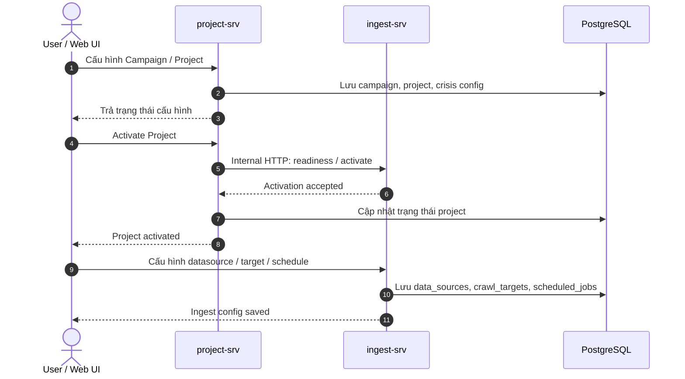
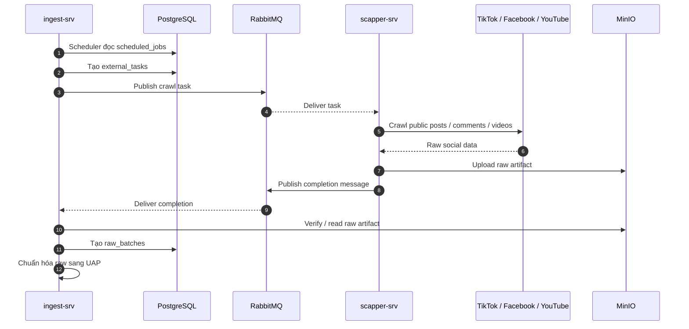
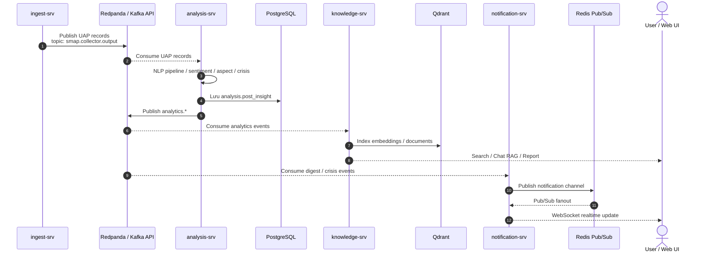

# SMAP - 3 luồng hệ thống để đưa vào slide

File này chia luồng tổng thể thành 3 hình nhỏ để trình bày dễ hơn trong 15 phút. Mỗi hình chỉ tập trung vào một ý: cấu hình, ingest, và outflow phân tích/cảnh báo.

---

## Hình 1 - Luồng Thiết lập & Kích hoạt Chiến dịch

Trọng tâm: tách rời quản lý nghiệp vụ dự án ở `project-srv` và quản lý kỹ thuật thu thập dữ liệu ở `ingest-srv`.

Gợi ý nói ngắn:

- `project-srv` giữ business context: campaign, project, trạng thái, cấu hình crisis.
- `ingest-srv` giữ execution context: datasource, target, schedule, task lineage.
- Khi activate, `project-srv` gọi internal HTTP sang `ingest-srv` để bắt đầu phần thu thập.

---

## Hình 2 - Luồng Thu thập & Chuẩn hóa Dữ liệu Thô

Trọng tâm: bất đồng bộ qua RabbitMQ và MinIO để crawler có thể scale, không làm nghẽn core service.

Gợi ý nói ngắn:

- RabbitMQ đóng vai trò buffer cho crawl task, giúp `scapper-srv` scale độc lập.
- Raw data lớn không đi trực tiếp trong message, mà lưu ở MinIO theo kiểu artifact reference.
- UAP là định dạng chung, giúp tầng analysis không cần biết dữ liệu đến từ TikTok, Facebook hay YouTube.

---

## Hình 3 - Luồng Phân tích, Tri thức & Cảnh báo Realtime

Trọng tâm: Redpanda/Kafka API cho analytics streaming, PostgreSQL cho read model, Qdrant cho vector search, Redis/WebSocket cho realtime.

Gợi ý nói ngắn:

- Redpanda/Kafka API phù hợp với luồng UAP/analytics vì đây là stream record lớn và có nhiều consumer.
- `analysis-srv` tạo read model chính ở `analysis.post_insight`.
- `knowledge-srv` index vào Qdrant để phục vụ AI search, chat RAG và report.
- `notification-srv` nhận digest/crisis event, đẩy qua Redis Pub/Sub và WebSocket cho realtime dashboard.

