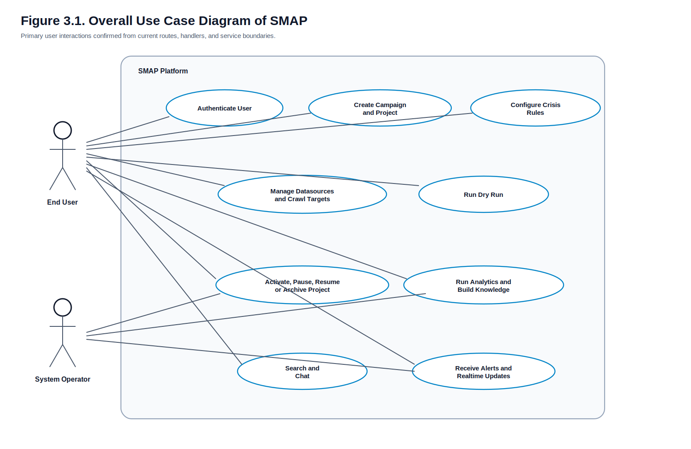
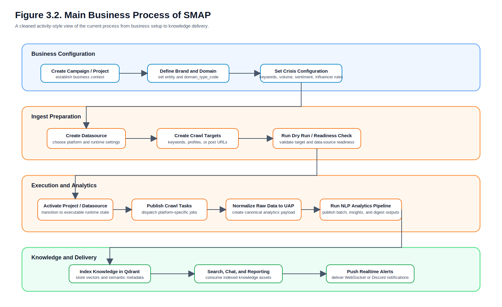

# CHAPTER 3: SYSTEM ANALYSIS

## 3.1 Requirements Gathering

### 3.1.1 Lớp lý thuyết

Trong các đồ án hoặc luận văn phần mềm, yêu cầu hệ thống thường được thu thập từ nhiều nguồn như phỏng vấn stakeholder, khảo sát hiện trạng, phân tích tài liệu nghiệp vụ và đối chiếu với mã nguồn hiện có. Đối với các hệ thống đã được hiện thực một phần hoặc đang phát triển theo hướng tiến hóa, phương pháp thu thập yêu cầu dựa trên tài liệu và mã nguồn có giá trị rất lớn vì nó cho phép xác định chênh lệch giữa yêu cầu dự kiến và năng lực thực tế của hệ thống.

Phương pháp document-driven analysis thường bao gồm ba bước. Thứ nhất là xác định tài liệu có giá trị định hướng nghiệp vụ, ví dụ BRD tổng quan hoặc architecture notes. Thứ hai là rà soát các API routes, contracts, configs và deployment manifests để xác nhận những yêu cầu nào đã được hiện thực. Thứ ba là đối chiếu giữa tài liệu lịch sử và current code để loại bỏ các giả định đã lỗi thời. Phương pháp này đặc biệt hữu ích khi hệ thống có nhiều service và có sự lệch pha giữa report cũ với kiến trúc hiện tại.

### 3.1.2 Lớp phân tích trên dự án SMAP

Đối với SMAP, việc thu thập yêu cầu trong luận văn này không dựa trên biên bản phỏng vấn trực tiếp vì workspace hiện tại không chứa các artifact như meeting notes, issue tickets hay sprint specifications. Thay vào đó, yêu cầu được tổng hợp từ bốn nguồn chính.

Nguồn thứ nhất là tài liệu bối cảnh nghiệp vụ tại `../tong-quan.md`. Tài liệu này đóng vai trò gần với BRD tổng quan, mô tả mục tiêu sản phẩm, khách hàng mục tiêu, giá trị cốt lõi, các entity chính như `Campaign`, `Project`, `Datasource`, `CrawlTarget`, `CrisisConfig`, và các năng lực như social listening, market intelligence, crisis monitoring, reporting và RAG.

Nguồn thứ hai là các README của từng service. Các README này không chỉ liệt kê stack công nghệ mà còn mô tả trách nhiệm của từng service, các luồng nghiệp vụ chính, entity ownership và đôi khi cả topic/queue/runtime contracts.

Nguồn thứ ba là các file route và handler, dùng để xác nhận trực tiếp các use case đã được hiện thực ở mức API hoặc delivery layer. Ví dụ, login flow có thể được xác nhận qua route `/login`, `/callback`, `/me`, `/logout` trong `identity-srv`, trong khi project lifecycle có thể được xác nhận qua các route `activate`, `pause`, `resume`, `archive` trong `project-srv`.

Nguồn thứ tư là các contract docs và gap docs, tiêu biểu như `../notification-srv/documents/contracts.md`, `../scapper-srv/RABBITMQ.md`, và `../document/gap/007_reporting_execution_and_transport_contract_mismatch.md`. Các file này giúp tách biệt rõ giữa current-state và target-state, đồng thời ngăn việc luận văn lặp lại transport model cũ đã không còn phản ánh đúng hiện trạng.

### 3.1.3 Lớp minh họa từ mã nguồn

Các bằng chứng quan trọng dùng để tổng hợp yêu cầu bao gồm:

- `../identity-srv/internal/authentication/delivery/http/routes.go`, nơi route login, callback, logout và me được định nghĩa.
- `../project-srv/internal/project/delivery/http/routes.go`, nơi route tạo project trong campaign, xem danh sách project, kiểm tra điều kiện kích hoạt, activate, pause, resume, archive và delete được hiện thực.
- `../project-srv/internal/crisis/delivery/http/routes.go`, nơi route quản lý crisis config được định nghĩa.
- `../ingest-srv/internal/datasource/delivery/http/routes.go` và `../ingest-srv/internal/dryrun/delivery/http/routes.go`, nơi route quản lý datasource, target và dry run được hiện thực.
- `../knowledge-srv/internal/search/delivery/http/routes.go` và `../knowledge-srv/internal/chat/delivery/http/routes.go`, nơi search và chat workflows được công bố ở lớp HTTP.
- `../notification-srv/internal/websocket/delivery/http/routes.go` cùng `../notification-srv/documents/contracts.md`, nơi kết nối WebSocket và các message types được chốt.

Từ các nguồn trên, có thể kết luận rằng yêu cầu trong chương này là kết quả của `document-driven requirements extraction` có đối chiếu với current implementation, thay vì là danh sách yêu cầu giả định hoặc thuần lý thuyết.

## 3.2 Functional Requirements

### 3.2.1 Lớp lý thuyết

Yêu cầu chức năng mô tả những gì hệ thống phải thực hiện để đáp ứng mục tiêu nghiệp vụ. Trong các hệ thống đa dịch vụ, yêu cầu chức năng không nên chỉ viết ở mức màn hình hay API endpoint riêng lẻ, mà cần diễn đạt ở mức capability đủ lớn để có thể ánh xạ sang bounded context, transport và implementation modules.

Để một bảng yêu cầu chức năng có thể sử dụng trong luận văn, mỗi yêu cầu nên có ít nhất bốn thành phần: mã yêu cầu, tên yêu cầu, mô tả ngắn gọn, và mức độ ưu tiên. Khi các yêu cầu này được nối với evidence thực tế từ source code, chúng có thể được dùng làm cơ sở cho traceability matrix giữa Chương 3, Chương 4 và Chương 5.

### 3.2.2 Bảng yêu cầu chức năng

Table 3.1 presents the functional requirements extracted from the current SMAP source code and service documentation.

| ID | Name | Description | Priority |
| --- | --- | --- | --- |
| FR-01 | User Authentication | Hệ thống phải cho phép người dùng đăng nhập bằng Google OAuth2, duy trì phiên làm việc và lấy thông tin người dùng hiện tại | High |
| FR-02 | Campaign and Project Management | Hệ thống phải cho phép tạo campaign, tạo project trong campaign, xem danh sách, cập nhật và xóa project | High |
| FR-03 | Project Lifecycle Control | Hệ thống phải cho phép kiểm tra điều kiện kích hoạt và thay đổi trạng thái project như activate, pause, resume, archive, unarchive | High |
| FR-04 | Crisis Configuration Management | Hệ thống phải cho phép cấu hình, xem và xóa crisis rules cho từng project | High |
| FR-05 | Datasource Management | Hệ thống phải cho phép tạo, xem, cập nhật, archive và xóa datasource | High |
| FR-06 | Crawl Target Management | Hệ thống phải cho phép tạo và quản lý crawl target theo keyword, profile và post | High |
| FR-07 | Dry Run Validation | Hệ thống phải cho phép chạy dry run cho datasource và truy vấn lịch sử, kết quả dry run gần nhất | High |
| FR-08 | Crawl Runtime Orchestration | Hệ thống phải cho phép publish crawl tasks, nhận completion metadata và liên kết raw artifacts vào ingest flow | High |
| FR-09 | Analytics Processing | Hệ thống phải tiêu thụ UAP events, chạy pipeline NLP và sinh analytics outputs downstream | High |
| FR-10 | Knowledge Search and Chat | Hệ thống phải hỗ trợ semantic search, chat, tra cứu conversation và suggestion generation | High |
| FR-11 | Realtime Notification | Hệ thống phải hỗ trợ kết nối WebSocket và đẩy các message types như onboarding, analytics progress, campaign event và crisis alert | Medium |
| FR-12 | Internal Service Validation | Hệ thống phải hỗ trợ một số internal routes phục vụ liên thông giữa các service như token validation hoặc internal project/detail lookups | Medium |

### 3.2.3 Lớp phân tích trên dự án SMAP

Nhìn từ góc độ chức năng, hệ thống SMAP được chia thành ba nhóm capability lớn.

Nhóm thứ nhất là `business configuration capabilities`, gồm xác thực người dùng, quản lý campaign, project, crisis config, datasource và crawl target. Đây là nhóm capability phục vụ thiết lập ngữ cảnh kinh doanh và đầu vào cho toàn bộ pipeline.

Nhóm thứ hai là `execution and processing capabilities`, gồm dry run, kiểm tra điều kiện kích hoạt, lifecycle control, crawl orchestration và analytics processing. Đây là trục giúp hệ thống chuyển từ cấu hình tĩnh sang xử lý dữ liệu thực.

Nhóm thứ ba là `consumption and delivery capabilities`, gồm semantic search, chat, truy hồi phục vụ báo cáo và realtime notifications. Đây là phần đưa kết quả xử lý đến người dùng cuối dưới dạng insight có thể hành động.

Sự phân nhóm này khớp chặt với kiến trúc nhiều lớp của hệ thống. Nói cách khác, yêu cầu chức năng không xuất hiện rời rạc mà phản ánh trực tiếp cách hệ thống đã được chia thành `project-srv`, `ingest-srv`, `analysis-srv`, `knowledge-srv` và `notification-srv`.

### 3.2.4 Lớp minh họa từ mã nguồn

- FR-01 được hiện thực tại `../identity-srv/internal/authentication/delivery/http/routes.go` qua các route `/login`, `/callback`, `/logout`, `/me`; logic chính nằm tại `../identity-srv/internal/authentication/delivery/http/oauth.go` qua `OAuthLogin`, `OAuthCallback` và tại `handlers.go` qua `Logout`, `GetMe`.
- FR-02 và FR-03 được hiện thực tại `../project-srv/internal/project/delivery/http/routes.go` thông qua các route `POST /campaigns/:id/projects`, `GET /campaigns/:id/projects`, `GET /projects/:project_id`, `PUT /projects/:project_id`, `POST /projects/:project_id/activate`, `pause`, `resume`, `archive`, `unarchive`, `DELETE /projects/:project_id`.
- FR-04 được hiện thực tại `../project-srv/internal/crisis/delivery/http/routes.go` qua các route `PUT/GET/DELETE /projects/:project_id/crisis-config`.
- FR-05, FR-06, FR-07 được hiện thực tại `../ingest-srv/internal/datasource/delivery/http/routes.go` và `../ingest-srv/internal/dryrun/delivery/http/routes.go`.
- FR-09 được hiện thực tại `../analysis-srv/internal/consumer/server.py` qua `ConsumerServer._handle_message` và `../analysis-srv/internal/pipeline/usecase/usecase.py` qua hàm `run`.
- FR-10 được hiện thực tại `../knowledge-srv/internal/search/delivery/http/handlers.go` qua `Search`, và `../knowledge-srv/internal/chat/delivery/http/handlers.go` qua `Chat`, `GetChatJob`.
- FR-11 được hiện thực tại `../notification-srv/internal/websocket/delivery/http/handlers.go` qua `HandleWebSocket`, kết hợp contract tại `../notification-srv/documents/contracts.md`.

### 3.2.5 Traceability Matrix cho yêu cầu chức năng

Table 3.2 links each functional requirement to the service, file and implementation entry point where the capability is realized.

| Requirement ID | Module / Service | Evidence file | Evidence function / route |
| --- | --- | --- | --- |
| FR-01 | `identity-srv` | `../identity-srv/internal/authentication/delivery/http/oauth.go` | `OAuthLogin`, `OAuthCallback` |
| FR-02 | `project-srv` | `../project-srv/internal/project/delivery/http/routes.go` | campaign/project CRUD routes |
| FR-03 | `project-srv`, `ingest-srv` | `../project-srv/internal/project/delivery/http/routes.go`, `../ingest-srv/internal/datasource/usecase/project_lifecycle.go` | `Activate`, `Pause`, `Resume` |
| FR-04 | `project-srv` | `../project-srv/internal/crisis/delivery/http/routes.go` | `PUT/GET/DELETE crisis-config` |
| FR-05 | `ingest-srv` | `../ingest-srv/internal/datasource/delivery/http/routes.go` | datasource CRUD routes |
| FR-06 | `ingest-srv` | `../ingest-srv/internal/datasource/delivery/http/routes.go` | target create/list/update/activate/deactivate |
| FR-07 | `ingest-srv` | `../ingest-srv/internal/dryrun/delivery/http/routes.go` | `Trigger`, `GetLatest`, `ListHistory` |
| FR-08 | `ingest-srv`, `scapper-srv` | `../scapper-srv/app/publisher.py`, `../scapper-srv/RABBITMQ.md` | `publish_task`, `publish_completion` |
| FR-09 | `analysis-srv` | `../analysis-srv/internal/consumer/server.py`, `../analysis-srv/internal/pipeline/usecase/usecase.py` | `_handle_message`, `run` |
| FR-10 | `knowledge-srv` | `../knowledge-srv/internal/search/usecase/search.go`, `../knowledge-srv/internal/chat/usecase/chat.go` | `Search`, `Chat` |
| FR-11 | `notification-srv` | `../notification-srv/internal/websocket/delivery/http/handlers.go` | `HandleWebSocket` |
| FR-12 | multiple services | route files under `internal/*/delivery/http/routes.go` | internal routes protected by internal auth |

### 3.2.6 Requirement Priority Classification Matrix

Table 3.3 classifies the functional requirements by implementation priority, based on their role in maintaining a minimally operational system.

| Requirement ID | Mức ưu tiên | Lý do phân loại |
| --- | --- | --- |
| FR-01 | Must-have | xác thực là điều kiện tiên quyết cho protected routes và WebSocket access |
| FR-02 | Must-have | campaign/project là hạt nhân business context của toàn hệ thống |
| FR-03 | Must-have | lifecycle control chi phối lane runtime và readiness |
| FR-04 | Should-have | crisis configuration quan trọng cho monitoring nâng cao nhưng không phải điều kiện để hệ chạy tối thiểu |
| FR-05 | Must-have | không có datasource thì ingest layer không thể hoạt động |
| FR-06 | Must-have | crawl target là đầu vào trực tiếp của runtime |
| FR-07 | Should-have | dry run giúp tăng độ an toàn và readiness trước khi activation |
| FR-08 | Must-have | crawl orchestration là lõi của ingest execution |
| FR-09 | Must-have | analytics processing là lớp tạo giá trị kỹ thuật trung tâm |
| FR-10 | Should-have | search/chat là lớp tiêu thụ tri thức nâng cao |
| FR-11 | Should-have | notification là lớp delivery quan trọng nhưng không phải điều kiện duy nhất để pipeline tồn tại |
| FR-12 | Should-have | internal validation routes hỗ trợ tính ổn định liên service |

## 3.3 Non-functional Requirements

### 3.3.1 Lớp lý thuyết

Yêu cầu phi chức năng mô tả các ràng buộc về chất lượng của hệ thống như hiệu năng, bảo mật, khả năng sẵn sàng, khả năng mở rộng và khả năng bảo trì. Trong các hệ thống đa dịch vụ, yêu cầu phi chức năng thường có tác động trực tiếp đến thiết kế kiến trúc: việc chọn message broker, storage layer, health probes, HPA hay authentication flow đều là phản hồi đối với một hoặc nhiều yêu cầu phi chức năng.

Một hệ thống chỉ có yêu cầu chức năng đầy đủ nhưng không có yêu cầu phi chức năng rõ ràng sẽ rất khó được triển khai ổn định trong môi trường thực tế. Vì vậy, phần này không chỉ liệt kê các yêu cầu chất lượng mà còn đối chiếu trực tiếp với manifest và runtime config hiện tại.

### 3.3.2 Bảng yêu cầu phi chức năng

Table 3.4 summarizes the non-functional requirements that can be inferred and evidenced from manifests, configuration files and service structure.

| ID | Category | Requirement | Evidence / Indicator |
| --- | --- | --- | --- |
| NFR-01 | Performance | Analytics pipeline phải hỗ trợ xử lý bất đồng bộ và consumer-based throughput thay vì request-response đồng bộ | `analysis-srv/internal/consumer/server.py`, `analysis-srv/internal/pipeline/usecase/usecase.py` |
| NFR-02 | Security | Hệ thống phải hỗ trợ OAuth2 login, JWT, cookie-based session và internal service authentication | `identity-srv/config/auth-config.yaml`, `notification-srv/documents/contracts.md` |
| NFR-03 | Availability | Workloads quan trọng phải có health check hoặc probe để phát hiện lỗi runtime | `analysis-srv/apps/consumer/deployment.yaml` |
| NFR-04 | Scalability | Analytics consumer phải có khả năng scale theo CPU và workload | `analysis-srv/manifests/hpa.yaml` |
| NFR-05 | Data Integrity | Các flow bất đồng bộ phải dùng correlation keys hoặc canonical contracts | `scapper-srv/RABBITMQ.md`, `3-event-contracts.md` |
| NFR-06 | Modularity | Các bounded contexts phải được tách thành service/module độc lập | cấu trúc thư mục + `go.mod` / `pyproject.toml` riêng |
| NFR-07 | Observability | Hệ thống phải hỗ trợ logging có cấu hình và metrics ở ít nhất một số workload | `analysis-srv/pyproject.toml`, `shared-libs/go/go.mod`, `knowledge-srv/go.mod` |

### 3.3.3 Lớp phân tích trên dự án SMAP

Về hiệu năng, việc tách `analysis-srv` ra thành một consumer service độc lập cho thấy hệ thống không kỳ vọng analytics chạy trong request lifecycle đồng bộ. Đây là một phản hồi trực tiếp trước tính chất nặng của NLP pipeline. HPA theo CPU trong `analysis-srv/manifests/hpa.yaml` còn cho thấy analytics workload được xem là có thể co giãn theo mức tải xử lý thực tế.

Về bảo mật, `identity-srv` đóng vai trò security boundary của toàn hệ thống. Việc kết hợp Google OAuth2, JWT HS256, HttpOnly cookie, Redis-backed session/blacklist và internal shared key thể hiện một chiến lược bảo mật nhiều lớp, phù hợp với hệ đa dịch vụ có cả external users lẫn service-to-service communication.

Về tính sẵn sàng và khả năng mở rộng, các Docker Compose stacks và Kubernetes manifests cho thấy hệ thống đã được tổ chức để chạy theo workload tách rời, thay vì triển khai như một application khối. Việc tách từng lane còn làm giảm blast radius khi một thành phần nặng như analytics gặp sự cố.

### 3.3.4 Lớp minh họa từ mã nguồn

- `../analysis-srv/apps/consumer/deployment.yaml` định nghĩa `livenessProbe`, `startupProbe`, resource requests/limits và rolling update strategy cho `analysis-consumer`.
- `../analysis-srv/manifests/hpa.yaml` định nghĩa autoscaling dựa trên CPU, `minReplicas: 1`, `maxReplicas: 3`.
- `../identity-srv/config/auth-config.yaml` định nghĩa `oauth2`, `jwt`, `cookie`, `session`, `blacklist`, `internal.service_keys`.
- `../scapper-srv/RABBITMQ.md` quy định `task_id` là correlation key và completion envelope phải idempotent theo `task_id`.

### 3.3.5 Stakeholder-to-Requirement Traceability Matrix

Table 3.5 connects stakeholder groups with the requirement groups that matter most to each role in the current system.

| Stakeholder | Nhu cầu chính | Yêu cầu liên quan |
| --- | --- | --- |
| End User / Analyst | đăng nhập, cấu hình project, tìm kiếm, nhận cảnh báo | FR-01, FR-02, FR-03, FR-04, FR-10, FR-11 |
| Marketing / Brand Team | quản lý campaign, theo dõi dữ liệu, xem báo cáo | FR-02, FR-05, FR-06, FR-09, FR-10 |
| System Operator | kiểm soát runtime, theo dõi dry run, hạn chế lỗi lifecycle | FR-03, FR-07, FR-08, FR-12 |
| Data / ML Team | đảm bảo analytics pipeline và contract downstream đúng | FR-08, FR-09, FR-10, NFR-01, NFR-05 |
| DevOps / Platform Team | bảo mật, khả năng mở rộng, tính sẵn sàng | NFR-02, NFR-03, NFR-04, NFR-06, NFR-07 |

## 3.4 Use Case Analysis

### 3.4.1 Overall Use Case Diagram

Hình 3.1 trình bày sơ đồ use case tổng quát của hệ thống SMAP dựa trên các route và contract hiện có.

**Figure 3.1. Overall Use Case Diagram of SMAP.**

Đoạn thứ nhất của sơ đồ tập trung vào lớp cấu hình nghiệp vụ. Từ phía `End User`, các tương tác chính gồm xác thực, tạo campaign/project, cấu hình luật khủng hoảng, quản lý datasource, chạy dry run, kích hoạt project, tìm kiếm và nhận cảnh báo. Điều này phản ánh đúng current code: identity routes được tách ở `identity-srv`, project và crisis routes ở `project-srv`, còn datasource và dry run routes ở `ingest-srv`.

Đoạn thứ hai của sơ đồ cho thấy có sự hiện diện của `System Operator`. Tác nhân này không nhất thiết là một end-user cuối, mà là vai trò quản trị hoặc vận hành hệ thống, liên quan đến các use case như kích hoạt/tạm dừng execution flow, theo dõi runtime và xử lý alerting. Việc thêm actor này giúp phân biệt rõ use case nghiệp vụ với use case vận hành, một điểm cần thiết trong các hệ thống đa dịch vụ có control plane nội bộ.

### 3.4.2 Use Case Specification

#### UC-01: Authenticate User

| Thuộc tính | Nội dung |
| --- | --- |
| Mục tiêu | Cho phép người dùng đăng nhập và lấy được phiên làm việc hợp lệ |
| Actor chính | End User |
| Tiền điều kiện | Người dùng chưa có phiên hợp lệ hoặc cần xác thực lại |
| Kích hoạt | Người dùng truy cập luồng login |
| Hậu điều kiện | JWT/cookie được phát, người dùng có thể truy cập protected routes |

Luồng chính:

1. Người dùng gọi endpoint login.
2. `identity-srv` chuyển hướng người dùng sang Google OAuth2.
3. Google gọi callback về hệ thống sau khi xác thực thành công.
4. `identity-srv` xử lý callback, tạo session và phát token/cookie.
5. Người dùng gọi `/me` hoặc truy cập các route bảo vệ.

Minh họa hiện thực:

- Route được định nghĩa tại `../identity-srv/internal/authentication/delivery/http/routes.go`.
- Logic chính được hiện thực tại `../identity-srv/internal/authentication/delivery/http/oauth.go` qua `OAuthLogin` và `OAuthCallback`.
- Tạo session được thực hiện tại `../identity-srv/internal/authentication/usecase/util.go` qua `createSession`.

#### UC-02: Create Campaign and Project

| Thuộc tính | Nội dung |
| --- | --- |
| Mục tiêu | Tạo một project gắn với campaign và business context |
| Actor chính | End User |
| Tiền điều kiện | Người dùng đã đăng nhập |
| Kích hoạt | Người dùng chọn tạo campaign/project mới |
| Hậu điều kiện | Campaign và project tồn tại trong persistence layer |

Luồng chính:

1. Người dùng gửi yêu cầu tạo campaign hoặc tạo project trong một campaign.
2. `project-srv` xác thực người dùng, kiểm tra dữ liệu đầu vào và lưu vào database.
3. Project mới được trả về cùng business metadata cơ bản.

Minh họa hiện thực:

- Route tạo project nằm tại `../project-srv/internal/project/delivery/http/routes.go` qua `POST /campaigns/:id/projects`.
- Persistence hiện thực tại `../project-srv/internal/project/repository/postgre/project.go` qua hàm `Create`.

#### UC-03: Configure Datasource and Run Dry Run

| Thuộc tính | Nội dung |
| --- | --- |
| Mục tiêu | Tạo datasource, target và kiểm tra readiness trước khi chạy thật |
| Actor chính | End User |
| Tiền điều kiện | Project đã tồn tại |
| Kích hoạt | Người dùng cấu hình nguồn dữ liệu và chạy dry run |
| Hậu điều kiện | Hệ thống lưu datasource, target và kết quả dry run |

Luồng chính:

1. Người dùng tạo datasource.
2. Người dùng thêm crawl target cho datasource.
3. Người dùng kích hoạt dry run.
4. Hệ thống lưu kết quả dry run và bằng chứng về mức sẵn sàng.

Minh họa hiện thực:

- Route datasource nằm tại `../ingest-srv/internal/datasource/delivery/http/routes.go`.
- Route dry run nằm tại `../ingest-srv/internal/dryrun/delivery/http/routes.go`.
- Activation của target được hiện thực tại `../ingest-srv/internal/datasource/usecase/target.go` qua `ActivateTarget`.

#### UC-04: Execute Analytics and Build Knowledge

| Thuộc tính | Nội dung |
| --- | --- |
| Mục tiêu | Chạy analytics pipeline và xây dựng knowledge index downstream |
| Actor chính | System Operator / System Runtime |
| Tiền điều kiện | Dữ liệu UAP đã được publish |
| Kích hoạt | UAP event xuất hiện trên Kafka |
| Hậu điều kiện | Analytics outputs và knowledge index được sinh ra |

Luồng chính:

1. `analysis-srv` consume message từ `smap.collector.output`.
2. Pipeline NLP được kích hoạt và xử lý từng batch.
3. Kết quả được publish sang các topic analytics downstream.
4. `knowledge-srv` consume các topic này và index vào Qdrant.

Minh họa hiện thực:

- `../analysis-srv/internal/consumer/server.py` qua `ConsumerServer._handle_message`
- `../analysis-srv/internal/pipeline/usecase/usecase.py` qua `run`
- `../knowledge-srv/internal/indexing/delivery/kafka/consumer/consumer.go` qua các consumer groups cho `batch.completed`, `report.digest`, `insights.published`

#### UC-05: Search and Chat Over Knowledge

| Thuộc tính | Nội dung |
| --- | --- |
| Mục tiêu | Cho phép người dùng tìm kiếm ngữ nghĩa và tương tác qua chat |
| Actor chính | End User |
| Tiền điều kiện | Người dùng đã đăng nhập; dữ liệu đã được index |
| Kích hoạt | Người dùng gửi truy vấn search hoặc chat |
| Hậu điều kiện | Kết quả search hoặc câu trả lời được trả về |

Luồng chính:

1. Người dùng gửi yêu cầu search hoặc chat.
2. `knowledge-srv` xác thực người dùng.
3. Search usecase truy vấn Qdrant và các tầng dữ liệu liên quan.
4. Chat usecase kết hợp search results với generation logic hoặc notebook fallback.

Minh họa hiện thực:

- Route search tại `../knowledge-srv/internal/search/delivery/http/routes.go` qua `POST /search`.
- Route chat tại `../knowledge-srv/internal/chat/delivery/http/routes.go` qua `POST /chat` và `GET /chat/jobs/:job_id`.
- Logic tại `../knowledge-srv/internal/search/usecase/search.go` qua `Search` và `../knowledge-srv/internal/chat/usecase/chat.go` qua `Chat`, `GetChatJobStatus`.

#### UC-06: Receive Realtime Alerts

| Thuộc tính | Nội dung |
| --- | --- |
| Mục tiêu | Đẩy cảnh báo và tiến độ xử lý theo thời gian thực tới người dùng |
| Actor chính | End User |
| Tiền điều kiện | Người dùng đã có JWT hợp lệ và kết nối WebSocket |
| Kích hoạt | Backend services publish message vào Redis channels |
| Hậu điều kiện | Browser hoặc Discord nhận được message tương ứng |

Luồng chính:

1. Client mở kết nối `GET /ws`.
2. `notification-srv` xác thực token/cookie.
3. Backend service publish message vào Redis theo channel pattern tương ứng.
4. `notification-srv` subscribe, transform và đẩy message đến client.

Minh họa hiện thực:

- Route WebSocket tại `../notification-srv/internal/websocket/delivery/http/routes.go` qua `GET /ws`.
- Handler tại `../notification-srv/internal/websocket/delivery/http/handlers.go` qua `HandleWebSocket`.
- Message contracts tại `../notification-srv/documents/contracts.md`.

Table 3.6 summarizes the use cases described in this section and highlights the main service boundaries involved in each flow.

| Use Case ID | Tên use case | Actor chính | Service chính tham gia |
| --- | --- | --- | --- |
| UC-01 | Authenticate User | End User | `identity-srv` |
| UC-02 | Create Campaign and Project | End User | `project-srv` |
| UC-03 | Configure Datasource and Run Dry Run | End User | `ingest-srv` |
| UC-04 | Execute Analytics and Build Knowledge | System Runtime / Operator | `analysis-srv`, `knowledge-srv` |
| UC-05 | Search and Chat Over Knowledge | End User | `knowledge-srv` |
| UC-06 | Receive Realtime Alerts | End User | `notification-srv` |

## 3.5 Business Process Modeling

### 3.5.1 Mô hình quy trình nghiệp vụ chính

Hình 3.2 mô tả quy trình nghiệp vụ chính của SMAP ở current-state theo góc nhìn activity-style.

**Figure 3.2. Main Business Process of SMAP.**

Đoạn đầu của quy trình cho thấy luồng bắt đầu từ lớp business configuration. Người dùng tạo campaign hoặc project, sau đó khai báo business metadata và nếu cần thì gắn thêm crisis configuration. Đây là giai đoạn tạo ngữ cảnh để toàn bộ pipeline downstream hiểu hệ thống đang theo dõi đối tượng nào và theo domain nào. Nếu thiếu bước này, các phân tích downstream khó có thể diễn giải được đúng intent của bài toán.

Đoạn sau của quy trình cho thấy hệ thống chuyển từ cấu hình sang vận hành. `ingest-srv` tạo datasource, tạo crawl target, chạy dry run, rồi đi vào activation và crawl orchestration. Dữ liệu raw sau đó được chuẩn hóa thành UAP, chuyển qua `analysis-srv` để xử lý NLP, rồi được index ở `knowledge-srv` trước khi được dùng cho search, report hoặc notification. Quy trình này thể hiện rất rõ sự phân tách cơ chế truyền thông theo từng giai đoạn: phần đầu nghiêng về control/configuration, phần giữa là work queue và streaming, còn phần cuối là retrieval và delivery.

### 3.5.2 Lớp lý thuyết

Business process modeling giúp nối yêu cầu nghiệp vụ với kiến trúc hiện thực. Đối với các hệ thống nhiều dịch vụ, activity hoặc BPMN diagram có vai trò làm cầu nối giữa use case mức người dùng và sequence diagram mức kỹ thuật. Chúng cho phép nhận diện các điểm chuyển trạng thái, các nút đồng bộ và các nơi dữ liệu đổi dạng, ví dụ từ business metadata sang runtime payload, hoặc từ raw artifact sang canonical record.

### 3.5.3 Lớp phân tích trên dự án SMAP

Quy trình chính của SMAP có thể được chia thành bốn pha. Pha một là cấu hình nghiệp vụ. Pha hai là chuẩn bị ingest. Pha ba là execution và analytics. Pha bốn là knowledge và delivery. Cách chia này đồng nhất với các bounded contexts đang tồn tại trong workspace, và do đó sẽ được giữ làm trục liên kết chính cho Chương 4 và Chương 5.

### 3.5.4 Lớp minh họa từ mã nguồn

- Pha cấu hình nghiệp vụ có bằng chứng ở `../project-srv/internal/project/delivery/http/routes.go` và `../project-srv/internal/crisis/delivery/http/routes.go`.
- Pha chuẩn bị ingest có bằng chứng ở `../ingest-srv/internal/datasource/delivery/http/routes.go` và `../ingest-srv/internal/dryrun/delivery/http/routes.go`.
- Pha analytics có bằng chứng ở `../analysis-srv/internal/consumer/server.py` và `../analysis-srv/internal/pipeline/usecase/usecase.py`.
- Pha knowledge và delivery có bằng chứng ở `../knowledge-srv/internal/search/usecase/search.go`, `../knowledge-srv/internal/chat/usecase/chat.go`, và `../notification-srv/internal/websocket/delivery/http/handlers.go`.

## 3.6 Kết luận chương

Phân tích trong chương này cho thấy current SMAP đã hình thành một hệ thống có tập yêu cầu chức năng và phi chức năng khá rõ, dù chúng chưa được đóng gói sẵn thành một SRS hoàn chỉnh trong repo. Việc tổng hợp yêu cầu từ mã nguồn và tài liệu hiện tại cho phép xây dựng một nền tảng phân tích đáng tin cậy cho các chương thiết kế và hiện thực.

Quan trọng hơn, các functional requirements, non-functional requirements, use cases và business process ở đây đều đã được nối với source-code evidence cụ thể. Nhờ đó, Chương 4 có thể thiết kế hệ thống bám sát thực tế, và Chương 5 có thể giải thích hiện thực hóa từng capability mà không rơi vào tình trạng “thiết kế một hệ thống khác với hệ thống đang có”.
