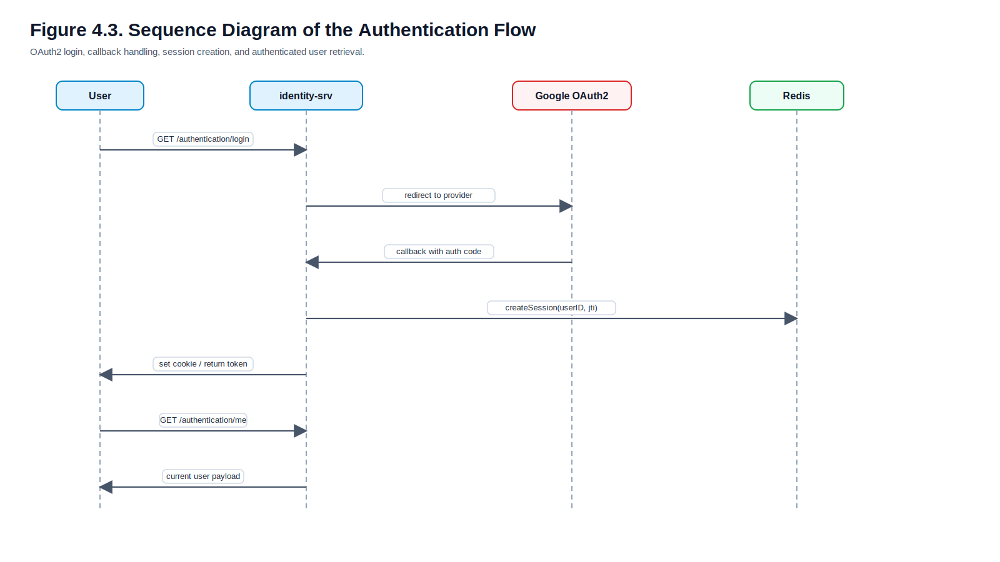
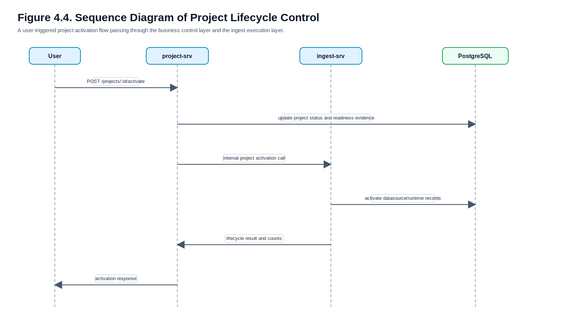
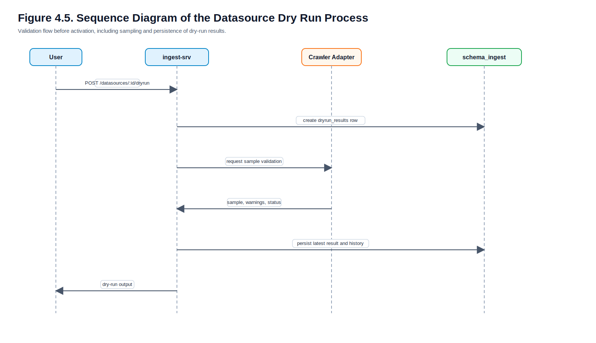
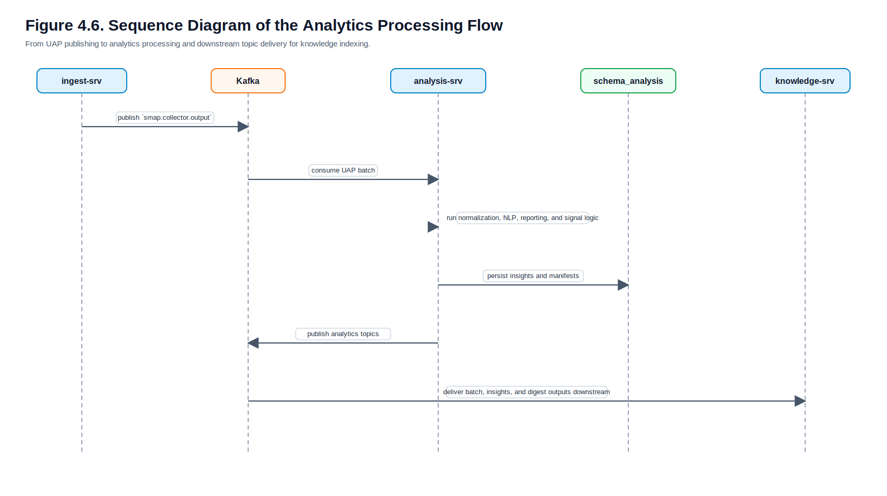
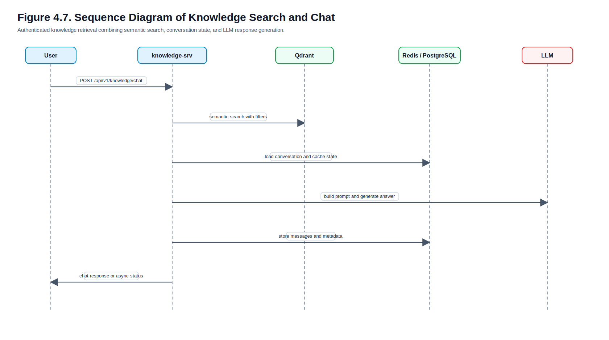
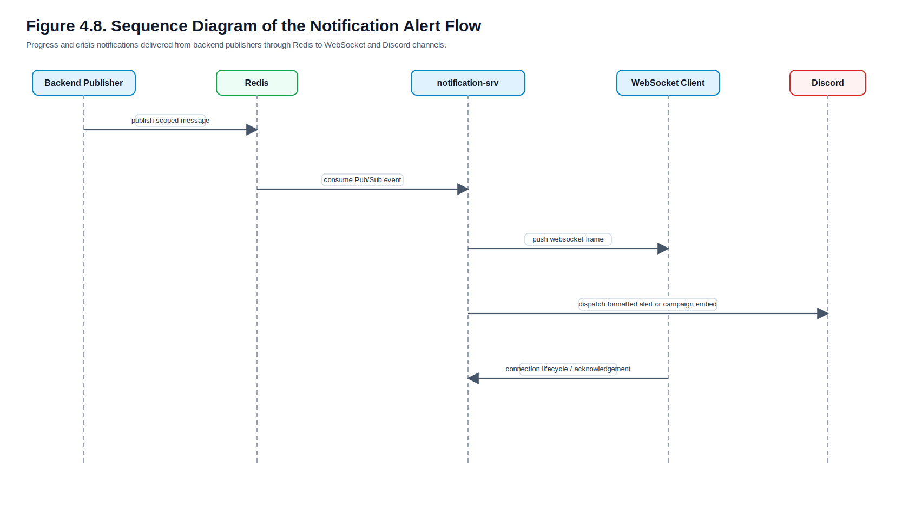

# CHAPTER 4: SYSTEM DESIGN

## 4.1 System Architecture

### 4.1.1 Lớp lý thuyết

Thiết kế kiến trúc hệ thống là bước chuyển từ yêu cầu ở Chương 3 sang mô hình tổ chức thành phần có thể hiện thực được. Đối với các hệ thống đa dịch vụ, kiến trúc tổng thể phải trả lời ba câu hỏi cốt lõi: thành phần nào chịu trách nhiệm cho nhóm chức năng nào, dữ liệu đi qua các thành phần theo cách nào, và các ràng buộc phi chức năng được phản ánh trong kiến trúc ra sao.

Một kiến trúc phù hợp không chỉ là sơ đồ hộp và mũi tên. Nó còn phải giải thích được ranh giới ownership, loại transport nào được dùng cho từng lane, và cách mà hệ thống duy trì được tính mở rộng, tính toàn vẹn dữ liệu và tính tách biệt giữa các lớp nghiệp vụ. Trong các hệ social analytics platform, vấn đề này càng quan trọng vì hệ thống đồng thời phải xử lý CRUD/API, task queue, analytics pipeline, object storage và knowledge retrieval.

### 4.1.2 Lớp phân tích trên dự án SMAP

Hình 4.1 trình bày kiến trúc tổng thể của SMAP ở current-state.

**Figure 4.1. High-level Architecture of SMAP.**


Kiến trúc này cho thấy SMAP được chia thành sáu nhóm thành phần chính. `identity-srv` tạo security boundary cho toàn hệ thống. `project-srv` giữ business context và lifecycle của campaign/project. `ingest-srv` cùng `scapper-srv` hình thành execution plane để điều phối crawl và chuẩn hóa dữ liệu. `analysis-srv` xử lý pipeline AI/NLP. `knowledge-srv` xây dựng lớp semantic search và RAG. `notification-srv` chịu trách nhiệm delivery theo thời gian thực. Các thành phần này kết nối với PostgreSQL, Redis, Kafka, RabbitMQ, MinIO và Qdrant theo cơ chế chuyên biệt hóa transport.

Một điểm quan trọng của kiến trúc hiện tại là không áp dụng một transport duy nhất cho toàn bộ hệ thống. Control plane giữa `project-srv` và `ingest-srv` nghiêng về internal HTTP. Crawl runtime dùng RabbitMQ. Data plane phân tích dùng Kafka. Notification ingress dùng Redis Pub/Sub. Cách tổ chức này phản ánh trực tiếp các yêu cầu phi chức năng đã nêu ở Chương 3, đặc biệt là yêu cầu về hiệu năng, khả năng mở rộng và tính phù hợp giữa workload với cơ chế giao tiếp.

### 4.1.3 Lớp minh họa từ mã nguồn

- `../identity-srv/internal/httpserver/handler.go` map các domain authentication và audit vào HTTP server.
- `../project-srv/internal/httpserver/handler.go` map các domain campaign, project và crisis config.
- `../ingest-srv/internal/httpserver/handler.go` map datasource, dryrun và internal APIs cho execution.
- `../analysis-srv/internal/consumer/server.py` là entry point của analytics consumer pipeline.
- `../knowledge-srv/internal/httpserver/handler.go` setup các domain search, chat, report, indexing và notebook.
- `../notification-srv/internal/httpserver/handler.go` map WebSocket route và system routes.

### 4.1.4 Architecture Decision Matrix

Table 4.1 summarizes the most important architecture decisions identified from the current codebase and supporting technical documents.

| Quyết định thiết kế | Lựa chọn | Lý do chính | Bằng chứng |
| --- | --- | --- | --- |
| Tách identity khỏi business services | `identity-srv` riêng | cô lập xác thực, JWT, session và OAuth2 | `identity-srv/internal/httpserver/handler.go`, `identity-srv/config/auth-config.yaml` |
| Tách project context khỏi ingest runtime | `project-srv` và `ingest-srv` riêng | giữ ownership business context tách khỏi execution plane | `project-srv/internal/project/delivery/http/routes.go`, `ingest-srv/internal/datasource/delivery/http/routes.go` |
| Dùng RabbitMQ cho crawl runtime | task queues theo platform | phù hợp work queue, completion correlation theo `task_id` | `ingest-srv/go.mod`, `scapper-srv/RABBITMQ.md` |
| Dùng Kafka cho analytics data plane | `smap.collector.output` và analytics topics | phù hợp batch consumer, fanout và downstream indexing | `analysis-srv/pyproject.toml`, `analysis-srv/README.md`, `knowledge-srv/go.mod` |
| Dùng Redis cho notification ingress | Pub/Sub channels theo scope | phù hợp fanout thời gian thực và routing nhẹ | `notification-srv/documents/contracts.md`, `notification-srv/go.mod` |
| Dùng Qdrant cho knowledge layer | vector store riêng | phục vụ semantic search và RAG | `knowledge-srv/go.mod`, `knowledge-srv/pkg/qdrant/qdrant.go` |

### 4.1.5 Service Ownership and Boundary Matrix

Table 4.2 clarifies ownership boundaries so that responsibilities are not confused across services during analysis, implementation or future maintenance.

| Service | Ownership chính | Không nên sở hữu | Boundary implication |
| --- | --- | --- | --- |
| `identity-srv` | OAuth2, JWT, session, token validation | business metadata, crawl runtime, analytics facts | security boundary tách khỏi domain logic |
| `project-srv` | campaign, project, crisis config, business metadata | raw batch, queue runtime state, vector index | owner của business context |
| `ingest-srv` | datasource, target, dry run, scheduled job, external task, raw batch, UAP publishing | OAuth/session, rich NLP logic, semantic retrieval | owner của execution plane và data ingress |
| `analysis-srv` | NLP enrichment, reporting bundle, crisis signals, analytics topics | project CRUD, datasource CRUD, websocket delivery | owner của analytics pipeline |
| `knowledge-srv` | semantic search, chat, notebook sync, indexed documents, conversations | crawl orchestration, project lifecycle control | owner của retrieval và knowledge consumption |
| `notification-srv` | WebSocket connection management, Discord alert formatting and dispatch | project decision logic, analytics computation | owner của delivery channels |
| `scapper-srv` | platform-specific crawling and completion publish | project business logic, analytics, semantic retrieval | worker runtime tách khỏi business services |

## 4.2 Database Design

### 4.2.1 Conceptual Schema (ERD)

#### Lớp lý thuyết

Conceptual schema mô tả các thực thể chính và quan hệ nghiệp vụ giữa chúng mà chưa đi sâu vào tất cả chi tiết vật lý. Ở mức này, mục tiêu là trả lời hệ thống đang quản lý những đối tượng nào và các đối tượng đó liên hệ với nhau ra sao. Đây là bước nền trước khi trình bày logical schema và data dictionary.

#### Lớp phân tích trên dự án SMAP

Hình 4.2 trình bày conceptual schema của các thực thể nghiệp vụ cốt lõi trong SMAP.

**Figure 4.2. Conceptual Schema of Core Business Entities.**


Sơ đồ này cho thấy `Campaign` là lớp grouping ở mức cao nhất. Mỗi `Campaign` có thể chứa nhiều `Project`. Mỗi `Project` có thể sở hữu nhiều `Datasource`. Mỗi `Datasource` có thể có nhiều `CrawlTarget`. Ngoài ra, `Project` có thể có `CrisisConfig` như một cấu hình nghiệp vụ tùy chọn. Quan hệ này nhất quán với `tong-quan.md` và với các migration files của `project-srv` và `ingest-srv`.

Điểm đáng chú ý là conceptual schema này không ép các foreign key cross-service ở tầng vật lý theo mọi hướng. Một số liên kết như `project_id` trong `ingest-srv` được dùng như logical foreign key, không phải physical FK xuyên service. Đây là một lựa chọn phổ biến trong microservices architecture để giữ ranh giới ownership giữa các schemas.

#### Lớp minh họa từ mã nguồn

- `../project-srv/migration/init_schema.sql` định nghĩa `project.campaigns` và `project.projects`, trong đó `campaign_id` là FK thật trong cùng schema.
- `../project-srv/migration/000002_add_crisis_config.sql` định nghĩa `project.projects_crisis_config` với `project_id` là khóa chính đồng thời là FK tới `project.projects(id)`.
- `../ingest-srv/migrations/001_create_schema_ingest_v1.sql` định nghĩa `ingest.data_sources` và `ingest.crawl_targets`, trong đó `crawl_targets.data_source_id` là FK thật trong schema ingest.

### 4.2.2 Logical Schema (Relational Tables)

#### Tổng hợp các bảng chính trong phạm vi luận văn

Table 4.3 provides a logical overview of the most important tables grouped by service schema.

| Schema / Service | Tables chính |
| --- | --- |
| `identity` | `users`, `jwt_keys`, `audit_logs` |
| `project` | `campaigns`, `projects`, `projects_crisis_config` |
| `ingest` | `data_sources`, `dryrun_results`, `scheduled_jobs`, `external_tasks`, `raw_batches`, `crawl_mode_changes`, `crawl_targets`, `crawl_mode_defaults` |
| `schema_analysis` | `post_insight`, `analytics_outbox`, `analytics_run_manifest` |
| `knowledge` | `indexed_documents`, `conversations`, `messages` |

Logical schema của SMAP được phân mảnh theo bounded context. Đây là một quyết định đúng với microservices architecture: mỗi service duy trì schema riêng cho domain của nó, tránh việc toàn hệ thống phụ thuộc vào một relational schema duy nhất. Mặc dù điều này làm tăng nhu cầu đồng bộ bằng contract và event, nó giúp giảm coupling trong thay đổi schema và làm rõ ownership của dữ liệu.

### 4.2.3 Data Dictionary

#### 4.2.3.1 `identity.users`

Table 4.4 describes the structure of `identity.users`.

| Tên trường | Kiểu dữ liệu | Khóa | Mô tả |
| --- | --- | --- | --- |
| `id` | `UUID` | PK | Định danh người dùng |
| `email` | `VARCHAR(255)` | Unique | Email người dùng từ OAuth provider |
| `name` | `VARCHAR(255)` | - | Tên hiển thị |
| `avatar_url` | `TEXT` | - | Ảnh đại diện |
| `role_hash` | `VARCHAR(255)` | - | Role đã được mã hóa hoặc băm |
| `is_active` | `BOOLEAN` | - | Trạng thái hoạt động của tài khoản |
| `last_login_at` | `TIMESTAMPTZ` | - | Thời điểm đăng nhập gần nhất |
| `created_at` | `TIMESTAMPTZ` | - | Thời điểm tạo |
| `updated_at` | `TIMESTAMPTZ` | - | Thời điểm cập nhật |

#### 4.2.3.2 `identity.jwt_keys`

Table 4.5 describes the structure of `identity.jwt_keys`.

| Tên trường | Kiểu dữ liệu | Khóa | Mô tả |
| --- | --- | --- | --- |
| `kid` | `VARCHAR(50)` | PK | Key ID |
| `private_key` | `TEXT` | - | Khóa riêng để ký token |
| `public_key` | `TEXT` | - | Khóa công khai |
| `status` | `VARCHAR(20)` | - | Trạng thái key: active, rotating, retired |
| `created_at` | `TIMESTAMPTZ` | - | Thời điểm tạo |
| `expires_at` | `TIMESTAMPTZ` | - | Hết hạn |
| `retired_at` | `TIMESTAMPTZ` | - | Thời điểm retire |

#### 4.2.3.3 `identity.audit_logs`

Table 4.6 describes the structure of `identity.audit_logs`.

| Tên trường | Kiểu dữ liệu | Khóa | Mô tả |
| --- | --- | --- | --- |
| `id` | `UUID` | PK | Định danh log |
| `user_id` | `UUID` | FK | Người dùng liên quan |
| `action` | `VARCHAR(100)` | - | Hành động audit |
| `resource_type` | `VARCHAR(100)` | - | Loại tài nguyên bị tác động |
| `resource_id` | `VARCHAR(255)` | - | Định danh tài nguyên |
| `ip_address` | `INET` | - | IP người dùng |
| `user_agent` | `TEXT` | - | User agent |
| `metadata` | `JSONB` | - | Metadata mở rộng |
| `created_at` | `TIMESTAMPTZ` | - | Thời điểm tạo log |

#### 4.2.3.4 `project.campaigns`

Table 4.7 describes the structure of `project.campaigns`.

| Tên trường | Kiểu dữ liệu | Khóa | Mô tả |
| --- | --- | --- | --- |
| `id` | `UUID` | PK | Định danh campaign |
| `name` | `VARCHAR(255)` | - | Tên campaign |
| `description` | `TEXT` | - | Mô tả campaign |
| `status` | `project.campaign_status` | - | Trạng thái campaign |
| `start_date` | `TIMESTAMPTZ` | - | Ngày bắt đầu |
| `end_date` | `TIMESTAMPTZ` | - | Ngày kết thúc |
| `created_by` | `UUID` | - | Người tạo |
| `favorite_user_ids` | `UUID[]` | - | Danh sách user favorite |
| `created_at` | `TIMESTAMPTZ` | - | Tạo lúc |
| `updated_at` | `TIMESTAMPTZ` | - | Cập nhật lúc |
| `deleted_at` | `TIMESTAMPTZ` | - | Soft delete timestamp |

#### 4.2.3.5 `project.projects`

Table 4.8 describes the structure of `project.projects`.

| Tên trường | Kiểu dữ liệu | Khóa | Mô tả |
| --- | --- | --- | --- |
| `id` | `UUID` | PK | Định danh project |
| `campaign_id` | `UUID` | FK | Thuộc campaign nào |
| `name` | `VARCHAR(255)` | - | Tên project |
| `description` | `TEXT` | - | Mô tả project |
| `brand` | `VARCHAR(100)` | - | Nhãn hàng / nhóm brand |
| `entity_type` | `project.entity_type` | - | Loại thực thể |
| `entity_name` | `VARCHAR(200)` | - | Tên thực thể cụ thể |
| `domain_type_code` | `VARCHAR(50)` | - | Domain dùng cho analysis |
| `status` | `project.project_status` | - | Trạng thái vòng đời project |
| `config_status` | `project.project_config_status` | - | Mức hoàn tất cấu hình |
| `created_by` | `UUID` | - | Người tạo |
| `favorite_user_ids` | `UUID[]` | - | Danh sách user favorite |
| `created_at` | `TIMESTAMPTZ` | - | Tạo lúc |
| `updated_at` | `TIMESTAMPTZ` | - | Cập nhật lúc |
| `deleted_at` | `TIMESTAMPTZ` | - | Soft delete timestamp |

#### 4.2.3.6 `project.projects_crisis_config`

Table 4.9 describes the structure of `project.projects_crisis_config`.

| Tên trường | Kiểu dữ liệu | Khóa | Mô tả |
| --- | --- | --- | --- |
| `project_id` | `UUID` | PK, FK | Project được gắn cấu hình |
| `status` | `project.crisis_status` | - | Trạng thái khủng hoảng hiện tại |
| `keywords_rules` | `JSONB` | - | Luật keyword |
| `volume_rules` | `JSONB` | - | Luật volume |
| `sentiment_rules` | `JSONB` | - | Luật sentiment |
| `influencer_rules` | `JSONB` | - | Luật influencer |
| `created_at` | `TIMESTAMPTZ` | - | Tạo lúc |
| `updated_at` | `TIMESTAMPTZ` | - | Cập nhật lúc |

#### 4.2.3.7 `ingest.data_sources`

Table 4.10 describes the structure of `ingest.data_sources`.

| Tên trường | Kiểu dữ liệu | Khóa | Mô tả |
| --- | --- | --- | --- |
| `id` | `UUID` | PK | Định danh datasource |
| `project_id` | `UUID` | Logical FK | Project sở hữu datasource |
| `name` | `VARCHAR(255)` | - | Tên nguồn dữ liệu |
| `description` | `TEXT` | - | Mô tả |
| `source_type` | `ingest.source_type` | - | Loại nguồn dữ liệu |
| `source_category` | `ingest.source_category` | - | Nhóm nguồn: crawl hoặc passive |
| `status` | `ingest.source_status` | - | Trạng thái lifecycle |
| `config` | `JSONB` | - | Cấu hình runtime |
| `account_ref` | `JSONB` | - | Tham chiếu account, đã deprecated một phần |
| `mapping_rules` | `JSONB` | - | Luật ánh xạ dữ liệu |
| `onboarding_status` | `ingest.onboarding_status` | - | Trạng thái onboarding |
| `dryrun_status` | `ingest.dryrun_status` | - | Trạng thái dry run |
| `dryrun_last_result_id` | `UUID` | FK | Kết quả dry run gần nhất |
| `crawl_mode` | `ingest.crawl_mode` | - | Chế độ crawl |
| `crawl_interval_minutes` | `INTEGER` | - | Chu kỳ mặc định |
| `webhook_id` | `VARCHAR(255)` | - | Định danh webhook |
| `webhook_secret_encrypted` | `TEXT` | - | Secret webhook |
| `created_by` | `VARCHAR(255)` | - | Người tạo |
| `activated_at` | `TIMESTAMPTZ` | - | Kích hoạt lúc |
| `paused_at` | `TIMESTAMPTZ` | - | Tạm dừng lúc |
| `archived_at` | `TIMESTAMPTZ` | - | Lưu trữ lúc |
| `created_at` | `TIMESTAMPTZ` | - | Tạo lúc |
| `updated_at` | `TIMESTAMPTZ` | - | Cập nhật lúc |
| `deleted_at` | `TIMESTAMPTZ` | - | Soft delete timestamp |

#### 4.2.3.8 `ingest.dryrun_results`

Table 4.11 describes the structure of `ingest.dryrun_results`.

| Tên trường | Kiểu dữ liệu | Khóa | Mô tả |
| --- | --- | --- | --- |
| `id` | `UUID` | PK | Định danh dry run |
| `source_id` | `UUID` | FK | Datasource liên quan |
| `project_id` | `UUID` | Logical FK | Project liên quan |
| `target_id` | `UUID` | FK nullable | Target liên quan |
| `job_id` | `VARCHAR(255)` | - | Job external hoặc nội bộ |
| `status` | `ingest.dryrun_status` | - | Trạng thái dry run |
| `sample_count` | `INTEGER` | - | Số mẫu lấy được |
| `total_found` | `INTEGER` | - | Tổng số phần tử tìm thấy |
| `sample_data` | `JSONB` | - | Dữ liệu mẫu |
| `warnings` | `JSONB` | - | Cảnh báo |
| `error_message` | `TEXT` | - | Lỗi nếu có |
| `requested_by` | `VARCHAR(255)` | - | Người yêu cầu |
| `started_at` | `TIMESTAMPTZ` | - | Bắt đầu lúc |
| `completed_at` | `TIMESTAMPTZ` | - | Hoàn tất lúc |
| `created_at` | `TIMESTAMPTZ` | - | Tạo lúc |

#### 4.2.3.9 `ingest.crawl_targets`

Table 4.12 describes the structure of `ingest.crawl_targets`.

| Tên trường | Kiểu dữ liệu | Khóa | Mô tả |
| --- | --- | --- | --- |
| `id` | `UUID` | PK | Định danh target |
| `data_source_id` | `UUID` | FK | Thuộc datasource nào |
| `target_type` | `ingest.target_type` | - | Loại target |
| `values` | `JSONB` | - | Giá trị target |
| `label` | `TEXT` | - | Nhãn hiển thị |
| `platform_meta` | `JSONB` | - | Metadata nền tảng |
| `is_active` | `BOOLEAN` | - | Trạng thái hoạt động |
| `priority` | `INTEGER` | - | Độ ưu tiên |
| `crawl_interval_minutes` | `INTEGER` | - | Chu kỳ crawl riêng |
| `next_crawl_at` | `TIMESTAMPTZ` | - | Lần crawl kế tiếp |
| `last_crawl_at` | `TIMESTAMPTZ` | - | Lần crawl gần nhất |
| `last_success_at` | `TIMESTAMPTZ` | - | Lần thành công gần nhất |
| `last_error_at` | `TIMESTAMPTZ` | - | Lần lỗi gần nhất |
| `last_error_message` | `TEXT` | - | Thông điệp lỗi gần nhất |
| `created_at` | `TIMESTAMPTZ` | - | Tạo lúc |
| `updated_at` | `TIMESTAMPTZ` | - | Cập nhật lúc |

#### 4.2.3.10 `ingest.external_tasks`

Table 4.13 describes the structure of `ingest.external_tasks`.

| Tên trường | Kiểu dữ liệu | Khóa | Mô tả |
| --- | --- | --- | --- |
| `id` | `UUID` | PK | Định danh task nội bộ |
| `source_id` | `UUID` | FK | Datasource gốc |
| `project_id` | `UUID` | Logical FK | Project liên quan |
| `domain_type_code` | `VARCHAR(50)` | - | Domain cho downstream analysis |
| `target_id` | `UUID` | FK nullable | Target liên quan |
| `scheduled_job_id` | `UUID` | FK | Scheduled job sinh ra task |
| `task_id` | `UUID` | Unique | Correlation key chính |
| `platform` | `VARCHAR(50)` | - | Nền tảng crawl |
| `task_type` | `VARCHAR(100)` | - | Loại tác vụ |
| `routing_key` | `VARCHAR(100)` | - | RabbitMQ routing key |
| `request_payload` | `JSONB` | - | Payload gửi đi |
| `status` | `ingest.job_status` | - | Trạng thái xử lý |
| `published_at` | `TIMESTAMPTZ` | - | Thời điểm publish |
| `response_received_at` | `TIMESTAMPTZ` | - | Nhận phản hồi lúc |
| `completed_at` | `TIMESTAMPTZ` | - | Hoàn tất lúc |
| `error_message` | `TEXT` | - | Lỗi nếu có |
| `created_at` | `TIMESTAMPTZ` | - | Tạo lúc |

#### 4.2.3.11 `ingest.raw_batches`

Table 4.14 describes the structure of `ingest.raw_batches`.

| Tên trường | Kiểu dữ liệu | Khóa | Mô tả |
| --- | --- | --- | --- |
| `id` | `UUID` | PK | Định danh batch |
| `source_id` | `UUID` | FK | Datasource gốc |
| `project_id` | `UUID` | Logical FK | Project liên quan |
| `domain_type_code` | `VARCHAR(50)` | - | Domain downstream |
| `external_task_id` | `UUID` | FK | Task tạo ra batch |
| `batch_id` | `VARCHAR(255)` | Unique theo source | Mã batch raw |
| `status` | `ingest.batch_status` | - | Trạng thái batch |
| `storage_bucket` | `VARCHAR(100)` | - | Bucket lưu raw |
| `storage_path` | `TEXT` | - | Đường dẫn object |
| `storage_url` | `TEXT` | - | URL object nếu có |
| `item_count` | `INTEGER` | - | Số item trong batch |
| `size_bytes` | `BIGINT` | - | Kích thước batch |
| `checksum` | `VARCHAR(128)` | - | Checksum |
| `received_at` | `TIMESTAMPTZ` | - | Nhận lúc |
| `parsed_at` | `TIMESTAMPTZ` | - | Parse lúc |
| `publish_status` | `ingest.publish_status` | - | Trạng thái publish UAP |
| `publish_record_count` | `INTEGER` | - | Số record đã publish |
| `first_event_id` | `UUID` | - | Event đầu |
| `last_event_id` | `UUID` | - | Event cuối |
| `uap_published_at` | `TIMESTAMPTZ` | - | Publish UAP lúc |
| `error_message` | `TEXT` | - | Lỗi batch |
| `publish_error` | `TEXT` | - | Lỗi publish |
| `raw_metadata` | `JSONB` | - | Metadata raw |
| `created_at` | `TIMESTAMPTZ` | - | Tạo lúc |

#### 4.2.3.12 `schema_analysis.post_insight`

Table 4.15 describes the structure of `schema_analysis.post_insight`.

| Tên trường | Kiểu dữ liệu | Khóa | Mô tả |
| --- | --- | --- | --- |
| `id` | `UUID` | PK | Định danh insight |
| `project_id` | `VARCHAR(255)` | - | Project liên quan |
| `source_id` | `VARCHAR(255)` | - | Nguồn gốc |
| `content` | `TEXT` | - | Nội dung post/comment |
| `content_created_at` | `TIMESTAMPTZ` | - | Thời điểm nội dung được tạo |
| `ingested_at` | `TIMESTAMPTZ` | - | Thời điểm ingest |
| `platform` | `VARCHAR(50)` | - | Nền tảng |
| `uap_metadata` | `JSONB` | - | Metadata UAP |
| `overall_sentiment` | `VARCHAR(20)` | - | Nhãn sentiment |
| `overall_sentiment_score` | `FLOAT` | - | Điểm sentiment |
| `sentiment_confidence` | `FLOAT` | - | Độ tin cậy sentiment |
| `aspects` | `JSONB` | - | Kết quả ABSA |
| `keywords` | `TEXT[]` | - | Từ khóa |
| `risk_level` | `VARCHAR(20)` | - | Mức rủi ro |
| `risk_score` | `FLOAT` | - | Điểm rủi ro |
| `requires_attention` | `BOOLEAN` | - | Có cần chú ý không |
| `alert_triggered` | `BOOLEAN` | - | Đã trigger alert chưa |
| `engagement_score` | `FLOAT` | - | Điểm tương tác |
| `virality_score` | `FLOAT` | - | Điểm lan truyền |
| `influence_score` | `FLOAT` | - | Điểm ảnh hưởng |
| `reach_estimate` | `INTEGER` | - | Ước lượng reach |
| `content_quality_score` | `FLOAT` | - | Điểm chất lượng nội dung |
| `is_spam` | `BOOLEAN` | - | Đánh dấu spam |
| `is_bot` | `BOOLEAN` | - | Đánh dấu bot |
| `language` | `VARCHAR(10)` | - | Ngôn ngữ |
| `primary_intent` | `VARCHAR(50)` | - | Ý định chính |
| `impact_score` | `FLOAT` | - | Điểm ảnh hưởng tổng hợp |
| `processing_time_ms` | `INTEGER` | - | Thời gian xử lý |
| `model_version` | `VARCHAR(50)` | - | Phiên bản mô hình |
| `processing_status` | `VARCHAR(50)` | - | Trạng thái xử lý |
| `analyzed_at` | `TIMESTAMPTZ` | - | Phân tích lúc |
| `created_at` | `TIMESTAMPTZ` | - | Tạo lúc |
| `updated_at` | `TIMESTAMPTZ` | - | Cập nhật lúc |

#### 4.2.3.13 `schema_analysis.analytics_outbox`

Table 4.16 describes the structure of `schema_analysis.analytics_outbox`.

| Tên trường | Kiểu dữ liệu | Khóa | Mô tả |
| --- | --- | --- | --- |
| `id` | `UUID` | PK | Định danh outbox record |
| `run_id` | `TEXT` | - | Đợt chạy liên quan |
| `topic` | `TEXT` | - | Kafka topic đích |
| `payload` | `JSONB` | - | Payload sẽ gửi |
| `status` | `TEXT` | - | pending / sent / failed |
| `error` | `TEXT` | - | Lỗi gửi nếu có |
| `created_at` | `TIMESTAMPTZ` | - | Tạo lúc |
| `sent_at` | `TIMESTAMPTZ` | - | Gửi thành công lúc |

#### 4.2.3.14 `schema_analysis.analytics_run_manifest`

Table 4.17 describes the structure of `schema_analysis.analytics_run_manifest`.

| Tên trường | Kiểu dữ liệu | Khóa | Mô tả |
| --- | --- | --- | --- |
| `run_id` | `TEXT` | PK | Định danh batch run |
| `project_id` | `TEXT` | - | Project liên quan |
| `campaign_id` | `TEXT` | - | Campaign liên quan |
| `data` | `JSONB` | - | Manifest dữ liệu chạy |
| `updated_at` | `TIMESTAMPTZ` | - | Cập nhật lúc |

#### 4.2.3.15 `knowledge.indexed_documents`

Table 4.18 describes the structure of `knowledge.indexed_documents`.

| Tên trường | Kiểu dữ liệu | Khóa | Mô tả |
| --- | --- | --- | --- |
| `id` | `UUID` | PK | Định danh record indexing |
| `analytics_id` | `UUID` | Unique | Định danh analytics document |
| `project_id` | `UUID` | - | Project sở hữu document |
| `source_id` | `UUID` | - | Nguồn dữ liệu |
| `qdrant_point_id` | `UUID` | - | Point ID trong Qdrant |
| `collection_name` | `VARCHAR(100)` | - | Collection Qdrant |
| `content_hash` | `VARCHAR(64)` | - | Hash nội dung cho dedup |
| `status` | `VARCHAR(20)` | - | Trạng thái indexing |
| `error_message` | `TEXT` | - | Lỗi nếu có |
| `retry_count` | `INT` | - | Số lần retry |
| `batch_id` | `VARCHAR(100)` | - | Định danh batch |
| `embedding_time_ms` | `INT` | - | Thời gian sinh embedding |
| `upsert_time_ms` | `INT` | - | Thời gian upsert Qdrant |
| `total_time_ms` | `INT` | - | Thời gian xử lý tổng |
| `indexed_at` | `TIMESTAMPTZ` | - | Index thành công lúc |
| `created_at` | `TIMESTAMPTZ` | - | Tạo lúc |
| `updated_at` | `TIMESTAMPTZ` | - | Cập nhật lúc |

#### 4.2.3.16 `knowledge.conversations`

Table 4.19 describes the structure of `knowledge.conversations`.

| Tên trường | Kiểu dữ liệu | Khóa | Mô tả |
| --- | --- | --- | --- |
| `id` | `UUID` | PK | Định danh conversation |
| `campaign_id` | `VARCHAR(100)` | - | Campaign scope |
| `user_id` | `VARCHAR(100)` | - | Người mở conversation |
| `title` | `VARCHAR(255)` | - | Tiêu đề conversation |
| `status` | `VARCHAR(20)` | - | ACTIVE / ARCHIVED |
| `message_count` | `INT` | - | Tổng số message |
| `last_message_at` | `TIMESTAMPTZ` | - | Thời điểm message gần nhất |
| `created_at` | `TIMESTAMPTZ` | - | Tạo lúc |
| `updated_at` | `TIMESTAMPTZ` | - | Cập nhật lúc |

#### 4.2.3.17 `knowledge.messages`

Table 4.20 describes the structure of `knowledge.messages`.

| Tên trường | Kiểu dữ liệu | Khóa | Mô tả |
| --- | --- | --- | --- |
| `id` | `UUID` | PK | Định danh message |
| `conversation_id` | `UUID` | FK | Thuộc conversation nào |
| `role` | `VARCHAR(20)` | - | user hoặc assistant |
| `content` | `TEXT` | - | Nội dung message |
| `citations` | `JSONB` | - | Trích dẫn nguồn |
| `search_metadata` | `JSONB` | - | Metadata tìm kiếm |
| `suggestions` | `JSONB` | - | Gợi ý follow-up |
| `filters_used` | `JSONB` | - | Bộ lọc áp dụng |
| `created_at` | `TIMESTAMPTZ` | - | Tạo lúc |

### 4.2.4 Nhận xét về thiết kế dữ liệu

Thiết kế dữ liệu của SMAP thể hiện rõ tư duy phân tách schema theo bounded context. `identity`, `project`, `ingest`, `schema_analysis` và `knowledge` không chia sẻ cùng một schema vật lý. Cách tổ chức này làm tăng nhu cầu đồng bộ qua contract và logical foreign key, nhưng đổi lại giúp từng service thay đổi lược đồ dữ liệu mà không phá trực tiếp service khác.

Điểm thứ hai là dữ liệu được chia theo vòng đời sử dụng. `project` schema thiên về business metadata. `ingest` schema thiên về runtime lineage và task orchestration. `schema_analysis` thiên về facts và reliability patterns như outbox/manifest. `knowledge` thiên về indexing metadata và conversation storage. Cách chia này rất phù hợp với workflow nhiều pha của hệ thống.

### 4.2.5 Crisis Semantics Clarification

Table 4.26 distinguishes the current business crisis status stored in `project-srv`, the analytics-side signal semantics, and the target architecture events described in future-oriented contracts.

| Lớp khái niệm | Trạng thái / tín hiệu | Ý nghĩa hiện tại |
| --- | --- | --- |
| Business crisis status | `NORMAL`, `WARNING`, `CRITICAL` | enum hiện hành của `project.projects_crisis_config.status`, phản ánh trạng thái nghiệp vụ được lưu ở `project-srv` |
| Analytics signal | risk score, watch-level, candidate crisis signal | tín hiệu do `analysis-srv` sinh ra để hỗ trợ đánh giá, nhưng chưa đồng nhất tuyệt đối với business state đã chốt |
| Target architecture events | `analysis.signal.computed`, `analysis.crisis.candidate_detected`, `project.crisis.*` | cơ chế dự kiến để nối tín hiệu phân tích với quyết định nghiệp vụ và adaptive crawl trong các pha phát triển tiếp theo |

Điểm cần được giữ rất rõ trong luận văn là enum hiện hành của source không phải `NORMAL | CRISIS`, mà là `NORMAL | WARNING | CRITICAL` theo migration `000002_add_crisis_config.sql`. Vì vậy, các diễn đạt rút gọn về “trạng thái khủng hoảng” chỉ nên được dùng như mô hình tường thuật ở mức khái niệm, không nên thay thế cho business enum đang tồn tại trong mã nguồn.

## 4.3 Module Design

### 4.3.1 Lớp lý thuyết

Module design nhằm mô tả cách source code được chia thành các khối có trách nhiệm rõ ràng. Trong các hệ thống có nhiều service, module design nên được thực hiện trên hai mức: mức service boundary và mức nội bộ từng service. Điều này giúp luận văn không chỉ nói “hệ thống có những service nào”, mà còn chỉ ra service đó được tổ chức như thế nào ở lớp delivery, usecase, repository và infrastructure.

### 4.3.2 Bảng phân tách module chính

Table 4.21 presents the main module partitioning of the current source tree.

| Service | Module chính | Vai trò | Bằng chứng |
| --- | --- | --- | --- |
| `identity-srv` | `internal/authentication` | OAuth2, logout, get-me, validate token | route + usecase files |
| `identity-srv` | `internal/audit` | audit delivery và persistence | audit HTTP/Kafka files |
| `project-srv` | `internal/project` | project CRUD, lifecycle, readiness | `internal/project/*` |
| `project-srv` | `internal/campaign` | campaign management | `internal/campaign/*` |
| `project-srv` | `internal/crisis` | crisis config management | `internal/crisis/*` |
| `ingest-srv` | `internal/datasource` | datasource CRUD, target management, lifecycle | `internal/datasource/*` |
| `ingest-srv` | `internal/dryrun` | dry run orchestration and history | `internal/dryrun/*` |
| `ingest-srv` | `internal/crawler` | RabbitMQ integration with crawler | `internal/crawler/*` |
| `ingest-srv` | `internal/parser` | raw to UAP normalization | `internal/parser/*` |
| `ingest-srv` | `internal/scheduler` | scheduled crawl jobs | `internal/scheduler/*` |
| `analysis-srv` | `internal/consumer` | Kafka consumption | `internal/consumer/server.py` |
| `analysis-srv` | `internal/pipeline` | multi-stage pipeline orchestration | `internal/pipeline/usecase/usecase.py` |
| `analysis-srv` | `internal/analytics` | NLP batch enricher | `internal/analytics/usecase/batch_enricher.py` |
| `analysis-srv` | `internal/reporting` | report bundle generation | `internal/reporting/*` |
| `knowledge-srv` | `internal/search` | semantic search | `internal/search/*` |
| `knowledge-srv` | `internal/chat` | chat and async job flow | `internal/chat/*` |
| `knowledge-srv` | `internal/indexing` | downstream Kafka indexing | `internal/indexing/*` |
| `knowledge-srv` | `internal/notebook` | notebook sync and job status | `internal/notebook/*` |
| `notification-srv` | `internal/websocket` | WebSocket delivery | `internal/websocket/*` |
| `notification-srv` | `internal/alert` | Discord alert dispatch | `internal/alert/*` |
| `scapper-srv` | `app/main.py`, `app/worker.py`, `app/publisher.py` | FastAPI application, worker execution and queue publish | Python runtime files |

### 4.3.3 Lớp phân tích trên dự án SMAP

Module design của SMAP cho thấy một quy luật khá nhất quán: delivery layer ở lớp HTTP hoặc consumer nhận request/message, chuyển vào usecase layer, rồi usecase layer tương tác với repository hoặc infrastructure adapters. Đây là một biểu hiện của kiến trúc đa tầng và có nhiều nét tương đồng với Ports-and-Adapters hoặc Clean Architecture.

Ví dụ, ở `knowledge-srv`, route `/search` không truy cập thẳng Qdrant. Thay vào đó, request đi qua handler, sau đó tới search usecase, rồi mới tới point repository dùng Qdrant client. Tương tự, ở `analysis-srv`, Kafka message đi qua `ConsumerServer._handle_message`, rồi vào pipeline usecase, rồi mới lan xuống các stage xử lý cụ thể. Cách tổ chức này giúp cô lập transport khỏi business logic và tăng khả năng kiểm thử.

### 4.3.4 Lớp minh họa từ mã nguồn

- Search được hiện thực tại `../knowledge-srv/internal/search/delivery/http/handlers.go` qua `Search`, sau đó gọi `../knowledge-srv/internal/search/usecase/search.go` qua `Search`, rồi tới `../knowledge-srv/internal/point/repository/qdrant/point.go` qua `Search`.
- Chat được hiện thực tại `../knowledge-srv/internal/chat/delivery/http/handlers.go` qua `Chat`, sau đó vào `../knowledge-srv/internal/chat/usecase/chat.go` qua `Chat`.
- Dry run được khai báo route tại `../ingest-srv/internal/dryrun/delivery/http/routes.go` và thực thi ở usecase layer của dryrun domain.

### 4.3.5 Module-to-Requirement Mapping

Table 4.22 maps the main code modules to the functional requirements identified in Chapter 3.

| Requirement ID | Module chính | Vai trò thiết kế |
| --- | --- | --- |
| FR-01 | `identity-srv/internal/authentication` | xác thực OAuth2, logout, me, validate token |
| FR-02, FR-03 | `project-srv/internal/project`, `project-srv/internal/campaign` | quản lý campaign/project và lifecycle business |
| FR-04 | `project-srv/internal/crisis` | quản lý crisis config |
| FR-05, FR-06 | `ingest-srv/internal/datasource` | datasource CRUD, target CRUD, crawl mode |
| FR-07 | `ingest-srv/internal/dryrun` | trigger, history, bằng chứng về mức sẵn sàng |
| FR-08 | `ingest-srv/internal/crawler`, `scapper-srv/app/publisher.py` | publish task, consume completion, runtime orchestration |
| FR-09 | `analysis-srv/internal/consumer`, `internal/pipeline`, `internal/analytics` | consume UAP, run pipeline, persist/publish outputs |
| FR-10 | `knowledge-srv/internal/search`, `internal/chat`, `internal/notebook` | semantic search, chat routing, async notebook jobs |
| FR-11 | `notification-srv/internal/websocket`, `internal/alert` | WebSocket delivery và Discord alerting |
| FR-12 | `internal/*/delivery/http/routes.go` của nhiều service | internal auth routes và service-to-service lookup |

## 4.4 Sequence Diagrams

### 4.4.1 Sequence 1 - Authentication Flow



**Figure 4.3. Sequence Diagram of the Authentication Flow.**

Sơ đồ này mô tả luồng xác thực từ khi người dùng gọi route login đến khi hệ thống tạo session và trả thông tin người dùng hiện tại. Luồng đi qua `identity-srv`, external Google OAuth2 và Redis session store. Đây là một sequence quan trọng vì nó tạo security precondition cho hầu hết các use case còn lại trong hệ thống.

Điểm kỹ thuật đáng chú ý là `identity-srv` không chỉ đóng vai trò bridge tới OAuth2 provider mà còn là nơi tạo session và phát token/cookie dùng chung cho toàn bộ backend. Từ góc độ thiết kế, việc tách login flow thành route layer, OAuth callback processing và session management giúp hệ thống kiểm soát tốt hơn authentication boundary.

### 4.4.2 Sequence 2 - Project Lifecycle Control



**Figure 4.4. Sequence Diagram of Project Lifecycle Control.**

Luồng này thể hiện cách một yêu cầu kích hoạt project đi từ user sang `project-srv`, sau đó được chuyển tiếp vào `ingest-srv` qua internal control plane. Đây là một luồng rất quan trọng vì nó chứng minh rõ current architecture không thuần event-driven ở mọi nơi, mà vẫn giữ một control plane đồng bộ giữa business service và execution service.

Sơ đồ đồng thời cho thấy vai trò của relational persistence trong việc cập nhật project state và runtime state trước khi execution thật sự diễn ra. Thiết kế như vậy giảm rủi ro mất đồng bộ business semantics trong những thao tác lifecycle quan trọng như activate, pause hay resume.

### 4.4.3 Sequence 3 - Datasource Dry Run



**Figure 4.5. Sequence Diagram of the Datasource Dry Run Process.**

Sơ đồ này mô tả quy trình kiểm tra dry run cho datasource trước khi chạy thật. Luồng bắt đầu từ người dùng, đi vào `ingest-srv`, sau đó kích hoạt bước kiểm tra mẫu với crawler/runtime adapter và lưu lại `dryrun_results` trong schema ingest.

Điểm có ý nghĩa thiết kế lớn ở đây là dry run được tách thành một capability riêng thay vì gộp thẳng vào activation. Điều này cho phép hệ thống giữ một bước xác minh mức sẵn sàng độc lập, tăng tính an toàn vận hành và giảm khả năng kích hoạt một datasource chưa đủ điều kiện chạy thật.

### 4.4.4 Sequence 4 - Analytics Processing Flow



**Figure 4.6. Sequence Diagram of the Analytics Processing Flow.**

Sequence này mô tả luồng từ `ingest-srv` publish `smap.collector.output`, tới `analysis-srv` consume UAP, chạy pipeline và persist analytics results, rồi publish tiếp ba topic downstream cho `knowledge-srv`. Đây là sequence quan trọng nhất để hiểu trục giá trị dữ liệu của hệ thống.

Từ góc nhìn thiết kế, sơ đồ cho thấy rõ vì sao Kafka được dùng ở lane này. Dữ liệu đã được chuẩn hóa sang UAP, downstream cần tiêu thụ bất đồng bộ và có khả năng fanout, còn analytics pipeline cần tách khỏi HTTP control plane để vận hành theo batch/consumer model. Kết quả là một data plane đủ rõ ràng để các lớp analytics và knowledge phát triển độc lập.

### 4.4.5 Sequence 5 - Knowledge Search and Chat



**Figure 4.7. Sequence Diagram of Knowledge Search and Chat.**

Sơ đồ này thể hiện một truy vấn chat/search đi từ người dùng đến `knowledge-srv`, sau đó lần lượt sử dụng Qdrant cho semantic retrieval, Redis/PostgreSQL cho cache và conversation metadata, rồi gọi LLM để tạo câu trả lời. Sequence này phản ánh bản chất knowledge-centric của lớp `knowledge-srv`, nơi retrieval và generation được phối hợp chặt chẽ.

Ở mức thiết kế, đây là một luồng tiêu biểu cho việc một service không chỉ là API gateway đơn thuần. `knowledge-srv` đang đóng vai trò orchestration layer cho nhiều dependency: vector database, conversation storage và external LLM services. Cách tổ chức này lý giải vì sao service cần các module tách biệt như `search`, `chat`, `notebook` và `report`.

### 4.4.6 Sequence 6 - Notification Alert Flow



**Figure 4.8. Sequence Diagram of the Notification Alert Flow.**

Sơ đồ này mô tả luồng một backend service publish message vào Redis channel, sau đó `notification-srv` consume sự kiện để vừa đẩy khung dữ liệu tới WebSocket client, vừa có thể gửi alert đã định dạng sang Discord. So với các sequence trước, luồng này nhấn mạnh rằng notification layer không tự tạo ra business event mà đóng vai trò điều phối delivery ở chặng cuối.

Từ góc nhìn thiết kế, đây là sơ đồ quan trọng để giải thích vì sao `notification-srv` được tách thành hai domain `internal/websocket` và `internal/alert`. Một phía ưu tiên quản lý kết nối và đẩy khung dữ liệu thời gian thực; phía còn lại ưu tiên format message nhiều ngữ nghĩa cho Discord. Cách tách này giúp hệ thống mở rộng loại cảnh báo mà không làm rối lớp quản lý kết nối.

## 4.5 API Design

### 4.5.1 Nguyên tắc thiết kế API

API trong current SMAP nhìn chung tuân theo mô hình REST-oriented cho control plane và user-facing interactions. Protected routes thường yêu cầu `mw.Auth()` hoặc xác thực JWT/cookie, trong khi internal routes yêu cầu `mw.InternalAuth()`. Đây là một cách phân tầng API hợp lý giữa external clients và service-to-service communication.

### 4.5.2 Danh sách endpoint chính

Table 4.23 lists the main user-facing or control-plane endpoints that can be confirmed directly from route files.

| Service | Method | Endpoint | Mục đích | Evidence |
| --- | --- | --- | --- | --- |
| `identity-srv` | GET | `/authentication/login` | Bắt đầu OAuth login | `identity-srv/internal/authentication/delivery/http/routes.go` |
| `identity-srv` | GET | `/authentication/callback` | Xử lý OAuth callback | cùng file |
| `identity-srv` | POST | `/authentication/logout` | Logout | cùng file |
| `identity-srv` | GET | `/authentication/me` | Lấy user hiện tại | cùng file |
| `project-srv` | GET | `/domains` | Liệt kê domains | `project-srv/internal/project/delivery/http/routes.go` |
| `project-srv` | POST | `/campaigns/:id/projects` | Tạo project trong campaign | cùng file |
| `project-srv` | GET | `/campaigns/:id/projects` | Liệt kê project trong campaign | cùng file |
| `project-srv` | GET | `/projects/:project_id` | Xem chi tiết project | cùng file |
| `project-srv` | PUT | `/projects/:project_id` | Cập nhật project | cùng file |
| `project-srv` | POST | `/projects/:project_id/activate` | Activate project | cùng file |
| `project-srv` | POST | `/projects/:project_id/pause` | Pause project | cùng file |
| `project-srv` | POST | `/projects/:project_id/resume` | Resume project | cùng file |
| `project-srv` | POST | `/projects/:project_id/archive` | Archive project | cùng file |
| `project-srv` | PUT | `/projects/:project_id/crisis-config` | Upsert crisis config | `project-srv/internal/crisis/delivery/http/routes.go` |
| `ingest-srv` | POST | `/datasources` | Tạo datasource | `ingest-srv/internal/datasource/delivery/http/routes.go` |
| `ingest-srv` | GET | `/datasources/:id` | Xem datasource | cùng file |
| `ingest-srv` | POST | `/datasources/:id/targets/keywords` | Tạo keyword target | cùng file |
| `ingest-srv` | POST | `/datasources/:id/targets/profiles` | Tạo profile target | cùng file |
| `ingest-srv` | POST | `/datasources/:id/targets/posts` | Tạo post target | cùng file |
| `ingest-srv` | POST | `/datasources/:id/dryrun` | Chạy dry run | `ingest-srv/internal/dryrun/delivery/http/routes.go` |
| `knowledge-srv` | POST | `/api/v1/knowledge/search` | Semantic search | `knowledge-srv/internal/search/delivery/http/routes.go` |
| `knowledge-srv` | POST | `/api/v1/knowledge/chat` | Chat | `knowledge-srv/internal/chat/delivery/http/routes.go` |
| `knowledge-srv` | GET | `/api/v1/knowledge/chat/jobs/:job_id` | Lấy trạng thái chat job | cùng file |
| `notification-srv` | GET | `/ws` | Kết nối WebSocket | `notification-srv/internal/websocket/delivery/http/routes.go` |

### 4.5.3 Request / Response mẫu

#### Mẫu 1: Login callback output

Đầu ra của callback login được xây dựng tại `../identity-srv/internal/authentication/delivery/http/presenters.go` qua hàm `newOAuthCallbackResp`.

```json
{
  "access_token": "jwt-or-cookie-backed-session-token"
}
```

#### Mẫu 2: Crisis alert payload

Payload crisis alert được chốt trong `../notification-srv/documents/contracts.md`.

```json
{
  "project_id": "proj_123",
  "project_name": "VinFast VF8 Monitor",
  "severity": "CRITICAL",
  "alert_type": "sentiment_spike",
  "metric": "Negative Sentiment",
  "current_value": 0.85,
  "threshold": 0.70,
  "affected_aspects": ["BATTERY", "PRICE"]
}
```

#### Mẫu 3: Analytics pipeline event

Payload analytics progress event được chốt trong `../notification-srv/documents/contracts.md`.

```json
{
  "project_id": "proj_123",
  "source_id": "src_456",
  "total_records": 1000,
  "processed_count": 350,
  "success_count": 345,
  "failed_count": 5,
  "progress": 35,
  "current_phase": "ANALYZING",
  "estimated_time_ms": 120000
}
```

#### Mẫu 4: UAP minimum payload

Payload UAP tối thiểu được mô tả trong `../3-event-contracts.md`.

```json
{
  "identity": {
    "uap_id": "uuid",
    "origin_id": "platform_post_id",
    "uap_type": "post",
    "platform": "TIKTOK",
    "project_id": "uuid"
  },
  "content": {
    "text": "..."
  },
  "domain_type_code": "beer_vn",
  "crawl_keyword": "bia thủ công"
}
```

### 4.5.4 Internal API và Security Policy

Table 4.24 groups route types by authentication and authorization model.

| Loại route | Cơ chế bảo vệ | Ví dụ | Bằng chứng |
| --- | --- | --- | --- |
| Public auth route | không yêu cầu JWT | `/authentication/login`, `/authentication/callback` | `identity-srv/internal/authentication/delivery/http/routes.go` |
| Protected user route | `mw.Auth()` | `/authentication/me`, `/projects/:project_id`, `/api/v1/knowledge/search` | route files của identity, project, knowledge |
| WebSocket route | token/cookie xử lý trong handler | `GET /ws` | `notification-srv/internal/websocket/delivery/http/handlers.go` |
| Internal service route | `mw.InternalAuth()` | `/authentication/internal/validate`, `/projects/:project_id` internal detail, `/datasources/:id/crawl-mode` | route files của identity, project, ingest |

Thiết kế này cho thấy hệ thống đang dùng ít nhất ba lớp bảo vệ khác nhau. Lớp thứ nhất là public route dành riêng cho OAuth handshake. Lớp thứ hai là protected user-facing route với JWT/cookie. Lớp thứ ba là internal route dùng shared internal key cho service-to-service calls. Cách phân tầng này vừa giảm nguy cơ lộ internal capabilities ra ngoài, vừa tránh việc mọi service phải tự hiện thực lại logic kiểm tra vai trò ở từng request nội bộ.

### 4.5.5 API Grouping by Service Boundary

Table 4.25 explains how endpoint groups are distributed across service boundaries to preserve modularity.

| API group | Service owner | Mục tiêu thiết kế |
| --- | --- | --- |
| Authentication APIs | `identity-srv` | cung cấp login, callback, logout, me và internal token validation |
| Campaign / Project APIs | `project-srv` | quản lý business context và project lifecycle |
| Crisis configuration APIs | `project-srv` | tách riêng crisis rules khỏi CRUD project cơ bản |
| Datasource / Target APIs | `ingest-srv` | quản lý execution plane inputs |
| Dry Run APIs | `ingest-srv` | xác minh điều kiện sẵn sàng trước activation |
| Search / Chat APIs | `knowledge-srv` | tiêu thụ knowledge assets qua search và RAG |
| WebSocket API | `notification-srv` | realtime delivery tới client |

## 4.6 Kết luận chương

Chương này đã chuyển hóa tập yêu cầu ở Chương 3 thành một thiết kế hệ thống có cấu trúc rõ ràng. Kiến trúc tổng thể cho thấy SMAP là một hệ đa dịch vụ với sự phân tách cơ chế truyền thông theo từng loại luồng xử lý. Thiết kế dữ liệu cho thấy hệ thống được phân schema theo bounded context và dữ liệu được chia theo vòng đời sử dụng. Thiết kế module và các sequence diagrams cho thấy logic xử lý được tách thành delivery, usecase và repository/infrastructure layers khá rõ ràng.

Điểm quan trọng nhất là mọi kết luận thiết kế ở chương này đều gắn với source-code evidence hoặc migration files. Điều này bảo đảm rằng Chương 5 có thể đi thẳng vào hiện thực hóa mà không cần “sửa lại” toàn bộ thiết kế. Nói cách khác, thiết kế được trình bày ở đây là thiết kế có thể truy ngược về implementation thật, chứ không phải một thiết kế lý tưởng tách rời khỏi mã nguồn.
