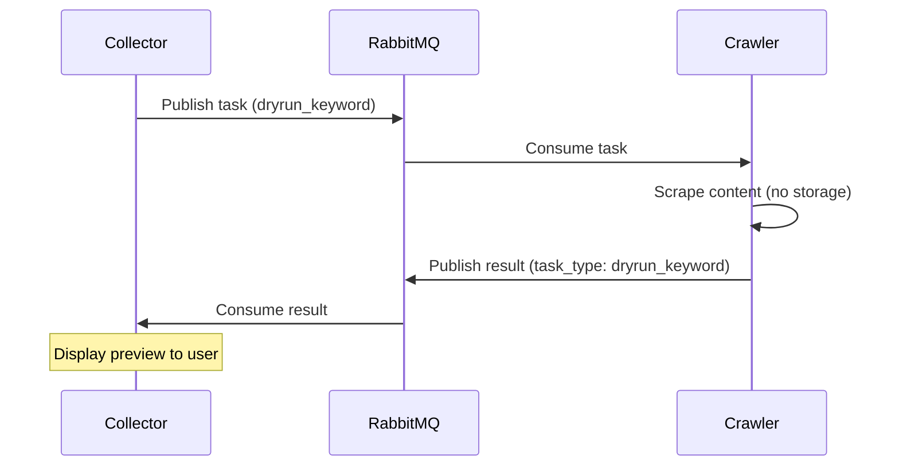
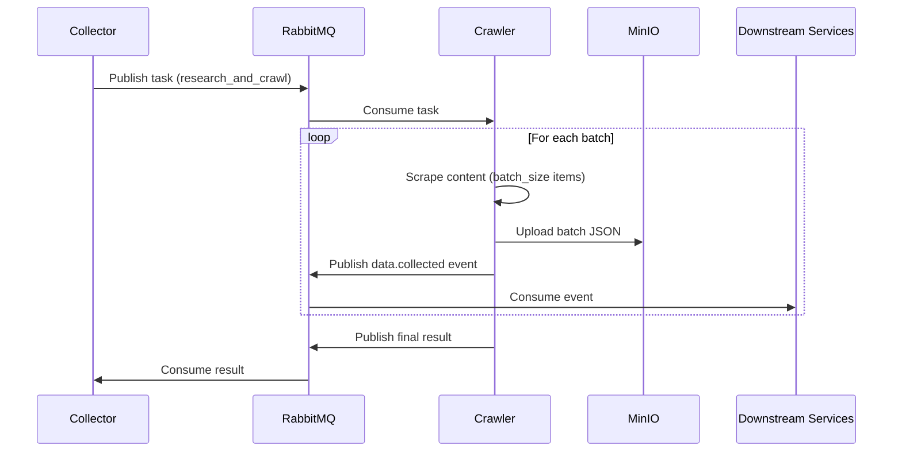

# Crawler Behavior Documentation

**Version:** 3.1  
**Last Updated:** 2025-12-18  
**Language:** Vietnamese / English

---

## Mục Lục

1. [Tổng Quan](#1-tổng-quan)
2. [Kiến Trúc Hệ Thống](#2-kiến-trúc-hệ-thống)
3. [Task Types & Payload](#3-task-types--payload)
4. [Data Flow & Processing Logic](#4-data-flow--processing-logic)
5. [Service Integrations](#5-service-integrations)
6. [Storage & Persistence](#6-storage--persistence)
7. [Event System](#7-event-system)
8. [Error Handling](#8-error-handling)
9. [Configuration](#9-configuration)
10. [Domain Schema](#10-domain-schema)
11. [Performance Metrics](#11-performance-metrics)

---

## 1. Tổng Quan

### 1.1. Crawler Services

Hệ thống SMAP Scrapper bao gồm **2 crawler services chính**:

| Service     | Mô tả                                 | Scraping Engine       | Trạng thái          |
| ----------- | ------------------------------------- | --------------------- | ------------------- |
| **TikTok**  | Scraper cho TikTok videos & creators  | Playwright + HTTP API | ✅ Production-ready |
| **YouTube** | Scraper cho YouTube videos & channels | yt-dlp                | ✅ Production-ready |

### 1.2. Chức Năng Chính

Cả hai crawler services đều thực hiện:

- ✅ Nhận crawl tasks từ RabbitMQ queues
- ✅ Scraping content từ social media platforms
- ✅ Upload kết quả lên MinIO theo batches
- ✅ Publish events cho downstream processing
- ✅ Gửi results về Collector Service
- ✅ Lưu metadata vào MongoDB (optional)

### 1.3. So Sánh TikTok vs YouTube

| Feature             | TikTok                | YouTube                |
| ------------------- | --------------------- | ---------------------- |
| Batch Size          | 50 items              | 20 items               |
| Result Routing Key  | `tiktok.res`          | `youtube.res`          |
| Browser Required    | Yes (Playwright)      | No                     |
| Comment Coverage    | 60-70% (top comments) | 100% (full pagination) |
| Speed per video     | ~5s                   | ~15-30s                |
| RAM per worker      | ~200MB                | ~50MB                  |
| Media Processing    | Direct download       | FFmpeg service         |
| AI Summary          | No                    | Yes (Gemini optional)  |
| External Dependency | Playwright Service    | FFmpeg Service         |

---

## 2. Kiến Trúc Hệ Thống

### 2.1. High-Level Architecture

```
┌─────────────────┐     ┌─────────────────┐     ┌─────────────────┐
│  Collector      │────▶│   RabbitMQ      │────▶│   Crawler       │
│  Service        │     │   (Tasks)       │     │   Service       │
└─────────────────┘     └─────────────────┘     └────────┬────────┘
                                                         │
                        ┌─────────────────┐              │
                        │   RabbitMQ      │◀─────────────┤ Results
                        │   (Results)     │              │
                        └────────┬────────┘              │
                                 │                       │
                        ┌────────▼────────┐     ┌────────▼────────┐
                        │   Collector     │     │     MinIO       │
                        │   Service       │     │   (Batches)     │
                        └─────────────────┘     └────────┬────────┘
                                                         │
                        ┌─────────────────┐              │
                        │   RabbitMQ      │◀─────────────┘ Events
                        │   (Events)      │
                        └────────┬────────┘
                                 │
                        ┌────────▼────────┐
                        │   Downstream    │
                        │   Services      │
                        └─────────────────┘
```

### 2.2. Internal Architecture (Clean Architecture)

```
Crawler Service
├── app/                    # Entry points & DI Container
│   ├── main.py            # Application entry
│   ├── bootstrap.py       # Dependency injection
│   └── worker_service.py  # Worker orchestration
│
├── application/           # Use Cases & Business Logic
│   ├── interfaces.py      # Abstract interfaces (Ports)
│   ├── crawler_service.py # Main crawling orchestration
│   └── task_service.py    # Task routing & handling
│
├── domain/                # Pure Business Entities
│   ├── entities/
│   │   ├── content.py     # Content entity (video)
│   │   ├── author.py      # Author entity (creator/channel)
│   │   ├── comment.py     # Comment entity
│   │   └── search_session.py
│   └── enums.py           # SourcePlatform, MediaType, etc.
│
├── internal/              # Infrastructure Adapters
│   ├── adapters/
│   │   ├── scrapers_{platform}/  # Platform-specific scrapers
│   │   └── repository_mongo.py
│   └── infrastructure/
│       ├── rabbitmq/      # Message queue
│       ├── mongo/         # Database client
│       ├── minio/         # Object storage
│       └── ...            # Other infrastructure
│
├── config/                # Configuration
│   └── settings.py        # Environment-based settings
│
└── utils/                 # Utilities
    ├── helpers.py         # Data mapping functions
    └── logger.py          # Logging configuration
```

### 2.3. TikTok Scrapers

| Scraper            | File                  | Mô tả                              |
| ------------------ | --------------------- | ---------------------------------- |
| `video_api`        | `video_api.py`        | HTTP API scraping video metadata   |
| `creator_api`      | `creator_api.py`      | Creator profile scraping           |
| `comment_scraper`  | `comment_scraper.py`  | Playwright-based comments scraping |
| `search_scraper`   | `search_scraper.py`   | Keyword search via Playwright      |
| `profile_scraper`  | `profile_scraper.py`  | Profile video listing              |
| `media_downloader` | `media_downloader.py` | Media file download                |

### 2.4. YouTube Scrapers

| Scraper            | File                  | Mô tả                              |
| ------------------ | --------------------- | ---------------------------------- |
| `video_scraper`    | `video_scraper.py`    | yt-dlp based video metadata        |
| `channel_scraper`  | `channel_scraper.py`  | Channel info scraping              |
| `comment_scraper`  | `comment_scraper.py`  | youtube-comment-downloader         |
| `search_scraper`   | `search_scraper.py`   | Keyword search via yt-dlp          |
| `media_downloader` | `media_downloader.py` | Media download + FFmpeg extraction |

---

## 3. Task Types & Payload

### 3.1. Supported Task Types

| Task Type               | TikTok | YouTube | Mô tả                                  |
| ----------------------- | ------ | ------- | -------------------------------------- |
| `research_keyword`      | ✅     | ✅      | Search videos, save URLs               |
| `crawl_links`           | ✅     | ✅      | Crawl từ danh sách URLs                |
| `research_and_crawl`    | ✅     | ✅      | Search + crawl trong một operation     |
| `fetch_profile_content` | ✅     | ❌      | Crawl tất cả videos từ TikTok profile  |
| `fetch_channel_content` | ❌     | ✅      | Crawl tất cả videos từ YouTube channel |
| `dryrun_keyword`        | ✅     | ✅      | Search + scrape KHÔNG lưu storage      |

### 3.2. Task Type Details

#### 3.2.1. `research_keyword`

Tìm kiếm video theo keyword, lưu URLs vào `search_sessions`.

```json
{
  "task_type": "research_keyword",
  "job_id": "uuid-123",
  "payload": {
    "keyword": "python tutorial",
    "limit": 50,
    "sort_by": "relevance"
  }
}
```

**Sort options:** `relevance`, `upload_date`, `view_count`, `rating` (YouTube) / `views` (TikTok)

#### 3.2.2. `crawl_links`

Crawl chi tiết từ danh sách URLs với media download.

```json
{
  "task_type": "crawl_links",
  "job_id": "uuid-456",
  "payload": {
    "video_urls": ["https://tiktok.com/@user/video/123"],
    "download_media": true,
    "media_type": "audio",
    "include_comments": true,
    "include_creator": true,
    "max_comments": 200,
    "time_range": 14,
    "save_to_db_enabled": true,
    "media_download_enabled": true,
    "archive_storage_enabled": true
  }
}
```

#### 3.2.3. `research_and_crawl`

Kết hợp search + crawl trong một job. **Đây là task type chính cho production crawling.**

```json
{
  "task_type": "research_and_crawl",
  "job_id": "proj_abc123-brand-0",
  "payload": {
    "keywords": ["music production", "beat making"],
    "limit_per_keyword": 100,
    "download_media": true,
    "media_type": "audio",
    "time_range": 30,
    "include_comments": true,
    "max_comments": 100,
    "save_to_db_enabled": true,
    "media_download_enabled": true,
    "archive_storage_enabled": true
  }
}
```

#### 3.2.4. `fetch_profile_content` (TikTok only)

Crawl tất cả videos từ một TikTok profile.

```json
{
  "task_type": "fetch_profile_content",
  "job_id": "uuid-101",
  "payload": {
    "profile_url": "https://www.tiktok.com/@username",
    "download_media": true,
    "include_comments": true,
    "since_date": "2024-01-01",
    "until_date": "2024-12-31"
  }
}
```

#### 3.2.5. `fetch_channel_content` (YouTube only)

Crawl tất cả videos từ một YouTube channel.

```json
{
  "task_type": "fetch_channel_content",
  "job_id": "uuid-101",
  "payload": {
    "channel_url": "https://www.youtube.com/@username",
    "include_comments": true,
    "limit": 100,
    "time_range": 90
  }
}
```

#### 3.2.6. `dryrun_keyword`

Search và scrape KHÔNG lưu vào storage (testing/validation). Hỗ trợ multiple keywords.

```json
{
  "task_type": "dryrun_keyword",
  "job_id": "uuid-202",
  "payload": {
    "keywords": ["test keyword 1", "test keyword 2"],
    "limit": 10,
    "include_comments": true,
    "max_comments": 50
  }
}
```

**Đặc điểm:**

- Tất cả storage flags tự động disabled
- Kết quả được publish về Collector để hiển thị preview
- Không lưu vào MongoDB, MinIO

### 3.3. Storage Control Flags

Mỗi task có thể control storage behavior thông qua các flags:

| Flag                      | Default | Mô tả                      |
| ------------------------- | ------- | -------------------------- |
| `save_to_db_enabled`      | `false` | Lưu metadata vào MongoDB   |
| `media_download_enabled`  | `true`  | Download media files       |
| `archive_storage_enabled` | `true`  | Archive JSON data to MinIO |

**Lưu ý:** Với `dryrun_keyword`, tất cả flags tự động được set thành `false`.

### 3.4. Common Payload Parameters

| Parameter          | Type       | Default   | Mô tả                                  |
| ------------------ | ---------- | --------- | -------------------------------------- |
| `include_comments` | bool       | `true`    | Scrape comments                        |
| `include_creator`  | bool       | `true`    | Scrape creator/channel info (TikTok)   |
| `include_channel`  | bool       | `true`    | Scrape channel info (YouTube)          |
| `max_comments`     | int        | `0`       | Max comments per video (0 = unlimited) |
| `download_media`   | bool       | `false`   | Download media files                   |
| `media_type`       | string     | `"audio"` | `"audio"` hoặc `"video"`               |
| `time_range`       | int        | `null`    | Filter videos trong N ngày gần nhất    |
| `since_date`       | ISO string | `null`    | Filter videos từ ngày này              |
| `until_date`       | ISO string | `null`    | Filter videos đến ngày này             |

---

## 4. Data Flow & Processing Logic

### 4.1. General Processing Flow

```
1. RabbitMQ Consumer nhận message
         │
         ▼
2. TaskService.handle_task() routing
         │
         ├── Validate payload
         ├── Create job record in MongoDB
         ├── Update job status → "processing"
         │
         ▼
3. Route to appropriate handler
         │
         ├── research_keyword    → SearchScraper.search_videos()
         ├── crawl_links         → CrawlerService.fetch_videos_batch()
         ├── research_and_crawl  → CrawlerService.search_and_fetch()
         ├── fetch_profile/channel → CrawlerService.fetch_profile/channel_videos()
         └── dryrun_keyword      → CrawlerService.search_and_fetch() (no storage)
         │
         ▼
4. Processing Pipeline
         │
         ├── Scrape video metadata
         ├── Scrape creator/channel info
         ├── Scrape comments
         ├── Download media (if enabled)
         ├── Transcribe audio (if enabled)
         │
         ▼
5. Storage Operations
         │
         ├── Save to MongoDB (if save_to_db_enabled)
         ├── Upload batch to MinIO (if archive_storage_enabled)
         ├── Publish data.collected event
         │
         ▼
6. Publish Result
         │
         ├── Update job status → "completed"
         └── Publish result message to Collector
```

### 4.2. TikTok Processing Flow

```
CrawlerService.fetch_videos_batch()
         │
         ▼
┌────────────────────────────────────────┐
│  For each video URL:                   │
│                                        │
│  1. VideoAPI.scrape()                  │
│     └── HTTP API call to TikTok        │
│                                        │
│  2. CreatorAPI.scrape()                │
│     └── HTTP API call for creator info │
│                                        │
│  3. CommentScraper.scrape()            │
│     └── Playwright browser automation  │
│                                        │
│  4. MediaDownloader.download_media()   │
│     └── Direct download from CDN       │
│                                        │
│  5. Speech2Text.transcribe() (optional)│
│     └── Call STT API                   │
└────────────────────────────────────────┘
         │
         ▼
Batch Upload to MinIO (every 50 items)
         │
         ▼
Publish data.collected event
```

### 4.3. YouTube Processing Flow

```
CrawlerService.fetch_videos_batch()
         │
         ▼
┌────────────────────────────────────────┐
│  For each video URL:                   │
│                                        │
│  1. VideoScraper.scrape() [yt-dlp]     │
│     └── Extract video metadata         │
│                                        │
│  2. AI Summary (Gemini) - Optional     │
│     ├── Success → Skip media download  │
│     └── Failed → Fallback to download  │
│                                        │
│  3. MediaDownloader.download_media()   │
│     └── yt-dlp download + FFmpeg       │
│                                        │
│  4. ChannelScraper.scrape() [yt-dlp]   │
│     └── Extract channel info           │
│                                        │
│  5. CommentScraper.scrape()            │
│     └── youtube-comment-downloader     │
│     └── 100% comment coverage          │
└────────────────────────────────────────┘
         │
         ▼
Batch Upload to MinIO (every 20 items)
         │
         ▼
Publish data.collected event
```

### 4.4. Dry-Run Flow



### 4.5. Production Crawl Flow



---

## 5. Service Integrations

### 5.1. RabbitMQ Integration

#### Exchanges và Queues

| Exchange          | Type   | Purpose                        |
| ----------------- | ------ | ------------------------------ |
| `results.inbound` | direct | Crawler results to Collector   |
| `smap.events`     | topic  | System events (data.collected) |

#### Routing Keys

| Platform | Task Queue            | Results       | Events           |
| -------- | --------------------- | ------------- | ---------------- |
| TikTok   | `tiktok_crawl_queue`  | `tiktok.res`  | `data.collected` |
| YouTube  | `youtube_crawl_queue` | `youtube.res` | `data.collected` |

#### Message Schemas

**Task Message (Input):**

```json
{
  "task_type": "research_and_crawl",
  "job_id": "proj_abc123-brand-0",
  "payload": {
    "keywords": ["keyword1", "keyword2"],
    "limit_per_keyword": 50,
    ...
  }
}
```

**Result Message (Output):**

Crawler publishes result messages về Collector sau khi task hoàn thành. Message format khác nhau tùy theo task type:

**1. `research_and_crawl` Result (Flat format - No payload):**

Dùng cho production crawling. Message chỉ chứa stats summary, không chứa content payload (content đã được upload lên MinIO và notify qua `data.collected` event).

```json
{
  "success": true,
  "task_type": "research_and_crawl",
  "job_id": "proj123-brand-0",
  "platform": "tiktok",
  "requested_limit": 50,
  "applied_limit": 50,
  "total_found": 30,
  "platform_limited": true,
  "successful": 28,
  "failed": 2,
  "skipped": 0,
  "error_code": null,
  "error_message": null
}
```

| Field              | Type        | Description                                         |
| ------------------ | ----------- | --------------------------------------------------- |
| `success`          | bool        | `true` nếu task hoàn thành (kể cả không có kết quả) |
| `task_type`        | string      | `"research_and_crawl"`                              |
| `job_id`           | string      | Job ID format: `{projectID}-{source}-{index}`       |
| `platform`         | string      | `"tiktok"` hoặc `"youtube"`                         |
| `requested_limit`  | int         | Limit được request từ Collector                     |
| `applied_limit`    | int         | Limit thực tế Crawler áp dụng                       |
| `total_found`      | int         | Số items tìm được trên platform                     |
| `platform_limited` | bool        | `true` nếu `total_found < requested_limit`          |
| `successful`       | int         | Số items crawl thành công                           |
| `failed`           | int         | Số items crawl thất bại                             |
| `skipped`          | int         | Số items bị skip                                    |
| `error_code`       | string/null | Error code khi `success=false`                      |
| `error_message`    | string/null | Error message khi `success=false`                   |

**2. `dryrun_keyword` Result (With payload):**

Dùng cho preview/testing. Message chứa full content payload để hiển thị preview.

```json
{
  "success": true,
  "task_type": "dryrun_keyword",
  "limit_info": {
    "requested_limit": 50,
    "applied_limit": 50,
    "total_found": 30,
    "platform_limited": true
  },
  "stats": {
    "successful": 28,
    "failed": 2,
    "skipped": 0,
    "completion_rate": 0.93
  },
  "payload": [...]
}
```

#### ACK Strategy

```
┌─────────────────────────────────────────────────────────────┐
│                    ACK Strategy                              │
├─────────────────────────────────────────────────────────────┤
│                                                              │
│  1. Always ACK after processing (success or failure)        │
│  2. Failed jobs marked in MongoDB for retry service         │
│  3. Prevents infinite redelivery loops                      │
│  4. Crash safety: Unacked messages redelivered              │
│                                                              │
└─────────────────────────────────────────────────────────────┘
```

### 5.2. Playwright Service Integration (TikTok)

```python
# TikTok sử dụng Playwright cho:
# - Comment scraping (browser automation)
# - Search scraping (keyword search)
# - Profile video listing

# Connection via WebSocket
PLAYWRIGHT_WS_ENDPOINT=ws://playwright-service:4444/?headless=1

# REST API cho profile scraping
PLAYWRIGHT_REST_API_URL=http://playwright-service:8001
```

### 5.3. FFmpeg Service Integration (YouTube)

```python
# YouTube sử dụng remote FFmpeg service cho audio extraction
MEDIA_FFMPEG_SERVICE_URL=http://ffmpeg-service:8000

# Flow:
# 1. Download video via yt-dlp
# 2. Upload to MinIO (temp)
# 3. Call FFmpeg service để extract audio
# 4. FFmpeg service trả về audio file path
```

### 5.4. Gemini AI Integration (YouTube - Optional)

```python
# Smart fallback strategy:
# 1. Try AI summary first (fast, cheap)
# 2. If failed → fallback to media download

# Benefits:
# - Giảm bandwidth và storage costs
# - Faster processing
# - AI-generated content summaries
```

### 5.5. Speech-to-Text Integration

```python
# Transcribe audio sau khi download
STT_API_URL=http://stt-service/transcribe
STT_API_KEY=your-api-key

# Flow:
# 1. Download audio → MinIO
# 2. Call STT API với audio URL
# 3. Store transcription trong Content entity
```

---

## 6. Storage & Persistence

### 6.1. MinIO Storage

#### Bucket Structure

```
crawl-results/
├── tiktok/
│   └── {project_id}/
│       ├── brand/
│       │   ├── batch_000.json
│       │   ├── batch_001.json
│       │   └── ...
│       └── competitor/
│           ├── batch_000.json
│           └── ...
└── youtube/
    └── {project_id}/
        ├── brand/
        │   ├── batch_000.json
        │   └── ...
        └── competitor/
            └── ...
```

#### Path Format

```
crawl-results/{platform}/{project_id}/{brand|competitor}/batch_{index:03d}.json
```

- `platform`: `tiktok` hoặc `youtube`
- `project_id`: Extracted từ job_id (e.g., `proj_abc123` từ `proj_abc123-brand-0`)
- `brand|competitor`: Determined by job_id pattern
- `index`: Zero-padded batch index (000, 001, 002, ...)

#### Batch File Format

Mỗi batch file chứa array of items theo new format:

```json
[
  { "meta": {...}, "content": {...}, "interaction": {...}, "author": {...}, "comments": [...] },
  { "meta": {...}, "content": {...}, "interaction": {...}, "author": {...}, "comments": [...] },
  ...
]
```

### 6.2. MongoDB Collections

| Collection        | TikTok | YouTube | Mô tả                  |
| ----------------- | ------ | ------- | ---------------------- |
| `content`         | ✅     | ✅      | Video/content metadata |
| `authors`         | ✅     | ✅      | Creator/channel info   |
| `comments`        | ✅     | ✅      | Video comments         |
| `search_sessions` | ✅     | ✅      | Keyword search results |
| `crawl_jobs`      | ✅     | ✅      | Job tracking           |

#### Upsert Behavior

- Uses `external_id` as unique identifier
- Updates existing records if found
- Creates new records if not found

```python
# Static fields (never change)
STATIC_FIELDS = {"source", "external_id", "url", "job_id", "created_at"}

# Dynamic fields (updated on every crawl)
DYNAMIC_FIELDS = {
    "view_count", "like_count", "comment_count",
    "description", "tags", "media_path", ...
}
```

---

## 7. Event System

### 7.1. data.collected Event

Published sau mỗi batch upload lên MinIO. Enables downstream services để process data incrementally.

**Event Schema:**

```json
{
  "event_type": "data.collected",
  "timestamp": "2024-12-06T10:30:00Z",
  "payload": {
    "project_id": "proj_abc123",
    "job_id": "proj_abc123-brand-0",
    "platform": "tiktok",
    "minio_path": "crawl-results/tiktok/proj_abc123/brand/batch_000.json",
    "content_count": 50,
    "batch_index": 1
  }
}
```

**RabbitMQ Configuration:**

```
Exchange: smap.events (topic)
Routing Key: data.collected
Queue: analytics.data.collected (Analytics Service consume)
```

### 7.2. Project ID Extraction

Project ID được extract từ job_id theo các patterns:

| Job ID Format                      | Project ID    | Type       |
| ---------------------------------- | ------------- | ---------- |
| `{projectID}-brand-{index}`        | `{projectID}` | Brand      |
| `{projectID}-{competitor}-{index}` | `{projectID}` | Competitor |
| UUID format                        | `null`        | Dry-run    |

**Examples:**

- `proj_abc123-brand-0` → `proj_abc123`
- `proj_abc123-competitor_name-1` → `proj_abc123`
- `550e8400-e29b-41d4-a716-446655440000` → `null` (dry-run)

---

## 8. Error Handling

### 8.1. Error Classification

```python
def _classify_error(self, error: Exception) -> str:
    """
    Classify errors for ACK decision:
    - 'infrastructure': DB/Queue connection failures → May retry
    - 'scraping': Platform-specific errors → Usually ACK and mark failed
    """
```

### 8.2. Error Codes

| Code                    | Description                | Category      | Retryable |
| ----------------------- | -------------------------- | ------------- | --------- |
| `RATE_LIMITED`          | Platform rate limiting     | Rate Limiting | Yes       |
| `AUTH_FAILED`           | Authentication failure     | Rate Limiting | No        |
| `ACCESS_DENIED`         | Access denied              | Rate Limiting | No        |
| `CONTENT_REMOVED`       | Content has been removed   | Content       | No        |
| `CONTENT_NOT_FOUND`     | Content not found          | Content       | No        |
| `CONTENT_UNAVAILABLE`   | Content unavailable        | Content       | No        |
| `NETWORK_ERROR`         | Network connectivity issue | Network       | Yes       |
| `TIMEOUT`               | Request timeout            | Network       | Yes       |
| `CONNECTION_REFUSED`    | Connection refused         | Network       | Yes       |
| `DNS_ERROR`             | DNS resolution failed      | Network       | Yes       |
| `PARSE_ERROR`           | Response parsing failed    | Parsing       | No        |
| `INVALID_URL`           | Invalid URL format         | Parsing       | No        |
| `INVALID_RESPONSE`      | Invalid response format    | Parsing       | No        |
| `MEDIA_DOWNLOAD_FAILED` | Media download failed      | Media         | Yes       |
| `MEDIA_TOO_LARGE`       | Media file too large       | Media         | No        |
| `MEDIA_FORMAT_ERROR`    | Unsupported media format   | Media         | No        |
| `STORAGE_ERROR`         | Storage operation failed   | Storage       | Yes       |
| `UPLOAD_FAILED`         | Upload to MinIO failed     | Storage       | Yes       |
| `DATABASE_ERROR`        | Database operation failed  | Storage       | Yes       |
| `UNKNOWN_ERROR`         | Unknown error              | Generic       | No        |
| `INTERNAL_ERROR`        | Internal server error      | Generic       | No        |

### 8.3. Error Response Format

```json
{
  "error_code": "CONTENT_NOT_FOUND",
  "error_message": "Video not found or has been removed",
  "error_details": {
    "exception_type": "ContentNotFoundError",
    "traceback": "..."
  },
  "timestamp": "2024-12-06T10:30:00Z",
  "context": {
    "url": "https://tiktok.com/@user/video/123",
    "job_id": "proj_abc123-brand-0",
    "content_id": "123"
  }
}
```

### 8.4. Error Handling Strategy

1. **Graceful Degradation**: Errors không stop entire crawl job
2. **Structured Logging**: All errors include error code for easy filtering
3. **Error Propagation**: Errors được include trong results cho Collector handle
4. **Retry Logic**: Network errors có thể trigger automatic retries (configurable)
5. **Job Status Tracking**: Failed jobs được mark trong MongoDB cho retry service

### 8.5. Job Status Flow

```
QUEUED → PROCESSING → COMPLETED
                   ↘
                    FAILED → (Retry Service) → RETRYING → COMPLETED
                                                       ↘
                                                        FAILED (permanent)
```

---

## 9. Configuration

### 9.1. TikTok Settings

```python
# config/settings.py
class Settings:
    # RabbitMQ
    rabbitmq_host: str = "localhost"
    rabbitmq_port: int = 5672
    rabbitmq_username: str = "guest"
    rabbitmq_password: str = "guest"
    rabbitmq_queue_name: str = "tiktok_crawl_queue"

    # Result Publisher
    result_exchange_name: str = "results.inbound"
    result_routing_key: str = "tiktok.res"

    # Event Publisher
    event_publisher_enabled: bool = True
    event_exchange_name: str = "smap.events"
    event_routing_key: str = "data.collected"

    # Batch Upload
    batch_size: int = 50
    minio_crawl_results_bucket: str = "crawl-results"

    # Playwright
    playwright_ws_endpoint: str = "ws://playwright-service:4444"
    playwright_rest_api_url: str = "http://playwright-service:8001"
```

### 9.2. YouTube Settings

```python
# config/settings.py
class Settings:
    # RabbitMQ
    rabbitmq_host: str = "localhost"
    rabbitmq_port: int = 5672
    rabbitmq_username: str = "guest"
    rabbitmq_password: str = "guest"
    rabbitmq_queue_name: str = "youtube_crawl_queue"

    # Result Publisher
    result_exchange_name: str = "results.inbound"
    result_routing_key: str = "youtube.res"

    # Event Publisher
    event_publisher_enabled: bool = True
    event_exchange_name: str = "smap.events"
    event_routing_key: str = "data.collected"

    # Batch Upload
    batch_size: int = 20  # Smaller due to larger content
    minio_crawl_results_bucket: str = "crawl-results"

    # FFmpeg Service
    media_ffmpeg_service_url: str = "http://ffmpeg-service:8000"
```

### 9.3. Environment Variables

#### Core Infrastructure

| Variable            | Description               | Default          |
| ------------------- | ------------------------- | ---------------- |
| `RABBITMQ_HOST`     | RabbitMQ server host      | `localhost`      |
| `RABBITMQ_PORT`     | RabbitMQ server port      | `5672`           |
| `RABBITMQ_USERNAME` | RabbitMQ username         | `guest`          |
| `RABBITMQ_PASSWORD` | RabbitMQ password         | `guest`          |
| `MINIO_ENDPOINT`    | MinIO server endpoint     | `localhost:9000` |
| `MINIO_ACCESS_KEY`  | MinIO access key          | -                |
| `MINIO_SECRET_KEY`  | MinIO secret key          | -                |
| `MINIO_SECURE`      | Use HTTPS for MinIO       | `true`           |
| `MONGODB_URI`       | MongoDB connection string | -                |
| `MONGODB_DATABASE`  | MongoDB database name     | `smap`           |

#### Event & Batch Settings

| Variable                  | Description             | Default                        |
| ------------------------- | ----------------------- | ------------------------------ |
| `BATCH_SIZE`              | Items per batch         | `50` (TikTok) / `20` (YouTube) |
| `EVENT_PUBLISHER_ENABLED` | Enable event publishing | `true`                         |
| `EVENT_EXCHANGE_NAME`     | RabbitMQ exchange name  | `smap.events`                  |
| `EVENT_ROUTING_KEY`       | Event routing key       | `data.collected`               |

#### Service URLs

| Variable                   | Description              | Default |
| -------------------------- | ------------------------ | ------- |
| `PLAYWRIGHT_WS_ENDPOINT`   | Playwright WebSocket URL | -       |
| `PLAYWRIGHT_REST_API_URL`  | Playwright REST API URL  | -       |
| `MEDIA_FFMPEG_SERVICE_URL` | FFmpeg service URL       | -       |

#### Limit Settings (Configurable)

| Variable                           | Description                          | Default |
| ---------------------------------- | ------------------------------------ | ------- |
| `LIMIT_RESEARCH_KEYWORD_DEFAULT`   | Default limit for keyword search     | `50`    |
| `LIMIT_RESEARCH_KEYWORD_MAX`       | Max limit for keyword search         | `200`   |
| `LIMIT_CRAWL_LINKS_DEFAULT`        | Default limit for crawl_links        | `100`   |
| `LIMIT_CRAWL_LINKS_MAX`            | Max limit for crawl_links            | `200`   |
| `LIMIT_RESEARCH_AND_CRAWL_DEFAULT` | Default limit for research_and_crawl | `50`    |
| `LIMIT_RESEARCH_AND_CRAWL_MAX`     | Max limit for research_and_crawl     | `200`   |
| `LIMIT_FETCH_PROFILE_DEFAULT`      | Default limit for profile fetch      | `100`   |
| `LIMIT_FETCH_PROFILE_MAX`          | Max limit for profile fetch          | `500`   |
| `LIMIT_FETCH_CHANNEL_DEFAULT`      | Default limit for channel fetch      | `100`   |
| `LIMIT_FETCH_CHANNEL_MAX`          | Max limit for channel fetch          | `500`   |
| `LIMIT_DRYRUN_DEFAULT`             | Default limit for dry-run            | `10`    |
| `LIMIT_DRYRUN_MAX`                 | Max limit for dry-run                | `50`    |

---

## 10. Domain Schema

### 10.1. Payload Item Format (New Format)

Mỗi item trong payload theo cấu trúc sau:

```json
{
  "meta": {
    "id": "video_external_id",
    "platform": "tiktok|youtube",
    "job_id": "proj_abc123-brand-0",
    "task_type": "research_and_crawl",
    "crawled_at": "2024-12-06T10:30:00Z",
    "published_at": "2024-12-01T08:00:00Z",
    "permalink": "https://...",
    "keyword_source": "search keyword",
    "lang": "vi",
    "region": "VN",
    "pipeline_version": "crawler_tiktok_v3",
    "fetch_status": "success|error",
    "fetch_error": null
  },
  "content": {
    "text": "Video description",
    "title": "Video title (YouTube only)",
    "duration": 60,
    "hashtags": ["tag1", "tag2"],
    "sound_name": "Original Sound (TikTok only)",
    "category": "Entertainment",
    "media": {
      "type": "video|audio",
      "video_path": "path/to/video.mp4",
      "audio_path": "path/to/audio.mp3",
      "downloaded_at": "2024-12-06T10:30:00Z"
    },
    "transcription": "...",
    "transcription_status": "completed|pending|failed",
    "transcription_error": null
  },
  "interaction": {
    "views": 10000,
    "likes": 500,
    "comments_count": 50,
    "shares": 25,
    "saves": 10,
    "engagement_rate": 0.0585,
    "updated_at": "2024-12-06T10:30:00Z"
  },
  "author": {
    "id": "author_external_id",
    "name": "Display Name",
    "username": "username",
    "followers": 5000,
    "following": 100,
    "likes": 10000,
    "videos": 50,
    "is_verified": false,
    "bio": "Author bio",
    "avatar_url": null,
    "profile_url": "https://...",
    "country": "VN (YouTube only)",
    "total_view_count": 1000000
  },
  "comments": [
    {
      "id": "comment_id",
      "parent_id": null,
      "post_id": "video_external_id",
      "user": {
        "id": "commenter_id",
        "name": "Commenter Name",
        "avatar_url": null
      },
      "text": "Comment text",
      "likes": 10,
      "replies_count": 2,
      "published_at": "2024-12-05T12:00:00Z",
      "is_author": false,
      "media": null,
      "is_favorited": false
    }
  ]
}
```

### 10.2. Platform-Specific Fields

| Field                     | TikTok | YouTube | Mô tả                        |
| ------------------------- | ------ | ------- | ---------------------------- |
| `content.title`           | ❌     | ✅      | Video title                  |
| `content.sound_name`      | ✅     | ❌      | TikTok sound name            |
| `interaction.shares`      | ✅     | ❌      | Share count                  |
| `interaction.saves`       | ✅     | ❌      | Save/bookmark count          |
| `author.following`        | ✅     | ❌      | Following count              |
| `author.likes`            | ✅     | ❌      | Total likes received         |
| `author.country`          | ❌     | ✅      | Channel country              |
| `author.total_view_count` | ❌     | ✅      | Total channel views          |
| `comments.is_favorited`   | ❌     | ✅      | Comment favorited by creator |

### 10.3. Content Entity (Internal)

```python
class Content(BaseModel):
    # Core identifiers
    source: SourcePlatform  # TIKTOK, YOUTUBE
    external_id: str        # Platform-specific ID
    url: str
    job_id: Optional[str]

    # Author reference
    author_id: Optional[str]
    author_external_id: Optional[str]
    author_username: Optional[str]
    author_display_name: Optional[str]

    # Content metadata
    title: Optional[str]           # YouTube only
    description: Optional[str]
    duration_seconds: Optional[int]
    sound_name: Optional[str]      # TikTok only
    tags: List[str]

    # Media
    media_type: Optional[MediaType]
    media_path: Optional[str]

    # Metrics (dynamic)
    view_count: Optional[int]
    like_count: Optional[int]
    comment_count: Optional[int]
    share_count: Optional[int]
    save_count: Optional[int]      # TikTok only

    # Timestamps
    published_at: Optional[datetime]
    crawled_at: Optional[datetime]

    # Speech-to-Text
    transcription: Optional[str]
    transcription_status: Optional[str]
```

### 10.4. Author Entity (Internal)

```python
class Author(BaseModel):
    source: SourcePlatform
    external_id: str
    username: Optional[str]
    display_name: Optional[str]
    profile_url: Optional[str]
    verified: Optional[bool]

    # Stats
    follower_count: Optional[int]
    following_count: Optional[int]  # TikTok only
    like_count: Optional[int]       # TikTok only
    video_count: Optional[int]
    total_view_count: Optional[int] # YouTube only
```

### 10.5. Comment Entity (Internal)

```python
class Comment(BaseModel):
    source: SourcePlatform
    external_id: str
    parent_type: ParentType  # CONTENT or COMMENT
    parent_id: str
    job_id: Optional[str]

    comment_text: Optional[str]
    commenter_name: Optional[str]
    commenter_id: Optional[str]
    like_count: Optional[int]
    reply_count: Optional[int]
    published_at: Optional[datetime]
    is_author: Optional[bool]       # Comment by video author
    is_favorited: Optional[bool]    # YouTube only
```

---

## 11. Performance Metrics

### 11.1. TikTok Performance

| Metric                  | Value           |
| ----------------------- | --------------- |
| Single video            | ~5s             |
| 100 videos (concurrent) | ~2 minutes      |
| Throughput              | ~0.8 videos/sec |
| RAM per worker          | ~200MB          |
| Comment coverage        | 60-70%          |

### 11.2. YouTube Performance

| Metric                       | Value            |
| ---------------------------- | ---------------- |
| Single video (no comments)   | ~15s             |
| Single video (with comments) | ~30s             |
| 100 videos (concurrent)      | ~15 minutes      |
| Throughput                   | ~0.22 videos/sec |
| Comment coverage             | 100%             |
| RAM per worker               | ~50MB            |

### 11.3. Batch Size Recommendations

| Platform | Recommended Batch Size | Reason                        |
| -------- | ---------------------- | ----------------------------- |
| TikTok   | 50 items               | Smaller content, faster crawl |
| YouTube  | 20 items               | Larger content with comments  |

---

## Appendix A: Collector Service Routing

Collector Service routing dựa trên `task_type` trong result message:

| Task Type            | Handler                 | Webhook Endpoint                       |
| -------------------- | ----------------------- | -------------------------------------- |
| `dryrun_keyword`     | `handleDryRunResult()`  | `/internal/dryrun/callback`            |
| `research_and_crawl` | `handleProjectResult()` | Redis + `/internal/progress/callback`  |
| Unknown/Missing      | `handleDryRunResult()`  | `/internal/dryrun/callback` (fallback) |

**Quan trọng:** `task_type` PHẢI được include trong `meta` của mỗi content item để Collector routing đúng.

---

## Appendix B: Docker Compose Deployment

```yaml
services:
  playwright-service:
    container_name: playwright-service
    image: smap-playwright:latest
    ports:
      - "4444:4444"
      - "8001:8001"

  tiktok-worker:
    container_name: tiktok-scraper
    build: ./tiktok
    environment:
      PLAYWRIGHT_WS_ENDPOINT: ws://playwright-service:4444
    depends_on:
      - playwright-service

  youtube-worker:
    container_name: youtube-scraper
    build: ./youtube
    depends_on:
      - ffmpeg-service

  ffmpeg-service:
    container_name: ffmpeg-service
    build: ./ffmpeg
    ports:
      - "8000:8000"
```

---

**Document maintained by:** SMAP AI Team  
**Last review:** 2025-12-18
