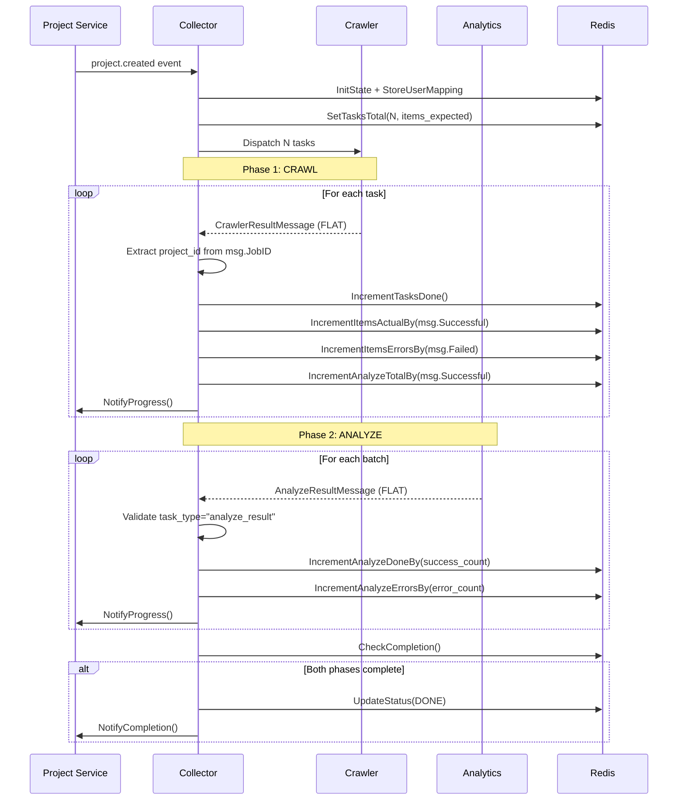

# Design Document: Project State Contract Fix

## Overview

Tài liệu này mô tả thiết kế chi tiết để sửa chữa và cải thiện flow xử lý message giữa Collector Service với Crawler và Analytics Service. Mục tiêu chính là:

1. Xác định rõ ràng message contract giữa các services
2. Handle đúng case platform limitation từ Crawler
3. Tính toán chính xác completion status dựa trên cả Crawl và Analyze phases

## Architecture

### Current Architecture Issues

```
┌─────────────────────────────────────────────────────────────────────────────┐
│                         CURRENT ISSUES                                       │
├─────────────────────────────────────────────────────────────────────────────┤
│                                                                              │
│  Crawler → Collector:                                                        │
│  ┌──────────────────────────────────────────────────────────────────────┐   │
│  │ CrawlerResult {                                                       │   │
│  │   success: bool,                                                      │   │
│  │   payload: []CrawlerContent  ← Missing limit_info, stats             │   │
│  │ }                                                                     │   │
│  └──────────────────────────────────────────────────────────────────────┘   │
│                                                                              │
│  Problem: Collector uses fallback logic that assumes all items succeeded     │
│           when success=true, ignoring platform limitations                   │
│                                                                              │
│  Analytics → Collector:                                                      │
│  ┌──────────────────────────────────────────────────────────────────────┐   │
│  │ AnalyzeResultPayload {                                                │   │
│  │   project_id, job_id, task_type,                                      │   │
│  │   batch_size, success_count, error_count                              │   │
│  │ }                                                                     │   │
│  └──────────────────────────────────────────────────────────────────────┘   │
│                                                                              │
│  Problem: Need to ensure Analytics sends correct format and Collector        │
│           properly aggregates success_count/error_count                      │
│                                                                              │
└─────────────────────────────────────────────────────────────────────────────┘
```

### Target Architecture (Version 3.0 - FLAT Format)

```
┌─────────────────────────────────────────────────────────────────────────────┐
│                    TARGET ARCHITECTURE (FLAT FORMAT v3.0)                    │
├─────────────────────────────────────────────────────────────────────────────┤
│                                                                              │
│  Crawler → Collector (FLAT - No Payload):                                    │
│  ┌──────────────────────────────────────────────────────────────────────┐   │
│  │ CrawlerResultMessage {                                                │   │
│  │   success: bool,                                                      │   │
│  │   task_type: string,                                                  │   │
│  │   job_id: string,           ← Moved to root level                    │   │
│  │   platform: string,         ← Moved to root level                    │   │
│  │   requested_limit: int,     ← Flattened from limit_info              │   │
│  │   applied_limit: int,                                                 │   │
│  │   total_found: int,                                                   │   │
│  │   platform_limited: bool,                                             │   │
│  │   successful: int,          ← Flattened from stats                   │   │
│  │   failed: int,                                                        │   │
│  │   skipped: int,                                                       │   │
│  │   error_code: string?,                                                │   │
│  │   error_message: string?                                              │   │
│  │ }                                                                     │   │
│  │                                                                       │   │
│  │ NOTE: No payload - Crawler pushes content directly to Analytics       │   │
│  └──────────────────────────────────────────────────────────────────────┘   │
│                                                                              │
│  Analytics → Collector (FLAT):                                               │
│  ┌──────────────────────────────────────────────────────────────────────┐   │
│  │ AnalyzeResultMessage {                                                │   │
│  │   task_type: "analyze_result",                                        │   │
│  │   project_id: string,       ← Direct extraction                      │   │
│  │   job_id: string,                                                     │   │
│  │   batch_size: int,                                                    │   │
│  │   success_count: int,       ← Increment analyze_done                 │   │
│  │   error_count: int          ← Increment analyze_errors               │   │
│  │ }                                                                     │   │
│  └──────────────────────────────────────────────────────────────────────┘   │
│                                                                              │
└─────────────────────────────────────────────────────────────────────────────┘
```

### State Flow Diagram



## Components and Interfaces

### 1. CrawlerResultMessage Handler (FLAT Format)

```go
// handleProjectResult xử lý kết quả từ Crawler với FLAT format
func (uc implUseCase) handleProjectResult(ctx context.Context, msg models.CrawlerResultMessage) error {
    // 1. Validate message
    if err := msg.Validate(); err != nil {
        return fmt.Errorf("%w: %v", results.ErrInvalidInput, err)
    }

    // 2. Extract project_id từ job_id (FLAT - no payload parsing needed)
    projectID := msg.ExtractProjectID()

    // 3. Update task-level counter (1 per response)
    if msg.Success {
        uc.stateUC.IncrementTasksDone(ctx, projectID)
    } else {
        uc.stateUC.IncrementTasksErrors(ctx, projectID)
    }

    // 4. Update item-level counters (FLAT - direct access from msg)
    if msg.Successful > 0 {
        uc.stateUC.IncrementItemsActualBy(ctx, projectID, int64(msg.Successful))
        uc.stateUC.IncrementAnalyzeTotalBy(ctx, projectID, int64(msg.Successful))
    }
    if msg.Failed > 0 {
        uc.stateUC.IncrementItemsErrorsBy(ctx, projectID, int64(msg.Failed))
    }

    // 5. Log platform limitation warning (FLAT - direct access)
    if msg.PlatformLimited {
        uc.l.Warnf(ctx, "Platform limited: requested=%d, found=%d",
            msg.RequestedLimit, msg.TotalFound)
    }

    // 6. Send progress webhook và check completion
    // ...
}
```

### 2. AnalyzeResult Handler

```go
// handleAnalyzeResult xử lý kết quả từ Analytics Service
func (uc implUseCase) handleAnalyzeResult(ctx context.Context, res models.CrawlerResult) error {
    // 1. Extract và validate analyze payload
    payload, err := uc.extractAnalyzePayload(ctx, res.Payload)
    if err != nil || payload.TaskType != TaskTypeAnalyzeResult {
        return results.ErrInvalidInput
    }

    // 2. Extract project_id trực tiếp từ payload (không parse từ job_id)
    projectID := payload.ProjectID
    if projectID == "" {
        return results.ErrInvalidInput
    }

    // 3. Update analyze counters
    if payload.SuccessCount > 0 {
        uc.stateUC.IncrementAnalyzeDoneBy(ctx, projectID, int64(payload.SuccessCount))
    }
    if payload.ErrorCount > 0 {
        uc.stateUC.IncrementAnalyzeErrorsBy(ctx, projectID, int64(payload.ErrorCount))
    }

    // 4. Send progress webhook và check completion
    // ...
}
```

### 3. Completion Check Logic

```go
// CheckCompletion kiểm tra và update status nếu project hoàn thành
func (uc *implUseCase) CheckCompletion(ctx context.Context, projectID string) (bool, error) {
    state, err := uc.GetState(ctx, projectID)
    if err != nil {
        return false, err
    }

    // Check cả 2 phases
    crawlComplete := state.IsCrawlComplete()   // tasks_done + tasks_errors >= tasks_total
    analyzeComplete := state.IsAnalyzeComplete() // analyze_done + analyze_errors >= analyze_total

    if crawlComplete && analyzeComplete {
        uc.UpdateStatus(ctx, projectID, models.ProjectStatusDone)
        return true, nil
    }

    return false, nil
}
```

## Data Models

### 1. CrawlerResultMessage (Crawler → Collector) - FLAT Format v3.0

```go
// CrawlerResultMessage là flat message format từ Crawler cho case research_and_crawl.
// Không có payload - Crawler push content trực tiếp sang Analytics.
type CrawlerResultMessage struct {
    Success         bool    `json:"success"`
    TaskType        string  `json:"task_type"`
    JobID           string  `json:"job_id"`
    Platform        string  `json:"platform"`
    RequestedLimit  int     `json:"requested_limit"`
    AppliedLimit    int     `json:"applied_limit"`
    TotalFound      int     `json:"total_found"`
    PlatformLimited bool    `json:"platform_limited"`
    Successful      int     `json:"successful"`
    Failed          int     `json:"failed"`
    Skipped         int     `json:"skipped"`
    ErrorCode       *string `json:"error_code,omitempty"`
    ErrorMessage    *string `json:"error_message,omitempty"`
}
```

### 2. AnalyzeResultPayload (Analytics → Collector)

```go
type AnalyzeResultPayload struct {
    ProjectID    string `json:"project_id"`    // Direct extraction
    JobID        string `json:"job_id"`
    TaskType     string `json:"task_type"`     // Must be "analyze_result"
    BatchSize    int    `json:"batch_size"`
    SuccessCount int    `json:"success_count"` // Increment analyze_done
    ErrorCount   int    `json:"error_count"`   // Increment analyze_errors
}
```

### 3. ProjectState (Redis Hash)

```go
type ProjectState struct {
    Status ProjectStatus `json:"status"`

    // Task-level (completion check)
    TasksTotal  int64 `json:"tasks_total"`
    TasksDone   int64 `json:"tasks_done"`
    TasksErrors int64 `json:"tasks_errors"`

    // Item-level (progress display)
    ItemsExpected int64 `json:"items_expected"`
    ItemsActual   int64 `json:"items_actual"`
    ItemsErrors   int64 `json:"items_errors"`

    // Analyze phase
    AnalyzeTotal  int64 `json:"analyze_total"`
    AnalyzeDone   int64 `json:"analyze_done"`
    AnalyzeErrors int64 `json:"analyze_errors"`

    // Legacy (backward compatibility)
    CrawlTotal  int64 `json:"crawl_total"`
    CrawlDone   int64 `json:"crawl_done"`
    CrawlErrors int64 `json:"crawl_errors"`
}
```

## Correctness Properties

_A property is a characteristic or behavior that should hold true across all valid executions of a system-essentially, a formal statement about what the system should do. Properties serve as the bridge between human-readable specifications and machine-verifiable correctness guarantees._

### Property 1: Message Structure Validation (FLAT Format)

_For any_ CrawlerResultMessage, the message SHALL contain `task_type`, `job_id`, and `platform` fields at root level (non-empty strings).

**Validates: Requirements 1.1, 1.4**

### Property 2: Stats Consistency (FLAT Format)

_For any_ CrawlerResultMessage, the fields `successful`, `failed`, `skipped` SHALL be non-negative integers at root level.

**Validates: Requirements 1.3, 3.2, 3.3**

### Property 3: Project ID Extraction

_For any_ CrawlerResultMessage with `job_id` in format `{projectID}-{source}-{index}`, the ExtractProjectID() method SHALL correctly extract the projectID portion.

**Validates: Requirements 1.4 (simplified - no fallback needed with FLAT format)**

### Property 4: Platform Limitation Detection (FLAT Format)

_For any_ CrawlerResultMessage where `total_found < requested_limit`, the `platform_limited` field SHALL be `true`.

**Validates: Requirements 1.2**

### Property 5: Analyze Payload Validation

_For any_ AnalyzeResultPayload, the `task_type` field SHALL equal "analyze_result" and `project_id` SHALL be non-empty for the message to be processed.

**Validates: Requirements 2.1, 2.2, 2.3**

### Property 6: Counter Update Consistency

_For any_ CrawlerResult processed, the Redis state SHALL have `items_actual` incremented by exactly `stats.successful` and `items_errors` incremented by exactly `stats.failed`. Additionally, `analyze_total` SHALL be incremented by `stats.successful`.

**Validates: Requirements 2.4, 4.1, 4.2**

### Property 7: Completion Logic

_For any_ ProjectState, `IsComplete()` SHALL return `true` if and only if both conditions are met: `(tasks_done + tasks_errors >= tasks_total)` AND `(analyze_done + analyze_errors >= analyze_total)`.

**Validates: Requirements 3.4, 4.3, 4.4**

### Property 8: Legacy Field Consistency

_For any_ state update that increments `items_actual`, the corresponding `crawl_done` legacy field SHALL also be incremented by the same amount. Similarly for `items_errors` and `crawl_errors`.

**Validates: Requirements 5.2**

### Property 9: Progress Calculation

_For any_ ProjectState, `OverallProgressPercent()` SHALL equal `(CrawlProgressPercent() + AnalyzeProgressPercent()) / 2`, where `CrawlProgressPercent()` uses item-level counters when available.

**Validates: Requirements 6.2, 6.3**

### Property 10: Progress Webhook Structure

_For any_ progress webhook sent, the payload SHALL contain both `tasks` (with `total`, `done`, `errors`, `percent`) and `items` (with `expected`, `actual`, `errors`, `percent`) fields, plus `analyze` phase fields.

**Validates: Requirements 6.1, 6.4**

## Error Handling

### 1. Invalid Message Format

```go
// Khi message không parse được
if err := json.Unmarshal(data, &result); err != nil {
    // ACK message để không requeue (invalid format)
    return results.ErrInvalidInput
}
```

### 2. Missing Required Fields

```go
// Khi thiếu project_id hoặc job_id
if projectID == "" {
    return results.ErrInvalidInput
}
```

### 3. State Not Found

```go
// Khi state không tồn tại trong Redis
if state == nil {
    return state.ErrStateNotFound
}
```

### 4. Webhook Failures

```go
// Webhook failure là non-fatal, log warning và continue
if err := uc.webhookUC.NotifyProgress(ctx, req); err != nil {
    uc.l.Warnf(ctx, "Failed to send progress webhook: %v", err)
    // Don't return error - continue processing
}
```

## Testing Strategy

### Dual Testing Approach

Testing sẽ sử dụng cả unit tests và property-based tests:

1. **Unit Tests**: Verify specific examples, edge cases, và error conditions
2. **Property-Based Tests**: Verify universal properties across all valid inputs

### Property-Based Testing Framework

Sử dụng `github.com/leanovate/gopter` cho Go property-based testing.

### Test Categories

1. **Message Contract Tests**

   - Validate CrawlerResult structure
   - Validate AnalyzeResultPayload structure
   - Test fallback behavior

2. **State Update Tests**

   - Counter increment consistency
   - Legacy field updates
   - Completion logic

3. **Progress Calculation Tests**
   - Progress percentage accuracy
   - Webhook payload structure

### Property Test Configuration

- Minimum 100 iterations per property test
- Each test tagged with property reference: `**Feature: project-state-contract-fix, Property {N}: {description}**`
