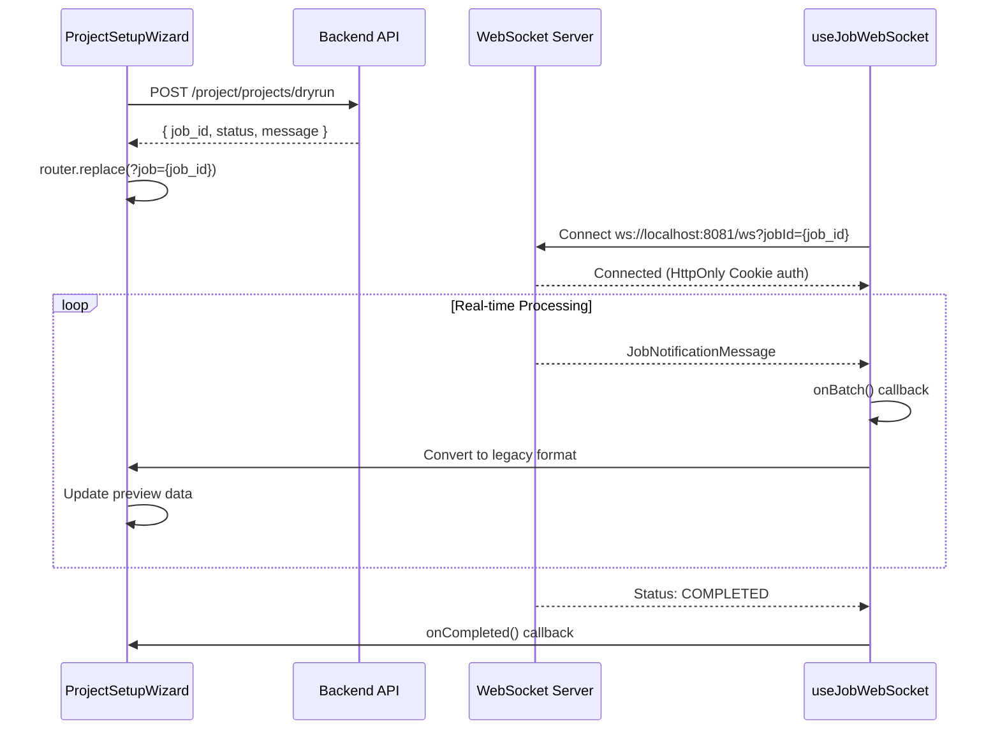

# Dry-Run WebSocket Behavior Documentation

## Overview

Tài liệu này mô tả chi tiết behavior của WebSocket trong flow dry-run, từ việc trigger API đến nhận real-time data và hiển thị UI.

**Updated**: Đã fix race condition issue - client không còn disconnect connection cũ trước khi connection mới được establish.

## 1. Flow Tổng Quan



## 2. API Trigger

### Endpoint

```
POST /project/projects/dryrun
```

### Request Body

```json
{
  "keywords": ["xedien", "vinfast", "pin", "giavinfast", "tesla"]
}
```

### Response

```json
{
  "error_code": 0,
  "message": "Dry-run job created successfully",
  "data": {
    "job_id": "job_abc123def456",
    "status": "PROCESSING",
    "message": "Job queued for processing"
  }
}
```

### Code Implementation

```typescript
const response = await projectService.createDryRun(keywords);
setDryRunJobId(response.job_id);

// Update URL để trigger WebSocket connection
const currentUrl = new URL(window.location.href);
currentUrl.searchParams.set("job", response.job_id);
router.replace(currentUrl.pathname + currentUrl.search, undefined, {
  shallow: true,
});
```

## 3. WebSocket Connection

### Connection Details

- **URL Pattern**: `wss://smap-api.tantai.dev/ws?jobId={job_id}` (production)
- **Authentication**: HttpOnly Cookie (automatic, no manual token)
- **Protocol**: WebSocket với race condition protection
- **Timeout**: 60 seconds cho dry-run completion
- **Race Condition Fix**: New connection established BEFORE disconnecting old one

### URL Parameter Trigger

```typescript
// useJobWebSocket tự động detect URL parameter
const router = useRouter();
const jobId = (router.query.job as string) || null;

// Auto-connect khi jobId có trong URL
useEffect(() => {
  if (jobId && !isJobConnected) {
    connectToJob(jobId);
  }
}, [jobId, isJobConnected, connectToJob]);
```

### Connection Code

```typescript
const {
  isConnected,
  status,
  contentList,
  connect: connectToJob,
} = useJobWebSocket({
  onBatch: (batch) => {
    /* Handle real-time data */
  },
  onCompleted: () => {
    /* Job finished */
  },
  onFailed: (errors) => {
    /* Handle errors */
  },
});
```

### Race Condition Protection

Hook `useJobWebSocket` đã được cập nhật để tránh race condition:

```typescript
// ✅ FIXED: Wait for new connection BEFORE disconnecting old one
const connectToJob = async (jobId: string) => {
  // Keep old connection alive
  const oldWs = wsRef.current;
  const oldJobId = currentJobIdRef.current;

  // Create new connection
  const newWs = createJobWebSocket(jobId);

  // Wait for new connection to open
  newWs.on("connected", () => {
    // NOW disconnect old connection (after new one is established)
    if (oldWs && oldJobId !== jobId) {
      oldWs.disconnect();
    }
    // Update to new connection
    wsRef.current = newWs;
  });

  await newWs.connect();
};
```

## 4. Message Format

### New WebSocket Message Structure

```typescript
interface JobNotificationMessage {
  platform: Platform; // "TIKTOK" | "YOUTUBE" | "INSTAGRAM"
  status: JobStatus; // "PROCESSING" | "COMPLETED" | "FAILED" | "PAUSED"
  batch?: BatchData; // Real-time content batch (optional)
  progress?: Progress; // Overall job progress (optional)
}
```

### BatchData Structure

```typescript
interface BatchData {
  keyword: string; // "vinfast"
  content_list: ContentItem[]; // Array of crawled content
  crawled_at: string; // "2024-01-15T10:30:00Z"
}
```

### ContentItem Structure

```typescript
interface ContentItem {
  id: string; // "tiktok_abc123"
  text: string; // Post content/caption
  author: AuthorInfo; // Author details
  metrics: EngagementMetrics; // Views, likes, comments, shares
  media?: MediaInfo; // Video/image info (optional)
  published_at: string; // "2024-01-15T08:00:00Z"
  permalink: string; // Direct link to original post
}
```

## 5. Real-time Data Handling

### onBatch Callback

```typescript
onBatch: (batch) => {
  console.log("Received batch data:", batch.keyword, batch.content_list.length);

  // Convert new format to legacy format for UI compatibility
  if (batch.content_list.length > 0) {
    const legacyData: DryRunOuterPayload = {
      type: "dryrun_result",
      job_id: dryRunJobId || "",
      platform: "tiktok",
      status: "success",
      payload: {
        content: convertContentItemsToDryRunContent(batch.content_list),
        errors: [],
      },
    };
    setDryRunData(legacyData);
    setIsLoadingPreview(false);
    setPreviewError(null);
  }
};
```

### Format Conversion

```typescript
const convertContentItemsToDryRunContent = (items: ContentItem[]): any[] => {
  return items.map((item) => ({
    meta: {
      id: item.id,
      platform: "tiktok",
      job_id: dryRunJobId || "",
      crawled_at: new Date().toISOString(),
      published_at: item.published_at,
      permalink: item.permalink,
      // ... other meta fields
    },
    content: {
      text: item.text,
      duration: item.media?.duration,
      // ... other content fields
    },
    interaction: {
      views: item.metrics.views,
      likes: item.metrics.likes,
      comments_count: item.metrics.comments,
      shares: item.metrics.shares,
      engagement_rate: item.metrics.rate / 100,
      // ... other interaction fields
    },
    author: {
      id: item.author.id,
      name: item.author.name,
      username: item.author.username,
      followers: item.author.followers,
      is_verified: item.author.is_verified,
      avatar_url: item.author.avatar_url,
      // ... other author fields
    },
    comments: [],
  }));
};
```

## 6. Status Handling

### Job Status Flow

```
PROCESSING → COMPLETED (success)
PROCESSING → FAILED (error)
PROCESSING → PAUSED (temporary stop)
```

### Status Callbacks

```typescript
onProcessing: (progress) => {
  // Job is actively running
  // progress.current, progress.total, progress.percentage, progress.eta
},

onCompleted: () => {
  // Job finished successfully
  setIsLoadingPreview(false)
  if (contentList.length === 0) {
    setPreviewError('Không tìm thấy dữ liệu cho các từ khóa đã chọn')
  }
},

onFailed: (errors) => {
  // Job encountered errors
  setIsLoadingPreview(false)
  setPreviewError(errors?.join(', ') || 'Job processing failed')
},

onError: (error) => {
  // WebSocket connection error
  setPreviewError(`WebSocket error: ${error.message}`)
  setIsLoadingPreview(false)
}
```

## 7. UI State Management

### Loading States

```typescript
const [isLoadingPreview, setIsLoadingPreview] = useState(false);
const [previewError, setPreviewError] = useState<string | null>(null);
const [dryRunData, setDryRunData] = useState<DryRunOuterPayload | null>(null);
```

### State Transitions

```
Initial → Loading (API call) → Connected (WebSocket) → Receiving Data → Complete/Error
```

### Timeout Handling

```typescript
// Set timeout for 60 seconds
setTimeout(() => {
  if (!dryRunData) {
    setIsLoadingPreview(false);
    setPreviewError("Timeout: Không nhận được dữ liệu preview sau 60 giây");
  }
}, 60000);
```

## 8. Error Scenarios

### Common Errors

1. **API Error**: Dry-run creation failed
2. **WebSocket Connection Error**: Cannot connect to WebSocket
3. **Authentication Error**: HttpOnly Cookie invalid/expired
4. **Timeout Error**: No data received within 60 seconds
5. **Job Processing Error**: Backend processing failed

### Error Handling

```typescript
try {
  const response = await projectService.createDryRun(keywords);
  // Success path
} catch (error: any) {
  let errorMessage = "Không thể khởi chạy preview";
  if (error.message) {
    errorMessage = error.message;
  }
  if (error.error_code) {
    errorMessage = `[Error ${error.error_code}] ${
      error.message || "Something went wrong"
    }`;
  }
  setPreviewError(errorMessage);
  setIsLoadingPreview(false);
}
```

## 9. Debugging

### Console Logs

```typescript
// API Response
console.log("Dry-run job created:", response.job_id);

// WebSocket Events
console.log("Connecting to job WebSocket:", dryRunJobId);
console.log("Received job notification:", message);
console.log("Received batch data:", batch.keyword, batch.content_list.length);
```

### Browser DevTools

1. **Network Tab**: Check API call `/project/projects/dryrun`
2. **WebSocket Tab**: Monitor WebSocket connection `ws://localhost:8081/ws?jobId=...`
3. **Console**: Check for connection logs and error messages
4. **Application Tab**: Verify HttpOnly Cookie presence

### Common Debug Steps

1. Verify API response contains `job_id`
2. Check URL parameter `?job={job_id}` is set
3. Confirm WebSocket connection in DevTools
4. Monitor incoming messages in Console
5. Check `contentList` state updates

## 10. Migration Notes

### Legacy vs New Format

- **Legacy**: Single `dryrun_result` message at the end
- **New**: Real-time `JobNotificationMessage` with streaming batches

### Backward Compatibility

- UI components still expect legacy `DryRunOuterPayload` format
- Conversion function maintains compatibility
- Gradual migration path without breaking existing UI

### Performance Improvements

- Real-time data streaming (no waiting for completion)
- Automatic deduplication by `content.id`
- Configurable content limit (default: 500 items)
- ETA tracking and progress updates

## 11. Testing

### Manual Testing Steps

1. Open ProjectSetupWizard
2. Fill in project details and keywords
3. Navigate to preview step
4. Click "Xem trước dữ liệu thực tế"
5. Monitor Console for WebSocket logs
6. Verify real-time data appears
7. Check completion/error handling

### Expected Behavior

- ✅ API call succeeds with job_id
- ✅ URL updates with ?job parameter
- ✅ WebSocket connects automatically
- ✅ Real-time batches appear in UI
- ✅ No timeout errors
- ✅ Proper error handling for failures

---

**Last Updated**: January 2025  
**Version**: 1.0  
**Status**: Active Implementation
